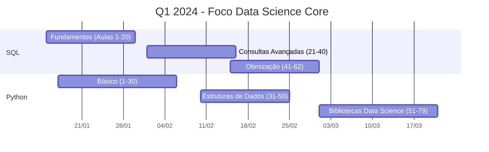

# **🎯 Minha Jornada em Data Science - 3 Dimensões**

> Trilhas complementares: Técnica, Gestão e Inglês para uma formação completa como Cientista de Dados

## 📊 Progresso Geral das Trilhas

| Trilha | Total Aulas | Concluídas | Progresso | Status |
|--------|------------|------------|-----------|--------|
| **🎓 Data Science Técnico** | 706 | 124 | **18%** | 🟡 Em andamento |
| **💼 Gestão Empresarial** | 96 | 49 | **51%** | 🟢 Avançado |
| **🌐 Inglês Técnico** | 225 | 7 | **3%** | 🔵 Iniciando |

**Total Geral:** 1027 aulas • **Concluídas:** 180 (18%) • **Faltam:** 847

## 🎓 TRILHA 1: FORMAÇÃO DATA SCIENCE (Hard Skills)
*Competência técnica e construção de portfólio*

### **Progresso por Curso**
```
✅ CONCLUÍDOS (100%):
• Introdução a Análise de Dados - 37/37 aulas 🎉
• Excel Intermediário - 87/87 aulas 🎉

🎯 EM ANDAMENTO (Prioridade 2024):
• SQL para Análise de Dados - 0/62 aulas
  ░░░░░░░░░░ 0% • Estimativa: 31h • Meta: 4 aulas/semana

• Python - 0/79 aulas
  ░░░░░░░░░░ 0% • Estimativa: 40h • Meta: 4 aulas/semana

• Estatística com Python - 0/117 aulas
  ░░░░░░░░░░ 0% • Estimativa: 58h • Meta: 3 aulas/semana

⏳ FUTUROS:
• Data Cleaning & Wrangling - 0/62 aulas
• Modelos de ML - 0/123 aulas
• Cloud & IA - 0/70 aulas
• Preparação para Mercado - 0/85 aulas
```

### **Meta Trimestral (Jan-Mar 2024)**


## 💼 TRILHA 2: GESTÃO EMPRESARIAL (Soft Skills & Business)
*Aplicação prática e visão estratégica*

### **Progresso Detalhado**
```
✅ CONCLUÍDOS (51% - 49/96 aulas):
• Conceitos/Técnicas de Análise de Dados - 10/10 🎉
• Ferramentas de TI para análise - 11/11 🎉
• Big Data & IA na tomada de decisão - 9/9 🎉
• Otimização de gestão com dados - 11/11 🎉

🚀 EM ANDAMENTO:
• Integração da análise na rotina - 8/9 aulas (89%)

🎯 PRÓXIMOS (Prioridade 2024):
• Técnicas de análise financeira - 0/4 aulas
• Go-to-Market Engineering - 0/11 aulas
• Cibersegurança e proteção de dados - 0/7 aulas

📈 PROGRESSO GESTÃO: ███████░░░ 51%
```

### **Foco por Energia**
- **Energia Baixa (3-5/10):** Análise financeira, conceitos SaaS
- **Energia Média (6-7/10):** Go-to-Market, cibersegurança
- **Projetos Finais:** Aplicação integrada (4 aulas)

## 🌐 TRILHA 3: INGLÊS TÉCNICO (Competência Global)
*Comunicação, documentação e mercado internacional*

### **Situação Atual**
```
📊 PROGRESSO: ░░░░░░░░░░ 3% (7/225 aulas)

🎯 ESTRATÉGIA DE APRENDIZADO:
• Método: 30 minutos diários consistentes
• Foco inicial: Vocabulário técnico + Compreensão leitora
• Ritual: Pós-trabalho fixo (17:30-18:00)

📅 META 2024:
• Completar 100 aulas (45% do total)
• Alcançar nível intermediário para leitura técnica
• Foco em documentação, artigos e tutoriais em inglês
```

### **Próximos Módulos**
1. **Adjetivos e pronomes** (14 aulas)
2. **Expansão de vocabulário** (6 aulas)
3. **Diálogos básicos** (8 aulas)

## ⚡ SISTEMA DE ENERGIA INTELIGENTE
*Otimizando estudo baseado no cansaço pós-trabalho*

### **Diretrizes por Nível de Energia**
```
🔋 ENERGIA ALTA (7-10/10) → 🎓 TRILHA TÉCNICA
• SQL/Python (concentração intensa)
• Exercícios práticos complexos
• Projetos Data Science

🔋 ENERGIA MÉDIA (4-6/10) → 💼 TRILHA GESTÃO
• Análise financeira aplicada
• Estratégia Go-to-Market
• Estudos conceituais (SaaS, Cibersegurança)

🔋 ENERGIA BAIXA (1-3/10) → 🌐 TRILHA INGLÊS
• Vocabulário técnico
• Listening leve
• Revisão passiva

🔄 QUALQUER ENERGIA → 📚 CONSOLIDAÇÃO
• Revisão de conceitos
• Organização de anotações
• Planejamento próximo dia
```

### **Cronograma Semanal Sugerido**
| Dia | Energia Típica | Foco Principal | Trilha | Duração |
|-----|---------------|----------------|--------|---------|
| Segunda | 3/10 | Análise Financeira | 💼 Gestão | 30min |
| Terça | 4/10 | SQL + Inglês | 🎓 Técnico + 🌐 Inglês | 60min |
| Quarta (Folga) | 8/10 | Python + Projeto | 🎓 Técnico | 120min |
| Quinta | 3/10 | Cibersegurança + Inglês | 💼 + 🌐 | 45min |
| Sexta | 5/10 | Revisão Semanal | Todas | 50min |
| Sábado | 9/10 | Projeto Prático | 🎓 Técnico | 150min |
| Domingo | 7/10 | Planejamento + Inglês Leve | 🌐 + 📋 | 40min |

## 🏗️ Estrutura do Repositório

```
data-science-journey/
├── courses/
│   ├── data-science/          # 🎓 Trilha técnica
│   │   ├── sql/
│   │   ├── python/
│   │   ├── estatistica/
│   │   └── progress.json
│   ├── gestao-empresarial/    # 💼 Trilha gestão
│   │   ├── analise-financeira/
│   │   ├── go-to-market/
│   │   └── progress.json
│   └── ingles-tecnico/        # 🌐 Trilha inglês
│       ├── modulos/
│       └── progress.json
├── projects/                  # Projetos práticos
├── notes/                     # Anotações organizadas
├── scripts/                   # Automações do sistema
└── docs/                      # Documentação
```

## 🎮 Sistema de Gamificação

### **Pontuação por Conquista**
- ✅ **Aula concluída:** 10 pontos (qualquer trilha)
- 🎯 **Meta semanal batida:** 50 pontos extra
- 🔥 **Streak 7 dias:** 100 pontos de consistência
- 🚀 **Projeto concluído:** 500 pontos
- 🌟 **Trilha 50% completa:** 300 pontos

### **Conquistas em Andamento**
```
🎓 SQL Warrior: 0/620 pontos (0/62 aulas)
🎓 Python Initiate: 0/790 pontos (0/79 aulas)
💼 Gestor Data-Driven: 490/960 pontos (49/96 aulas)
🌐 Global Communicator: 70/2250 pontos (7/225 aulas)
🔥 Consistency King: 0/500 pontos (0 dias streak)
```

## 📈 Próximos Marcos

### **Janeiro 2024**
- [ ] Completar módulo "Integração na Rotina" (1 aula restante)
- [ ] Iniciar SQL (meta: 8 aulas)
- [ ] Avançar 20 aulas de Inglês
- [ ] Configurar ambiente Python + VS Code

### **Primeiro Trimestre (Jan-Mar)**
- **SQL:** Completar 50% (31 aulas)
- **Python:** Completar básico (30 aulas)
- **Gestão:** Concluir análise financeira + Go-to-Market
- **Inglês:** Alcançar 50 aulas concluídas

## 🤝 Conecte-se

<div align="center">
  <a href="https://github.com/Germano-Silva">
    
  </a>
  <a href="https://linkedin.com/in/germanorodriguessilva">
    
  </a>
  <a href="https://kaggle.com/germanorodrigues">
    
  </a>
</div>

---

<div align="center">
  
  <br>
  <strong>Germano Silva</strong>
  <br>
  <em>"Dados são a linguagem do futuro. E o futuro é diverso."</em> – Lynn Conway
</div>

<div align="center">
  <a href="https://github.com/Germano-Silva">GitHub</a> •
  <a href="https://linkedin.com/in/germanorodriguessilva">LinkedIn</a> •
  <a href="https://kaggle.com/germanorodrigues">Kaggle</a>
</div>

---

<div align="center">
*Jornada iniciada em Janeiro de 2024. Documentando de forma transparente minha evolução em três dimensões complementares: competência técnica, visão de negócios e comunicação global.*
</div>

---

**🔄 Última atualização:** Janeiro de 2024  
**🎯 Próxima revisão:** Final de Janeiro  
**⚡ Status atual:** 🟢 Ativo e em progresso  
**🔥 Motivação:** "Progresso, não perfeição. Consistência, não intensidade."