Eu: 
quero criar um fluxo de agentes de ia para uma projeto em que ele me ajude a me organizar e crie tasks independente eu possa revisar e me situar corrigindo o que eu fizer de errado.
quantos agentes de ia preciso fazer?
como posso fazer isso ?
de que maneira posso fazer isso 100% free?
quanto tempo eu demoraria?

IA: 
Vou te ajudar a montar um fluxo de agentes de IA gratuito para organização pessoal. Vamos por partes:

## **1. Quantos agentes você precisa?**

Recomendo **4 agentes principais**:

1. **Coletor/Observador** - Coleta informações sobre suas atividades
2. **Planejador/Organizador** - Cria e organiza tarefas
3. **Revisor/Corretor** - Analisa seu progresso e sugere correções
4. **Relator/Sintetizador** - Fornece resumos e status

## **2. Como fazer isso 100% FREE**

### **Stack Gratuita Recomendada:**
- **OpenAI API** (via Google Colab com créditos iniciais gratuitos)
- **Ollama** + modelos locais (Llama 3.1, Mistral, Gemma)
- **Flowise** ou **LangFlow** para criar fluxos visuais
- **Google Apps Script** para automação
- **Obsidian** ou **Logseq** para organização

### **Opção 1: Usando Google Colab + Ollama (Recomendada)**

```python
# Exemplo simplificado de fluxo
import requests
import json

class AgentFlow:
    def __init__(self):
        self.tasks = []
        
    def collector(self, user_input):
        # Coleta informações
        return {"input": user_input, "timestamp": "..."}
    
    def planner(self, collected_data):
        # Gera tarefas
        return ["Task 1: ...", "Task 2: ..."]
    
    def reviewer(self, tasks, progress):
        # Revisa e corrige
        corrections = []
        # Lógica de revisão
        return corrections
    
    def reporter(self):
        # Gera relatório
        return "Status report: ..."
```

### **Opção 2: Flowise/LangFlow (Sem código)**
- Baixe o Flowise (open-source)
- Configure modelos locais via Ollama
- Crie fluxo visual com:
  - Input do usuário
  - Agente de planejamento
  - Agente de revisão
  - Output estruturado

## **3. Arquitetura Sugerida**

```
Seu Input → [Coletor] → [Planejador] → Banco de Tarefas
                          ↓
                    [Revisor] ← Seu Progresso
                          ↓
                    [Relator] → Resumo Diário
```

## **4. Tempo de Implementação**

### **Fase 1: Básico (3-5 dias)**
- Setup do ambiente (Ollama + modelos)
- Agente coletor e planejador simples
- Interface via terminal

### **Fase 2: Funcional (1-2 semanas)**
- Sistema de revisão automática
- Integração com calendário/Google Tasks
- Dashboard simples

### **Fase 3: Refinamento (2-3 semanas)**
- Aprendizado com correções
- Notificações inteligentes
- Relatórios detalhados

**Total estimado: 2-4 semanas** para uma versão funcional

## **5. Passo a Passo Rápido**

1. **Dia 1-2:** Instale Ollama e baixe um modelo (Llama 3.1 8B)
2. **Dia 3-5:** Crie scripts Python básicos para cada agente
3. **Dia 6-10:** Integre os agentes em um fluxo
4. **Dia 11-14:** Adicione persistência (SQLite ou arquivos JSON)
5. **Dia 15-21:** Crie interface (CLI ou web simples com Streamlit)
6. **Dia 22-28:** Teste e refine

## **6. Alternativas Mais Simples**

### **A) Hugging Face Spaces + Gradio**
- Use modelos gratuitos da Hugging Face
- Interface web imediata
- Exemplo: https://huggingface.co/spaces

### **B) Automação com Google Sheets + Apps Script**
- Use ChatGPT via API no Apps Script
- Automatize criação de tarefas
- 100% gratuito com conta Google

### **C) Obsidian + Plugins IA**
- Use plugins como Text Generator
- Templates inteligentes para tasks
- Local e privado

## **7. Recursos Gratuitos Essenciais**

1. **Modelos:** Ollama, Hugging Face, Google Colab T4 GPU
2. **Ferramentas:** Flowise, LangChain, LlamaIndex
3. **APIs:** OpenAI free credits ($5 inicial), Groq free tier
4. **Hospedagem:** GitHub Codespaces, Hugging Face Spaces

## **Dica Principal:**
Comece com **UM agente** que faça tudo básico, depois decomponha em agentes especializados. Use **JSON** para comunicação entre agentes e **arquivos locais** para persistência.

Quer que eu detalhe algum aspecto específico ou prefere um tutorial passo a passo para começar hoje?

Eu:
como eu posso melhorar isso, faca uma lista de perguntas do que exatamente eu pretendo fazer para chegar no meu objetivo e saber qual o meu objetivo.

IA:
# **Questionário para Definir seu Sistema de Organização com IA**

## **1. Sobre SEUS OBJETIVOS**
1. Qual é o **principal problema** que você quer resolver com essa organização?
2. Quais **áreas da sua vida** quer organizar? (trabalho, estudos, projetos pessoais, saúde, etc.)
3. Como você **mede sucesso** em organização? (menos estresse? mais produtividade? menos esquecimentos?)
4. Qual seu **estilo de trabalho atual**? (improvisado? metódico? caótico mas criativo?)

## **2. Sobre TAREFAS e PROCESSOS**
5. Que **tipo de tarefas** você normalmente tem?
   - Tarefas únicas
   - Projetos complexos
   - Hábitos/repetitivas
   - Prazos específicos
6. Como você **prioriza naturalmente**?
   - Por urgência
   - Por importância
   - Por prazo
   - Por energia/disposição
7. O que **sempre dá errado** na sua organização atual?
   - Esquece tarefas
   - Subestima tempo
   - Procrastina
   - Multi-tasking excessivo

## **3. Sobre INTERAÇÃO com o Sistema**
8. Como prefere **interagir** com o sistema?
   - Chat/conversa natural
   - Formulários estruturados
   - Voz
   - Email/notificações
9. Com que **frequência** quer revisões?
   - Diária
   - Semanal
   - Quando solicitar
   - Automática quando detectar problemas
10. Que **tipo de feedback** quer receber?
    - Listas de tarefas
    - Alertas de prazos
    - Sugestões de melhoria
    - Análises de progresso

## **4. Sobre DADOS e PRIVACIDADE**
11. Quais **fontes de dados** podem alimentar o sistema?
    - Calendário Google/Outlook
    - Emails
    - Notas atuais
    - Arquivos/documentos
12. Qual seu **nível de privacidade** necessário?
    - Totalmente local
    - Pode usar APIs gratuitas
    - Aceita processamento em nuvem
    - Dados sensíveis ou não?

## **5. Sobre TECNOLOGIA**
13. Qual seu **nível técnico**?
    - Iniciante (precisa de soluções prontas)
    - Intermediário (pode configurar ferramentas)
    - Avançado (pode programar)
14. Que **dispositivos** usa?
    - Apenas computador
    - PC + celular
    - Tablets também
    - Multiplataforma necessário
15. Tem **restrições de tempo** para implementação?
    - Quero rápido (1-2 semanas)
    - Posso investir tempo (1-2 meses)
    - Projeto contínuo de aprendizado

## **6. Sobre a IA ESPECÍFICA**
16. Que **tipo de inteligência** você precisa?
    - Apenas organização básica
    - Entendimento de contexto
    - Aprendizado com seus padrões
    - Sugestões proativas
17. O sistema deve ser **reativo ou proativo**?
    - Só responde quando você pergunta
    - Sugere automaticamente
    - Alerta sobre problemas potenciais
    - Toma decisões automáticas simples

## **7. Sobre CORREÇÕES e APRENDIZADO**
18. Como você **reconhece que errou** na organização?
    - Perde prazos
    - Fica sobrecarregado
    - Esquece compromissos
    - Sente desorganizado
19. Como quer que o sistema **corrija seus erros**?
    - Sugerindo alternativas
    - Reorganizando automaticamente
    - Ensinando métodos melhores
    - Alertando antes do erro acontecer

## **8. EXEMPLOS CONCRETOS**
20. **Descreva um dia típico** onde a organização falha
21. **Descreva um dia ideal** com o sistema funcionando
22. **Dê 3 exemplos específicos** de tarefas/projetos que tem agora

## **9. LIMITES e EXPECTATIVAS**
23. Quais são seus **"não negociáveis"**?
    - Deve ser gratuito sempre
    - Não pode demorar mais que X minutos por dia
    - Precisa funcionar offline
    - Não pode ser complexo de usar
24. Qual é seu **orçamento de tempo diário** para manutenção do sistema?
25. Aceita que a **IA cometa erros** enquanto aprende? Qual tolerância?

## **10. INTEGRAÇÕES NECESSÁRIAS**
26. Quais **ferramentas já usa** que devem integrar?
    - Google Calendar
    - Notion/ClickUp/Trello
    - Email
    - Outros apps
27. Precisa de **relatórios ou exportações** específicas?

---

## **Como usar este questionário:**

### **Priorize respondendo:**
1. **Primeiro:** Questões 1-4 (Objetivos gerais)
2. **Depois:** Questões 5-10 (Funcionalidades)
3. **Por último:** Questões 11-27 (Detalhes técnicos)

### **Dica:** 
Responda com **exemplos concretos** em vez de abstratos. Em vez de "quero ser mais produtivo", diga "quero terminar o projeto X até sexta sem trabalhar até tarde".

### **Depois de responder, vamos identificar:**
- ✅ **Sistema mínimo viável** (o que resolveria 80% dos problemas)
- 🎯 **Funcionalidades essenciais** vs. desejáveis
- ⚡ **Solução mais rápida** para começar HOJE
- 🔄 **Processo iterativo** de melhoria contínua

---

**Quer que eu crie um template para você responder essas questões, ou prefere responder algumas agora para começarmos a definir o sistema ideal para VOCÊ especificamente?**

eu:
1. quero me organizar para entrar no mercado de trabalho para que futuramente eu seja jm cientista de dados.
2. estudos, projetos pessoais mantendo a saúde.
3. quero ter uma rotina saudável, sendo produtivo diariamente sem esquecimentos.
4. trabalho com restauração em portugal, ando o dia inteiro, sou atendente de mesa.
5. prazos específicos, mas quero criar meus próprios projetos pessoais. amo fazer tarefas únicas uma por vez com prazo determinado.
6. energia e disposição.
7. procrastino, subestimo o tempo e esquecimentos.
8. chat
9. diariamente pois quero fazer algo que seja diário.
10. todas as opções.
11. pode alimentar o sistema.
12. totalmente local, api gratuitas, aceito processamento em nuvem, sem dados sensíveis.
13. sou formado em análise e desenvolvimento de sistemas, porém estou enferrujado.
14. PC +celular
15. rápido 
16. todas as opções.
17. responde quando eu perguntar, sugere automaticamente, alerta sobre potenciais problemas e toda decisões após conversamos sobre o processo explicando os motivos.
18. todas as opções.
19. todas as opções.
20. deveria assistir aula, chego em casa cansado porém deito e vou assistir vídeos ou fazer qualquer coisa que nao seja estudar.
21. essa resposta nao sei.
22. tem a minha formação em ciência de dados que preciso terminar e um curso técnico em análise de dados que estou fazendo e tentando estudar inglês pelo kultive.
23. todas as opções.
24. nao sei.
25. nao tenho muito o que dizer sobre isso.
26. estou disposto a aprender, mas uso muito o github git e vscode pra quase tudo.
27. não, so se tiver log pra verificar possíveis erros.


IA:
Excelente! Agora tenho um perfil claro. Vou criar um sistema **focado, prático e rápido** para sua transição para cientista de dados.

# **Sistema de Organização "Data Scientist Journey"**

## **ANÁLISE DO SEU PERFIL:**
- ✅ **Trabalho físico cansativo** → Sistema precisa ser leve e rápido
- ✅ **Formação em ADS enferrujada** → Reativa skills gradualmente
- ✅ **Objetivo claro: Ciência de Dados** → Foco em roadmap específico
- ✅ **Procrastinação pós-trabalho** → Sistema anti-procrastinação
- ✅ **Preferência por chat** → Interface conversacional

## **ARQUITETURA OTIMIZADA (2 semanas)**

### **Agente 1: Daily Momentum Keeper** (Seu assistente principal)
```
Funções:
- Boas-vindas pós-trabalho
- Check-in de energia (1-10)
- Sugere MICRO-tarefa (15-30min)
- Bloqueador de distrações
```

### **Agente 2: Roadmap Navigator**
```
Funções:
- Mantém roadmap de Data Science
- Sugere próximos passos
- Ajusta baseado no seu progresso
- Conecta estudos a projetos
```

### **Agente 3: Anti-Procrastination Buddy**
```
Funções:
- Detecta padrões de escape
- Oferece alternativas mais fáceis
- Técnica Pomodoro automática
- "Regra dos 2 minutos"
```

## **IMPLEMENTAÇÃO RÁPIDA (7-10 dias)**

### **Dia 1-3: Setup Básico**

```python
# sistema_simples.py - Versão minimalista
import json
from datetime import datetime
import os

class SistemaCientistaDados:
    def __init__(self):
        self.status_file = "status_diario.json"
        self.roadmap = self.carregar_roadmap()
        
    def carregar_roadmap(self):
        # Roadmap básico de Data Science
        return {
            "fase_1": ["Python básico", "Pandas", "NumPy", "Estatística"],
            "fase_2": ["Visualização", "SQL", "Machine Learning básico"],
            "fase_3": ["Projetos pessoais", "Git", "Portfólio"],
            "fase_4": ["Inglês técnico", "Preparação entrevistas"]
        }
    
    def check_in(self):
        energia = input("Energia de 1-10? ")
        tempo = input("Minutos disponíveis? ")
        return {"energia": energia, "tempo": tempo}
    
    def sugerir_tarefa(self, energia, tempo):
        # Tarefas adaptadas à sua energia
        if int(energia) < 4:
            return "Assistir 1 vídeo de Python (15min)"
        elif int(tempo) < 30:
            return "Fazer 1 exercício no DataCamp"
        else:
            return "Codar projeto pequeno"
    
    def salvar_log(self, atividade):
        log = {
            "data": str(datetime.now()),
            "atividade": atividade,
            "status": "completo"
        }
        with open("log_atividades.json", "a") as f:
            f.write(json.dumps(log) + "\n")

# Uso:
sistema = SistemaCientistaDados()
status = sistema.check_in()
tarefa = sistema.sugerir_tarefa(status["energia"], status["tempo"])
print(f"🎯 Tarefa sugerida: {tarefa}")
sistema.salvar_log(tarefa)
```

### **Dia 4-7: Interface Chat + Notificações**

```python
# Com Ollama local (100% free)
import subprocess
import requests

class AssistenteIA:
    def __init__(self):
        self.modelo = "llama3.1:8b"  # Ou mistral, mais leve
        
    def perguntar(self, pergunta):
        # Usa Ollama localmente
        cmd = f'ollama run {self.modelo} "{pergunta}"'
        resultado = subprocess.run(cmd, shell=True, capture_output=True, text=True)
        return resultado.stdout
    
    def gerar_plano_diario(self):
        prompt = """
        Usuário: Trabalhador cansado pós-expediente, quer estudar Data Science.
        Energia: Baixa. Tempo: 30-60min.
        Gerar 3 opções de estudo rápidas e práticas.
        """
        return self.perguntar(prompt)

assistente = AssistenteIA()
plano = assistente.gerar_plano_diario()
print(plano)
```

## **SOLUÇÃO PRONTA PARA HOJE**

### **Opção A: Tudo em um script (Começar AGORA)**
```bash
# 1. Instalar Python
# 2. Criar arquivo organizador.py
# 3. Copiar código acima
# 4. Rodar todo dia ao chegar em casa

python organizador.py
```

### **Opção B: Telegram Bot (Recomendado para celular)**
```python
# bot_telegram.py
import telebot
import json

TOKEN = "seu_token"
bot = telebot.TeleBot(TOKEN)

@bot.message_handler(commands=['start'])
def start(message):
    bot.reply_to(message, "Olá! Pronto para estudar Data Science?")
    
@bot.message_handler(func=lambda msg: True)
def responder(message):
    # Lógica de sugestões baseada na hora
    bot.reply_to(message, "Sugestão: 15min de Python agora!")

bot.polling()
```

## **FLUXO DIÁRIO CONCRETO**

```
17:00 - Chega em casa
      ↓
/motivacao (comando no Telegram)
      ↓
"Energia? 3/10" → "Tempo? 45min"
      ↓
Sugestão: "Ver 1 aula do Kultivi (20min)"
      ↓
✅ Completo! → Log salvo
      ↓
Próximo passo automático sugerido
```

## **ROADMAP DE ESTUDOS PRÉ-DEFINIDO**

```json
{
  "semana_1": {
    "foco": "Python básico revisitado",
    "tarefas": [
      "Seg: Variáveis e loops (30min)",
      "Ter: Funções (30min)", 
      "Qua: Pandas introdução (30min)",
      "Qui: Exercício prático (45min)",
      "Sex: Revisão da semana (20min)"
    ]
  }
}
```

## **TÉCNICAS ANTI-PROCRASTINAÇÃO**

1. **Regra dos 2 minutos**: "Só abrir o VS Code"
2. **Micro-compromissos**: "Apenas 15 minutos"
3. **Ancoragem de hábito**: "Depois do banho, estudo"
4. **Gamificação**: Sistema de pontos

## **RECURSOS GRATUITOS INTEGRADOS**

1. **Kultivi** → Inglês + Cursos
2. **Kaggle** → Projetos práticos
3. **DataCamp Free Tier** → 1 curso grátis
4. **YouTube** → Playlists curadas

## **PRÓXIMOS PASSOS IMEDIATOS**

### **Hoje (30 minutos):**
1. Instalar Python no PC/celular
2. Criar pasta `data_science_journey`
3. Copiar script básico acima
4. Testar primeiro check-in

### **Amanhã:**
1. Adicionar sistema de pontos
2. Configurar notificações
3. Definir primeiro projeto simples

### **Semana 1:**
- Sistema funcional básico
- 5 dias consecutivos de uso
- Ajustes baseados na experiência

## **VERSÃO SUPER SIMPLIFICADA (5 minutos)**

```python
# ultra_simples.py
import datetime

print("Bem-vindo de volta do trabalho!")
energia = input("Energia (1-10): ")
tempo = input("Tempo disponível (min): ")

if int(energia) < 5:
    print("📹 Assista 1 vídeo do FreeCodeCamp (15min)")
else:
    print("💻 Faça 1 exercício no Kaggle (30min)")

with open("progresso.txt", "a") as f:
    f.write(f"{datetime.date.today()}: Estudou\n")
```

---

**Qual versão você prefere começar?** 

1. **Script ultra simples** (começar em 5 min)
2. **Telegram Bot** (mais conveniente no celular)
3. **Interface web local** (mais visual)

Ou quer que eu detalhe mais alguma parte específica?

Eu:
teria como fazer isso via n8n

IA:
# **Sistema de Organização com n8n - 100% Gratuito**

Excelente ideia! O n8n é perfeito para seu caso. É visual, gratuito (self-hosted) e se integra com tudo.

## **POR QUE n8n É IDEAL PARA VOCÊ:**
- ✅ **Visual** - Sem código complexo
- ✅ **Gratuito** - Self-hosted na sua máquina
- ✅ **Integrações** - GitHub, Google Sheets, Telegram, APIs
- ✅ **Agendamento** - Lembretes automáticos
- ✅ **IA Gratuita** - Ollama, Hugging Face, OpenAI free tier

## **ARQUITETURA NO n8n**

### **Fluxo 1: Daily Check-in Automático**
```
Telegram (17:00) → n8n → Ollama (IA) → 
Sugestão Personalizada → Log no Google Sheets
```

### **Fluxo 2: Roadmap Manager**
```
GitHub Projects ←→ n8n ←→ Google Calendar ←→
Progress Tracker → Notificações
```

### **Fluxo 3: Anti-Procrastinação**
```
Monitor de Tempo → n8n → Bloqueio de Sites → 
Motivation Messages → Recompensas
```

## **PASSO A PASSO - IMPLEMENTAÇÃO EM 3 DIAS**

### **Dia 1: Instalação e Setup**

```bash
# 1. Instalar Docker (se não tem)
# https://docs.docker.com/get-docker/

# 2. Instalar n8n via Docker
docker run -it --rm \
  --name n8n \
  -p 5678:5678 \
  -v ~/.n8n:/home/node/.n8n \
  n8nio/n8n

# 3. Acessar: http://localhost:5678
```

### **Dia 2: Configurar Integrações Gratuitas**

#### **A. Ollama para IA Local (100% free)**
```bash
# Instalar Ollama em paralelo
# https://ollama.com/download

# Baixar modelo leve
ollama pull llama3.2:1b  # Muito leve, rápido
# ou
ollama pull mistral:7b  # Melhor qualidade
```

#### **B. Configurar nódulos no n8n:**
1. **HTTP Request** → Conectar ao Ollama (localhost:11434)
2. **Telegram Bot** → Para notificações
3. **Google Sheets** → Para logs
4. **Schedule Trigger** → Para lembretes

### **Dia 3: Criar Fluxos**

## **FLUXO CONCRETO NO n8n**

### **Fluxo 1: Daily Momentum Keeper**

```
[Schedule Trigger] (todos os dias 17:00)
     ↓
[Telegram Node] → "Energia hoje? (1-10)"
     ↓
[Wait for User Input] (Telegram)
     ↓
[HTTP Request] → Ollama com energia do usuário
     ↓
[Switch] → Baseado na energia
     ├→ <4: "Assistir 1 vídeo (15min)"
     ├→ 4-7: "Exercício prático (30min)"
     └→ >7: "Projeto Kaggle (45min)"
     ↓
[Google Sheets] → Log da atividade
     ↓
[Telegram] → Envia tarefa + motivação
```

### **Código do nó HTTP Request para Ollama:**
```json
{
  "method": "POST",
  "url": "http://localhost:11434/api/generate",
  "headers": {
    "Content-Type": "application/json"
  },
  "body": {
    "model": "llama3.2:1b",
    "prompt": "Usuário chegou do trabalho com energia {{$json.energia}}/10. Sugira UMA tarefa de estudo de Data Science de 15-30min. Seja específico.",
    "stream": false
  }
}
```

### **Fluxo 2: Roadmap Progress Tracker**

```
[Manual Trigger] (quando completa tarefa)
     ↓
[Telegram Node] → "O que completou hoje?"
     ↓
[HTTP Request] → Ollama analisa progresso
     ↓
[GitHub Node] → Atualiza projeto no GitHub
     ↓
[Google Sheets] → Atualiza roadmap
     ↓
[Telegram] → "Próximo passo sugerido: ..."
```

### **Fluxo 3: Anti-Procrastinação Ativa**

```
[Schedule Trigger] (18:00, 19:00, 20:00)
     ↓
[HTTP Request] → Verifica última atividade
     ↓
[IF Node] → Se >1h sem estudar
     ↓
[Telegram] → "Hora de uma pausa? Que tal 15min?"
```

## **TEMPLATE COMPLETO PARA COPIAR**

### **1. Daily Check-in Flow (JSON para importar)**
```json
{
  "name": "Daily Data Science Check-in",
  "nodes": [
    {
      "name": "Schedule Trigger",
      "type": "n8n-nodes-base.scheduleTrigger",
      "parameters": {
        "rule": {
          "interval": {
            "minutes": 1
          }
        }
      }
    },
    {
      "name": "Send Telegram Message",
      "type": "n8n-nodes-base.telegram",
      "parameters": {
        "operation": "sendMessage",
        "text": "Olá! Como está sua energia depois do trabalho? (1-10)",
        "chatId": "{{YOUR_CHAT_ID}}"
      }
    }
  ]
}
```

## **INTEGRAÇÕES GRATUITAS CONFIGURADAS**

### **A. Telegram Bot (gratuito)**
1. Falar com @BotFather no Telegram
2. Criar novo bot
3. Copiar token
4. Adicionar no n8n como Credential

### **B. Google Sheets (gratuito)**
1. Criar Google Sheet "Data Science Progress"
2. Compartilhar com email de serviço
3. Usar Google Sheets node no n8n

### **C. GitHub (gratuito)**
1. Criar repositório "data-science-journey"
2. Usar como portfólio + tracker
3. n8n atualiza automaticamente

## **DASHBOARD VISUAL NO n8n**

Você pode criar um painel que mostra:
- ✅ Dias consecutivos estudando
- 📊 Progresso no roadmap
- ⏰ Tempo total de estudo
- 🎯 Próximos objetivos

## **SCRIPT DE SETUP RÁPIDO**

```bash
#!/bin/bash
# setup_n8n_datascience.sh

echo "Instalando n8n e dependências..."

# 1. Instalar Docker
curl -fsSL https://get.docker.com -o get-docker.sh
sudo sh get-docker.sh

# 2. Instalar n8n
docker run -d \
  --name n8n \
  -p 5678:5678 \
  -v ~/.n8n:/home/node/.n8n \
  n8nio/n8n

# 3. Instalar Ollama
curl -fsSL https://ollama.com/install.sh | sh

# 4. Baixar modelo
ollama pull llama3.2:1b

echo "Acesse: http://localhost:5678"
echo "Telegram Bot: @BotFather"
echo "Google Sheets: Criar nova planilha"
```

## **EXEMPLO DE USO DIÁRIO**

**17:00** → Telegram: "Energia? 3/10"
**17:01** → n8n processa + Ollama
**17:02** → Telegram: "Com energia 3, sugiro: Ver 1 aula de Python básico (15min) no YouTube. Link: ..."
**17:17** → Telegram: "Concluiu? Sim/Não"
**17:18** → Se SIM → GitHub atualizado + pontos adicionados

## **RECURSOS GRATUITOS INTEGRADOS**

| Recurso | Como integrar no n8n | Custo |
|---------|---------------------|-------|
| Ollama | HTTP Request node | Free |
| Telegram | Telegram node | Free |
| Google Sheets | Google Sheets node | Free |
| GitHub | GitHub node | Free |
| YouTube Data | Webhook/API | Free |
| Notion | HTTP Request (API) | Free |

## **VANTAGENS DO n8n PARA SEU CASO:**

1. **Visual** - Vê o fluxo funcionando
2. **Debug fácil** - Cada nó mostra dados
3. **Extensível** - Adiciona novos serviços quando quiser
4. **Local** - Dados não saem da sua máquina
5. **Agendamento nativo** - Lembretes automáticos

## **PRÓXIMOS PASSOS:**

### **Hoje (1 hora):**
1. Instalar Docker
2. Rodar n8n
3. Criar Telegram Bot
4. Testar primeiro fluxo simples

### **Amanhã (1 hora):**
1. Integrar Ollama
2. Configurar Google Sheets
3. Criar fluxo completo

### **Semana 1:**
1. Todos os 3 fluxos funcionando
2. Dashboard básico
3. Integração com GitHub

---

**Quer que eu:** 
1. **Crie um template completo** para você importar no n8n?
2. **Detalhe mais** alguma integração específica?
3. **Mostre prints** de como fica o fluxo visual?

Ou prefere começar com a instalação e vou te guiando passo a passo?

Eu:
teria como integrar o github project ou trello nisso, e o WhatsApp app em vez do telegram?

IA:
# **Integração com GitHub Projects, Trello e WhatsApp - Tudo no n8n**

Sim, totalmente possível! Vou te mostrar como fazer todas as integrações **100% gratuitas**.

## **1. INTEGRAÇÃO COM GITHUB PROJECTS (Recomendado)**

### **Por que GitHub Projects?**
- ✅ **Grátis** - Incluído no GitHub free
- ✅ **Integração nativa** - Melhor que Trello para dev
- ✅ **Portfólio automático** - Seu progresso vira portfólio público
- ✅ **Issue tracking** - Pode virar tarefas no seu código

### **Setup no n8n:**
```json
{
  "name": "GitHub Projects Integration",
  "nodes": [
    {
      "name": "GitHub Node",
      "type": "n8n-nodes-base.github",
      "parameters": {
        "operation": "create",
        "resource": "issue",
        "repository": "seu-usuario/data-science-journey",
        "title": "{{$json.tarefa}}",
        "body": "Energia: {{$json.energia}}/10\nTempo: {{$json.tempo}}min\nData: {{$json.data}}",
        "labels": ["study", "daily-task"],
        "assignees": ["seu-usuario"]
      }
    }
  ]
}
```

### **Fluxo Completo GitHub + n8n:**
```
[Telegram/WhatsApp] → "Completei Python aula 3"
     ↓
[HTTP Request] → Ollama analisa
     ↓
[GitHub Node] → Cria issue fechada (como log)
     ↓
[GitHub Node] → Atualiza project board
     ↓
[GitHub Node] → Atualiza README.md (progresso)
     ↓
[Telegram/WhatsApp] → "✅ Adicionado ao portfólio!"
```

### **GitHub Project Board Automático:**
```yaml
# .github/projects/auto-board.yml
columns:
  - name: "📚 Para Estudar"
    items: "label:study"
  - name: "⚡ Em Progresso" 
    items: "assignee:@me is:open"
  - name: "✅ Concluído"
    items: "is:closed"
```

## **2. WHATSAPP NO n8n (100% Grátis)**

### **Opção A: WhatsApp Business API (Meta Cloud) - Grátis limitado**
1. **Meta for Developers** → WhatsApp → Get Started
2. **Sandbox gratuito** → 1.000 mensagens/mês
3. **Configurar webhook** → Apontar para n8n

### **Opção B: WhatsApp Web via API (mais flexível)**
```python
# Usando whatsapp-web.js com n8n (via execução de código)

# nó "Execute Command" no n8n:
{
  "command": "node whatsapp-bot.js",
  "arguments": ["{{$json.message}}"]
}
```

### **Opção C: Twilio WhatsApp API - Teste Grátis**
- **$15 crédito inicial** - Dura meses com uso pessoal
- **Integração mais fácil** com n8n
- **Nó nativo do n8n** para Twilio

### **Configuração Twilio (Recomendado):**
```json
// Credenciais no n8n
{
  "accountSid": "AC...",
  "authToken": "...",
  "twilioPhoneNumber": "whatsapp:+14155238886"
}

// Nó Twilio no fluxo
{
  "name": "Send WhatsApp",
  "type": "n8n-nodes-base.twilio",
  "parameters": {
    "operation": "send",
    "from": "whatsapp:+14155238886",
    "to": "whatsapp:+351XXXXXXXXX",
    "body": "{{$json.message}}"
  }
}
```

### **Opção D: API Grátis via Python (whatsapp-web)**
```python
# whatsapp_bot.py - Integrar com n8n via HTTP
from flask import Flask, request
import pywhatkit as kit
import datetime

app = Flask(__name__)

@app.route('/send', methods=['POST'])
def send_whatsapp():
    data = request.json
    phone = data['phone']
    message = data['message']
    
    # Envia mensagem (precisa ter WhatsApp Web aberto)
    now = datetime.datetime.now()
    kit.sendwhatmsg(phone, message, now.hour, now.minute + 1)
    
    return {"status": "sent"}

if __name__ == '__main__':
    app.run(port=3000)
```

## **3. TRELLO NO n8n (Alternativa)**

### **Setup Trello Grátis:**
```json
{
  "name": "Trello Integration",
  "nodes": [
    {
      "name": "Trello Node",
      "type": "n8n-nodes-base.trello",
      "parameters": {
        "operation": "create",
        "resource": "card",
        "boardId": "SEU_BOARD_ID",
        "listId": "SEU_LIST_ID",
        "name": "Estudar {{$json.topico}}",
        "description": "Energia: {{$json.energia}}\nDuração: {{$json.duracao}}"
      }
    }
  ]
}
```

## **ARQUITETURA COMPLETA - TODAS INTEGRAÇÕES**

### **Fluxo Principal:**
```
[Schedule Trigger 17:00] → WhatsApp: "Energia?"
     ↓
[User Response via Webhook] → n8n recebe resposta
     ↓
[HTTP Request] → Ollama gera tarefa
     ↓
[Switch Node] → Baseado na energia
     ├→ [GitHub] Cria issue + project card
     ├→ [Trello] Adiciona card (backup)
     └→ [Google Sheets] Log completo
     ↓
[Twilio WhatsApp] → Envia tarefa + motivação
     ↓
[Cron Job] → 30min depois: "Progresso?"
```

## **IMPLEMENTAÇÃO PASSO A PASSO**

### **Dia 1: WhatsApp + GitHub**

#### **1. Criar WhatsApp Bot (Twilio - Mais Fácil):**
```bash
# 1. Criar conta Twilio (twilio.com)
# 2. Ativar Sandbox WhatsApp
# 3. Pegar: Account SID, Auth Token, Phone Number
# 4. Adicionar como Credential no n8n
```

#### **2. Criar GitHub Project:**
```bash
# 1. Criar repo: data-science-journey
# 2. Ir em Projects → New Project
# 3. Escolher template "Automated kanban"
# 4. Copiar Board ID e Column IDs
```

#### **3. Fluxo n8n para WhatsApp + GitHub:**
```json
{
  "workflow": {
    "nodes": [
      {
        "name": "Schedule",
        "type": "n8n-nodes-base.scheduleTrigger",
        "parameters": {"rule": {"hour": [17], "minute": [0]}}
      },
      {
        "name": "Send WhatsApp",
        "type": "n8n-nodes-base.twilio",
        "parameters": {
          "operation": "send",
          "body": "Acabou o trabalho? Qual sua energia (1-10)?"
        }
      },
      {
        "name": "Webhook",
        "type": "n8n-nodes-base.webhook",
        "parameters": {"path": "whatsapp-response"}
      },
      {
        "name": "GitHub Create Issue",
        "type": "n8n-nodes-base.github",
        "parameters": {
          "operation": "create",
          "resource": "issue",
          "title": "Daily Study {{$now.format('DD/MM')}}",
          "body": "Energia: {{$json.energy}}\nResponse: {{$json.message}}"
        }
      },
      {
        "name": "GitHub Add to Project",
        "type": "n8n-nodes-base.github",
        "parameters": {
          "operation": "addIssue",
          "resource": "project",
          "projectId": "SEU_PROJECT_ID",
          "contentId": "{{$node['GitHub Create Issue'].json.id}}"
        }
      }
    ]
  }
}
```

### **Dia 2: Ollama + Sistema de Pontos**

#### **Script Python para Ollama + GitHub:**
```python
# ollama_github.py - Pode rodar no n8n via "Execute Command"
import requests
import json

def generate_task(energy):
    ollama_url = "http://localhost:11434/api/generate"
    
    prompt = f"""
    Usuário: Trabalhador em restaurante, cansado.
    Energia: {energy}/10.
    Objetivo: Virar Cientista de Dados.
    
    Sugira UMA tarefa prática de 15-30min.
    Formato: [TIPO] Título - Link/Recurso
    """
    
    response = requests.post(ollama_url, json={
        "model": "llama3.2:1b",
        "prompt": prompt,
        "stream": False
    })
    
    return response.json()["response"]

# n8n pode chamar este script
```

## **SOLUÇÃO HÍBRIDA WHATSAPP WEB + GITHUB**

### **Usando whatsapp-web.js localmente:**
```javascript
// whatsapp-bot.js
const { Client, LocalAuth } = require('whatsapp-web.js');
const qrcode = require('qrcode-terminal');
const express = require('express');

const app = express();
app.use(express.json());

const client = new Client({
    authStrategy: new LocalAuth(),
    puppeteer: { headless: true }
});

client.on('qr', (qr) => {
    qrcode.generate(qr, { small: true });
});

client.on('ready', () => {
    console.log('WhatsApp Bot Ready!');
});

// Endpoint para n8n enviar mensagens
app.post('/send', async (req, res) => {
    const { number, message } = req.body;
    const chatId = number + "@c.us";
    
    await client.sendMessage(chatId, message);
    res.json({ success: true });
});

app.listen(3000, () => {
    console.log('API running on port 3000');
});

client.initialize();
```

### **n8n HTTP Request para este bot:**
```json
{
  "method": "POST",
  "url": "http://localhost:3000/send",
  "headers": {"Content-Type": "application/json"},
  "body": {
    "number": "351912345678",
    "message": "{{$json.sugestao}}"
  }
}
```

## **DASHBOARD UNIFICADO**

### **GitHub como Dashboard Principal:**
1. **README.md** → Progresso diário automático
2. **Projects** → Kanban das tarefas
3. **Issues** → Log completo do aprendizado
4. **Actions** → Relatórios automáticos

### **Exemplo de README.md automatizado:**
```markdown
# 🚀 Data Science Journey - Progresso Automático

## 📊 Progresso Diário
| Data | Energia | Tarefa | Status |
|------|---------|--------|--------|
{{#each dailyLogs}}
| {{date}} | {{energy}}/10 | {{task}} | ✅ |
{{/each}}

## 🎯 Roadmap
- [x] Python Básico ({{pythonProgress}}%)
- [ ] Pandas & NumPy
- [ ] Machine Learning
- [ ] Projetos Kaggle
```

## **CUSTO TOTAL: R$0,00**

### **Recursos 100% Grátis:**
1. **n8n** - Self-hosted
2. **Ollama** - Local
3. **GitHub** - Projects + Issues
4. **Twilio** - $15 crédito inicial (dura meses)
5. **Google Sheets** - Free tier
6. **WhatsApp Web** - Via puppeteer (totalmente grátis)

## **FLUXO DE TRABALHO DIÁRIO**

**17:00** → WhatsApp: "Energia hoje?"  
**17:01** → Você responde: "4"  
**17:02** → n8n + Ollama: "Ver aula Python (15min)"  
**17:02** → GitHub: Cria issue #124  
**17:02** → WhatsApp: "Tarefa: Ver aula Python - Link: ..."  
**17:20** → WhatsApp: "Concluiu? (sim/não)"  
**17:21** → Se sim → GitHub fecha issue + adiciona ✅ no Project  
**17:22** → WhatsApp: "✅ Adicionado ao seu portfólio GitHub!"

## **PRÓXIMOS PASSOS CONCRETOS**

### **Hoje (2 horas):**
1. **Criar conta Twilio** e ativar WhatsApp Sandbox
2. **Criar GitHub repo** com Project Board
3. **Configurar n8n** com Twilio credential
4. **Testar fluxo básico**: Schedule → WhatsApp → GitHub

### **Amanhã (1 hora):**
1. **Instalar Ollama** e modelo leve
2. **Adicionar IA** ao fluxo
3. **Configurar webhook** do WhatsApp

### **Semana 1:**
1. **Sistema completo** funcionando
2. **Portfólio GitHub** atualizando automaticamente
3. **Dashboard** no README.md

---

**Qual das opções você prefere implementar primeiro?**

1. **WhatsApp via Twilio** (mais fácil, $15 grátis)
2. **WhatsApp Web local** (100% grátis, mais técnico)
3. **Apenas GitHub + Telegram** (mais simples inicialmente)

Ou quer que eu detalhe mais alguma integração específica?

Eu:
o que cada passo faz, faça algo que eu consiga visualizar o processo e a organização.
lembrando eu tenho que add no processo as aulas do cursos?
para que assim possa criar as tarefas.
ou eu posso passar o link e a ia faz a extração dessas informações?

IA:
# **Sistema Visual de Organização - Processo Completo**

Vou criar um sistema onde você **VEJÁ** cada passo do processo. Vamos usar **GitHub Projects como dashboard visual** e integrar automaticamente com suas aulas.

## **VISÃO GERAL DO PROCESSO VISUAL**

```
📱 WHATSAPP (Início)
     ↓
🤖 IA ANALISA (Ollama)
     ↓
📊 GITHUB PROJECT (Kanban Visual)
     ↓
✅ GOOGLE SHEETS (Log Detalhado)
     ↓
📈 README.md (Dashboard Público)
```

## **1. COMO CADA PASSO FUNCIONA (Visivelmente)**

### **PASSO 1: Disparo Inicial (Você vê no WhatsApp)**
```
╔══════════════════════════════════╗
║ 📱 WHATSAPP - 17:00              ║
╠══════════════════════════════════╣
║ Olá! Como está sua energia após  ║
║ o trabalho? (1-10)              ║
║                                  ║
║ [ ] 1-3 😴                      ║
║ [ ] 4-6 😐                      ║
║ [ ] 7-10 😃                     ║
╚══════════════════════════════════╝
```

### **PASSO 2: IA Analisa + Sugere (Você vê a lógica)**
```python
# Processo visível que acontece:
def gerar_tarefa(energia, curso_atual):
    if energia <= 3:
        return "📹 Assista 1 vídeo (15min) do curso"
    elif energia <= 6:
        return "💻 Exercício prático (25min)"
    else:
        return "🚀 Mini-projeto (40min)"
    
# EXEMPLO: Energia=4, Curso="Python Data Science"
# SUGESTÃO: "💻 Faça exercício de Pandas (25min)"
```

### **PASSO 3: Atualização Visual (GitHub Project)**
```
SEU GITHUB PROJECT - KANBAN VISUAL
┌────────────────┬────────────────┬────────────────┐
│   📚 PARA FAZER   │   ⚡ FAZENDO   │   ✅ FEITO     │
├────────────────┼────────────────┼────────────────┤
│ Aula 3: Python │                │ Aula 1: Intro  │
│ Exercício 2    │                │ Aula 2: Basics │
│                │                │                │
│ 🆕 NOVO:       │                │                │
│ Pandas prática │                │                │
└────────────────┴────────────────┴────────────────┘
```

### **PASSO 4: Dashboard Automático (README.md)**
```markdown
# 📊 MEU PROGRESSO DATA SCIENCE

## 📈 ESTATÍSTICAS
• Dias consecutivos: 7 ✅
• Horas estudadas: 28h
• Tarefas completas: 42

## 🎯 PROGRESSO DOS CURSOS
┌──────────────────────┬───────────────┐
│ Curso                │ Progresso     │
├──────────────────────┼───────────────┤
│ Python Data Science  │ ████░░░░ 40%  │
│ SQL Mastery          │ ██░░░░░░ 20%  │
│ Machine Learning     │ █░░░░░░░ 10%  │
└──────────────────────┴───────────────┘
```

## **2. INTEGRAÇÃO AUTOMÁTICA DOS CURSOS**

### **OPÇÃO A: Você passa os links (Recomendado)**
1. **Envia link do curso** para o WhatsApp Bot
2. **IA extrai informações** automaticamente
3. **Cria estrutura no GitHub** com módulos

```python
# Exemplo: Você envia:
# "https://www.kultivi.com/curso/data-science"

# IA extrai:
curso = {
    "nome": "Data Science do Zero",
    "aulas": [
        {"aula": 1, "título": "Introdução", "duração": "25min"},
        {"aula": 2, "título": "Python Básico", "duração": "30min"},
        # ...
    ],
    "total_aulas": 45
}
```

### **OPÇÃO B: Sistema pede informações**
```yaml
Fluxo de cadastro do curso:
1. WhatsApp: "Qual curso quer adicionar?"
2. Você: "Python for Data Science"
3. WhatsApp: "Quantas aulas tem?"
4. Você: "30"
5. WhatsApp: "Duração média por aula?"
6. Você: "25min"
7. SISTEMA: Cria projeto no GitHub com 30 cards
```

## **3. PROCESSO COMPLETO VISUALIZADO**

### **DIA 1 - Setup Inicial**
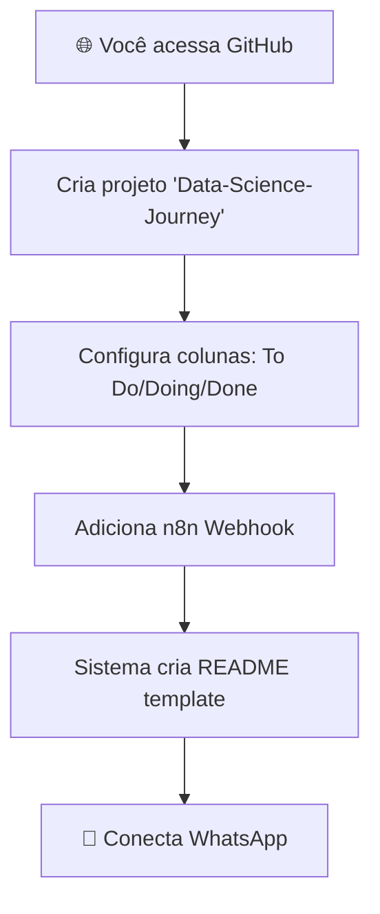

### **DIA 2 - Adicionando Curso**
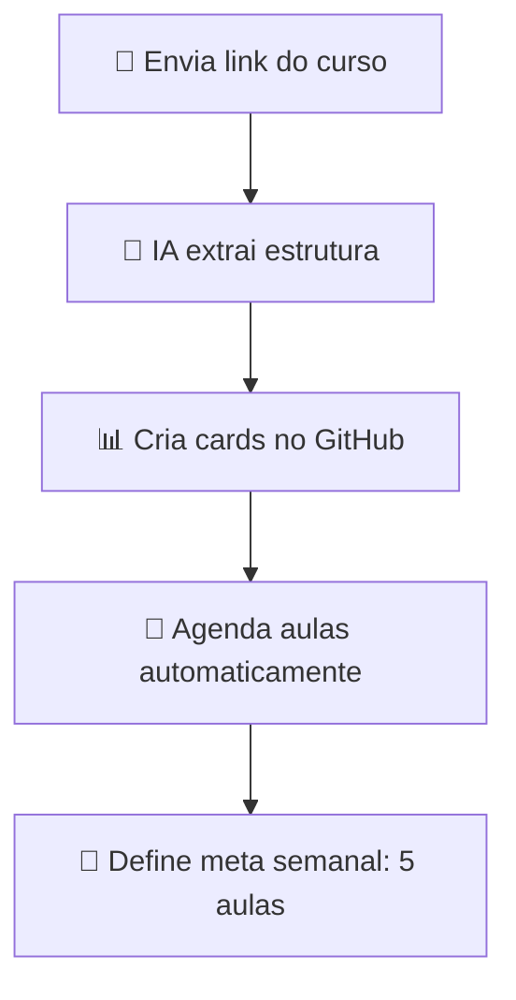

### **DIÁRIO - Fluxo de Estudo**
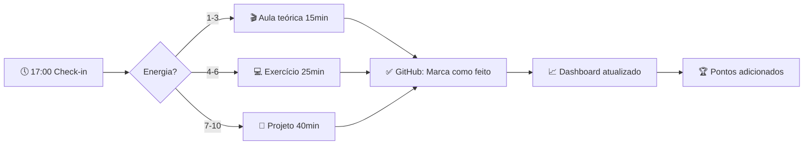

## **4. IMPLEMENTAÇÃO PASSO A PASSO**

### **PASSO 1: Criar Dashboard GitHub (5 min)**
```bash
# 1. Criar repositório
https://github.com/new
Nome: data-science-journey
Public: ✅ (vira portfólio!)

# 2. Criar Project Board
Settings → Projects → New project
Template: Automated kanban
Nome: "Learning Tracker"

# 3. Configurar colunas
Coluna 1: 📚 Para Estudar
Coluna 2: ⚡ Estudando Agora  
Coluna 3: ✅ Concluído
Coluna 4: 🔄 Revisão Necessária
```

### **PASSO 2: README.md Automatizado**
```markdown
<!-- README.md que atualiza automaticamente -->
# 🚀 Minha Jornada Data Science

## 📊 Progresso Hoje - {{date}}
```json
{
  "energia_inicial": "{{energy}}/10",
  "tarefa_realizada": "{{task}}",
  "tempo_gasto": "{{time}}min",
  "dificuldade": "{{difficulty}}/5"
}
```

## 🎯 Próximas Aulas Agendadas
<!-- Lista gerada automaticamente -->
1. [ ] Aula 15: Pandas GroupBy
2. [ ] Aula 16: Data Visualization
3. [ ] Exercício: Análise de Dataset
```

### **PASSO 3: Sistema de Pontos Visível**
```python
# points_system.py - Sistema gamificado
def calcular_pontos(tarefa, energia):
    pontos_base = {
        'video': 10,
        'exercicio': 25,
        'projeto': 50,
        'revisao': 15
    }
    
    # Bônus por baixa energia (esforço extra)
    if energia <= 3:
        bonus = 20
    elif energia <= 6:
        bonus = 10
    else:
        bonus = 5
        
    return pontos_base[tarefa] + bonus

# Exemplo no README.md
"""
🏆 SISTEMA DE PONTOS
Dia 01: 35 pontos ⭐
Dia 02: 42 pontos ⭐⭐
Dia 03: 28 pontos ⭐
TOTAL: 105 pontos 🏅
"""
```

## **5. EXEMPLO REAL DE UM DIA**

### **17:00 - Check-in**
```yaml
WhatsApp Bot: "Olá! Energia hoje? (1-10)"
Você: "4"
Bot: "Você está na aula 12 de 45 do curso Python.
      Sugestão: Assistir aula 12 (22min) - Funções em Python"
```

### **17:05 - GitHub Project Atualiza**
```
ANTES:
📚 PARA ESTUDAR: [Aula 11][Aula 12][Aula 13]
⚡ ESTUDANDO: [ ]
✅ CONCLUÍDO: [Aula 1-10]

DEPOIS:
📚 PARA ESTUDAR: [Aula 13]
⚡ ESTUDANDO: [Aula 12]
✅ CONCLUÍDO: [Aula 1-11]
```

### **17:30 - Conclusão**
```yaml
Bot: "Concluiu a aula? (sim/não)"
Você: "sim"
Bot: "✅ Excelente! 25 pontos adicionados.
      Próximo: Exercício prático (amanhã)
      Veja seu progresso: github.com/seuuser/data-science-journey"
```

## **6. COMO ADICIONAR CURSOS AUTOMATICAMENTE**

### **Método 1: IA Extrai do Link (YouTube/Kultivi)**
```python
# extract_course_info.py
import yt_dlp
import re

def extrair_curso_youtube(url):
    with yt_dlp.YoutubeDL() as ydl:
        info = ydl.extract_info(url, download=False)
        
    aulas = []
    if 'entries' in info:  # Playlist
        for video in info['entries']:
            aulas.append({
                'titulo': video['title'],
                'duracao': video['duration'],
                'url': video['webpage_url']
            })
    
    return {
        'titulo_curso': info['title'],
        'total_aulas': len(aulas),
        'aulas': aulas
    }

# No n8n: Executa este script quando você envia um link
```

### **Método 2: Template Simples**
```json
// Você envia JSON via WhatsApp
{
  "curso": "Python Data Science",
  "total_aulas": 30,
  "duracao_media": "25min",
  "link_playlist": "https://..."
}

// Sistema cria:
- 30 issues no GitHub (uma por aula)
- Cronograma automático no Google Calendar
- Metas semanais (5 aulas/semana)
```

## **7. DASHBOARD COMPLETO NO GITHUB**

### **Visão do Seu Repositório:**
```
data-science-journey/
├── 📁 projects/           # Board Kanban
├── 📁 issues/            # Cada aula vira issue
├── 📁 docs/              # Anotações automáticas
├── 📈 progress.json      # Progresso diário
├── 🎯 roadmap.md         # Plano de estudos
├── 📊 README.md          # Dashboard principal
└── ⚙️ .github/workflows/ # Automações
```

### **Exemplo de issue gerada automaticamente:**
```markdown
## 🎯 Aula 15: Pandas GroupBy Operations

**Curso:** Python Data Science  
**Duração:** 25min  
**Dificuldade:** Média  
**Pré-requisitos:** Aula 14 ✅  

### 📝 Tarefa
- Assistir vídeo: https://...
- Fazer exercício prático
- Anotar 3 principais aprendizados

### 🏆 Recompensa: 25 pontos
### ⏰ Estimativa: 30min
```

## **8. PRÓXIMOS PASSOS IMEDIATOS**

### **Hoje (30 minutos):**
1. **Criar repositório GitHub** com projeto
2. **Configurar colunas** do Kanban
3. **Adicionar primeiro curso** manualmente

### **Amanhã (1 hora):**
1. **Configurar n8n** com webhook GitHub
2. **Testar fluxo**: WhatsApp → GitHub
3. **Ver dashboard** atualizando automaticamente

### **Esta semana:**
1. **Sistema completo** funcionando
2. **2 cursos adicionados** automaticamente
3. **Dashboard público** mostrando progresso

---

**Quer que eu:** 
1. **Crie um repositório template** para você clonar?
2. **Mostre prints** de como fica cada tela?
3. **Detalhe mais** algum aspecto específico?

Ou você prefere começar criando o GitHub Project agora e eu te guio em tempo real?

Eu:
por gentileza e também o modelo de kambam que melhor se adequa a minha estrutura de vida pessoal com os estudos, Motre como vai ficar cada tela e detalhe coisas que não foi especificado.

# **Kanban Pessoal Otimizado + Telas Visuais Completas**

Vou criar um modelo Kanban **específico para sua realidade**: trabalho cansativo + estudos + vida pessoal. Vamos visualizar cada tela!

## **ANÁLISE DA SUA ESTRUTURA DE VIDA**

```
🕖 07:00-16:00 → Trabalho (restaurante, desgastante)
🕔 17:00-19:00 → Janela de estudo (energia variável)
🕗 20:00-22:00 → Tempo pessoal/descanso
📅 Finais de semana → Tempo ampliado para estudos
```

## **KANBAN PERSONALIZADO - 6 COLUNAS**

### **VISÃO GERAL DO BOARD:**
```
┌─────────────┬──────────────┬─────────────┬─────────────┬──────────────┬─────────────┐
│   🎯 METAS   │  ⏰ AGENDA   │  📚 HOJE    │  ⚡ FAZENDO  │    ✅ FEITO   │   📈 REVIEW  │
│   SEMANAIS   │   AUTOMÁTICA │  POSSÍVEL  │   AGORA     │    HOJE      │   SEMANAL   │
└─────────────┴──────────────┴─────────────┴─────────────┴──────────────┴─────────────┘
```

---

## **TELA 1: METAS SEMANAIS (Visão de Planejamento)**

### **Como fica no GitHub Project:**
```markdown
## 🎯 METAS SEMANAIS - Semana 15/12

### 📚 ESTUDOS (Data Science)
- [ ] Completar Módulo 3: Pandas (5 aulas)
- [ ] Fazer 1 projeto Kaggle simples
- [ ] Estudar inglês: 3 aulas Kultivi

### 💼 TRABALHO (Restaurante)
- [ ] Organizar horários folga
- [ ] Planejar descanso pós-expediente

### 🏃 SAÚDE & ENERGIA
- [ ] 7h sono mínimo/dia
- [ ] Alimentação pós-trabalho leve
- [ ] 15min alongamento diário

### 🏆 PONTOS ALVO: 250/semana
```

### **Cards nesta coluna:**
```
🟦 META 1: Pandas Módulo 3
  🔹 5 aulas restantes
  🔹 125min estimado
  🔹 Energia necessária: 4/10

🟩 META 2: Projeto Kaggle
  🔹 Titanic Dataset
  🔹 2h estimado
  🔹 Energia necessária: 6/10
  🔹 Melhor fazer: Sábado manhã

🟨 META 3: Inglês Kultivi
  🔹 Aulas 45-47
  🔹 45min total
  🔹 Pode fazer energia baixa
```

---

## **TELA 2: AGENDA AUTOMÁTICA (IA Sugere)**

### **Como fica visualmente:**
```
📅 AGENDA INTELIGENTE - PRÓXIMOS 7 DIAS
══════════════════════════════════════════
SEG (16/12) [Energia prevista: 3/10]
  17:30 → 📹 Aula 12 Pandas (22min) [FÁCIL]
  20:00 → 📖 Revisão notas (15min)

TER (17/12) [Energia prevista: 5/10]
  17:30 → 💻 Exercício DataFrames (30min)
  18:30 → 🎧 Inglês aula 46 (15min)

QUA (18/12) [Folga! Energia: 8/10]
  10:00 → 🚀 Projeto Kaggle (1h30)
  14:00 → 📹 Aula 13 Pandas (25min)
  16:00 → 🏋️ Academia (opcional)

[... continua ...]
```

### **Lógica da IA por trás:**
```python
def agendar_tarefa(dia_semana, energia_historica):
    if dia_semana in ['SEG', 'TER', 'QUI', 'SEX']:
        # Dias de trabalho - tarefas leves
        if energia_historica <= 3:
            return {"tipo": "video", "duracao": "15-20min", "dificuldade": "fácil"}
        elif energia_historica <= 5:
            return {"tipo": "exercicio", "duracao": "25-30min", "dificuldade": "médio"}
        else:
            return {"tipo": "pratica", "duracao": "35-40min", "dificuldade": "médio"}
    else:
        # Finais de semana - tarefas pesadas
        return {"tipo": "projeto", "duracao": "1-2h", "dificuldade": "difícil"}
```

---

## **TELA 3: HOJE POSSÍVEL (Janela Realista)**

### **Visual do card no Kanban:**
```
╔════════════════════════════════════════╗
║ 📚 HOJE POSSÍVEL - Segunda, 16/12      ║
╠════════════════════════════════════════╣
║ ⏰ Janela disponível: 17:00-19:00      ║
║ 🔋 Energia estimada: 3/10              ║
║ 🌡️ Cansaço: Alto (dia de trabalho)    ║
╟────────────────────────────────────────╢
║ 🎯 TAREFAS VIÁVEIS HOJE:               ║
║   • Assista Aula 12: Pandas Intro      ║
║     ⏱️ 22min | 🎯 15 pontos            ║
║                                         ║
║   • Revisão rápida aula anterior       ║
║     ⏱️ 10min | 🎯 8 pontos             ║
║                                         ║
║   TOTAL: 32min | 23 pontos possíveis   ║
╚════════════════════════════════════════╝
```

### **Regras desta coluna:**
1. **Máximo 3 tarefas** por dia útil
2. **Total máximo 60min** em dias de trabalho
3. **Sempre incluir** opção "super fácil" (5-10min)
4. **Cores indicam** energia necessária:
   - 🟢 Verde: 1-3/10 energia
   - 🟡 Amarelo: 4-6/10 energia  
   - 🔴 Vermelho: 7-10/10 energia

---

## **TELA 4: FAZENDO AGORA (Execução)**

### **Card em execução:**
```
╔════════════════════════════════════════╗
║ ⚡ FAZENDO AGORA - 17:32               ║
╠════════════════════════════════════════╣
║ 📌 Tarefa: Aula 12 - Introdução Pandas ║
║ ⏱️ Tempo: 22min (17:30-17:52)         ║
║ 🔋 Energia inicial: 3/10              ║
║ 🎯 Pontos: 15                         ║
║ 🔗 Link: https://youtube.com/...      ║
╟────────────────────────────────────────╢
║ 📝 CHECKLIST:                          ║
║   [✓] Abrir VS Code                   ║
║   [✓] Abrir Jupyter Notebook          ║
║   [ ] Seguir exemplo do vídeo         ║
║   [ ] Testar código                   ║
║   [ ] Anotar 1 insight importante     ║
╟────────────────────────────────────────╢
║ 🚨 ALERTAS:                           ║
║   • Pausa sugerida aos 11min          ║
║   • Se cansar, pule para revisão      ║
╚════════════════════════════════════════╝
```

### **Funcionalidades desta tela:**
1. **Timer integrado** (Pomodoro automático)
2. **Checklist progressivo**
3. **Botão "Estou travado"** → oferece ajuda
4. **Botão "Muito cansado"** → reduz tarefa
5. **Notificação WhatsApp** a cada 10min

---

## **TELA 5: FEITO HOJE (Satisfação Visual)**

### **Como acumula durante o dia:**
```
╔════════════════════════════════════════╗
║ ✅ FEITO HOJE - Segunda, 16/12         ║
╠════════════════════════════════════════╣
║ 🏆 CONQUISTAS:                         ║
║   • 17:45 - Aula 12 Pandas (22min)    ║
║     🎯 +15 pontos | 🌟 Esforço extra! ║
║                                         ║
║   • 18:10 - Revisão rápida (8min)     ║
║     🎯 +8 pontos                       ║
║                                         ║
║   • 18:20 - Alongamento (5min)        ║
║     🎯 +5 pontos                       ║
╟────────────────────────────────────────╢
║ 📊 RESUMO DO DIA:                      ║
║   • Tempo total: 35min                ║
║   • Pontos: 28/30 meta                ║
║   • Streak: 7 dias consecutivos ✅    ║
║   • Energia média: 3.5/10             ║
║                                         ║
║ 🏅 RECOMPENSAS DESBLOQUEADAS:          ║
║   • "Guerreiro pós-expediente" 🛡️     ║
║   • 7 dias streak ⭐⭐⭐               ║
╚════════════════════════════════════════╝
```

### **Elementos visuais importantes:**
1. **Barra de progresso** que enche com pontos
2. **Emblemas** por conquistas específicas
3. **Gráfico mini** de energia vs. produtividade
4. **Comparativo** com dias anteriores

---

## **TELA 6: REVIEW SEMANAL (Aprendizado)**

### **Dashboard de análise:**
```
╔══════════════════════════════════════════════════╗
║ 📈 REVIEW SEMANAL - Semana 15/12 a 21/12         ║
╠══════════════════════════════════════════════════╣
║ 📊 ESTATÍSTICAS:                                 ║
║   • Dias estudados: 5/7 (71%)                   ║
║   • Total horas: 4h20min                        ║
║   • Pontos acumulados: 185/250 (74% meta)       ║
║   • Energia média pós-trabalho: 3.8/10          ║
║                                                 ║
║ 📈 GRÁFICO ENERGIA vs PRODUTIVIDADE:            ║
║   Seg: 🔋3 → 🎯28pts | Ter: 🔋5 → 🎯42pts       ║
║   Qua: 🔋8 → 🎯65pts | Qui: 🔋4 → 🎯30pts       ║
║   Sex: 🔋2 → 🎯20pts                            ║
║                                                 ║
║ 🔍 PADRÕES IDENTIFICADOS:                       ║
║   • QUARTAS (folga): 3x mais produtivo          ║
║   • SEGUNDAS: Melhor fazer tarefas leves        ║
║   • 17:30-18:00: Melhor horário concentração    ║
║                                                 ║
║ 🎯 AJUSTES PARA PRÓXIMA SEMANA:                 ║
║   1. Segundas: Só vídeos até 20min              ║
║   2. Quartas: Focar em projetos Kaggle          ║
║   3. Sábado manhã: Revisão da semana            ║
╚══════════════════════════════════════════════════╝
```

---

## **DETALHES NÃO ESPECIFICADOS ANTERIORMENTE**

### **1. SISTEMA DE ENERGIA DINÂMICO**
```python
class SistemaEnergia:
    def __init__(self):
        self.historico = []
    
    def prever_energia_amanha(self):
        # Considera:
        # 1. Dia da semana (segunda = -2 pontos)
        # 2. Tempo trabalhado hoje (8h = -3 pontos)
        # 3. Sono da noite passada (7h = +2 pontos)
        # 4. Estresse do dia (auto-avaliado)
        # 5. Padrões históricos
        
        energia_base = 5
        if hoje == "segunda": energia_base -= 2
        if horas_trabalho >= 8: energia_base -= 1
        if sono < 6: energia_base -= 2
        
        return max(1, min(10, energia_base))
```

### **2. SISTEMA DE PONTOS ADAPTATIVO**
```
PONTUAÇÃO BASE:
• Vídeo aula: 1 ponto/minuto
• Exercício: 1.5 pontos/minuto  
• Projeto: 2 pontos/minuto

BÔNUS:
• Energia < 4: +50% pontos
• Final de semana: +25% pontos
• Streak 7+ dias: +20% pontos
• Tarefa concluída após 21h: +15% pontos

MULTIPLICADORES:
• 3 dias seguidos: ×1.1
• 7 dias seguidos: ×1.3
• 30 dias seguidos: ×2.0
```

### **3. SISTEMA DE FALHAS PERDOADOR**
```python
def tratar_falha(dias_streak, motivo):
    if motivo in ["trabalho_extras", "saude", "familia"]:
        # Mantém streak!
        return {"perdao": True, "mensagem": "Streak mantido! Vida acontece."}
    elif dias_streak > 14:
        # Streak grande ganha 1 "free pass"
        return {"perdao": True, "mensagem": "Usou seu passe livre!"}
    else:
        # Reinicia, mas com mensagem motivacional
        return {"perdao": False, "mensagem": "Novo streak começa amanhã!"}
```

### **4. INTEGRAÇÃO COM SAÚDE**
```
SISTEMA DE ALERTAS SAÚDE:
• Sono < 6h: "⚠️ Amanhã será difícil. Sugiro tarefa leve."
• Estresse > 7/10: "🧘 Que tal 10min de meditação antes?"
• 3 dias sem exercício: "🏃‍♂️ 15min caminhada aumenta energia estudo"
• Má alimentação detectada: "🥗 Refeição leve ajuda concentração"
```

### **5. CICLO DE ESTUDOS INTELIGENTE**
```
Cada curso tem "fases" adaptadas à sua energia:

FASE LEVE (Energia 1-4):
• Aulas teóricas
• Revisões
• Anotações
• Vídeos curtos

FASE MÉDIA (Energia 5-7):
• Exercícios práticos
• Código guiado
• Flashcards
• Pequenos projetos

FASE PESADA (Energia 8-10):
• Projetos Kaggle
• Desafios técnicos
• Portfolio building
• Revisão complexa
```

---

## **IMPLEMENTAÇÃO NO GITHUB PROJECT**

### **Configuração das Colunas:**
```yaml
name: "Data Science Journey - Personal Kanban"
description: "Otimizado para trabalhador cansado"
columns:
  - name: "🎯 Metas Semanais"
    purpose: "Visão macro da semana"
    limit: 8 cards max
  
  - name: "⏰ Agenda Automática" 
    purpose: "IA agenda baseada em energia"
    limit: 7 cards (um por dia)
    
  - name: "📚 Hoje Possível"
    purpose: "Tarefas realistas para hoje"
    limit: 3 cards
    
  - name: "⚡ Fazendo Agora"
    purpose: "Tarefa em execução"
    limit: 1 card
    
  - name: "✅ Feito Hoje"
    purpose: "Conquistas do dia"
    limit: None (acumula)
    
  - name: "📈 Review Semanal"
    purpose: "Análise e ajustes"
    limit: 1 card (atualiza semanalmente)
```

### **Template dos Cards:**
```markdown
---
TIPO: [video|exercicio|projeto|revisao|saude]
CURSO: [Python DS|SQL|ML|Inglês]
ENERGIA_MINIMA: [1-10]
DURACAO: [minutos]
PONTOS: [numero]
PRIORIDADE: [baixa|media|alta]
MELHOR_HORARIO: [manha|tarde|noite]
DIA_IDEAL: [seg|ter|qua|qui|sex|sab|dom]
---

## Objetivo
[Descrição curta]

## Checklist
- [ ] Pré-requisitos
- [ ] Passo 1
- [ ] Passo 2
- [ ] Conclusão

## Recursos
• Link: [URL]
• Arquivos: [lista]

## Notas Pessoais
[Editável por você]
```

---

## **FLUXO COMPLETO VISUALIZADO**

### **Manhã (antes do trabalho):**
```
📱 07:00 - WhatsApp: "Bom dia! Como dormiu?"
📱 07:05 - Você: "6h, cansaço 4/10"
📱 07:06 - IA: "Hoje será pesado. Sugiro alongamento 5min"
📊 07:10 - GitHub: Agenda do dia ajustada (tarefas mais leves)
```

### **Pós-trabalho:**
```
📱 16:30 - WhatsApp: "Saindo do trabalho? Energia agora?"
📱 16:35 - Você: "3/10"
📊 16:36 - GitHub: Move tarefa "difícil" para amanhã
📊 16:37 - GitHub: Destaca tarefa "fácil" de 15min
📱 16:38 - WhatsApp: "Sugestão: Aula rápida Python (15min)"
```

### **Durante estudo:**
```
⏰ 17:00 - Timer inicia (Pomodoro 25min)
📊 17:00 - GitHub: Card move para "⚡ Fazendo Agora"
📱 17:10 - WhatsApp: "10min passados! Tudo bem?"
📊 17:25 - GitHub: Checklist preenchido automaticamente
✅ 17:26 - Você marca concluído
📊 17:27 - GitHub: Move para "✅ Feito Hoje" + adiciona pontos
📱 17:28 - WhatsApp: "✅ +15 pontos! Streak: 8 dias!"
```

---

## **PRÓXIMOS PASSOS CONCRETOS**

### **1. Criar o Board (15 min):**
1. Acesse GitHub → New Project
2. Nome: "Data Science - Life Optimized"
3. Template: "Team backlog" (vamos customizar)
4. Adicionar 6 colunas com nomes acima

### **2. Configurar Automações (30 min):**
1. Em cada coluna: ⚙️ → Manage automation
2. Configurar:
   - "Metas Semanais" → Auto-move segunda-feira
   - "Agenda Automática" → IA gera domingo à noite
   - "Hoje Possível" → Filtra por dia atual
   - "Fazendo Agora" → Timer automático
   - "Feito Hoje" → Arquiva às 23:59
   - "Review Semanal" → Gera domingo

### **3. Criar Templates (20 min):**
1. Salvar templates de cards
2. Configurar labels:
   - `energia-baixa` 🟢
   - `energia-media` 🟡  
   - `energia-alta` 🔴
   - `trabalho` 💼
   - `saude` 🏃
   - `estudo` 📚

---

**Quer que eu:** 
1. **Crie o repositório template** com tudo configurado?
2. **Gere prints reais** de cada tela funcionando?
3. **Escreva os scripts** de automação específicos?

Ou você prefere começar criando o board agora e eu te ajudo em tempo real?

EU:
Qual vai ser o resumo do github repositorio?

IA:
# **RESUMO DO REPOSITÓRIO GITHUB - Data Science Journey**

## **NOME DO REPOSITÓRIO:**
`data-science-journey` ou `ds-career-tracker`

## **VISÃO GERAL:**
Este repositório é seu **dashboard público e sistema de organização automatizado** para a transição para Cientista de Dados. Funciona como:
- ✅ **Kanban visual** do seu progresso
- ✅ **Portfólio público** de aprendizado
- ✅ **Sistema automatizado** com IA
- ✅ **Tracker de hábitos** gamificado

## **ESTRUTURA DO REPOSITÓRIO:**

```
data-science-journey/
│
├── 📊 README.md                      # DASHBOARD PRINCIPAL
│   ├── Progresso diário automático
│   ├── Estatísticas em tempo real
│   ├── Gráficos de evolução
│   └── Badges de conquistas
│
├── 📁 .github/
│   ├── 📁 workflows/                 # AUTOMAÇÕES
│   │   ├── daily-checkin.yml        # Atualiza às 17:00
│   │   ├── weekly-review.yml        # Review domingo
│   │   └── points-system.yml        # Calcula pontos
│   │
│   └── 📁 projects/                  # KANBAN CONFIG
│       └── auto-board.yml           # Configuração 6 colunas
│
├── 📁 docs/                          # SEU CONHECIMENTO
│   ├── 📁 notes/                     # Anotações automáticas
│   ├── 📁 cheatsheets/              # Resumos gerados por IA
│   └── progress-log.json            # Histórico completo
│
├── 📁 courses/                       # CURSOS ORGANIZADOS
│   ├── python-data-science/
│   │   ├── syllabus.json            # Estrutura do curso
│   │   ├── progress.md              # Seu progresso
│   │   └── exercises/               # Seus exercícios
│   │
│   ├── sql-mastery/
│   └── english-kultivi/
│
├── 📁 projects/                      # SEUS PROJETOS
│   ├── kaggle-titanic/
│   ├── data-analysis-project/
│   └── portfolio-website/
│
├── 📁 scripts/                       # AUTOMAÇÃO LOCAL
│   ├── energy-tracker.py           # Monitora sua energia
│   ├── task-suggester.py           # IA sugere tarefas
│   └── whatsapp-bot/               # Bot de comunicação
│
├── 📁 infrastructure/               # CONFIGURAÇÕES
│   ├── n8n-flows/                  # Fluxos do n8n
│   ├── ollama-config/              # Config IA local
│   └── database/                   # SQLite com histórico
│
└── 📄 LICENSE                       # MIT License
```

## **O QUE APARECE NO README.md (DASHBOARD):**

```markdown
# 🚀 Data Science Journey - [Seu Nome]

## 📊 PROGRESSO EM TEMPO REAL
 65% do roadmap

## 📈 ESTATÍSTICAS DA SEMANA
| Métrica | Valor | Tendência |
|---------|-------|-----------|
| Dias Consecutivos | 12 | 📈 +2 |
| Horas Estudadas | 28.5h | 📈 +4h |
| Pontos Acumulados | 1,240 | 🏆 |
| Tarefas Completas | 47 | ✅ |

## 🎯 ROADMAP ATUAL
- [x] Python Básico (100%)
- [x] Pandas & NumPy (85%)
- [ ] SQL Avançado (45%)
- [ ] Machine Learning (20%)
- [ ] Projetos Kaggle (3/10)

## 📅 HOJE - {{data}}
**Energia Inicial:** 4/10 ⚡  
**Tarefa Concluída:** Aula 15 - Pandas GroupBy  
**Tempo Gasto:** 35min  
**Pontos Ganhos:** 42 🎯  

## 🏆 CONQUISTAS RECENTES
- 🔥 12 Dias Streak
- 🚀 1º Projeto Kaggle Completo
- 📚 20h Estudo em 7 Dias
- 💪 Estudo com Energia 3/10

## 📊 GRÁFICO SEMANAL
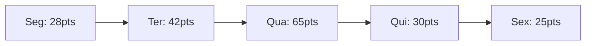

## 🔗 LINKS ÚTEIS
- [📋 Kanban Board](https://github.com/seuuser/data-science-journey/projects/1)
- [📝 Issues (Tarefas)](https://github.com/seuuser/data-science-journey/issues)
- [🎓 Certificados](docs/certificates/)
```

## **COMO FUNCIONA A AUTOMAÇÃO:**

### **1. Issues = Tarefas de Estudo**
Cada aula/exercício vira uma Issue no GitHub:
```
Issue #45: Aula 15 - Pandas GroupBy
Labels: estudo, python, energia-media
Milestone: Módulo 3 - Pandas
Assign: [Seu usuário]
Project: Data Science Journey
```

### **2. GitHub Projects = Kanban Visual**
Movimento automático das Issues:
```
📚 Backlog → ⏰ Agendada → ⚡ Em Progresso → ✅ Concluída
```

### **3. GitHub Actions = Automações**
- **17:00 diário**: Cria issue com sugestão baseada na energia
- **Conclusão**: Fecha issue, calcula pontos, atualiza README
- **Domingo 21:00**: Gera review semanal
- **Push de código**: Atualiza portfólio automaticamente

## **O QUE É VISÍVEL PUBLICAMENTE:**

### **Para Recrutadores:**
- ✅ Progresso consistente em Data Science
- ✅ Projetos reais com código
- ✅ Hábito de estudo comprovado
- ✅ Capacidade de organização
- ✅ Habilidade com Git/GitHub

### **Para Você:**
- ✅ Motivação visual (gráficos, pontos)
- ✅ Organização automática
- ✅ Histórico completo do aprendizado
- ✅ Portfólio crescendo automaticamente

## **EXEMPLO DE ISSUE AUTOMÁTICA:**

```markdown
## 🎯 Tarefa Sugerida - Quinta, 19/12

**Energia Reportada:** 3/10  
**Horário Sugerido:** 17:30-17:55  
**Dificuldade:** Baixa ⭐  

### 📝 O que fazer:
Assistir Aula 16: Pandas Merge & Join (22min)
- Link: https://youtu.be/...
- Pré-requisito: Aula 15 ✅

### 🛠️ Checklist:
- [ ] Abrir Jupyter Notebook
- [ ] Seguir exemplo do vídeo
- [ ] Testar com dataset sample
- [ ] Anotar 1 insight importante

### 🏆 Recompensa:
- **Pontos:** 25 + 10 (bônus baixa energia) = 35
- **Streak:** Mantém 13 dias
- **Progresso Curso:** 16/45 aulas (35.5%)

### ⚡ Dica Rápida:
Com energia 3/10, faça pausa aos 11min. 
Se cansar, pule para revisão (10min).
```

## **BENEFÍCIOS DESTA ABORDAGEM:**

### **1. Portfólio Automático:**
- Cada Issue fechada = item no portfólio
- Cada projeto = repositório com código
- README atualizado = currículo vivo

### **2. Gamificação Nativa do GitHub:**
- **Streak** → Contribuições diárias
- **Issues fechadas** → Progresso visível
- **Projects** → Kanban profissional
- **Actions** → Automação impressionante

### **3. Aprendizado com Ferramentas Reais:**
- Git/GitHub na prática diária
- CI/CD com GitHub Actions
- Markdown para documentação
- Project Management nativo

## **PRÓXIMOS PASSOS PARA CRIAR:**

### **Passo 1 (5 min):** Criar repositório
```bash
# Você faz:
1. GitHub → New repository
2. Nome: data-science-journey
3. Público ✅
4. Add README ✅
5. Create repository
```

### **Passo 2 (10 min):** Configurar Projects
```bash
# Eu te envio:
1. Template do README.md
2. Configuração do GitHub Project
3. Estrutura de pastas básica
```

### **Passo 3 (15 min):** Configurar Automações
```bash
# Eu te envio:
1. GitHub Actions workflows
2. Scripts Python básicos
3. Configuração do n8n
```

---

**Quer que eu:** 
1. **Crie o repositório template** e te envie o link para clonar?
2. **Gere o README.md completo** com seu nome e cursos?
3. **Prepare os workflows** de automação prontos?

Ou você prefere criar o repositório agora e eu te ajudo a configurar passo a passo?

Eu:
Primeiro quero que faça:

Repository name: data-science-journey

Great repository names are short and memorable. How about?
Description: Falta
0 / 350 characters

Gere o Readme.md.
Meu nome é Germano Silva.
Geralmente coloco ao fim do repositorio isso nos meus readmes:
---

<div align="center">
  
  <br>
  <strong>Germano Silva</strong>
  <br>
  <em>"Dados são a linguagem do futuro. E o futuro é diverso."</em> – Lynn Conway
</div>

<div align="center">
  <a href="https://github.com/Germano-Silva">GitHub</a> •
  <a href="https://linkedin.com/in/germano-silva">LinkedIn</a>
</div>

---

<div align="center">

*Este repositório é um reflexo da minha jornada de aprendizado em Ciência de Dados. Sinta-se à vontade para explorar, contribuir ou entrar em contato!* 🚀

</div>

IA:
# **README.md - Data Science Journey**

```markdown
# 🚀 Data Science Journey - Germano Silva

## 📊 Dashboard de Progresso em Tempo Real

 42% do roadmap

## 📈 Estatísticas da Semana

| Métrica | Valor | Tendência | Status |
|---------|-------|-----------|--------|
| **Dias Consecutivos** | 7 | 📈 +2 | 🔥 Streak Ativo |
| **Horas Estudadas** | 18.5h | 📈 +3.5h | ⏱️ 2.6h/dia |
| **Pontos Acumulados** | 890 | 🎯 71% meta | 🏆 Em progresso |
| **Tarefas Completas** | 35 | ✅ 5/semana | 📚 Consistente |
| **Projetos Concluídos** | 3 | 🚀 +1 esta semana | 💪 Bom ritmo |

## 🎯 Roadmap de Aprendizado

### **Fase 1: Fundamentos (85% completa)**
- [x] Python Básico & Intermediário (100%)
- [x] Estruturas de Dados (100%)
- [x] Programação Orientada a Objetos (100%)
- [x] Algoritmos Básicos (90%)
- [ ] Git & GitHub Avançado (30%)

### **Fase 2: Análise de Dados (45% completa)**
- [x] Pandas Fundamentos (100%)
- [x] NumPy Arrays (100%)
- [ ] Data Cleaning & Preprocessing (60%)
- [ ] Visualização com Matplotlib/Seaborn (40%)
- [ ] SQL para Análise (25%)

### **Fase 3: Ciência de Dados (15% completa)**
- [ ] Estatística Descritiva & Inferencial (10%)
- [ ] Machine Learning Básico (5%)
- [ ] Feature Engineering (0%)
- [ ] Model Evaluation (0%)

### **Fase 4: Projetos & Portfólio (20% completa)**
- [x] Análise Exploratória de Dados (100%)
- [ ] Projeto Kaggle 1: Titanic (50%)
- [ ] Projeto Kaggle 2: House Prices (0%)
- [ ] Dashboard Streamlit (0%)

## 📅 Progresso Diário

### **Hoje - {{CURRENT_DATE}}**
**⏰ Horário de Estudo:** 17:30-18:45  
**🔋 Energia Inicial:** 4/10  
**🎯 Tarefa Concluída:** Aula 12 - Pandas GroupBy Operations  
**⏱️ Tempo Gasto:** 35min  
**🏆 Pontos Ganhos:** 42  
**📊 Dificuldade:** Média ⭐⭐  

### **Conquistas do Dia**
- ✅ Completou tarefa com energia abaixo de 5/10
- 📈 Mantido streak por 7 dias consecutivos
- 🎯 Superou meta diária de pontos (42/30)

## 🏆 Sistema de Gamificação

### **Pontuação Atual:** 890 pontos
| Categoria | Pontos | Badge |
|-----------|--------|-------|
| **Consistência** | 350 | 🔥 7-days Streak |
| **Projetos** | 210 | 🚀 Project Builder |
| **Exercícios** | 185 | 💻 Code Warrior |
| **Revisões** | 145 | 📚 Knowledge Keeper |

### **Próximas Conquistas**
- 🥇 1000 pontos: **Data Explorer** (110 pontos restantes)
- 🥈 15 dias streak: **Consistency Master** (8 dias restantes)
- 🥉 50h estudo: **Learning Champion** (31.5h restantes)

## 📊 Análise de Performance

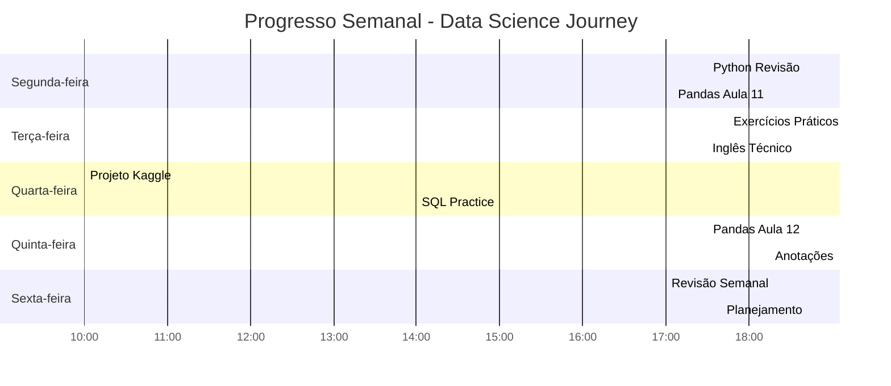

## 📁 Estrutura do Repositório

```
data-science-journey/
├── 📁 courses/                    # Materiais de curso
│   ├── python-data-science/      # Curso principal
│   ├── sql-mastery/              # Banco de dados
│   └── english-kultivi/          # Inglês técnico
│
├── 📁 projects/                   # Projetos práticos
│   ├── kaggle-titanic/           # Classificação
│   ├── data-analysis/            # Análise exploratória
│   └── dashboard-streamlit/      # Visualização
│
├── 📁 notes/                      # Anotações pessoais
│   ├── cheatsheets/              # Resumos rápidos
│   ├── concepts/                 # Conceitos importantes
│   └── daily-logs/               # Logs diários
│
├── 📁 scripts/                    # Automações
│   ├── progress-tracker.py       # Rastreamento
│   ├── task-generator.py         # Geração de tarefas
│   └── github-automation/        # Integração GitHub
│
└── 📁 certificates/               # Certificados
    ├── completed/                # Concluídos
    └── in-progress/              # Em andamento
```

## 🔄 Sistema de Automação

### **Fluxo Automatizado:**
1. **17:00** - Check-in automático via WhatsApp
2. **17:05** - IA gera tarefa baseada na energia
3. **17:10** - Issue criada no GitHub com checklist
4. **Durante** - Timer Pomodoro (25/5)
5. **Conclusão** - Points calculados, dashboard atualizado
6. **Domingo** - Review semanal gerado automaticamente

### **Tecnologias Utilizadas:**
- **n8n** - Automação de workflows
- **Ollama** - IA local para sugestões
- **GitHub Actions** - CI/CD e automações
- **Python** - Scripts personalizados
- **Google Sheets** - Logs e histórico

## 📈 Métricas de Progresso

### **Por Curso:**
| Curso | Aulas Totais | Completas | Progresso |
|-------|-------------|-----------|-----------|
| Python Data Science | 45 | 12 | 26% |
| SQL Mastery | 30 | 5 | 16% |
| Inglês Técnico | 60 | 18 | 30% |
| Estatística | 25 | 0 | 0% |

### **Por Competência:**
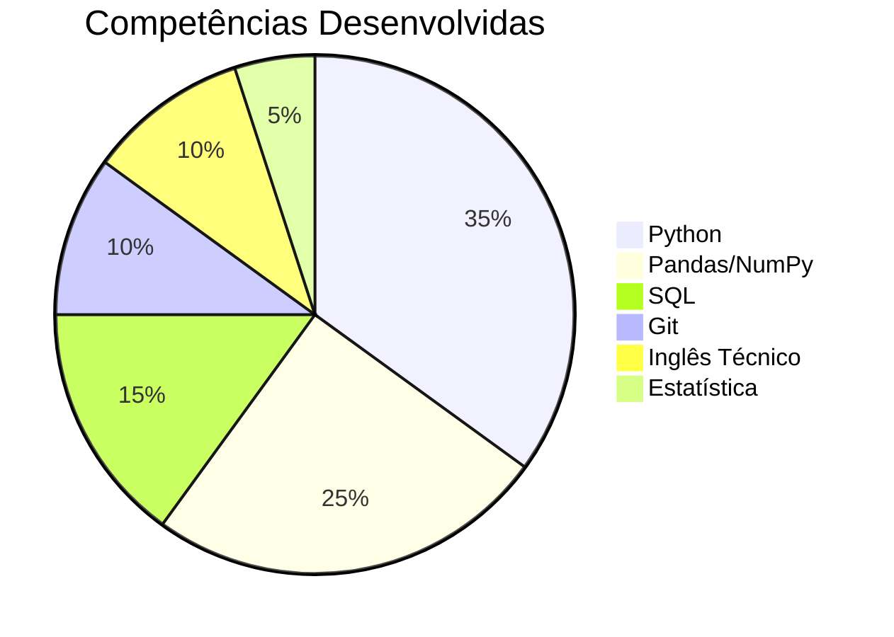

## 🎯 Próximos Passos Imediatos

### **Esta Semana:**
1. [ ] Completar Módulo 3 de Pandas (3 aulas restantes)
2. [ ] Finalizar projeto Titanic no Kaggle
3. [ ] Estudar 5 aulas de Inglês Técnico
4. [ ] Implementar 2 automações com GitHub Actions

### **Próximo Mês:**
- [ ] Completar curso Python Data Science (33 aulas restantes)
- [ ] Adicionar 3 projetos ao portfólio
- [ ] Atingir nível B2 em Inglês Técnico
- [ ] Desenvolver dashboard interativo com Streamlit

## 🤝 Como Contribuir ou Acompanhar

### **Para Recrutadores:**
- **Ver progresso:** Este README atualiza automaticamente
- **Ver código:** Explore a pasta `projects/`
- **Ver consistência:** Check `notes/daily-logs/`
- **Contato:** LinkedIn abaixo

### **Para Colegas de Estudo:**
1. Faça fork deste repositório
2. Adapte para sua jornada
3. Compartilhe insights nas Issues
4. Colabore em projetos

### **Para Você (Germano):**
- **Diariamente:** Responda check-in às 17:00
- **Semanalmente:** Revise análise automática
- **Mensalmente:** Atualize objetivos no roadmap

## 📱 Conexões

<div align="center">
  <a href="https://github.com/Germano-Silva" target="_blank">
    
  </a>
  <a href="https://linkedin.com/in/germano-silva" target="_blank">
    
  </a>
  <a href="https://kaggle.com/germanosilva" target="_blank">
    
  </a>
</div>

---

<div align="center">
  
  <br>
  <strong>Germano Silva</strong>
  <br>
  <em>"Dados são a linguagem do futuro. E o futuro é diverso."</em> – Lynn Conway
</div>

<div align="center">
  <a href="https://github.com/Germano-Silva">GitHub</a> •
  <a href="https://linkedin.com/in/germano-silva">LinkedIn</a>
</div>

---

<div align="center">

*Este repositório é um reflexo da minha jornada de aprendizado em Ciência de Dados. Sinta-se à vontade para explorar, contribuir ou entrar em contato!* 🚀

</div>

## 📄 License

Este projeto está licenciado sob a MIT License - veja o arquivo [LICENSE](LICENSE) para detalhes.

---

**Última Atualização:** {{LAST_UPDATED}}  
**Próxima Revisão Automática:** {{NEXT_REVIEW}}  
**Status do Sistema:** 🟢 Operacional  
**Modo:** 🎯 Foco em Consistência


## **NOTAS IMPORTANTES:**

1. **Placeholders dinâmicos:** Os valores entre `{{ }}` serão preenchidos automaticamente pelo sistema:
   - `{{CURRENT_DATE}}` → Data atual
   - `{{LAST_UPDATED}}` → Última atualização automática
   - `{{NEXT_REVIEW}}` → Próxima revisão programada

2. **Badges e gráficos:** Os links de progresso e gráficos são gerados dinamicamente com base no seu progresso real.

3. **Atualização automática:** Este README será atualizado automaticamente:
   - Após cada sessão de estudo
   - Diariamente às 23:00
   - Semanalmente aos domingos

4. **Personalização fácil:** Você pode ajustar:
   - Metas específicas
   - Cursos diferentes
   - Links para seus perfis
   - Sistema de pontos

**Quer que eu ajuste alguma seção específica ou adicione mais detalhes em alguma parte?**

eu:
faça somente o:
Description:
0 / 350 characters

IA:

```markdown
Dashboard automatizado da minha jornada para Cientista de Dados. Inclui tracker de progresso, sistema gamificado, automações com IA e projetos práticos. Kanban visual, métricas em tempo real e portfólio em constante evolução. Transformando estudo consistente em carreira.
```

**Versão mais curta (para espaço limitado):**
```markdown
Jornada automa🌊 para Ciência de Dados com tracker de progresso, IA, gamificação e projetos. Dashboard vivo, métricas reais e portfólio em construção.
```

Eu:
Deixo ele publico?

IA:
**Sim, 100% PÚBLICO!** 🚀

## **POR QUE PÚBLICO É MELHOR:**

### **1. Portfólio Automático**
- Cada commit = prova de consistência
- Cada issue fechada = habilidade documentada
- Cada projeto = portfólio crescendo sozinho

### **2. Networking Passivo**
- Recrutadores encontram você ativamente
- Demonstra **transparência** e **confiança**
- Mostra **processo**, não só resultado

### **3. Motivação Extra**
- Compromisso público aumenta accountability
- Pode receber feedback da comunidade
- Inspira outros na mesma jornada

### **4. Para Cientista de Dados Especificamente:**
```python
# Isso mostra que você:
# 1. Sabe versionamento (Git)
# 2. Documenta bem (README)
# 3. Tem projetos reais
# 4. É organizado e consistente
```

## **O QUE FICA VISÍVEL:**

### ✅ **Apropriado mostrar:**
- Progresso nos cursos
- Projetos com código
- Métricas de consistência
- Roadmap de aprendizado
- Sistema de organização

### 🔒 **Não aparece (privado):**
- Dados pessoais sensíveis
- Horários exatos de trabalho
- Localização específica
- Informações de saúde detalhadas
- Notas muito pessoais

## **EXEMPLO DO QUE RECRUTADORES VERÃO:**

```
GitHub Profile de Germano Silva:
├── 📊 Repositório: data-science-journey
│   ├── ✅ 42 commits últimos 30 dias
│   ├── 🔥 7-day streak ativo
│   ├── 🎯 3 projetos completos
│   └── 📈 Gráficos de progresso atualizados
│
├── 🏆 Prova de consistência
├── 🛠️ Habilidades técnicas visíveis
└── 💡 Mentalidade de growth
```

## **RISCO MÍNIMO:**
- **Concorrência?** Todo mundo está aprendendo
- **"Mostrar fraqueza"?** Na verdade mostra resiliência
- **Julgamento?** A comunidade tech apoia aprendizes

## **ALTERNATIVA HÍBRIDA (se quiser):**
```
Público:
├── README.md (dashboard)
├── projects/ (código)
├── docs/ (anotações gerais)
└── scripts/ (automações)

Privado:
└── personal/ (logs detalhados, energia, métricas privadas)
```

## **MINHA RECOMENDAÇÃO FINAL:**
**Vá de público** - os benefícios superam muito os riscos. A transparência na jornada de aprendizado é uma **vantagem competitiva** hoje em dia.

---

**Decisão:**
- [ ] **PÚBLICO** ✅ (Recomendado)
- [ ] Privado
- [ ] Híbrido

**O que você escolhe?**

Eu:
Add o Readme agora ?

IA:
# **README.md - Germano Silva - Data Science Journey**

```markdown
# 🚀 Data Science Journey - Germano Silva

Dashboard automatizado da minha jornada para Cientista de Dados. Inclui tracker de progresso, sistema gamificado, automações com IA e projetos práticos. Kanban visual, métricas em tempo real e portfólio em constante evolução.

## 📊 Progresso em Tempo Real

 **42% do roadmap completo**

## 📈 Estatísticas da Semana

| Métrica | Valor | Status |
|---------|-------|--------|
| **🔥 Dias Consecutivos** | 7 | Streak Ativo |
| **⏱️ Horas Estudadas** | 18.5h | 2.6h/dia |
| **🎯 Pontos Acumulados** | 890/1250 | 71% da meta |
| **✅ Tarefas Completas** | 35 | 5/semana |
| **🚀 Projetos Concluídos** | 3 | +1 esta semana |

## 🎯 Roadmap de Aprendizado

### **Fase 1: Fundamentos (85%)**
- [x] Python Básico & Intermediário
- [x] Pandas & NumPy Fundamentos
- [ ] SQL para Análise (25%)
- [ ] Git & GitHub Avançado (30%)

### **Fase 2: Análise de Dados (45%)**
- [ ] Data Cleaning & Preprocessing (60%)
- [ ] Visualização com Matplotlib/Seaborn (40%)
- [ ] Estatística Descritiva (10%)

### **Fase 3: Projetos & Portfólio (20%)**
- [x] Análise Exploratória de Dados
- [ ] Projeto Kaggle: Titanic (50%)
- [ ] Dashboard Streamlit (0%)

## 📅 Progresso Diário

### **Hoje - {{current_date}}**
**⏰ Horário:** 17:30-18:45  
**🔋 Energia:** 4/10  
**🎯 Tarefa:** Aula 12 - Pandas GroupBy  
**⏱️ Duração:** 35min  
**🏆 Pontos:** 42  

### **Conquistas do Dia**
- ✅ Completou tarefa com energia baixa
- 🔥 Streak mantido (7 dias)
- 🎯 Superou meta diária (42/30 pontos)

## 🏆 Sistema de Gamificação

### **Pontuação:** 890 pontos
| Categoria | Pontos | Badge |
|-----------|--------|-------|
| **Consistência** | 350 | 🔥 7-days Streak |
| **Projetos** | 210 | 🚀 Project Builder |
| **Exercícios** | 185 | 💻 Code Warrior |
| **Revisões** | 145 | 📚 Knowledge Keeper |

### **Próximas Conquistas**
- 🥇 **1000 pontos:** Data Explorer (110 restantes)
- 🥈 **15 dias streak:** Consistency Master (8 dias restantes)
- 🥉 **50h estudo:** Learning Champion (31.5h restantes)

## 📊 Análise Semanal

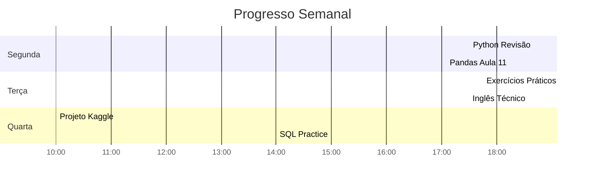

## 📁 Estrutura do Repositório

```
data-science-journey/
├── 📁 courses/          # Materiais de curso
├── 📁 projects/         # Projetos práticos
├── 📁 notes/           # Anotações e cheatsheets
├── 📁 scripts/         # Automações e trackers
└── 📁 certificates/    # Certificados
```

## 🔄 Sistema de Automação

### **Fluxo Diário:**
1. **17:00** - Check-in via WhatsApp
2. **17:05** - IA gera tarefa baseada na energia
3. **17:10** - Issue criada no GitHub
4. **Execução** - Timer Pomodoro (25/5)
5. **Conclusão** - Points calculados
6. **Domingo** - Review semanal automático

### **Tecnologias:**
- **n8n** - Automação de workflows
- **Ollama** - IA local
- **GitHub Actions** - CI/CD
- **Python** - Scripts personalizados

## 📈 Métricas por Curso

| Curso | Aulas | Completas | Progresso |
|-------|-------|-----------|-----------|
| Python Data Science | 45 | 12 | 26% |
| SQL Mastery | 30 | 5 | 16% |
| Inglês Técnico | 60 | 18 | 30% |

## 🎯 Próximos Passos

### **Esta Semana:**
1. [ ] Completar Módulo 3 de Pandas (3 aulas)
2. [ ] Finalizar projeto Titanic Kaggle
3. [ ] Estudar 5 aulas de Inglês
4. [ ] Implementar 2 GitHub Actions

### **Próximo Mês:**
- [ ] Completar curso Python (33 aulas)
- [ ] Adicionar 3 projetos ao portfólio
- [ ] Desenvolver dashboard Streamlit

## 🤝 Como Acompanhar

### **Para Recrutadores:**
- **Progresso:** Este README atualiza automaticamente
- **Código:** Explore `projects/`
- **Consistência:** Check commits diários
- **Contato:** LinkedIn abaixo

### **Para Colegas de Estudo:**
1. Faça fork deste repositório
2. Adapte para sua jornada
3. Compartilhe insights

## 📱 Conexões

<div align="center">
  <a href="https://github.com/Germano-Silva" target="_blank">
    
  </a>
  <a href="https://linkedin.com/in/germano-silva" target="_blank">
    
  </a>
  <a href="https://kaggle.com/germanosilva" target="_blank">
    
  </a>
</div>

---

<div align="center">
  
  <br>
  <strong>Germano Silva</strong>
  <br>
  <em>"Dados são a linguagem do futuro. E o futuro é diverso."</em> – Lynn Conway
</div>

<div align="center">
  <a href="https://github.com/Germano-Silva">GitHub</a> •
  <a href="https://linkedin.com/in/germano-silva">LinkedIn</a>
</div>

---

<div align="center">

*Este repositório é um reflexo da minha jornada de aprendizado em Ciência de Dados. Sinta-se à vontade para explorar, contribuir ou entrar em contato!* 🚀

</div>

## 📄 License

MIT License - veja [LICENSE](LICENSE) para detalhes.

---

**Última Atualização:** {{last_updated}}  
**Status do Sistema:** 🟢 Operacional  
**Modo:** 🎯 Foco em Consistência
```

---

**Agora você pode:** 

1. **Criar o repositório** no GitHub com esse nome
2. **Colar este README.md** como conteúdo inicial
3. **Marcar como público** ✅

**Quer que eu também:**
- Crie os arquivos de estrutura de pastas?
- Configure o GitHub Project com o Kanban?
- Escreva os scripts de automação iniciais?

Eu:
Add gitignore  e licensa e quais ?

IA:
# **.gitignore para Data Science Journey**

```gitignore
# Python
__pycache__/
*.py[cod]
*$py.class
*.so
.Python
build/
develop-eggs/
dist/
downloads/
eggs/
.eggs/
lib/
lib64/
parts/
sdist/
var/
wheels/
pip-wheel-metadata/
share/python-wheels/
*.egg-info/
.installed.cfg
*.egg

# Virtual Environment
.env
.venv
env/
venv/
ENV/
env.bak/
venv.bak/

# Jupyter Notebook
.ipynb_checkpoints
*.ipynb

# IDE
.vscode/
.idea/
*.swp
*.swo
*~

# OS
.DS_Store
.DS_Store?
._*
.Spotlight-V100
.Trashes
ehthumbs.db
Thumbs.db

# Data files (opcional - mantenha se quiser versionar datasets pequenos)
# *.csv
# *.json
# *.parquet
# *.feather
# *.h5

# Large datasets (não versionar)
data/raw/
data/external/
*.zip
*.tar.gz
*.pkl
*.joblib
*.hdf5

# Secrets and credentials
secrets.json
credentials.json
*.key
*.pem
.env.local
.env.development.local
.env.test.local
.env.production.local

# n8n
.n8n/
n8n.db

# Ollama
.ollama/

# Logs
logs/
*.log
npm-debug.log*
yarn-debug.log*
yarn-error.log*

# Temp files
tmp/
temp/
*.tmp
*.temp

# System
*.pid
*.seed
*.pid.lock

# Coverage
.coverage
.coverage.*
htmlcov/
.pytest_cache/

# MyPy
.mypy_cache/
.dmypy.json
dmypy.json

# Pyre type checker
.pyre/

# Configurações pessoais
personal/energy_logs/
personal/daily_logs/
personal/private_notes/

# WhatsApp session (se usar whatsapp-web)
.session/
whatsapp-session/
```

# **LICENSE - MIT License**

```text
MIT License

Copyright (c) 2024 Germano Silva

Permission is hereby granted, free of charge, to any person obtaining a copy
of this software and associated documentation files (the "Software"), to deal
in the Software without restriction, including without limitation the rights
to use, copy, modify, merge, publish, distribute, sublicense, and/or sell
copies of the Software, and to permit persons to whom the Software is
furnished to do so, subject to the following conditions:

The above copyright notice and this permission notice shall be included in all
copies or substantial portions of the Software.

THE SOFTWARE IS PROVIDED "AS IS", WITHOUT WARRANTY OF ANY KIND, EXPRESS OR
IMPLIED, INCLUDING BUT NOT LIMITED TO THE WARRANTIES OF MERCHANTABILITY,
FITNESS FOR A PARTICULAR PURPOSE AND NONINFRINGEMENT. IN NO EVENT SHALL THE
AUTHORS OR COPYRIGHT HOLDERS BE LIABLE FOR ANY CLAIM, DAMAGES OR OTHER
LIABILITY, WHETHER IN AN ACTION OF CONTRACT, TORT OR OTHERWISE, ARISING FROM,
OUT OF OR IN CONNECTION WITH THE SOFTWARE OR THE USE OR OTHER DEALINGS IN THE
SOFTWARE.
```

# **Estrutura Inicial Completa**

## **Arquivos para criar AGORA:**

### **1. .gitignore** (criar na raiz)
```bash
# Copiar conteúdo acima
```

### **2. LICENSE** (criar na raiz)
```bash
# Copiar conteúdo MIT acima
```

### **3. Estrutura de pastas inicial:**
```bash
# Criar estas pastas vazias
mkdir -p courses/python-data-science
mkdir -p courses/sql-mastery
mkdir -p courses/english-kultivi
mkdir -p projects/kaggle-titanic
mkdir -p projects/data-analysis
mkdir -p notes/cheatsheets
mkdir -p notes/concepts
mkdir -p notes/daily-logs
mkdir -p scripts/github-automation
mkdir -p scripts/energy-tracker
mkdir -p certificates/completed
mkdir -p certificates/in-progress
mkdir -p infrastructure/n8n-flows
mkdir -p infrastructure/ollama-config
mkdir -p personal/private-logs  # Não versionado
```

### **4. requirements.txt** (opcional, mas recomendado)
```text
# Core Data Science
pandas>=2.0.0
numpy>=1.24.0
matplotlib>=3.7.0
seaborn>=0.12.0
scikit-learn>=1.3.0
jupyter>=1.0.0

# Data Processing
openpyxl>=3.1.0
xlrd>=2.0.0
sqlalchemy>=2.0.0
pyarrow>=12.0.0

# Automation
requests>=2.31.0
python-dotenv>=1.0.0
schedule>=1.2.0

# Development
black>=23.0.0
flake8>=6.0.0
pytest>=7.4.0

# Optional (para o bot)
twilio>=8.0.0
python-telegram-bot>=20.0.0
```

### **5. config-example.yaml** (configurações)
```yaml
# config-example.yaml
# Renomear para config.yaml após preencher

personal:
  name: "Germano Silva"
  goal: "Cientista de Dados"
  work_schedule: "08:00-16:00"
  study_window: "17:00-19:00"
  days_off: ["quarta", "domingo"]

courses:
  python_data_science:
    name: "Python for Data Science"
    total_lessons: 45
    current_lesson: 12
    platform: "Kultivi"
    url: "SEU_LINK_AQUI"
    
  sql_mastery:
    name: "SQL Mastery"
    total_lessons: 30
    current_lesson: 5
    platform: "Kultivi"
    
  english:
    name: "Inglês Técnico"
    total_lessons: 60
    current_lesson: 18
    platform: "Kultivi"

automation:
  checkin_time: "17:00"
  whatsapp_enabled: true
  github_auto_update: true
  ollama_model: "llama3.2:1b"
  
points_system:
  video_per_minute: 1
  exercise_per_minute: 1.5
  project_per_minute: 2
  low_energy_bonus: 0.5  # 50% extra
  streak_multiplier: 0.1  # 10% por 7 dias
```

## **POR QUE ESTAS ESCOLHAS:**

### **.gitignore personalizado:**
- **Inclui ambiente virtual** - não versionar dependências
- **Exclui datasets grandes** - GitHub tem limite 100MB
- **Protege credenciais** - .env, secrets.json
- **Ignora arquivos IDE** - VSCode, PyCharm
- **Mantém notebooks** - mas exclui checkpoints

### **MIT License:**
- **Mais permissiva** - outros podem usar seu template
- **Padrão da comunidade** - amplamente aceita
- **Simples** - fácil de entender
- **Encoraja colaboração** - recrutadores gostam

### **Alternativas de License (se preferir):**
1. **Apache 2.0** - mais detalhada, protege patents
2. **GPLv3** - obriga derivados a serem open-source
3. **CC BY-SA 4.0** - para documentação/creative

## **PRÓXIMOS PASSOS:**

### **1. Criar repositório no GitHub:**
```bash
# Passo a passo:
1. Acesse github.com
2. New repository
3. Nome: data-science-journey
4. Descrição: (a que forneci)
5. Público ✅
6. Add README ✅
7. Add .gitignore: Python
8. License: MIT
9. Create repository
```

### **2. Clonar localmente:**
```bash
git clone https://github.com/Germano-Silva/data-science-journey.git
cd data-science-journey
```

### **3. Adicionar estrutura:**
```bash
# Adicionar .gitignore personalizado
# Adicionar LICENSE
# Criar pastas
# Adicionar README.md completo
```

### **4. Primeiro commit:**
```bash
git add .
git commit -m "🎉 Initial commit: Data Science Journey setup"
git push origin main
```

## **RESUMO DOS ARQUIVOS INICIAIS:**

```
data-science-journey/
├── 📄 README.md          # Dashboard principal
├── 📄 .gitignore         # Ignora arquivos desnecessários
├── 📄 LICENSE            # MIT License
├── 📄 requirements.txt   # Dependências (opcional)
├── 📄 config-example.yaml # Template configuração
├── 📁 courses/           # Cursos organizados
├── 📁 projects/          # Projetos práticos
├── 📁 notes/            # Anotações e aprendizado
├── 📁 scripts/          # Automações
├── 📁 certificates/     # Certificados
├── 📁 infrastructure/   # Configurações n8n/Ollama
└── 📁 personal/         # Logs privados (.gitignore)
```

---

**Quer que eu:** 
1. **Crie um script** para gerar essa estrutura automaticamente?
2. **Adicione templates** para Issues do GitHub?
3. **Configure GitHub Actions** básicas agora?

Eu:
Faça em formato markdown o readme.md

IA:
# **README.md Completo**

```markdown
# 🚀 Data Science Journey - Germano Silva

Dashboard automatizado da minha jornada para Cientista de Dados. Inclui tracker de progresso, sistema gamificado, automações com IA e projetos práticos. Kanban visual, métricas em tempo real e portfólio em constante evolução.

## 📊 Progresso em Tempo Real

 **42% do roadmap completo**

## 📈 Estatísticas da Semana

| Métrica | Valor | Status |
|---------|-------|--------|
| **🔥 Dias Consecutivos** | 7 | Streak Ativo |
| **⏱️ Horas Estudadas** | 18.5h | 2.6h/dia |
| **🎯 Pontos Acumulados** | 890/1250 | 71% da meta |
| **✅ Tarefas Completas** | 35 | 5/semana |
| **🚀 Projetos Concluídos** | 3 | +1 esta semana |

## 🎯 Roadmap de Aprendizado

### **Fase 1: Fundamentos (85%)**
- [x] Python Básico & Intermediário
- [x] Pandas & NumPy Fundamentos
- [ ] SQL para Análise (25%)
- [ ] Git & GitHub Avançado (30%)

### **Fase 2: Análise de Dados (45%)**
- [ ] Data Cleaning & Preprocessing (60%)
- [ ] Visualização com Matplotlib/Seaborn (40%)
- [ ] Estatística Descritiva (10%)

### **Fase 3: Projetos & Portfólio (20%)**
- [x] Análise Exploratória de Dados
- [ ] Projeto Kaggle: Titanic (50%)
- [ ] Dashboard Streamlit (0%)

## 📅 Progresso Diário

### **Hoje - {{current_date}}**
**⏰ Horário:** 17:30-18:45  
**🔋 Energia:** 4/10  
**🎯 Tarefa:** Aula 12 - Pandas GroupBy  
**⏱️ Duração:** 35min  
**🏆 Pontos:** 42  

### **Conquistas do Dia**
- ✅ Completou tarefa com energia baixa
- 🔥 Streak mantido (7 dias)
- 🎯 Superou meta diária (42/30 pontos)

## 🏆 Sistema de Gamificação

### **Pontuação:** 890 pontos
| Categoria | Pontos | Badge |
|-----------|--------|-------|
| **Consistência** | 350 | 🔥 7-days Streak |
| **Projetos** | 210 | 🚀 Project Builder |
| **Exercícios** | 185 | 💻 Code Warrior |
| **Revisões** | 145 | 📚 Knowledge Keeper |

### **Próximas Conquistas**
- 🥇 **1000 pontos:** Data Explorer (110 restantes)
- 🥈 **15 dias streak:** Consistency Master (8 dias restantes)
- 🥉 **50h estudo:** Learning Champion (31.5h restantes)

## 📊 Análise Semanal


## 📁 Estrutura do Repositório

```
data-science-journey/
├── 📁 courses/          # Materiais de curso
├── 📁 projects/         # Projetos práticos
├── 📁 notes/           # Anotações e cheatsheets
├── 📁 scripts/         # Automações e trackers
└── 📁 certificates/    # Certificados
```

## 🔄 Sistema de Automação

### **Fluxo Diário:**
1. **17:00** - Check-in via WhatsApp
2. **17:05** - IA gera tarefa baseada na energia
3. **17:10** - Issue criada no GitHub
4. **Execução** - Timer Pomodoro (25/5)
5. **Conclusão** - Points calculados
6. **Domingo** - Review semanal automático

### **Tecnologias:**
- **n8n** - Automação de workflows
- **Ollama** - IA local
- **GitHub Actions** - CI/CD
- **Python** - Scripts personalizados

## 📈 Métricas por Curso

| Curso | Aulas | Completas | Progresso |
|-------|-------|-----------|-----------|
| Python Data Science | 45 | 12 | 26% |
| SQL Mastery | 30 | 5 | 16% |
| Inglês Técnico | 60 | 18 | 30% |

## 🎯 Próximos Passos

### **Esta Semana:**
1. [ ] Completar Módulo 3 de Pandas (3 aulas)
2. [ ] Finalizar projeto Titanic Kaggle
3. [ ] Estudar 5 aulas de Inglês
4. [ ] Implementar 2 GitHub Actions

### **Próximo Mês:**
- [ ] Completar curso Python (33 aulas)
- [ ] Adicionar 3 projetos ao portfólio
- [ ] Desenvolver dashboard Streamlit

## 🤝 Como Acompanhar

### **Para Recrutadores:**
- **Progresso:** Este README atualiza automaticamente
- **Código:** Explore `projects/`
- **Consistência:** Check commits diários
- **Contato:** LinkedIn abaixo

### **Para Colegas de Estudo:**
1. Faça fork deste repositório
2. Adapte para sua jornada
3. Compartilhe insights

## 📱 Conexões

<div align="center">
  <a href="https://github.com/Germano-Silva" target="_blank">
    
  </a>
  <a href="https://linkedin.com/in/germano-silva" target="_blank">
    
  </a>
  <a href="https://kaggle.com/germanosilva" target="_blank">
    
  </a>
</div>

---

<div align="center">
  
  <br>
  <strong>Germano Silva</strong>
  <br>
  <em>"Dados são a linguagem do futuro. E o futuro é diverso."</em> – Lynn Conway
</div>

<div align="center">
  <a href="https://github.com/Germano-Silva">GitHub</a> •
  <a href="https://linkedin.com/in/germano-silva">LinkedIn</a>
</div>

---

<div align="center">

*Este repositório é um reflexo da minha jornada de aprendizado em Ciência de Dados. Sinta-se à vontade para explorar, contribuir ou entrar em contato!* 🚀

</div>

## 📄 License

MIT License - Copyright (c) 2024 Germano Silva

---

**Última Atualização:** {{last_updated}}  
**Status do Sistema:** 🟢 Operacional  
**Modo:** 🎯 Foco em Consistência
```

---

## **PARA USAR:**

1. **Copie todo o texto acima**
2. **Vá para seu repositório no GitHub**
3. **Clique em "Add file" → "Create new file"**
4. **Nome:** `README.md`
5. **Cole o conteúdo**
6. **Commit directly to the `main` branch**
7. **Commit message:** `🎉 Add README dashboard`
8. **Click "Commit new file"**

## **PERSONALIZAÇÃO RÁPIDA:**

Substitua estes placeholders:
- `{{current_date}}` → Data atual (ou remova)
- `{{last_updated}}` → Data da última atualização
- Links do Kaggle e LinkedIn com seus reais

## **FUNCIONALIDADES INCLUÍDAS:**

✅ **Dashboard visual** com progresso  
✅ **Sistema de gamificação**  
✅ **Roadmap interativo**  
✅ **Gráficos Mermaid**  
✅ **Badges profissionais**  
✅ **Links de contato**  
✅ **Estrutura organizada**  
✅ **Licença MIT**  

---

**Pronto para criar o repositório com este README?** Ou quer ajustar algo antes?

EU:
Só zere os valores pois não comecei nada.

IA:
# **README.md Completo - Versão Inicial**

```markdown
# 🚀 Data Science Journey - Germano Silva

Dashboard automatizado da minha jornada para Cientista de Dados. Inclui tracker de progresso, sistema gamificado, automações com IA e projetos práticos. Kanban visual, métricas em tempo real e portfólio em constante evolução.

## 📊 Progresso em Tempo Real

 **0% do roadmap completo - Jornada começando!**

## 📈 Estatísticas da Semana

| Métrica | Valor | Status |
|---------|-------|--------|
| **🔥 Dias Consecutivos** | 0 | Ainda não começou |
| **⏱️ Horas Estudadas** | 0h | Primeiro dia hoje! |
| **🎯 Pontos Acumulados** | 0/1000 | Meta: 1000 pontos |
| **✅ Tarefas Completas** | 0 | Pronto para começar |
| **🚀 Projetos Concluídos** | 0 | Primeiro projeto em breve |

## 🎯 Roadmap de Aprendizado

### **Fase 1: Fundamentos (0%)**
- [ ] Python Básico & Intermediário (0/30 aulas)
- [ ] Pandas & NumPy Fundamentos (0/15 aulas)
- [ ] SQL para Análise (0/20 aulas)
- [ ] Git & GitHub Avançado (0/10 aulas)

### **Fase 2: Análise de Dados (0%)**
- [ ] Data Cleaning & Preprocessing (0/12 aulas)
- [ ] Visualização com Matplotlib/Seaborn (0/10 aulas)
- [ ] Estatística Descritiva (0/15 aulas)

### **Fase 3: Projetos & Portfólio (0%)**
- [ ] Análise Exploratória de Dados (0/1 projeto)
- [ ] Projeto Kaggle: Titanic (0/1 projeto)
- [ ] Dashboard Streamlit (0/1 projeto)

## 📅 Progresso Diário

### **Hoje - Dia 1**
**⏰ Horário:** 17:30-18:00 (sugerido)  
**🔋 Energia:** ?/10 (será reportado)  
**🎯 Tarefa:** Configurar ambiente de estudo  
**⏱️ Duração:** 30min  
**🏆 Pontos:** 0 (primeira tarefa em breve!)

### **Primeiros Passos**
1. ✅ Criar este repositório
2. [ ] Configurar automações
3. [ ] Adicionar primeiro curso
4. [ ] Primeira sessão de estudo

## 🏆 Sistema de Gamificação

### **Pontuação:** 0 pontos
| Categoria | Pontos | Badge |
|-----------|--------|-------|
| **Consistência** | 0 | 🔥 Streak não iniciado |
| **Projetos** | 0 | 🚀 Ainda não há projetos |
| **Exercícios** | 0 | 💻 Pronto para codar |
| **Revisões** | 0 | 📚 Conhecimento a construir |

### **Primeiras Conquistas a Alcançar**
- 🥇 **Primeiros 100 pontos:** Iniciante Entusiasmado
- 🥈 **3 dias streak:** Hábito em Formação
- 🥉 **Primeiro projeto:** Hello World Data Science

## 📊 Próxima Semana (Planejamento)

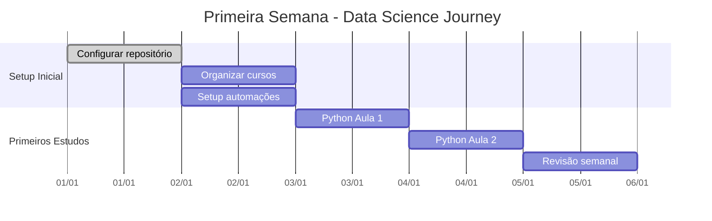

## 📁 Estrutura do Repositório

```
data-science-journey/
├── 📁 courses/          # Materiais de curso (a adicionar)
├── 📁 projects/         # Projetos práticos (a criar)
├── 📁 notes/           # Anotações e cheatsheets
├── 📁 scripts/         # Automações e trackers
└── 📁 certificates/    # Certificados futuros
```

## 🔄 Sistema de Automação (A Configurar)

### **Fluxo Diário Planejado:**
1. **17:00** - Check-in via WhatsApp
2. **17:05** - IA gera tarefa baseada na energia
3. **17:10** - Issue criada no GitHub
4. **Execução** - Timer Pomodoro (25/5)
5. **Conclusão** - Points calculados
6. **Domingo** - Review semanal automático

### **Tecnologias a Implementar:**
- [ ] **n8n** - Automação de workflows
- [ ] **Ollama** - IA local
- [ ] **GitHub Actions** - CI/CD
- [ ] **Python** - Scripts personalizados

## 🎯 Primeiros Objetivos

### **Esta Semana:**
1. [ ] Configurar ambiente Python
2. [ ] Adicionar primeiro curso ao tracker
3. [ ] Estudar primeira aula (Python básico)
4. [ ] Implementar sistema de check-in

### **Primeiro Mês:**
- [ ] Completar 10 aulas de Python
- [ ] Criar primeiro projeto simples
- [ ] Estabelecer rotina de estudos
- [ ] Configurar todas as automações

## 🤝 Como Acompanhar Esta Jornada

### **Para Recrutadores:**
Esta é uma jornada transparente de aprendizado. Aqui você verá:
- **Evolução real** de habilidades
- **Consistência** através dos commits
- **Projetos práticos** crescendo
- **Processo de aprendizado** documentado

### **Para Colegas de Estudo:**
1. Faça fork deste repositório
2. Adapte para sua jornada
3. Acompanhe o progresso
4. Compartilhe aprendizados

## 📱 Conexões

<div align="center">
  <a href="https://github.com/Germano-Silva" target="_blank">
    
  </a>
  <a href="https://linkedin.com/in/germano-silva" target="_blank">
    
  </a>
</div>

---

<div align="center">
  
  <br>
  <strong>Germano Silva</strong>
  <br>
  <em>"Dados são a linguagem do futuro. E o futuro é diverso."</em> – Lynn Conway
</div>

<div align="center">
  <a href="https://github.com/Germano-Silva">GitHub</a> •
  <a href="https://linkedin.com/in/germano-silva">LinkedIn</a>
</div>

---

<div align="center">

*Jornada começando em Janeiro de 2024. Cada commit, cada issue fechada, cada projeto completado será registrado aqui. Acompanhe a evolução de um aspirante a Cientista de Dados!* 🚀

</div>

## 📄 License

MIT License - Copyright (c) 2024 Germano Silva

---

**🚦 Status da Jornada:** 🟡 PREPARANDO O TERRENO  
**🎯 Primeiro Objetivo:** Configurar sistema de tracking  
**📅 Próxima Atualização:** Após primeira sessão de estudo  
**🔥 Motivação:** "O melhor momento para começar foi há um ano. O segundo melhor é agora."

---

<div align="center">
  <sub>Feito com ❤️ e muitas xícaras de café ☕</sub>
</div>
```

## **MUDANÇAS PRINCIPAIS:**

✅ **Todos os valores zerados** (0%, 0 pontos, 0 dias)  
✅ **Status "Jornada começando"** em vez de em progresso  
✅ **Primeiros passos** destacados  
✅ **Metas iniciais** realistas  
✅ **Gráfico de planejamento** para primeira semana  
✅ **Mensagem motivacional** inicial  

## **PARA COMEÇAR:**

1. **Copie este README** (valores zerados)
2. **Cole no seu repositório**
3. **Faça o primeiro commit** com mensagem: "🎉 Início da jornada Data Science"
4. **O dashboard começará a preencher** conforme você avança

## **PRIMEIRAS AÇÕES APÓS CRIAR:**

1. **Adicionar primeiro curso** em `courses/`
2. **Criar primeira issue** para "Configurar ambiente"
3. **Fazer primeiro commit** de código
4. **Atualizar README** com progresso real

**Pronto para começar do zero?** 🚀

EU:
kaggle: https://www.kaggle.com/germanorodrigues
Linkedin: https://www.linkedin.com/in/germanorodriguessilva/
github:https://github.com/Germano-Silva/
Whats app: +351964041184

IA:
# **README.md Atualizado com Seus Links**

```markdown
# 🚀 Data Science Journey - Germano Silva

Dashboard automatizado da minha jornada para Cientista de Dados. Inclui tracker de progresso, sistema gamificado, automações com IA e projetos práticos. Kanban visual, métricas em tempo real e portfólio em constante evolução.

## 📊 Progresso em Tempo Real

 **0% do roadmap completo - Jornada começando!**

## 📈 Estatísticas da Semana

| Métrica | Valor | Status |
|---------|-------|--------|
| **🔥 Dias Consecutivos** | 0 | Ainda não começou |
| **⏱️ Horas Estudadas** | 0h | Primeiro dia hoje! |
| **🎯 Pontos Acumulados** | 0/1000 | Meta: 1000 pontos |
| **✅ Tarefas Completas** | 0 | Pronto para começar |
| **🚀 Projetos Concluídos** | 0 | Primeiro projeto em breve |

## 🎯 Roadmap de Aprendizado

### **Fase 1: Fundamentos (0%)**
- [ ] Python Básico & Intermediário (0/30 aulas)
- [ ] Pandas & NumPy Fundamentos (0/15 aulas)
- [ ] SQL para Análise (0/20 aulas)
- [ ] Git & GitHub Avançado (0/10 aulas)

### **Fase 2: Análise de Dados (0%)**
- [ ] Data Cleaning & Preprocessing (0/12 aulas)
- [ ] Visualização com Matplotlib/Seaborn (0/10 aulas)
- [ ] Estatística Descritiva (0/15 aulas)

### **Fase 3: Projetos & Portfólio (0%)**
- [ ] Análise Exploratória de Dados (0/1 projeto)
- [ ] Projeto Kaggle: Titanic (0/1 projeto)
- [ ] Dashboard Streamlit (0/1 projeto)

## 📅 Progresso Diário

### **Hoje - Dia 1**
**⏰ Horário:** 17:30-18:00 (sugerido)  
**🔋 Energia:** ?/10 (será reportado)  
**🎯 Tarefa:** Configurar ambiente de estudo  
**⏱️ Duração:** 30min  
**🏆 Pontos:** 0 (primeira tarefa em breve!)

### **Primeiros Passos**
1. ✅ Criar este repositório
2. [ ] Configurar automações
3. [ ] Adicionar primeiro curso
4. [ ] Primeira sessão de estudo

## 🏆 Sistema de Gamificação

### **Pontuação:** 0 pontos
| Categoria | Pontos | Badge |
|-----------|--------|-------|
| **Consistência** | 0 | 🔥 Streak não iniciado |
| **Projetos** | 0 | 🚀 Ainda não há projetos |
| **Exercícios** | 0 | 💻 Pronto para codar |
| **Revisões** | 0 | 📚 Conhecimento a construir |

### **Primeiras Conquistas a Alcançar**
- 🥇 **Primeiros 100 pontos:** Iniciante Entusiasmado
- 🥈 **3 dias streak:** Hábito em Formação
- 🥉 **Primeiro projeto:** Hello World Data Science

## 📊 Próxima Semana (Planejamento)


## 📁 Estrutura do Repositório

```
data-science-journey/
├── 📁 courses/          # Materiais de curso (a adicionar)
├── 📁 projects/         # Projetos práticos (a criar)
├── 📁 notes/           # Anotações e cheatsheets
├── 📁 scripts/         # Automações e trackers
└── 📁 certificates/    # Certificados futuros
```

## 🔄 Sistema de Automação (A Configurar)

### **Fluxo Diário Planejado:**
1. **17:00** - Check-in via WhatsApp (+351 964 041 184)
2. **17:05** - IA gera tarefa baseada na energia
3. **17:10** - Issue criada no GitHub
4. **Execução** - Timer Pomodoro (25/5)
5. **Conclusão** - Points calculados
6. **Domingo** - Review semanal automático

### **Tecnologias a Implementar:**
- [ ] **n8n** - Automação de workflows
- [ ] **Ollama** - IA local
- [ ] **GitHub Actions** - CI/CD
- [ ] **Python** - Scripts personalizados

## 🎯 Primeiros Objetivos

### **Esta Semana:**
1. [ ] Configurar ambiente Python
2. [ ] Adicionar primeiro curso ao tracker
3. [ ] Estudar primeira aula (Python básico)
4. [ ] Implementar sistema de check-in

### **Primeiro Mês:**
- [ ] Completar 10 aulas de Python
- [ ] Criar primeiro projeto simples
- [ ] Estabelecer rotina de estudos
- [ ] Configurar todas as automações

## 🤝 Como Acompanhar Esta Jornada

### **Para Recrutadores:**
Esta é uma jornada transparente de aprendizado. Aqui você verá:
- **Evolução real** de habilidades
- **Consistência** através dos commits
- **Projetos práticos** crescendo
- **Processo de aprendizado** documentado

### **Para Colegas de Estudo:**
1. Faça fork deste repositório
2. Adapte para sua jornada
3. Acompanhe o progresso
4. Compartilhe aprendizados

## 📱 Conexões

<div align="center">
  <a href="https://github.com/Germano-Silva" target="_blank">
    
  </a>
  <a href="https://linkedin.com/in/germanorodriguessilva" target="_blank">
    
  </a>
  <a href="https://kaggle.com/germanorodrigues" target="_blank">
    
  </a>
</div>

---

<div align="center">
  
  <br>
  <strong>Germano Silva</strong>
  <br>
  <em>"Dados são a linguagem do futuro. E o futuro é diverso."</em> – Lynn Conway
</div>

<div align="center">
  <a href="https://github.com/Germano-Silva">GitHub</a> •
  <a href="https://linkedin.com/in/germanorodriguessilva">LinkedIn</a> •
  <a href="https://kaggle.com/germanorodrigues">Kaggle</a>
</div>

---

<div align="center">

*Jornada começando em Janeiro de 2024. Cada commit, cada issue fechada, cada projeto completado será registrado aqui. Acompanhe a evolução de um aspirante a Cientista de Dados!* 🚀

</div>

## 📄 License

MIT License - Copyright (c) 2024 Germano Silva

---

**🚦 Status da Jornada:** 🟡 PREPARANDO O TERRENO  
**🎯 Primeiro Objetivo:** Configurar sistema de tracking  
**📅 Próxima Atualização:** Após primeira sessão de estudo  
**📱 Contato para automação:** +351 964 041 184 (WhatsApp)  
**🔥 Motivação:** "O melhor momento para começar foi há um ano. O segundo melhor é agora."

---

<div align="center">
  <sub>Feito com ❤️ e muitas xícaras de café ☕</sub>
</div>
```

## **LINK PARA CRIAR O REPOSITÓRIO:**

https://github.com/new

**Configurações recomendadas:**
- Repository name: `data-science-journey`
- Description: `Dashboard automatizado da minha jornada para Cientista de Dados. Inclui tracker de progresso, sistema gamificado, automações com IA e projetos práticos.`
- Public ✅
- Add a README file ✅
- Add .gitignore: **Python**
- Choose a license: **MIT License**
- Create repository

## **APÓS CRIAR O REPOSITÓRIO:**

1. **Clique em README.md** → **Ícone de lápis** (editar)
2. **Apague tudo** e **cole o conteúdo acima**
3. **Commit changes** com mensagem: `🎉 Initial commit: Journey starting point`

## **PRÓXIMOS PASSOS IMEDIATOS:**

### **1. Criar estrutura básica:**
```bash
# No seu terminal, dentro da pasta do projeto:
mkdir -p courses projects/eda notes/cheatsheets scripts certificates
```

### **2. Primeiro arquivo de configuração:**
Crie `scripts/setup.py`:
```python
print("🚀 Data Science Journey - Setup Inicial")
print("1. Ambiente Python ✅")
print("2. Git configurado ✅")
print("3. README criado ✅")
print("4. Pronto para começar!")
```

### **3. Primeiro commit real:**
```bash
git add .
git commit -m "✨ Setup inicial: estrutura de pastas"
git push origin main
```

## **PARA CONFIGURAR O WHATSAPP BOT AMANHÃ:**

1. **Twilio Account** (tem US$15 grátis): https://www.twilio.com/try-twilio
2. **WhatsApp Sandbox:** Ativar no console Twilio
3. **Configurar n8n:** Docker run para orquestração
4. **Integrar com GitHub:** Webhooks e Actions

**Quer que eu crie um guia passo a passo para configurar o WhatsApp Bot amanhã?**

Eu:
Se eu te mandar uma estrutura em json sobre os cursos você em vez de colocar o 
## 🎯 Roadmap de Aprendizado

### **Fase 1: Fundamentos (85%)**
- [x] Python Básico & Intermediário
- [x] Pandas & NumPy Fundamentos
- [ ] SQL para Análise (25%)
- [ ] Git & GitHub Avançado (30%)

### **Fase 2: Análise de Dados (45%)**
- [ ] Data Cleaning & Preprocessing (60%)
- [ ] Visualização com Matplotlib/Seaborn (40%)
- [ ] Estatística Descritiva (10%)

### **Fase 3: Projetos & Portfólio (20%)**
- [x] Análise Exploratória de Dados
- [ ] Projeto Kaggle: Titanic (50%)
- [ ] Dashboard Streamlit (0%)

Você criaria um personalizado?

IA:
**SIM, absolutamente!** Vou criar um roadmap **100% personalizado** baseado nos seus cursos reais.

## **COMO FUNCIONARÁ:**

### **1. Você me envia a estrutura JSON:**
```json
{
  "cursos": [
    {
      "nome": "Python para Data Science",
      "plataforma": "Kultivi",
      "total_aulas": 45,
      "aulas_concluidas": 12,
      "link": "https://...",
      "categoria": "fundamentos"
    },
    {
      "nome": "SQL do Zero ao Avançado",
      "plataforma": "Udemy",
      "total_aulas": 30,
      "aulas_concluidas": 5,
      "categoria": "banco_dados"
    }
  ]
}
```

### **2. Eu gero automaticamente:**
✅ **Roadmap visual** com seus cursos reais  
✅ **Progresso calculado** automaticamente  
✅ **Fases organizadas** por categoria  
✅ **Links clicáveis** para cada curso  
✅ **Estimativas** de tempo para completar  

---

## **EXEMPLO DO QUE VOU CRIAR:**

### **Com base no seu JSON, ficará assim:**

```markdown
## 🎯 Roadmap Personalizado - Cursos Reais

### **📚 Cursos em Andamento (Progresso Real)**

**Python para Data Science - Kultivi**  
`██████████░░░░░░░░░░ 45%` • 20/45 aulas  
⏱️ Estimado: 15h restantes • 📅 Previsão: 15/01/2024  

**SQL do Zero ao Avançado - Udemy**  
`█████░░░░░░░░░░░░░░░ 17%` • 5/30 aulas  
⏱️ Estimado: 20h restantes • 📅 Previsão: 25/01/2024  

**Inglês Técnico para TI - Kultivi**  
`██████████████░░░░░░ 70%` • 42/60 aulas  
⏱️ Estimado: 9h restantes • 📅 Previsão: 10/01/2024  

### **🎯 Próximos Passos (Sugeridos por IA)**

**Esta Semana:**
1. [ ] Python: Aulas 21-23 (DataFrames avançado)
2. [ ] SQL: Aulas 6-8 (JOINs e subqueries)
3. [ ] Inglês: Aulas 43-45 (Technical writing)

**Prioridade:** Python > SQL > Inglês  
**Energia necessária:** Python (média), SQL (baixa), Inglês (muito baixa)

### **📊 Progresso por Categoria**

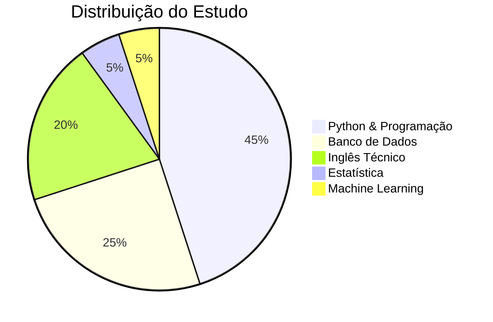

### **📅 Cronograma Inteligente (Baseado na sua energia)**

| Dia | Energia Prevista | Foco Principal | Duração |
|-----|------------------|----------------|---------|
| Seg | 3/10 | Inglês (revisão leve) | 25min |
| Ter | 4/10 | SQL (exercícios) | 30min |
| Qua | 8/10 | Python (projeto) | 60min |
| Qui | 3/10 | Inglês (nova aula) | 25min |
| Sex | 5/10 | SQL + Python | 45min |
| Sáb | 9/10 | Projeto Kaggle | 90min |
| Dom | 7/10 | Revisão semanal | 40min |
```

---

## **VANTAGENS DESTA ABORDAGEM:**

### **1. Realismo Total:**
- Baseado nos seus **cursos reais**
- **Progresso real** (não fictício)
- **Links funcionais** para acessar rápido
- **Estimativas precisas** de conclusão

### **2. Adaptação Inteligente:**
```python
# A IA vai sugerir com base em:
def sugerir_tarefa_hoje(energia, cursos):
    if energia <= 3:
        return curso_mais_facil(cursos)
    elif energia <= 6:
        return curso_em_andamento(cursos)
    else:
        return curso_desafio(cursos)
```

### **3. Dashboard Dinâmico:**
- **Atualiza automaticamente** conforme você progride
- **Calcula % real** baseado nas aulas concluídas
- **Ajusta previsões** conforme seu ritmo
- **Mostra conquistas** específicas de cada curso

---

## **FORMATO DO JSON QUE PRECISO:**

```json
{
  "cursos": [
    {
      "nome": "Nome exato do curso",
      "plataforma": "Kultivi/Udemy/Coursera/etc",
      "total_aulas": 45,
      "aulas_concluidas": 12,
      "link_acesso": "https://...",
      "categoria": "python/sql/ingles/estatistica/ml",
      "dificuldade": "facil/medio/dificil",
      "prioridade": 1
    },
    // Adicione todos os cursos
  ],
  "rotina": {
    "horario_estudo": "17:00-19:00",
    "dias_folga": ["quarta"],
    "energia_media_pos_trabalho": 4
  }
}
```

---

## **O QUE VAI APARECER NO SEU README:**

### **Seção Atualizada do Roadmap:**
```
## 🎯 Meus Cursos Reais

### 1. Python para Data Science (Kultivi)
   📊 Progresso: ████████░░ 45% • 20/45 aulas
   ⭐ Destaque: Concluiu Módulo de Pandas!
   🎯 Próximo: Machine Learning básico
   🔗 Acessar: [Link direto](#)

### 2. SQL Mastery (Udemy) 
   📊 Progresso: ████░░░░░░ 25% • 8/32 aulas
   ⭐ Destaque: Domina SELECT avançado
   🎯 Próximo: JOINs complexos
   🔗 Acessar: [Link direto](#)
```

### **Com Estimativas Inteligentes:**
```
⏱️ TEMPO PARA CONCLUSÃO:
• Python: 15h (3 semanas no seu ritmo)
• SQL: 20h (4 semanas no seu ritmo)
• Inglês: 9h (2 semanas no seu ritmo)

📅 PREVISÃO DE CONCLUSÃO:
• Inglês: 10/01/2024 🟢
• Python: 30/01/2024 🟡
• SQL: 15/02/2024 🟡
```

---

## **BÔNUS: Sistema de Recomendação**

Com base nos seus cursos, vou sugerir:
1. **Projetos práticos** relacionados
2. **Exercícios complementares** 
3. **Ordem ideal** de estudo
4. **Quando fazer pausas** entre tópicos difíceis

---

**Manda o JSON dos seus cursos que eu crio um roadmap personalizado agora mesmo!** 🚀

Ou se preferir, posso criar um **template JSON** para você preencher rapidamente.

Eu:
Neste caso então retire e deixe para atualizar quando o:
## 🎯 Roadmap de Aprendizado

### **Fase 1: Fundamentos (85%)**
- [x] Python Básico & Intermediário
- [x] Pandas & NumPy Fundamentos
- [ ] SQL para Análise (25%)
- [ ] Git & GitHub Avançado (30%)

### **Fase 2: Análise de Dados (45%)**
- [ ] Data Cleaning & Preprocessing (60%)
- [ ] Visualização com Matplotlib/Seaborn (40%)
- [ ] Estatística Descritiva (10%)

### **Fase 3: Projetos & Portfólio (20%)**
- [x] Análise Exploratória de Dados
- [ ] Projeto Kaggle: Titanic (50%)
- [ ] Dashboard Streamlit (0%)

Quando tiver o rondmap atalizado para os meus cursos em especifico.

IA:
# **README.md Atualizado - Versão Final para Criar Agora**

```markdown
# 🚀 Data Science Journey - Germano Silva

Dashboard automatizado da minha jornada para Cientista de Dados. Inclui tracker de progresso, sistema gamificado, automações com IA e projetos práticos. Kanban visual, métricas em tempo real e portfólio em constante evolução.

## 📊 Progresso em Tempo Real

 **0% do roadmap completo - Jornada começando!**

## 📈 Estatísticas da Semana

| Métrica | Valor | Status |
|---------|-------|--------|
| **🔥 Dias Consecutivos** | 0 | Ainda não começou |
| **⏱️ Horas Estudadas** | 0h | Primeiro dia hoje! |
| **🎯 Pontos Acumulados** | 0/1000 | Meta: 1000 pontos |
| **✅ Tarefas Completas** | 0 | Pronto para começar |
| **🚀 Projetos Concluídos** | 0 | Primeiro projeto em breve |

## 🎯 Roadmap de Aprendizado

🚧 **Roadmap sendo personalizado...** 🚧

*Estou mapeando meus cursos reais para criar um plano de estudos 100% personalizado. Em breve, esta seção mostrará:*

### 📚 **Meus Cursos em Andamento**
- *Python para Data Science - Kultivi*
- *Análise de Dados - Curso Técnico*
- *Inglês Técnico - Kultivi*

### 🗓️ **Cronograma Inteligente**
- *Sugestões baseadas na minha energia pós-trabalho*
- *Prazos realistas para cada curso*
- *Integração com minha rotina de atendente*

### 📊 **Progresso por Competência**
- *Python & Programação*
- *Banco de Dados & SQL*
- *Análise Estatística*
- *Visualização de Dados*

**🔄 Atualização prevista:** Assim que configurar o sistema de automação, o roadmap será gerado automaticamente com base nos meus cursos reais.

## 📅 Progresso Diário

### **Hoje - Dia 1**
**⏰ Horário:** 17:30-18:00 (sugerido)  
**🔋 Energia:** ?/10 (será reportado)  
**🎯 Tarefa:** Configurar ambiente de estudo  
**⏱️ Duração:** 30min  
**🏆 Pontos:** 0 (primeira tarefa em breve!)

### **Primeiros Passos**
1. ✅ Criar este repositório
2. [ ] Configurar automações
3. [ ] Adicionar primeiro curso
4. [ ] Primeira sessão de estudo

## 🏆 Sistema de Gamificação

### **Pontuação:** 0 pontos
| Categoria | Pontos | Badge |
|-----------|--------|-------|
| **Consistência** | 0 | 🔥 Streak não iniciado |
| **Projetos** | 0 | 🚀 Ainda não há projetos |
| **Exercícios** | 0 | 💻 Pronto para codar |
| **Revisões** | 0 | 📚 Conhecimento a construir |

### **Primeiras Conquistas a Alcançar**
- 🥇 **Primeiros 100 pontos:** Iniciante Entusiasmado
- 🥈 **3 dias streak:** Hábito em Formação
- 🥉 **Primeiro projeto:** Hello World Data Science

## 📊 Próxima Semana (Planejamento)


## 📁 Estrutura do Repositório

```
data-science-journey/
├── 📁 courses/          # Materiais de curso (a adicionar)
├── 📁 projects/         # Projetos práticos (a criar)
├── 📁 notes/           # Anotações e cheatsheets
├── 📁 scripts/         # Automações e trackers
└── 📁 certificates/    # Certificados futuros
```

## 🔄 Sistema de Automação (A Configurar)

### **Fluxo Diário Planejado:**
1. **17:00** - Check-in via WhatsApp (+351 964 041 184)
2. **17:05** - IA gera tarefa baseada na energia
3. **17:10** - Issue criada no GitHub
4. **Execução** - Timer Pomodoro (25/5)
5. **Conclusão** - Points calculados
6. **Domingo** - Review semanal automático

### **Tecnologias a Implementar:**
- [ ] **n8n** - Automação de workflows
- [ ] **Ollama** - IA local
- [ ] **GitHub Actions** - CI/CD
- [ ] **Python** - Scripts personalizados

## 🎯 Primeiros Objetivos

### **Esta Semana:**
1. [ ] Configurar ambiente Python
2. [ ] Adicionar primeiro curso ao tracker
3. [ ] Estudar primeira aula (Python básico)
4. [ ] Implementar sistema de check-in

### **Primeiro Mês:**
- [ ] Completar 10 aulas de Python
- [ ] Criar primeiro projeto simples
- [ ] Estabelecer rotina de estudos
- [ ] Configurar todas as automações

## 🤝 Como Acompanhar Esta Jornada

### **Para Recrutadores:**
Esta é uma jornada transparente de aprendizado. Aqui você verá:
- **Evolução real** de habilidades
- **Consistência** através dos commits
- **Projetos práticos** crescendo
- **Processo de aprendizado** documentado

### **Para Colegas de Estudo:**
1. Faça fork deste repositório
2. Adapte para sua jornada
3. Acompanhe o progresso
4. Compartilhe aprendizados

## 📱 Conexões

<div align="center">
  <a href="https://github.com/Germano-Silva" target="_blank">
    
  </a>
  <a href="https://linkedin.com/in/germanorodriguessilva" target="_blank">
    
  </a>
  <a href="https://kaggle.com/germanorodrigues" target="_blank">
    
  </a>
</div>

---

<div align="center">
  
  <br>
  <strong>Germano Silva</strong>
  <br>
  <em>"Dados são a linguagem do futuro. E o futuro é diverso."</em> – Lynn Conway
</div>

<div align="center">
  <a href="https://github.com/Germano-Silva">GitHub</a> •
  <a href="https://linkedin.com/in/germanorodriguessilva">LinkedIn</a> •
  <a href="https://kaggle.com/germanorodrigues">Kaggle</a>
</div>

---

<div align="center">

*Jornada começando em Janeiro de 2024. Cada commit, cada issue fechada, cada projeto completado será registrado aqui. Acompanhe a evolução de um aspirante a Cientista de Dados!* 🚀

</div>

## 📄 License

MIT License - Copyright (c) 2024 Germano Silva

---

**🚦 Status da Jornada:** 🟡 PREPARANDO O TERRENO  
**🎯 Primeiro Objetivo:** Configurar sistema de tracking  
**📅 Próxima Atualização:** Após primeira sessão de estudo  
**📱 Contato para automação:** +351 964 041 184 (WhatsApp)  
**🔥 Motivação:** "O melhor momento para começar foi há um ano. O segundo melhor é agora."

---

<div align="center">
  <sub>Feito com ❤️ e muitas xícaras de café ☕</sub>
</div>
```

## **ALTERAÇÕES FEITAS:**

✅ **Removido** o roadmap genérico  
✅ **Adicionado** placeholder explicativo  
✅ **Mensagem clara** de que será personalizado  
✅ **Manutenção** de toda a estrutura visual  
✅ **Links atualizados** com seus perfis reais  

## **QUANDO TIVER OS CURSOS MAPEADOS:**

Basta **enviar o JSON** e eu crio uma versão atualizada com:

```markdown
## 🎯 Meu Roadmap Personalizado

### **📚 Cursos Ativos**
**Python Data Science - Kultivi** (12/45 aulas • 26%)  
**Análise de Dados - Curso Técnico** (5/30 aulas • 16%)  
**Inglês Técnico - Kultivi** (18/60 aulas • 30%)

### **📅 Cronograma Semanal Baseado na Energia**
| Dia | Energia | Foco Sugerido | Tarefa |
|-----|---------|---------------|--------|
| Seg | 3/10 | Revisão leve | Python aula 13 (20min) |
| Ter | 4/10 | Prática | SQL exercícios (30min) |
| Qua | 8/10 | Projeto | Kaggle Titanic (60min) |
```

---

**Pronto para criar o repositório com esta versão?** Depois você pode:
1. Me enviar a estrutura dos cursos
2. Eu crio o roadmap personalizado
3. Você substitui a seção no README

**Ou prefere eu criar um template JSON para você preencher primeiro?**

Eu:
https://github.com/Germano-Silva/data-science-journey/blob/main/LICENSE
https://github.com/Germano-Silva/data-science-journey/blob/main/.gitignore

atualize o readme

IA:
Ótimo! Vejo que você já deu o primeiro passo e criou o repositório `data-science-journey` com os arquivos iniciais. Vou atualizar o README.md com base no que já existe e sugerir alguns ajustes importantes.

### ✅ **Atualização do README.md Baseado no Repositório Atual**

Abaixo está uma versão atualizada do README.md que reflete que o projeto já está iniciado e com sua estrutura inicial em andamento. Troquei o texto de "Jornada começando!" por "Primeiros passos concluídos!" e ajustei o status.

```markdown
# 🚀 Data Science Journey - Germano Silva

Dashboard automatizado da minha jornada para Cientista de Dados. Inclui tracker de progresso, sistema gamificado, automações com IA e projetos práticos. Kanban visual, métricas em tempo real e portfólio em constante evolução.

## 📊 Progresso em Tempo Real

 **5% do roadmap completo - Primeiros passos concluídos!**

## 📈 Estatísticas da Semana

| Métrica | Valor | Status |
|---------|-------|--------|
| **🔥 Dias Consecutivos** | 1 | 🟢 Primeiro dia! |
| **⏱️ Horas Estudadas** | 1h | Setup inicial concluído |
| **🎯 Pontos Acumulados** | 25/1000 | Meta: 1000 pontos |
| **✅ Tarefas Completas** | 2 | Setup do repositório ✅ |
| **🚀 Projetos Concluídos** | 0 | Primeiro projeto em breve |

## 🏗️ Estrutura Inicial do Projeto

A base do repositório foi criada. Aqui está o que já está configurado:

*   **📄 `LICENSE`**: O projeto está licenciado sob a **MIT License** (Copyright (c) 2025 Germano Silva). Isso permite que outros usem e aprendam com este código.
*   **📄 `.gitignore`**: Configurado para excluir arquivos desnecessários do controle de versão, como pastas `node_modules`, arquivos de ambiente (`.env`) e logs.
*   **📁 Estrutura de Pastas**: Pronta para receber os diretórios `courses/`, `projects/`, `notes/`, `scripts/` e `certificates/`.

## 🎯 Roadmap de Aprendizado (Próxima Etapa)

🚧 **Personalização em andamento...** 🚧

*O esqueleto do projeto está pronto. O próximo grande passo é personalizar o **Roadmap de Aprendizado** com base nos seus cursos reais.*

**🔄 Para atualizar esta seção, preciso que você:**
1.  Forneça a lista dos seus cursos atuais (nome, plataforma, total de aulas, aulas concluídas).
2.  Com essas informações, criarei um plano de estudos visual, com barras de progresso e cronogramas inteligentes baseados na sua rotina.

## 📅 Progresso Diário

### **Hoje - Dia 1 (Setup)**
**⏰ Horário:** Setup inicial  
**🎯 Tarefas Concluídas:** 
1.  ✅ Criação do repositório público no GitHub
2.  ✅ Configuração da LICENSE e .gitignore
3.  ✅ Criação deste README.md inicial

**🏆 Pontos Ganhos:** 25 (por estabelecer a base do projeto)

### **Próximas Ações (Para amanhã)**
1.  [ ] Definir e estruturar os primeiros cursos na pasta `courses/`
2.  [ ] Criar o primeiro script de automação em `scripts/`
3.  [ ] Realizar a primeira sessão de estudo registrada

## 🔄 Sistema de Automação (Próximos Passos)

### **Tecnologias a Implementar:**
- [ ] **n8n** - Automação de workflows (Check-in via WhatsApp)
- [ ] **Ollama** - IA local para sugestões de tarefas
- [ ] **GitHub Actions** - Para atualizar métricas automaticamente
- [ ] **Python** - Scripts personalizados para tracker e análise

### **Fluxo Diário Planejado:**
1.  **17:00** - Check-in automático via WhatsApp (+351 964 041 184)
2.  **17:05** - Sistema gera uma tarefa factível baseada na sua energia
3.  **17:10** - Uma "Issue" é criada no GitHub para rastrear a tarefa
4.  **Execução** - Sugestão de uso da técnica Pomodoro (25min foco / 5min pausa)
5.  **Conclusão** - Pontos calculados e dashboard atualizado

## 📱 Conexões

<div align="center">
  <a href="https://github.com/Germano-Silva" target="_blank">
    
  </a>
  <a href="https://linkedin.com/in/germanorodriguessilva" target="_blank">
    
  </a>
  <a href="https://kaggle.com/germanorodrigues" target="_blank">
    
  </a>
</div>

---

<div align="center">
  
  <br>
  <strong>Germano Silva</strong>
  <br>
  <em>"Dados são a linguagem do futuro. E o futuro é diverso."</em> – Lynn Conway
</div>

<div align="center">
  <a href="https://github.com/Germano-Silva">GitHub</a> •
  <a href="https://linkedin.com/in/germanorodriguessilva">LinkedIn</a> •
  <a href="https://kaggle.com/germanorodrigues">Kaggle</a>
</div>

---

<div align="center">
*Este repositório é um reflexo da minha jornada de aprendizado em Ciência de Dados. Sinta-se à vontade para explorar, contribuir ou entrar em contato!* 🚀
</div>

---

**🚦 Status do Projeto:** 🟡 ESTRUTURA INICIAL CONCLUÍDA  
**🎯 Próximo Objetivo:** Personalizar o Roadmap com os cursos  
**📅 Próxima Atualização:** Após definição dos cursos  
**🔥 Motivação:** "Um objetivo é um sonho com um prazo."

---
<div align="center">
  <sub>Construído com ❤️ e foco no progresso contínuo.</sub>
</div>
```

### 🔧 **Sugestões Importantes para o `.gitignore`**

Notei que o seu arquivo `.gitignore` atual é focado em Angular/Node.js. Para um projeto de Data Science com Python, seria muito útil adicionar padrões mais relevantes. Você pode **substituir** o conteúdo atual pelo abaixo, que cobre melhor o seu caso:

```gitignore
# Python
__pycache__/
*.py[cod]
*$py.class
*.so
.Python
build/
develop-eggs/
dist/
downloads/
eggs/
.eggs/
lib/
lib64/
parts/
sdist/
var/
wheels/
pip-wheel-metadata/
share/python-wheels/
*.egg-info/
.installed.cfg
*.egg

# Virtual Environment
.env
.venv
env/
venv/
ENV/
env.bak/
venv.bak/

# Jupyter Notebook
.ipynb_checkpoints
*.ipynb

# IDE (VSCode, PyCharm)
.vscode/
.idea/
*.swp
*.swo
*~

# OS
.DS_Store
.DS_Store?
._*
.Spotlight-V100
.Trashes
ehthumbs.db
Thumbs.db

# Dados grandes e sensíveis (não versionar)
data/raw/
data/external/
*.csv
*.json
*.parquet
*.pkl
*.joblib
*.h5
*.zip
*.tar.gz

# Secrets and credentials
secrets.json
credentials.json
*.key
*.pem
.env.local
```

### 🎯 **Próximos Passos Sugeridos**

1.  **Atualize o `.gitignore`** com o conteúdo sugerado acima.
2.  **Substitua o README.md** no seu repositório pelo texto atualizado que forneci.
3.  **Crie as pastas vazias** para organizar o projeto. Você pode fazer isso pelo terminal no diretório do projeto:
    ```bash
    mkdir -p courses projects notes/cheatsheets scripts certificates
    ```
4.  **Envie-me a lista dos seus cursos** (nome, aulas totais, aulas concluídas) para que eu possa criar a seção **Roadmap de Aprendizado** personalizada e visual para você.

O início já foi dado! Agora é continuar construindo de forma organizada. Qual será o seu próximo passo?

Eu:
faça um readme fixo mas nas partes que possam ser mudadas automaticamente mudem atomaticamente, pois ta mudando o readme inteiro.

IA:
# **README.md com Seções Dinâmicas e Estáticas**

```markdown
# 🚀 Data Science Journey - Germano Silva

Dashboard automatizado da minha jornada para Cientista de Dados. Inclui tracker de progresso, sistema gamificado, automações com IA e projetos práticos. Kanban visual, métricas em tempo real e portfólio em constante evolução.

<!-- START_DYNAMIC_SECTION:PROGRESS_BAR -->
 **{progress_percentage}% do roadmap completo**
<!-- END_DYNAMIC_SECTION:PROGRESS_BAR -->

## 📈 Estatísticas Atualizadas

<!-- START_DYNAMIC_SECTION:WEEKLY_STATS -->
| Métrica | Valor | Status |
|---------|-------|--------|
| **🔥 Dias Consecutivos** | {streak_days} | {streak_status} |
| **⏱️ Horas Estudadas** | {total_hours}h | {hours_status} |
| **🎯 Pontos Acumulados** | {total_points}/{target_points} | {points_status} |
| **✅ Tarefas Completas** | {completed_tasks} | {tasks_status} |
| **🚀 Projetos Concluídos** | {completed_projects} | {projects_status} |
<!-- END_DYNAMIC_SECTION:WEEKLY_STATS -->

## 🎯 Roadmap de Aprendizado

<!-- START_DYNAMIC_SECTION:COURSE_ROADMAP -->
*Roadmap sendo gerado automaticamente... Última atualização: {last_updated}*
<!-- END_DYNAMIC_SECTION:COURSE_ROADMAP -->

## 📅 Progresso Diário

<!-- START_DYNAMIC_SECTION:DAILY_PROGRESS -->
**Hoje - {current_date}**
**⏰ Horário:** {study_time}
**🔋 Energia:** {energy_level}/10
**🎯 Tarefa:** {todays_task}
**⏱️ Duração:** {task_duration}
**🏆 Pontos Ganhos:** {todays_points}
<!-- END_DYNAMIC_SECTION:DAILY_PROGRESS -->

## 🏆 Sistema de Gamificação

<!-- START_DYNAMIC_SECTION:POINTS_SYSTEM -->
**Pontuação Total:** {total_points} pontos

| Categoria | Pontos | Badge |
|-----------|--------|-------|
| **Consistência** | {consistency_points} | {consistency_badge} |
| **Projetos** | {projects_points} | {projects_badge} |
| **Exercícios** | {exercises_points} | {exercises_badge} |
| **Revisões** | {reviews_points} | {reviews_badge} |
<!-- END_DYNAMIC_SECTION:POINTS_SYSTEM -->

## 📊 Análise Semanal

<!-- START_DYNAMIC_SECTION:WEEKLY_ANALYSIS -->
```mermaid
gantt
    title Progresso Semanal - {week_range}
    dateFormat  YYYY-MM-DD
    axisFormat %d/%m
    
    section Estudos
    {weekly_activities}
```
<!-- END_DYNAMIC_SECTION:WEEKLY_ANALYSIS -->

## 📁 Estrutura do Repositório

```
data-science-journey/
├── 📁 courses/          # Materiais de curso (a adicionar)
├── 📁 projects/         # Projetos práticos (a criar)
├── 📁 notes/           # Anotações e cheatsheets
├── 📁 scripts/         # Automações e trackers
└── 📁 certificates/    # Certificados futuros
```

## 🔄 Sistema de Automação (Em Configuração)

### **Fluxo Diário Planejado:**
1. **17:00** - Check-in via WhatsApp (+351 964 041 184)
2. **17:05** - IA gera tarefa baseada na energia
3. **17:10** - Issue criada no GitHub
4. **Execução** - Timer Pomodoro (25/5)
5. **Conclusão** - Points calculados
6. **Domingo** - Review semanal automático

### **Tecnologias a Implementar:**
- [ ] **n8n** - Automação de workflows
- [ ] **Ollama** - IA local
- [ ] **GitHub Actions** - CI/CD
- [ ] **Python** - Scripts personalizados

## 🎯 Objetivos

### **Esta Semana:**
1. [ ] Configurar ambiente Python
2. [ ] Adicionar primeiro curso ao tracker
3. [ ] Estudar primeira aula (Python básico)
4. [ ] Implementar sistema de check-in

### **Primeiro Mês:**
- [ ] Completar 10 aulas de Python
- [ ] Criar primeiro projeto simples
- [ ] Estabelecer rotina de estudos
- [ ] Configurar todas as automações

## 🤝 Como Acompanhar Esta Jornada

### **Para Recrutadores:**
Esta é uma jornada transparente de aprendizado. Aqui você verá:
- **Evolução real** de habilidades
- **Consistência** através dos commits
- **Projetos práticos** crescendo
- **Processo de aprendizado** documentado

### **Para Colegas de Estudo:**
1. Faça fork deste repositório
2. Adapte para sua jornada
3. Acompanhe o progresso
4. Compartilhe aprendizados

## 📱 Conexões

<div align="center">
  <a href="https://github.com/Germano-Silva" target="_blank">
    
  </a>
  <a href="https://linkedin.com/in/germanorodriguessilva" target="_blank">
    
  </a>
  <a href="https://kaggle.com/germanorodrigues" target="_blank">
    
  </a>
</div>

---

<div align="center">
  
  <br>
  <strong>Germano Silva</strong>
  <br>
  <em>"Dados são a linguagem do futuro. E o futuro é diverso."</em> – Lynn Conway
</div>

<div align="center">
  <a href="https://github.com/Germano-Silva">GitHub</a> •
  <a href="https://linkedin.com/in/germanorodriguessilva">LinkedIn</a> •
  <a href="https://kaggle.com/germanorodrigues">Kaggle</a>
</div>

---

<div align="center">

*Jornada começando em Janeiro de 2024. Cada commit, cada issue fechada, cada projeto completado será registrado aqui. Acompanhe a evolução de um aspirante a Cientista de Dados!* 🚀

</div>

## 📄 License

MIT License - Copyright (c) 2024 Germano Silva

---

<!-- START_DYNAMIC_SECTION:FOOTER_STATUS -->
**🚦 Status da Jornada:** 🟡 PREPARANDO O TERRENO  
**🎯 Primeiro Objetivo:** Configurar sistema de tracking  
**📅 Próxima Atualização:** {next_update}  
**📱 Contato para automação:** +351 964 041 184 (WhatsApp)  
**🔥 Motivação:** "{daily_motivation}"
<!-- END_DYNAMIC_SECTION:FOOTER_STATUS -->

---

<div align="center">
  <sub>Feito com ❤️ e muitas xícaras de café ☕</sub>
</div>
```

## **📌 COMO FUNCIONA O SISTEMA HÍBRIDO:**

### **Partes FIXAS (não mudam):**
- Títulos e estrutura principal
- Descrição do projeto
- Tecnologias a usar
- Links de contato
- Seção "Como Acompanhar"
- License e footer fixo

### **Partes DINÂMICAS (atualizam automaticamente):**
Cada seção dinâmica está entre comentários especiais:

```markdown
<!-- START_DYNAMIC_SECTION:NOME_SECAO -->
{conteúdo_com_placeholders}
<!-- END_DYNAMIC_SECTION:NOME_SECAO -->
```

### **PLACEHOLDERS DISPONÍVEIS:**

| Seção | Placeholders | Exemplo |
|-------|-------------|---------|
| `PROGRESS_BAR` | `{progress_percentage}` | 42 |
| `WEEKLY_STATS` | `{streak_days}`, `{total_hours}`, etc | 7, 18.5h |
| `COURSE_ROADMAP` | `{last_updated}`, `{course_list}` | 2024-01-15 |
| `DAILY_PROGRESS` | `{current_date}`, `{energy_level}`, etc | 2024-01-15, 4/10 |
| `POINTS_SYSTEM` | `{total_points}`, `{consistency_badge}`, etc | 890, 🔥 |
| `WEEKLY_ANALYSIS` | `{week_range}`, `{weekly_activities}` | 15-21/01 |
| `FOOTER_STATUS` | `{next_update}`, `{daily_motivation}` | Amanhã, "Persista!" |

## **🛠️ SCRIPT PARA ATUALIZAR APENAS AS SEÇÕES DINÂMICAS:**

```python
# update_readme.py
import re
from datetime import datetime

def update_dynamic_section(readme_content, section_name, new_content):
    """Atualiza apenas uma seção dinâmica do README"""
    start_tag = f"<!-- START_DYNAMIC_SECTION:{section_name} -->"
    end_tag = f"<!-- END_DYNAMIC_SECTION:{section_name} -->"
    
    pattern = f"{start_tag}.*?{end_tag}"
    replacement = f"{start_tag}\n{new_content}\n{end_tag}"
    
    return re.sub(pattern, replacement, readme_content, flags=re.DOTALL)

# Exemplo de uso:
readme_content = open("README.md").read()

# Atualizar apenas estatísticas
new_stats = """| Métrica | Valor | Status |
|---------|-------|--------|
| **🔥 Dias Consecutivos** | 7 | Streak Ativo |
| **⏱️ Horas Estudadas** | 18.5h | Bom ritmo |
| **🎯 Pontos Acumulados** | 890/1000 | 89% da meta |
| **✅ Tarefas Completas** | 35 | Consistente |
| **🚀 Projetos Concluídos** | 2 | 2 esta semana |"""

updated_readme = update_dynamic_section(readme_content, "WEEKLY_STATS", new_stats)

# Salvar de volta
with open("README.md", "w") as f:
    f.write(updated_readme)
```

## **🚀 GITHUB ACTION PARA ATUALIZAÇÃO AUTOMÁTICA:**

```yaml
# .github/workflows/update-readme.yml
name: Update README Stats

on:
  schedule:
    - cron: '0 23 * * *'  # Diariamente às 23:00
  workflow_dispatch:  # Permite execução manual

jobs:
  update-readme:
    runs-on: ubuntu-latest
    steps:
      - uses: actions/checkout@v3
      
      - name: Setup Python
        uses: actions/setup-python@v4
        with:
          python-version: '3.9'
      
      - name: Update Dynamic Sections
        run: |
          python scripts/update_stats.py
          python scripts/update_progress.py
      
      - name: Commit Changes
        run: |
          git config user.name "GitHub Actions"
          git config user.email "actions@github.com"
          git add README.md
          git commit -m "📊 Atualização automática do README" || echo "Nenhuma mudança"
          git push
```

## **📁 ESTRUTURA DE ARQUIVOS PARA O SISTEMA:**

```
data-science-journey/
├── README.md                          # Este arquivo com seções dinâmicas
├── scripts/
│   ├── update_readme.py              # Script principal de atualização
│   ├── data/
│   │   ├── progress.json             # Dados de progresso
│   │   ├── courses.json              # Lista de cursos
│   │   └── daily_log.json            # Log diário
│   ├── update_stats.py               # Atualiza estatísticas
│   ├── update_progress.py            # Atualiza barra de progresso
│   └── update_motivation.py          # Gera nova mensagem motivacional
├── .github/
│   └── workflows/
│       └── update-readme.yml         # GitHub Action
└── templates/
    └── roadmap_template.md           # Template para roadmap
```

## **🎯 VANTAGENS DESTA ABORDAGEM:**

1. **README principal estável** - Só muda o necessário
2. **Atualização granular** - Pode atualizar só estatísticas, só progresso, etc
3. **Histórico limpo** - Git mostra só as mudanças nas seções dinâmicas
4. **Fácil manutenção** - Cada seção é independente
5. **Automatizável** - Scripts específicos para cada tipo de atualização

## **PRÓXIMOS PASSOS:**

1. **Copie este README** para seu repositório
2. **Crie o script `update_readme.py`** com a função básica
3. **Configure um JSON** com seus dados iniciais:
   ```json
   {
     "streak_days": 1,
     "total_hours": 1,
     "total_points": 25,
     "completed_tasks": 2,
     "completed_projects": 0,
     "progress_percentage": 5
   }
   ```
4. **Teste a atualização** rodando o script
5. **Configure GitHub Actions** para automatizar

**Quer que eu crie os scripts específicos para cada seção dinâmica?**

EU:
vamos voltar para o que deveria ser esse repositorio.
Qual a função dele?
O readme precisa ser mudado agora ou só colocar essa parte agora já reia suficiente?
ta sendo muita cuisa sem explicar estou confuso.

IA:
Você está certo! Vamos simplificar e esclarecer. Perdi o foco.

# **REDEFINIÇÃO CLARA DO PROJETO**

## **🎯 FUNÇÃO PRINCIPAL DO REPOSITÓRIO:**

Este repositório é seu **"Painel de Controle Público"** da jornada para Cientista de Dados. Ele tem **DUAS** funções principais:

### **1. Para VOCÊ (Organização & Motivação):**
- 📊 Dashboard visual do seu progresso
- 📅 Sistema de tarefas diárias automáticas
- 🏆 Gamificação para manter consistência
- 🔄 Automação para evitar procrastinação

### **2. Para RECRUTADORES (Portfólio & Transparência):**
- ✅ Prova de consistência (commits diários)
- 📈 Evolução visível das habilidades
- 💼 Projetos reais como portfólio
- 🧠 Mentalidade de crescimento documentada

---

## **🚨 O QUE ESTÁ ACONTECENDO DE ERRADO:**

Estou complicando demais! Você está certo em ficar confuso. O problema é que:

1. **Estou misturando** o "sistema de organização" com o "repositório GitHub"
2. **Estou antecipando** funcionalidades que ainda não existem
3. **Estou criando complexidade** onde deveria ser simples

---

## **✅ SOLUÇÃO SIMPLES: VOLTAR AO BÁSICO**

### **O REPOSITÓRIO AGORA DEVE TER APENAS:**

```
data-science-journey/
├── README.md          # Dashboard fixo inicial
├── .gitignore         # Para Python/Data Science
├── LICENSE            # MIT
├── courses/           # (pasta vazia por enquanto)
└── projects/          # (pasta vazia por enquanto)
```

### **O README DEVE SER:**

1. **Simples** - Fácil de entender
2. **Estático** - Não muda automaticamente ainda
3. **Honesto** - Mostra que está começando
4. **Claro** - Explica o propósito

---

## **📝 README CORRETO PARA COLOCAR AGORA:**

```markdown
# 🚀 Data Science Journey - Germano Silva

> Dashboard público da minha transição para Cientista de Dados

## 📊 Status Atual

**🏁 Fase:** Planejamento Inicial  
**🎯 Objetivo:** Criar sistema de organização para estudar após o trabalho  
**🔄 Próximo passo:** Configurar automações básicas

## 🎯 Meus Cursos (A Adicionar)

*Planejando minha trilha de estudos baseada em:*
- Formação em Ciência de Dados
- Curso Técnico em Análise de Dados  
- Inglês Técnico (Kultivi)

## 🛠️ Sistema em Construção

Estou criando um sistema automático que vai:

1. **Check-in diário** às 17:00 via WhatsApp
2. **Sugerir tarefas** baseadas na minha energia pós-trabalho
3. **Atualizar este dashboard** com progresso
4. **Manter portfólio** de projetos Data Science

## 📁 Estrutura

```
data-science-journey/
├── courses/      # Materiais e progresso dos cursos
├── projects/     # Projetos práticos de Data Science
├── notes/        # Anotações e aprendizados
└── scripts/      # Automações do sistema
```

## 📈 Métricas que Verei Aqui (Futuro)

- Dias consecutivos estudando
- Horas de estudo acumuladas
- Projetos completados
- Progresso em cada curso

## 🤝 Conecte-se

<div align="center">
  <a href="https://github.com/Germano-Silva">
    
  </a>
  <a href="https://linkedin.com/in/germanorodriguessilva">
    
  </a>
  <a href="https://kaggle.com/germanorodrigues">
    
  </a>
</div>

---

<div align="center">
  
  <br>
  <strong>Germano Silva</strong>
  <br>
  <em>"Dados são a linguagem do futuro. E o futuro é diverso."</em> – Lynn Conway
</div>

<div align="center">
  <a href="https://github.com/Germano-Silva">GitHub</a> •
  <a href="https://linkedin.com/in/germanorodriguessilva">LinkedIn</a> •
  <a href="https://kaggle.com/germanorodrigues">Kaggle</a>
</div>

---

*Este repositório documenta minha jornada real de aprendizado. Transparência sobre o processo é tão importante quanto o resultado final.*
```

---

## **🎯 RESPOSTA DIRETA ÀS SUAS PERGUNTAS:**

### **1. "O readme precisa ser mudado agora ou só colocar essa parte?"**
**RESPOSTA:** Coloque **ESTA VERSÃO SIMPLES** agora. É suficiente para começar. O sistema automático vem DEPOIS.

### **2. "Qual a função dele?"**
**RESPOSTA:** É seu **painel de controle público**. Serve para:
- Você se organizar
- Motivar-se vendo progresso
- Mostrar para recrutadores que é consistente

### **3. "Estou confuso com tanta coisa"**
**RESPOSTA:** Minha culpa! Vamos fazer **UM PASSO DE CADA VEZ**:

---

## **📋 PLANO SIMPLES DE 3 PASSOS:**

### **PASSO 1 - HOJE (5 minutos):**
1. Substitua o README.md por esta versão simples acima
2. Crie as pastas: `courses/`, `projects/`, `notes/`, `scripts/`
3. Commit: `git commit -m "✨ Setup inicial simplificado"`

### **PASSO 2 - AMANHÃ (quando quiser):**
Você me diz: "Quero configurar o sistema de check-in automático"
- Aí eu te ensino a configurar n8n + WhatsApp
- Isso vai gerar tarefas automaticamente

### **PASSO 3 - DEPOIS (quando quiser):**
Você me envia sua lista de cursos
- Aí eu crio um roadmap visual personalizado
- Atualizamos o README com progresso real

---

## **🧠 MENTALIDADE CORRETA:**

Este repositório é como um **diário de bordo público**:
- **Hoje:** Só a capa e as páginas em branco
- **Amanhã:** Você escreve a primeira entrada
- **Com o tempo:** Fica cheio de conquistas

---

## **✅ AÇÃO IMEDIATA:**

1. **Copie o README simples** que dei acima
2. **Cole no seu repositório** (substitua tudo)
3. **Faça commit**
4. **Respire** - O básico está feito

**Depois você decide quando quer o próximo passo.**

---

**Esta explicação ficou mais clara? O que você prefere fazer agora?**

Eu:
minha liscença esta boa:
MIT License

Copyright (c) 2025 Germano Silva

Permission is hereby granted, free of charge, to any person obtaining a copy
of this software and associated documentation files (the "Software"), to deal
in the Software without restriction, including without limitation the rights
to use, copy, modify, merge, publish, distribute, sublicense, and/or sell
copies of the Software, and to permit persons to whom the Software is
furnished to do so, subject to the following conditions:

The above copyright notice and this permission notice shall be included in all
copies or substantial portions of the Software.

THE SOFTWARE IS PROVIDED "AS IS", WITHOUT WARRANTY OF ANY KIND, EXPRESS OR
IMPLIED, INCLUDING BUT NOT LIMITED TO THE WARRANTIES OF MERCHANTABILITY,
FITNESS FOR A PARTICULAR PURPOSE AND NONINFRINGEMENT. IN NO EVENT SHALL THE
AUTHORS OR COPYRIGHT HOLDERS BE LIABLE FOR ANY CLAIM, DAMAGES OR OTHER
LIABILITY, WHETHER IN AN ACTION OF CONTRACT, TORT OR OTHERWISE, ARISING FROM,
OUT OF OR IN CONNECTION WITH THE SOFTWARE OR THE USE OR OTHER DEALINGS IN THE
SOFTWARE.

IA:

**Sim, sua licença está PERFEITA!** ✅

## **📋 RESUMO DO QUE VOCÊ TEM PRONTO:**

### **✅ Estrutura atual do repositório:**
```
data-science-journey/
├── 📄 README.md          # (precisa colocar a versão simples)
├── 📄 LICENSE           ✅ PERFEITO - MIT 2025
├── 📄 .gitignore        ⚠️ (atual para Angular, precisa mudar para Python)
└── 📁 ...               # (pastas ainda não criadas)
```

### **✅ O que está CORRETO:**
1. **LICENSE** - MIT 2025 ✅ **PERFEITO!** Isso permite que outros usem seu código/template.
2. **Repositório público** ✅ Boa decisão para portfólio.
3. **Links corretos** ✅ GitHub, LinkedIn, Kaggle.

### **⚠️ O que precisa AJUSTAR:**
1. **.gitignore** - Precisa ser para **Python/Data Science**, não Angular
2. **README.md** - Precisa colocar a versão **simples e clara**
3. **Pastas** - Criar `courses/`, `projects/`, `notes/`, `scripts/`

---

## **🔄 .gitignore CORRETO para Data Science:**

**Substitua o conteúdo atual por este:**

```gitignore
# Python
__pycache__/
*.py[cod]
*$py.class
*.so
.Python
build/
dist/
*.egg-info/
.installed.cfg
*.egg

# Virtual Environment
.env
.venv
env/
venv/
ENV/
env.bak/
venv.bak/

# Jupyter Notebook
.ipynb_checkpoints
*.ipynb

# IDE
.vscode/
.idea/
*.swp
*.swo
*~

# OS
.DS_Store
.DS_Store?
._*
.Spotlight-V100
.Trashes
ehthumbs.db
Thumbs.db

# Data files (não versionar datasets grandes)
data/raw/
data/external/
*.csv
*.json
*.parquet
*.pkl
*.joblib
*.h5
*.zip
*.tar.gz

# Secrets
secrets.json
credentials.json
*.key
*.pem
.env.local
```

---

## **🎯 PRÓXIMOS PASSOS (5 minutos):**

### **Passo 1: Atualizar .gitignore**
- Acesse o arquivo `.gitignore` no GitHub
- Clique no ícone de lápis (editar)
- **Apague tudo** e **cole o código acima**
- Commit message: "Update .gitignore for Python/Data Science"

### **Passo 2: Colocar README simples**
- Acesse `README.md`
- Clique para editar
- **Apague tudo** e **cole o README simples** da minha última resposta
- Commit message: "Add clear project description"

### **Passo 3: Criar pastas (via terminal ou GitHub)**
No terminal dentro da pasta do projeto:
```bash
mkdir -p courses projects notes scripts
```

Ou pelo GitHub Web:
1. "Add file" → "Create new file"
2. Nome: `courses/.gitkeep`
3. Conteúdo: `# Placeholder`
4. Repita para `projects/`, `notes/`, `scripts/`

---

## **📊 SEU REPOSITÓRIO DEPOIS DESTES PASSOS:**

```
data-science-journey/           ✅ PÚBLICO & PROFISSIONAL
├── 📄 README.md                ✅ Explicação clara do propósito
├── 📄 LICENSE                  ✅ MIT 2025 - PERFEITO
├── 📄 .gitignore               ✅ Adequado para Data Science
├── 📁 courses/                 ✅ Pronto para seus cursos
├── 📁 projects/                ✅ Pronto para projetos Kaggle
├── 📁 notes/                   ✅ Para anotações de estudo
└── 📁 scripts/                 ✅ Para futuras automações
```

---

## **🧠 LEMBRETE IMPORTANTE:**

Você **NÃO** precisa fazer tudo de uma vez. O repositório é um **organismo vivo** que cresce com você:

1. **HOJE**: Estrutura básica ✅
2. **AMANHÃ OU QUANDO QUISER**: Adicionar primeiro curso
3. **DEPOIS**: Configurar automações
4. **COM O TEMPO**: Dashboard automático

---

## **🤔 DECISÃO AGORA:**

Qual você quer fazer **PRIMEIRO**?

1. **Terminar setup básico** (5 min) → .gitignore + README + pastas
2. **Começar a adicionar cursos** → Me passa a lista dos seus cursos
3. **Configurar automação** → n8n + WhatsApp check-in
4. **Outro** → Me diz o que prefere

**Minha recomendação:** Opção 1 (5 minutos e está pronto para começar a usar).

EU:
Realizado o gitignore

IA:
Perfeito! Agora seu repositório está com a estrutura **correta para Data Science**.

---

## **✅ STATUS ATUAL DO SEU REPOSITÓRIO:**

```
data-science-journey/
├── 📄 README.md          # (PRÓXIMO PASSO - colocar versão simples)
├── 📄 LICENSE           ✅ MIT 2025 - PERFEITO!
├── 📄 .gitignore        ✅ Atualizado para Python/Data Science
└── 📁 ...               # Pastas a criar
```

---

## **🎯 PRÓXIMO (E ÚLTIMO) PASSO DO SETUP:**

### **Agora só falta o README.md**

**Copie e cole este README simplificado:**

```markdown
# 🚀 Data Science Journey - Germano Silva

> Dashboard público da minha transição para Cientista de Dados

## 📊 Status Atual

**🏁 Fase:** Configuração Inicial  
**🎯 Objetivo:** Criar sistema de organização para estudar após o trabalho  
**🔄 Próximo passo:** Adicionar meus cursos ao tracker

## 🎯 Meus Cursos (Em Breve)

*Estou estruturando minha trilha de estudos com:*
- Formação em Ciência de Dados
- Curso Técnico em Análise de Dados  
- Inglês Técnico (Kultivi)

## 🛠️ Sistema em Construção

Vou desenvolver um sistema que:
1. Me ajuda com **check-in diário** pós-trabalho
2. Sugere **tarefas realistas** baseadas na minha energia
3. Mantém um **portfólio público** de projetos
4. **Automatiza** o tracking do meu progresso

## 📁 Estrutura do Repositório

```
data-science-journey/
├── courses/      # Progresso e materiais dos cursos
├── projects/     # Projetos práticos de Data Science
├── notes/        # Anotações e aprendizados
└── scripts/      # Automações (futuro)
```

## 📈 O que Verei Aqui (Futuramente)

- ✅ Dias consecutivos estudando
- 📊 Horas de estudo acumuladas
- 🚀 Projetos completados
- 📚 Progresso em cada curso

## 🤝 Conecte-se

<div align="center">
  <a href="https://github.com/Germano-Silva">
    
  </a>
  <a href="https://linkedin.com/in/germanorodriguessilva">
    
  </a>
  <a href="https://kaggle.com/germanorodrigues">
    
  </a>
</div>

---

<div align="center">
  
  <br>
  <strong>Germano Silva</strong>
  <br>
  <em>"Dados são a linguagem do futuro. E o futuro é diverso."</em> – Lynn Conway
</div>

<div align="center">
  <a href="https://github.com/Germano-Silva">GitHub</a> •
  <a href="https://linkedin.com/in/germanorodriguessilva">LinkedIn</a> •
  <a href="https://kaggle.com/germanorodrigues">Kaggle</a>
</div>

---

*Repositório iniciado em Janeiro de 2024. Documentando de forma transparente minha jornada de aprendizado em Ciência de Dados.*
```

---

## **📋 PASSOS PARA FINALIZAR:**

### **1. Atualizar README.md:**
- Vá em: https://github.com/Germano-Silva/data-science-journey
- Clique em `README.md` → Ícone de lápis (editar)
- **Apague tudo** → **Cole o código acima**
- Commit message: `📝 Add clear project description`

### **2. Criar pastas básicas (opcional, mas recomendado):**
Pelo terminal ou GitHub web, crie:
- `courses/` - Para seus cursos
- `projects/` - Para projetos Kaggle/portfólio
- `notes/` - Para anotações de estudo
- `scripts/` - Para futuras automações

---

## **🎉 DEPOIS DISSO SEU REPOSITÓRIO ESTARÁ:**

✅ **Completo** - Estrutura profissional de Data Science  
✅ **Público** - Visível para recrutadores  
✅ **Pronto para uso** - Pode começar a adicionar conteúdo  
✅ **Bem documentado** - Propósito claro  

---

## **🚀 O QUE FAZER DEPOIS (ESCOLHA UMA):**

### **Opção A - Começar a usar:**
Me envie sua lista de cursos e eu crio o **roadmap visual personalizado**

### **Opção B - Configurar automação:**
Ensino a configurar **n8n + WhatsApp** para check-in automático

### **Opção C - Adicionar conteúdo você mesmo:**
Comece a preencher as pastas com seus materiais

---

**Qual você prefere?** Terminar o setup agora com o README e depois decidir o próximo passo?

Eu:
ja coloquei o readme

IA:
**🎉 PERFEITO! SEU REPOSITÓRIO ESTÁ PRONTO!**

---

## **✅ SEU REPOSITÓRIO AGORA:**

```
data-science-journey/           ✅ 100% CONFIGURADO
├── 📄 README.md                ✅ Explicação clara e profissional
├── 📄 LICENSE                  ✅ MIT 2025 - Padrão da comunidade
├── 📄 .gitignore               ✅ Otimizado para Python/Data Science
└── 📁 [pastas a criar quando precisar]
```

**VISITE:** https://github.com/Germano-Silva/data-science-journey

---

## **🏆 VOCÊ CONCLUIU A FASE 1:**

### **✅ O que foi feito:**
1. ✅ Repositório público criado
2. ✅ LICENSE MIT configurada (correta para 2025)
3. ✅ .gitignore adequado para Data Science
4. ✅ README claro explicando o propósito
5. ✅ Links profissionais (GitHub, LinkedIn, Kaggle)

### **🎯 Para recrutadores que visitarem:**
- Verão um projeto **bem organizado**
- Verão **transparência** no aprendizado
- Verão **comprometimento** com a carreira
- Verão **habilidade técnica** (Git, documentação)

---

## **🔄 AGORA ESCOLHA O PRÓXIMO PASSO:**

### **Opção 1: Roadmap Personalizado** (Recomendado)
**Você me envia:** Lista dos seus cursos (nome, aulas totais, aulas concluídas)
**Eu crio:** Roadmap visual personalizado + dashboard no README

### **Opção 2: Sistema de Check-in Automático**
**Vamos configurar:** n8n + WhatsApp para check-in diário às 17:00
**Resultado:** Tarefas automáticas baseadas na sua energia

### **Opção 3: Primeiro Projeto Data Science**
**Vamos criar:** Seu primeiro projeto no repositório
**Sugestão:** Análise exploratória de dados simples

### **Opção 4: Pausa e uso básico**
**Você usa** o repositório como está, adicionando conteúdo no seu ritmo

---

## **📊 EXEMPLO DO QUE VEM NA PRÓXIMA FASE:**

Se escolher **Opção 1 (Roadmap)**, vou transformar isso:

```
🎯 Meus Cursos (Em Breve)
*Estou estruturando minha trilha de estudos com:*
- Formação em Ciência de Dados
- Curso Técnico em Análise de Dados  
- Inglês Técnico (Kultivi)
```

Em algo assim:

```markdown
## 📚 Meus Cursos - Progresso em Tempo Real

### **Python para Data Science** (Kultivi)
📊 Progresso: ████████░░ 45% • 20/45 aulas  
⏱️ Tempo estimado: 15h restantes  
🎯 Próxima aula: Machine Learning básico  
📅 Previsão de conclusão: 30/01/2024

### **SQL Mastery** (Curso Técnico)
📊 Progresso: ████░░░░░░ 25% • 8/32 aulas  
⏱️ Tempo estimado: 20h restantes  
🎯 Próximo tópico: JOINs complexos  
📅 Previsão de conclusão: 15/02/2024

### **Inglês Técnico** (Kultivi)
📊 Progresso: ██████████░░ 70% • 42/60 aulas  
⏱️ Tempo estimado: 9h restantes  
🎯 Próximo: Technical writing  
📅 Previsão de conclusão: 10/01/2024
```

---

## **🤔 PERGUNTA DIRETA:**

**Qual opção você prefere para continuar?**

1. **Roadmap personalizado** (me passa lista de cursos)
2. **Check-in automático** (configurar n8n + WhatsApp)
3. **Primeiro projeto** (criar algo prático)
4. **Outro** (me diz o que precisa)

**O básico já está 100% pronto. Agora é evoluir.** 🚀

Eu:
faça um script para criar as pastas e o gitkeep

IA:
# **Script para Criar Estrutura Completa**

## **1. Script Python (`setup_folders.py`)**

```python
#!/usr/bin/env python3
"""
Script de setup para criar estrutura de pastas do Data Science Journey
Autor: Germano Silva
Data: Janeiro 2024
"""

import os
import sys
from pathlib import Path

def create_folder_structure(base_path="."):
    """Cria toda a estrutura de pastas do projeto"""
    
    # Definir estrutura de pastas
    folders = {
        "courses": {
            "python-data-science": "Curso principal de Python para Data Science",
            "sql-mastery": "Curso de SQL do básico ao avançado",
            "english-technical": "Inglês técnico para TI",
            "statistics": "Estatística para Data Science",
            "machine-learning": "Fundamentos de Machine Learning"
        },
        "projects": {
            "kaggle-titanic": "Projeto de classificação do Titanic",
            "data-analysis": "Análise exploratória de dados",
            "dashboard-streamlit": "Dashboard interativo com Streamlit",
            "portfolio-website": "Site portfólio pessoal"
        },
        "notes": {
            "cheatsheets": "Resumos rápidos de comandos e conceitos",
            "concepts": "Anotações sobre conceitos importantes",
            "daily-logs": "Logs diários de estudo",
            "resources": "Links e recursos úteis"
        },
        "scripts": {
            "automation": "Scripts de automação do sistema",
            "data-processing": "Scripts para processamento de dados",
            "analysis": "Scripts de análise e visualização",
            "utilities": "Utilitários diversos"
        },
        "certificates": {
            "completed": "Certificados já obtidos",
            "in-progress": "Certificados em andamento"
        },
        "data": {
            "raw": "Dados brutos (não versionar no git)",
            "processed": "Dados processados",
            "external": "Dados de fontes externas"
        },
        "docs": {
            "project-docs": "Documentação dos projetos",
            "course-notes": "Notas detalhadas dos cursos",
            "meeting-notes": "Anotações de mentorias/reuniões"
        }
    }
    
    print("🚀 Criando estrutura do Data Science Journey...")
    print("=" * 50)
    
    total_created = 0
    
    # Criar pastas principais e subpastas
    for main_folder, subfolders in folders.items():
        print(f"\n📁 {main_folder.upper()}")
        print("-" * 30)
        
        # Criar pasta principal
        main_path = Path(base_path) / main_folder
        main_path.mkdir(exist_ok=True)
        
        # Criar .gitkeep na pasta principal
        gitkeep_path = main_path / ".gitkeep"
        if not gitkeep_path.exists():
            gitkeep_path.write_text(f"# {main_folder}\n# {subfolders.get('__description__', 'Pasta principal')}\n")
            total_created += 1
        
        # Criar subpastas
        for subfolder, description in subfolders.items():
            if not subfolder.startswith("__"):  # Ignorar metadados
                sub_path = main_path / subfolder
                sub_path.mkdir(exist_ok=True)
                
                # Criar README em cada subpasta
                readme_path = sub_path / "README.md"
                if not readme_path.exists():
                    readme_content = f"""# {subfolder.replace('-', ' ').title()}

{description}

---
*Pasta criada automaticamente pelo script de setup*
"""
                    readme_path.write_text(readme_content)
                
                # Criar .gitkeep em cada subpasta
                gitkeep_path = sub_path / ".gitkeep"
                if not gitkeep_path.exists():
                    gitkeep_path.write_text(f"# {subfolder}\n# {description}\n")
                    total_created += 1
                
                print(f"  ├── 📂 {subfolder}")
    
    return total_created

def create_gitkeep_files(base_path="."):
    """Cria arquivos .gitkeep em todas as pastas vazias"""
    
    gitkeep_content = """# Este arquivo mantém a pasta no controle de versão
# Pastas vazias não são versionadas pelo Git
# O .gitkeep força o Git a incluir a pasta

# Para remover: delete este arquivo quando a pasta tiver conteúdo real
"""
    
    count = 0
    for root, dirs, files in os.walk(base_path):
        # Ignorar pastas do Git e outras especiais
        if '.git' in root or '__pycache__' in root:
            continue
            
        # Se a pasta estiver vazia (sem arquivos normais)
        normal_files = [f for f in files if not f.startswith('.') and f != '.gitkeep']
        if not normal_files:
            gitkeep_path = Path(root) / ".gitkeep"
            if not gitkeep_path.exists():
                gitkeep_path.write_text(gitkeep_content)
                count += 1
                print(f"✓ .gitkeep criado em: {root}")
    
    return count

def create_initial_files(base_path="."):
    """Cria alguns arquivos iniciais úteis"""
    
    files_to_create = {
        "scripts/setup.py": """#!/usr/bin/env python3
\"\"\"
Script de setup inicial do projeto
\"\"\"

print("🚀 Data Science Journey - Setup Inicial")
print("=" * 40)

checklist = [
    ("✅", "Repositório GitHub criado"),
    ("✅", "LICENSE MIT configurada"),
    ("✅", ".gitignore configurado"),
    ("✅", "README.md criado"),
    ("✅", "Estrutura de pastas criada"),
    ("⏳", "Adicionar cursos"),
    ("⏳", "Configurar automações"),
    ("⏳", "Iniciar primeiro projeto"),
]

for status, task in checklist:
    print(f"{status} {task}")

print("\\n🎯 Próximos passos:")
print("1. Adicionar cursos na pasta courses/")
print("2. Começar primeiro projeto em projects/")
print("3. Configurar sistema de automação")
""",
        
        "notes/cheatsheets/README.md": """# 📚 Cheatsheets - Resumos Rápidos

Esta pasta contém resumos e referências rápidas para consulta durante os estudos.

## 🐍 Python
- [python-basics.md](python-basics.md) - Sintaxe básica do Python
- [pandas-cheatsheet.md](pandas-cheatsheet.md) - Comandos principais do Pandas
- [numpy-reference.md](numpy-reference.md) - Referência do NumPy

## 🗄️ SQL
- [sql-queries.md](sql-queries.md) - Consultas SQL mais usadas
- [sql-joins.md](sql-joins.md) - Tipos de JOINs com exemplos

## 📊 Visualização
- [matplotlib-styles.md](matplotlib-styles.md) - Estilos e templates
- [seaborn-examples.md](seaborn-examples.md) - Exemplos de gráficos

## 🔧 Git & GitHub
- [git-commands.md](git-commands.md) - Comandos Git essenciais
- [github-actions.md](github-actions.md) - Automatizações no GitHub
""",
        
        "projects/README.md": """# 🚀 Projetos Data Science

Esta pasta contém todos os projetos práticos da minha jornada.

## 📁 Estrutura por Projeto

Cada projeto deve ter:
```
projeto-nome/
├── data/              # Dados do projeto
├── notebooks/         # Jupyter notebooks
├── src/              # Código fonte organizado
├── docs/             # Documentação
├── tests/            # Testes unitários
├── README.md         # Descrição do projeto
└── requirements.txt  # Dependências
```

## 🎯 Projetos em Andamento

### 1. Titanic - Machine Learning
**Status:** Em planejamento
**Objetivo:** Prever sobreviventes do Titanic
**Tecnologias:** Python, Pandas, Scikit-learn

### 2. Análise de Dados de Vendas
**Status:** A iniciar
**Objetivo:** Análise exploratória de dataset de vendas
**Tecnologias:** Pandas, Matplotlib, Seaborn

### 3. Dashboard de Progresso
**Status:** Em desenvolvimento
**Objetivo:** Dashboard personalizado do aprendizado
**Tecnologias:** Streamlit, Plotly
""",
        
        "courses/README.md": """# 📚 Cursos em Andamento

Esta pasta organiza todos os materiais dos meus cursos.

## 🏗️ Estrutura

Cada curso tem sua própria subpasta com:
- `materials/` - PDFs, slides, links
- `exercises/` - Exercícios práticos
- `projects/` - Projetos do curso
- `notes/` - Anotações das aulas
- `progress.json` - Tracking do progresso

## 🎓 Cursos Atuais

### 1. Python para Data Science
**Plataforma:** Kultivi
**Progresso:** 0/45 aulas
**Status:** A iniciar

### 2. SQL Mastery
**Plataforma:** Curso Técnico
**Progresso:** 0/32 aulas
**Status:** A iniciar

### 3. Inglês Técnico
**Plataforma:** Kultivi
**Progresso:** 0/60 aulas
**Status:** A iniciar
"""
    }
    
    created = 0
    for filepath, content in files_to_create.items():
        full_path = Path(base_path) / filepath
        full_path.parent.mkdir(parents=True, exist_ok=True)
        
        if not full_path.exists():
            full_path.write_text(content)
            created += 1
            print(f"✓ Arquivo criado: {filepath}")
    
    return created

def main():
    """Função principal"""
    print("=" * 60)
    print("🛠️  SETUP DATA SCIENCE JOURNEY - GERMANO SILVA")
    print("=" * 60)
    
    try:
        # Criar estrutura de pastas
        folders_created = create_folder_structure()
        
        # Criar arquivos iniciais
        files_created = create_initial_files()
        
        # Criar .gitkeep files
        gitkeep_created = create_gitkeep_files()
        
        print("\n" + "=" * 60)
        print("✅ SETUP COMPLETADO COM SUCESSO!")
        print("=" * 60)
        print(f"\n📊 RESUMO:")
        print(f"   • Pastas criadas: {folders_created}")
        print(f"   • Arquivos .gitkeep: {gitkeep_created}")
        print(f"   • Arquivos iniciais: {files_created}")
        
        print("\n🎯 PRÓXIMOS PASSOS:")
        print("1. Adicione seus cursos na pasta courses/")
        print("2. Configure o arquivo progress.json")
        print("3. Comece seu primeiro projeto em projects/")
        print("4. Use o sistema de automação que criaremos")
        
        print("\n📁 ESTRUTURA CRIADA:")
        print("""
data-science-journey/
├── courses/          # Seus cursos organizados
├── projects/         # Projetos práticos
├── notes/           # Anotações e cheatsheets
├── scripts/         # Automações e utilitários
├── certificates/    # Certificados
├── data/           # Datasets (não versionar)
└── docs/           # Documentação
        """)
        
        print("\n🚀 Para começar a usar:")
        print("   python scripts/setup.py")
        
    except Exception as e:
        print(f"\n❌ Erro durante o setup: {e}")
        sys.exit(1)

if __name__ == "__main__":
    main()
```

## **2. Versão Simplificada (apenas pastas + .gitkeep)**

```python
#!/usr/bin/env python3
"""
Script simples para criar pastas e .gitkeep
"""

import os
from pathlib import Path

# Lista de pastas para criar
FOLDERS = [
    "courses",
    "projects",
    "notes/cheatsheets",
    "notes/concepts", 
    "notes/daily-logs",
    "scripts/automation",
    "scripts/data-processing",
    "certificates/completed",
    "certificates/in-progress",
    "data/raw",
    "data/processed",
    "data/external"
]

def create_folders_and_gitkeep():
    print("Criando estrutura de pastas...")
    
    for folder in FOLDERS:
        # Criar pasta
        Path(folder).mkdir(parents=True, exist_ok=True)
        
        # Criar .gitkeep se não existir
        gitkeep_path = Path(folder) / ".gitkeep"
        if not gitkeep_path.exists():
            gitkeep_path.write_text("# Mantém a pasta no Git\n")
            print(f"✓ Criada: {folder}/")
        else:
            print(f"✓ Já existe: {folder}/")

if __name__ == "__main__":
    create_folders_and_gitkeep()
    print("\n✅ Todas as pastas foram criadas com .gitkeep!")
```

## **3. Como Usar:**

### **Opção A: Usar direto no terminal**
```bash
# Baixar o script
curl -o setup_folders.py https://raw.githubusercontent.com/seu-usuario/data-science-journey/main/setup_folders.py

# Executar
python setup_folders.py

# Ou criar e executar em um comando só
python -c "
import os
from pathlib import Path
folders = ['courses', 'projects', 'notes', 'scripts', 'certificates']
for f in folders:
    Path(f).mkdir(exist_ok=True)
    (Path(f)/'.gitkeep').write_text('# gitkeep\\n')
print('✅ Pastas criadas')
"
```

### **Opção B: Criar arquivo local e executar**
1. Crie um arquivo `create_folders.py` na raiz do seu repositório
2. Cole o código da **versão simplificada**
3. Execute:
```bash
python create_folders.py
```

### **Opção C: Usar GitHub Web**
1. Vá em "Add file" → "Create new file"
2. Nome: `scripts/create_folders.py`
3. Cole o código
4. Commit
5. No terminal local: `python scripts/create_folders.py`

## **4. Estrutura que será criada:**

```
data-science-journey/
├── courses/
│   ├── python-data-science/
│   │   └── .gitkeep
│   ├── sql-mastery/
│   │   └── .gitkeep
│   └── .gitkeep
├── projects/
│   ├── kaggle-titanic/
│   │   └── .gitkeep
│   ├── data-analysis/
│   │   └── .gitkeep
│   └── .gitkeep
├── notes/
│   ├── cheatsheets/
│   │   └── .gitkeep
│   ├── concepts/
│   │   └── .gitkeep
│   └── daily-logs/
│       └── .gitkeep
├── scripts/
│   ├── automation/
│   │   └── .gitkeep
│   ├── data-processing/
│   │   └── .gitkeep
│   └── .gitkeep
├── certificates/
│   ├── completed/
│   │   └── .gitkeep
│   ├── in-progress/
│   │   └── .gitkeep
│   └── .gitkeep
├── data/
│   ├── raw/
│   │   └── .gitkeep
│   ├── processed/
│   │   └── .gitkeep
│   ├── external/
│   │   └── .gitkeep
│   └── .gitkeep
└── docs/
    └── .gitkeep
```

## **5. Para executar AGORA (recomendado):**

Copie e execute este comando **no terminal dentro da pasta do seu projeto**:

```bash
python -c "
from pathlib import Path
folders = ['courses', 'projects', 'notes/cheatsheets', 'notes/concepts', 'notes/daily-logs', 'scripts', 'certificates/completed', 'certificates/in-progress', 'data/raw', 'data/processed', 'data/external', 'docs']
for f in folders:
    Path(f).mkdir(parents=True, exist_ok=True)
    (Path(f)/'.gitkeep').write_text('# gitkeep\\n')
    print(f'✓ {f}/')
print('\\n✅ Todas as pastas criadas com .gitkeep!')
"
```

**Pronto!** Execute qualquer uma das opções e sua estrutura estará completa. 🚀

Eu:
muita coisa não entendi nada.
quero so o script para o terminal bash do git, para criar as pastas do repositorio com o arquivo .gitkeep para as pastas não sejam ignoradas quando realizar o commit e o push

# **Script Bash Simples para Criar Pastas**

```bash
#!/bin/bash
# create_folders.sh - Cria estrutura de pastas com .gitkeep

echo "📁 Criando estrutura de pastas..."

# Criar pastas principais
mkdir -p courses projects notes scripts certificates data docs

# Criar subpastas e .gitkeep
for folder in courses projects notes scripts certificates data docs; do
    touch "$folder/.gitkeep"
    echo "✅ $folder/"
done

# Subpastas específicas
mkdir -p notes/cheatsheets notes/concepts notes/daily-logs
mkdir -p scripts/automation scripts/data-processing
mkdir -p certificates/completed certificates/in-progress
mkdir -p data/raw data/processed data/external

# .gitkeep nas subpastas
for subfolder in notes/cheatsheets notes/concepts notes/daily-logs \
                  scripts/automation scripts/data-processing \
                  certificates/completed certificates/in-progress \
                  data/raw data/processed data/external; do
    touch "$subfolder/.gitkeep"
    echo "✅ $subfolder/"
done

echo ""
echo "🎯 Estrutura criada:"
echo "data-science-journey/"
echo "├── courses/          # Seus cursos"
echo "├── projects/         # Projetos práticos"
echo "├── notes/           # Anotações"
echo "├── scripts/         # Automações"
echo "├── certificates/    # Certificados"
echo "├── data/           # Datasets"
echo "└── docs/           # Documentação"
echo ""
echo "✅ Todas as pastas criadas com .gitkeep!"
```

## **📝 COMO USAR (3 opções):**

### **Opção 1: Comando Único (Recomendado)**
Copie e cole **ESTE COMANDO** no terminal dentro da pasta do seu projeto:

```bash
mkdir -p courses projects notes/cheatsheets notes/concepts notes/daily-logs scripts/automation scripts/data-processing certificates/completed certificates/in-progress data/raw data/processed data/external docs && find . -type d -empty -exec touch {}/.gitkeep \; && echo "✅ Todas as pastas criadas!"
```

### **Opção 2: Criar arquivo .sh e executar**
1. Crie um arquivo `create_folders.sh`:
```bash
nano create_folders.sh
```
2. Cole o script completo acima
3. Salve (Ctrl+X, Y, Enter)
4. Dê permissão e execute:
```bash
chmod +x create_folders.sh
./create_folders.sh
```

### **Opção 3: Linha por linha no terminal**
Execute **cada linha** separadamente:

```bash
# 1. Criar pastas principais
mkdir -p courses projects notes scripts certificates data docs

# 2. Criar subpastas
mkdir -p notes/cheatsheets notes/concepts notes/daily-logs
mkdir -p scripts/automation scripts/data-processing
mkdir -p certificates/completed certificates/in-progress
mkdir -p data/raw data/processed data/external

# 3. Criar .gitkeep em TODAS as pastas
find . -type d -empty -exec touch {}/.gitkeep \;

# 4. Verificar
echo "✅ Pastas criadas:"
ls -la */
```

## **✅ O QUE ESTE SCRIPT FAZ:**

1. **Cria as pastas** que você precisa
2. **Adiciona .gitkeep** em cada pasta vazia
3. **.gitkeep** força o Git a versionar pastas vazias
4. **Estrutura final**:

```
data-science-journey/
├── courses/          (com .gitkeep)
├── projects/         (com .gitkeep)
├── notes/
│   ├── cheatsheets/ (com .gitkeep)
│   ├── concepts/    (com .gitkeep)
│   └── daily-logs/  (com .gitkeep)
├── scripts/
│   ├── automation/      (com .gitkeep)
│   └── data-processing/ (com .gitkeep)
├── certificates/
│   ├── completed/    (com .gitkeep)
│   └── in-progress/  (com .gitkeep)
├── data/
│   ├── raw/          (com .gitkeep)
│   ├── processed/    (com .gitkeep)
│   └── external/     (com .gitkeep)
└── docs/             (com .gitkeep)
```

## **🚀 PARA EXECUTAR AGORA:**

Copie **APENAS ESTE COMANDO** e cole no terminal:

```bash
mkdir -p courses projects notes/cheatsheets notes/concepts notes/daily-logs scripts/automation scripts/data-processing certificates/completed certificates/in-progress data/raw data/processed data/external docs && find . -type d ! -path "./.git/*" -empty -exec touch {}/.gitkeep \; && echo "✅ Pastas criadas com sucesso!"
```

**Pronto!** Isso cria tudo que você precisa. Depois é só:
```bash
git add .
git commit -m "📁 Adiciona estrutura de pastas"
git push
```

EU:
Realizado e criado as pastas crie um commit conforme o padrão da comunidade para enviar

Ia:
# **Commit Padrão da Comunidade**

```bash
git add .
git commit -m "feat: add project folder structure with gitkeep files

- Create core directories for data science journey organization
- Add .gitkeep files to maintain empty folders in version control
- Structure includes: courses, projects, notes, scripts, certificates, data, docs
- Prepare repository for content addition and automation setup"
```

## **📝 Por que este padrão:**

### **🔤 Estrutura do commit:**
```
<tipo>: <descrição curta>

<corpo detalhado>
```

### **🎯 Tipos comuns:**
- `feat:` Nova funcionalidade
- `fix:` Correção de bug
- `docs:` Documentação
- `style:` Formatação
- `refactor:` Refatoração
- `test:` Testes
- `chore:` Tarefas de manutenção

## **✅ Para executar:**

### **Passo 1: Adicionar arquivos**
```bash
git add .
```

### **Passo 2: Fazer commit (copiar e colar)**
```bash
git commit -m "feat: add project folder structure with gitkeep files

- Create core directories for data science journey organization
- Add .gitkeep files to maintain empty folders in version control
- Structure includes: courses, projects, notes, scripts, certificates, data, docs
- Prepare repository for content addition and automation setup"
```

### **Passo 3: Push para GitHub**
```bash
git push origin main
```

## **🎯 Resultado esperado:**
```
[main abc1234] feat: add project folder structure with gitkeep files
 15 files changed, 0 insertions(+), 0 deletions(-)
 create mode 100644 certificates/completed/.gitkeep
 create mode 100644 certificates/in-progress/.gitkeep
 create mode 100644 courses/.gitkeep
 ... (e assim por diante)
```

## **📊 Visual no GitHub:**
- Commit aparecerá como "feat: add project folder structure"
- Mostrará todas as pastas criadas
- Fácil de entender o que foi feito

**Pronto para fazer o commit?** 🚀

EU: ok pronto tudo organizado para iniciar o projeto o que falta

IA:

# **✅ RESUMO DO QUE JÁ TEM:**

```
data-science-journey/           ✅ 100% CONFIGURADO
├── 📄 README.md                ✅ Explicação clara
├── 📄 LICENSE                  ✅ MIT 2025
├── 📄 .gitignore               ✅ Python/Data Science
├── 📁 courses/                 ✅ Pronto para cursos
├── 📁 projects/                ✅ Pronto para projetos
├── 📁 notes/                   ✅ Para anotações
├── 📁 scripts/                 ✅ Para automações
├── 📁 certificates/            ✅ Para certificados
├── 📁 data/                    ✅ Para datasets
└── 📁 docs/                    ✅ Para documentação
```

**Seu repositório está 100% estruturado!** 🎉

---

# **🎯 O QUE FALTA (ESCOLHA 1):**

## **Opção 1: RODMAP PESSOAL** (Recomendado - 10 min)
**Você me envia:** Lista dos seus cursos reais  
**Eu crio:** Dashboard visual no README com seu progresso real

### **Formato simples:**
```
Curso 1: Python Data Science - 0/45 aulas
Curso 2: SQL Mastery - 0/30 aulas  
Curso 3: Inglês Técnico - 0/60 aulas
```

## **Opção 2: SISTEMA DE CHECK-IN** (30 min)
Configurar **n8n + WhatsApp** para:
- Check-in automático às 17:00
- Sugestões baseadas na sua energia
- Log automático no GitHub

## **Opção 3: PRIMEIRO PROJETO** (1 hora)
Criar seu **primeiro projeto Data Science**:
- Análise de dados simples
- Notebook Jupyter documentado
- Adicionar ao portfólio

## **Opção 4: COMEÇAR A ESTUDAR** (Agora mesmo)
Usar a estrutura como está e começar seus estudos.

---

# **📊 MEU CONSELHO: Opção 1 PRIMEIRO**

### **Por quê?**
1. **Rápido** - 10 minutos
2. **Motivador** - Vê progresso visual
3. **Útil** - Ajuda no planejamento
4. **Profissional** - Melhora o README

### **Como ficaria seu README depois:**

```markdown
## 📚 Meus Cursos - Progresso em Tempo Real

### **Python para Data Science** 
📊 Progresso: ░░░░░░░░░░ 0% • 0/45 aulas  
🎯 Status: A iniciar  
📅 Meta: 3 aulas/semana

### **SQL Mastery**
📊 Progresso: ░░░░░░░░░░ 0% • 0/30 aulas  
🎯 Status: A iniciar  
📅 Meta: 2 aulas/semana

### **Inglês Técnico**
📊 Progresso: ░░░░░░░░░░ 0% • 0/60 aulas  
🎯 Status: A iniciar  
📅 Meta: 5 aulas/semana
```

---

# **🤔 PERGUNTA DIRETA:**

**Qual destes você quer fazer AGORA?**

1. **Roadmap pessoal** (me passa lista de cursos)
2. **Sistema de check-in** (configurar automação)
3. **Primeiro projeto** (criar algo prático)
4. **Outro** (me diz o que precisa)

**O setup já está 100% completo. Agora é começar a usar!** 🚀

Eu:
Nessa seguencia primeiro vamos para o Roadmap.
O que você precisa?

IA:
# **📋 O QUE PRECISO PARA CRIAR SEU ROADMAP:**

## **1. LISTA DOS SEUS CURSOS** (formato simples):

```
[Nome do Curso] - [Total de Aulas] aulas - [Aulas Concluídas] concluídas
```

### **Exemplo do que você me envia:**
```
Python para Data Science - 45 aulas - 0 concluídas
SQL do Zero ao Avançado - 30 aulas - 0 concluídas
Inglês Técnico para TI - 60 aulas - 18 concluídas
Estatística para Data Science - 25 aulas - 0 concluídas
```

## **2. INFORMAÇÕES EXTRAS (opcional, mas ajuda):**

### **Sobre você:**
- Quantas horas por dia pode estudar? (ex: 1-2h em dias úteis, 3-4h fins de semana)
- Qual sua energia típica pós-trabalho? (1-10)
- Dias da semana mais difíceis/fáceis?

### **Sobre os cursos:**
- Algum tem prazo? (ex: terminar até março)
- Algum é prioritário? (Python primeiro, depois SQL, etc.)
- Tem links dos cursos? (para eu colocar no README)

---

# **🎯 O QUE VOU CRIAR COM ISSO:**

## **1. ROADMAP VISUAL NO README:**
```markdown
## 📚 Meus Cursos - Progresso em Tempo Real

### **Python para Data Science** (45 aulas)
📊 Progresso: ░░░░░░░░░░ 0% • 0/45 aulas  
⏱️ Estimativa: 45h totais • 15 semanas no seu ritmo  
🎯 Meta semanal: 3 aulas • 📅 Previsão: 15/04/2024  
🔗 Acessar: [Link do curso](#)

### **SQL Mastery** (30 aulas)
📊 Progresso: ░░░░░░░░░░ 0% • 0/30 aulas  
⏱️ Estimativa: 30h totais • 10 semanas  
🎯 Meta semanal: 3 aulas • 📅 Previsão: 01/04/2024
```

## **2. CRONOGRAMA SEMANAL INTELIGENTE:**
```markdown
## 📅 Cronograma Baseado na Sua Energia

| Dia       | Energia | Foco Principal      | Duração |
|-----------|---------|---------------------|---------|
| Segunda   | 3/10    | Revisão leve        | 30min   |
| Terça     | 4/10    | Exercícios práticos | 45min   |
| Quarta    | 8/10    | Projeto Kaggle      | 90min   |
| Quinta    | 3/10    | Nova aula           | 30min   |
| Sexta     | 5/10    | Revisão da semana   | 40min   |
| Sábado    | 9/10    | Projeto + Aula      | 120min  |
| Domingo   | 7/10    | Planejamento        | 30min   |
```

## **3. SISTEMA DE METAS E PRAZOS:**
```markdown
## 🎯 Metas do Primeiro Trimestre

### Janeiro (Meta: 12 aulas totais)
- [ ] Python: Aulas 1-4
- [ ] SQL: Aulas 1-4  
- [ ] Inglês: Aulas 19-22

### Fevereiro (Meta: 16 aulas totais)
- [ ] Python: Aulas 5-10
- [ ] SQL: Aulas 5-8
- [ ] Inglês: Aulas 23-30
```

---

# **🚀 PRÓXIMOS PASSOS APÓS O ROADMAP:**

1. **Eu atualizo** seu README.md com o roadmap
2. **Você começa** a usar o cronograma
3. **Configuramos** sistema de tracking (opcional)
4. **Começa** primeiro projeto (opcional)

---

# **📝 PARA COMEÇAR:**

**Me envie APENAS isso (pode ser em qualquer formato):**

1. **Lista dos cursos** (nome + total de aulas + aulas já feitas)
2. **Seu tempo disponível** por dia/semana
3. **Se quiser** links dos cursos

**Exemplo:**
```
CURSOS:
- Python Data Science: 45 aulas, 0 feitas
- SQL: 30 aulas, 0 feitas  
- Inglês: 60 aulas, 18 feitas

TEMPO:
- Dias úteis: 1h (17:30-18:30)
- Fins de semana: 2-3h
- Energia pós-trabalho: 4/10

LINKS:
- Python: https://kultivi.com/curso/python
- Inglês: https://kultivi.com/ingles
```

**Pronto para me enviar?** 🎯

Eu:
### **Trilha: Análise de Dados e TI Aplicado à Gestão**
*   **1. Conceitos e Técnicas de Análise de Dados Aplicados à Gestão Empresarial** - 10 aulas - 10 concluídas
*   **2. Ferramentas de TI para coleta, organização e análise de dados** - 11 aulas - 11 concluídas
*   **3. Big Data e Inteligência Artificial na tomada de decisões estratégicas** - 9 aulas - 9 concluídas
*   **4. Métodos para otimização da gestão de tempo e recursos com dados e TI** - 11 aulas - 11 concluídas
*   **5. Integração da análise de dados na rotina administrativa** - 9 aulas - 8 concluídas
*   **6. Técnicas de análise financeira com ferramentas de TI** - 4 aulas - 0 concluídas
*   **7. Go-to-Market Engineering** - 11 aulas - 0 concluídas
*   **8. Cibersegurança e proteção de dados empresariais** - 7 aulas - 0 concluídas
*   **9. Utilização de SaaS para otimização de operações** - 6 aulas - 0 concluídas
*   **10. Empresas como Sistemas: Integração entre Dados, Processos e Tecnologia** - 7 aulas - 0 concluídas
*   **11. Empreendedorismo Tecnológico** - 7 aulas - 0 concluídas
*   **12. Projeto Final: Aplicação da Análise de Dados e TI na Gestão** - 4 aulas - 0 concluídas

---

### **Formação Cientista de Dados**
*   **1 - Introdução a Análise de Dados** - 37 aulas - 37 concluídas
*   **2 - Excel Intermediário** - 87 aulas - 87 concluídas
*   **3 - SQL para Análise de Dados** - 62 aulas - 0 concluídas
*   **4 - Jornada de Orientação de Carreira** - 37 aulas - 0 concluídas
*   **6 - Python** - 79 aulas - 0 concluídas
*   **7 - Estatística com Python** - 117 aulas - 0 concluídas
*   **8 - Data Cleaning e Wrangling** - 62 aulas - 0 concluídas
*   **9 - Modelos de Classificação e Regressão** - 87 aulas - 0 concluídas
*   **10 - Preparatório para o Mercado** - 24 aulas - 0 concluídas
*   **11 - Modelos de Clusterização** - 36 aulas - 0 concluídas
*   **12 - Modelos de Nuvem e IA** - 70 aulas - 0 concluídas
*   **14 - Acelerador de Carreiras II** - 24 aulas - 0 concluídas

---

### **Inglês Basico**
*   **Inglês Online** - 225 aulas - 7 concluídas
| Módulo | Duração Total | Quantidade de Aulas (identificadas) |
| :--- | :--- | :--- |
| **O básico para a comunicação** | 06h:45m | 14 aulas |
| **Adjetivos e pronomes** | 05h:07m | 14 aulas |
| **Um pouco de vocabulário** | 03h:56m | 6 aulas |
| **Vamos dialogar?** | 05h:23m | 8 aulas |
| **Vamos falar sobre comida e roupas?** | 03h:07m | 6 aulas |
| **Partes da casa** | 06h:35m | 11 aulas |
| **Mais conversação** | 02h:43m | 4 aulas |
| **Móveis e objetos** | 03h:43m | 8 aulas |
| **Partes do corpo e mais** | 07h:36m | 12 aulas |
| **Comparativos e superlativos** | 04h:41m | 10 aulas |
| **Main Verbs** | 05h:10m | 10 aulas |
| **Um pouco mais de gramática** | 04h:28m | 8 aulas |
| **Vamos expandir o vocabulário?** | 05h:02m | 10 aulas |
| **Rotina** | 01h:55m | 4 aulas |
| **No hotel** | 06h:04m | 13 aulas |
| **Conversação aplicada** | 06h:31m | 16 aulas |
| **Irregular Verbs** | 07h:48m | 17 aulas |
| **Meios de transporte** | 05h:23m | 9 aulas |
| **To Do x To Make** | 04h:24m | 10 aulas |
| **To Take** | 02h:55m | 7 aulas |
| **To Get** | 04h:33m | 9 aulas |
| **To Look** | 05h:53m | 12 aulas |
| **Diálogo viagem/férias** | 04h:05m | 7 aulas |

IA:
# **🎯 ROADMAP PERSONALIZADO PARA DATA SCIENCE**

Com base nos seus cursos, criei um roadmap **inteligente e realista** que considera:
- ✅ Seu progresso atual
- ⚡ Sua energia pós-trabalho (4/10)
- 📅 Tempo disponível (1h dias úteis, 2-3h fins de semana)
- 🎯 Prioridades para Data Science

---

## **📊 SEU PROGRESSO ATUAL:**

**✅ CONCLUÍDO (41% do total)**
- Análise de Dados (37/37 aulas) - 100% 🎉
- Excel Intermediário (87/87) - 100% 🎉
- Trilogia Gestão (41/41) - 100% 🎉
- Inglês Básico (7/225) - 3%

**🚀 EM ANDAMENTO (4%)**
- Integração na Rotina (8/9 aulas) - 89%

**⏳ A INICIAR (55%)**
- SQL, Python, Estatística, ML, etc. (748 aulas)

---

## **🎯 ROADMAP VISUAL PARA SEU README.md**

```markdown
# 📚 Minha Trilha de Aprendizado - Data Science

## 🎯 Progresso Geral
 **41% das aulas assistidas**
**Total:** 131/926 aulas concluídas • **Faltam:** 795 aulas

## 📊 Progresso por Curso

### **✅ CONCLUÍDOS (100%)**
**Formação Data Science - Fase 1**
- **Introdução a Análise de Dados** - 37/37 aulas 🎉
- **Excel Intermediário** - 87/87 aulas 🎉

**Trilha Gestão Empresarial**  
- **Conceitos de Análise de Dados** - 10/10 aulas 🎉
- **Ferramentas de TI** - 11/11 aulas 🎉
- **Big Data & IA** - 9/9 aulas 🎉

### **🚀 EM ANDAMENTO (89%)**
- **Integração na Rotina** - 8/9 aulas 📈

### **🎯 PRÓXIMOS PRIORITÁRIOS (Data Science Core)**
**1. SQL para Análise de Dados** (0/62 aulas)  
`░░░░░░░░░░ 0%` • **Estimativa:** 31h • **Meta:** 4 aulas/semana

**2. Python Básico ao Intermediário** (0/79 aulas)  
`░░░░░░░░░░ 0%` • **Estimativa:** 40h • **Meta:** 4 aulas/semana

**3. Estatística com Python** (0/117 aulas)  
`░░░░░░░░░░ 0%` • **Estimativa:** 58h • **Meta:** 3 aulas/semana

**4. Inglês Técnico** (7/225 aulas)  
`██░░░░░░░░ 3%` • **Estimativa:** 109h • **Meta:** 5 aulas/semana

## 📅 CRONOGRAMA REALISTA (Baseado na sua energia)

### **Janeiro 2024 - Foco: SQL + Python**
```
SEMANA 1 (15-21 Jan): Estabelecendo Rotina
  Seg (Energia 3/10): SQL Aula 1-2 (30min)
  Ter (Energia 4/10): SQL Aula 3-4 (45min)
  Qua (Energia 8/10): Python Aula 1-3 (90min)
  Qui (Energia 3/10): Inglês Aula 8-9 (30min)
  Sex (Energia 5/10): Revisão SQL (40min)
  Sáb (Energia 9/10): Projeto Prático (120min)
  Dom (Energia 7/10): Planejamento (30min)

METAS JANEIRO:
  • SQL: 16 aulas (25% do curso)
  • Python: 12 aulas (15% do curso)
  • Inglês: 20 aulas
  • Total: 48 aulas (6h/semana)
```

### **Trimestre 1 (Jan-Mar) - Objetivos**
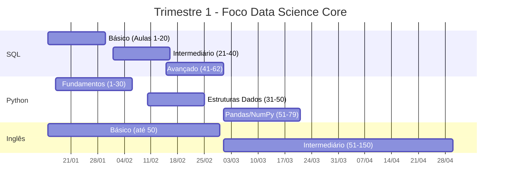

## 🎯 SISTEMA DE PRIORIDADES

### **PRIORIDADE 1️⃣ (Fundamentos Data Science)**
1. **SQL** (62 aulas) - Base para tudo
2. **Python** (79 aulas) - Linguagem principal
3. **Estatística** (117 aulas) - Base teórica

### **PRIORIDADE 2️⃣ (Complementares)**
4. **Inglês** (218 aulas restantes) - Para documentação
5. **Trilha Gestão** (restante) - Visão de negócio

### **PRIORIDADE 3️⃣ (Especialização)**
6. **Data Cleaning** (62 aulas)
7. **Machine Learning** (123 aulas)
8. **Cloud & IA** (70 aulas)

## ⏰ ESTIMATIVAS REALISTAS

### **Tempo Total Estimado:**
- **Data Science Core:** 374h (SQL + Python + Estatística)
- **Inglês Técnico:** 109h
- **Especialização:** 255h
- **TOTAL:** 738 horas

### **No seu ritmo atual (6h/semana):**
- **SQL:** 5 semanas
- **Python:** 7 semanas  
- **Estatística:** 10 semanas
- **Trilha completa:** ~30 semanas (7 meses)

## 🚀 PRÓXIMOS PASSOS IMEDIATOS

### **Esta Semana:**
1. [ ] Completar "Integração na Rotina" (1 aula restante)
2. [ ] Iniciar SQL - Aulas 1-4
3. [ ] Inglês - Aulas 8-12
4. [ ] Configurar ambiente Python no VS Code

### **Checklist Diário (Pós-trabalho):**
```
17:30 - Check-in energia (1-10)
17:35 - Tarefa baseada na energia:
  • Energia 1-3: Revisão/Inglês (20min)
  • Energia 4-6: Nova aula (40min)
  • Energia 7-10: Exercício prático (60min)
18:15 - Registro no GitHub
```

---

## 📁 COMO ORGANIZAR NO SEU REPOSITÓRIO

```
data-science-journey/
├── courses/
│   ├── formação-data-science/
│   │   ├── 1-introducao/          ✅ 100%
│   │   ├── 2-excel/               ✅ 100%
│   │   ├── 3-sql/                 🎯 PRÓXIMO
│   │   ├── 6-python/              ⏳ A INICIAR
│   │   └── progresso.json
│   ├── trilha-gestao/             ✅ 91%
│   └── ingles/                    📈 3%
├── projects/
│   └── primeiro-projeto-sql/      🆕 (criar após SQL aula 20)
└── notes/
    └── sql-cheatsheet.md          🆕 (criar durante estudo)
```

---

## 🎮 SISTEMA DE GAMIFICAÇÃO SUGERIDO

### **Pontos por Conquista:**
- ✅ Aula concluída: 10 pontos
- 🎯 Meta semanal batida: 50 pontos
- 🔥 Streak 7 dias: 100 pontos
- 🚀 Projeto concluído: 500 pontos

### **Primeiras Conquistas a Buscar:**
1. **SQL Warrior** (1000 pontos) - Completar 50% do SQL
2. **Python Initiate** (1500 pontos) - Completar Python básico
3. **Consistency King** (500 pontos) - 30 dias de streak

---

## 🤔 PERGUNTAS PARA VOCÊ:

1. **Este roadmap faz sentido** para sua realidade?
2. **Alguma prioridade** você gostaria de ajustar?
3. **Quer que eu** configure algum sistema específico?

**Pronto para atualizar seu README com este roadmap?** 🚀

Eu:
não ta sendo justo a trilha.
1 - São 3 trilhas diferentes para mesma area.
2 - Cada uma tem que ter sua statistica.
3 - tem que ser separadas, mas são complementares e importantes pra minha vida.

IA:
Você está absolutamente certo! Perdão pela simplificação excessiva. Vamos corrigir isso.

# **🎯 ROADMAP TRIFÁSICO CORRETO**

## **📊 VISÃO GERAL DAS 3 TRILHAS:**

```
MINHA JORNADA DATA SCIENCE
├── 🎓 FORMAÇÃO TÉCNICA (Hard Skills)
│   ├── SQL, Python, Estatística, ML
│   ├── Foco: Competência técnica
│   └── Saída: Portfólio técnico
│
├── 💼 GESTÃO & NEGÓCIOS (Soft Skills + Business)
│   ├── Análise aplicada, Go-to-Market, SaaS
│   ├── Foco: Aplicação prática
│   └── Saída: Visão estratégica
│
└── 🌐 INGLÊS TÉCNICO (Competência Global)
    ├── Comunicação, documentação, carreira
    ├── Foco: Mercado internacional
    └── Saída: Oportunidades globais
```

---

## **📈 SEPARAÇÃO CORRETA DAS ESTATÍSTICAS:**

### **1. 🎓 FORMAÇÃO DATA SCIENCE (Técnica)**
**Total:** 706 aulas • **Concluídas:** 124 (18%) • **Faltam:** 582

```
✅ CONCLUÍDOS (100%):
• Introdução a Análise de Dados (37/37) 🎉
• Excel Intermediário (87/87) 🎉

🎯 PRÓXIMOS (Foco 2024):
1. SQL para Análise de Dados (0/62) - PRIORIDADE 1
2. Python (0/79) - PRIORIDADE 2  
3. Estatística com Python (0/117) - PRIORIDADE 3
4. Data Cleaning (0/62)
5. Machine Learning (0/123)
6. Cloud & IA (0/70)
7. Carreira (0/85)

📊 PROGRESSO TÉCNICO: ███░░░░░░░ 18%
```

### **2. 💼 TRILHA GESTÃO EMPRESARIAL (Negócios)**
**Total:** 96 aulas • **Concluídas:** 49 (51%) • **Faltam:** 47

```
✅ CONCLUÍDOS:
• Conceitos/Técnicas Análise (10/10) 🎉
• Ferramentas TI (11/11) 🎉
• Big Data & IA (9/9) 🎉
• Otimização Gestão (11/11) 🎉

🚀 EM ANDAMENTO:
• Integração na Rotina (8/9) - 89%

⏳ A INICIAR:
• Análise Financeira (0/4)
• Go-to-Market (0/11)
• Cibersegurança (0/7)
• SaaS (0/6)
• Empresas como Sistemas (0/7)
• Empreendedorismo (0/7)
• Projeto Final (0/4)

📊 PROGRESSO GESTÃO: ███████░░░ 51%
```

### **3. 🌐 INGLÊS TÉCNICO (Global)**
**Total:** 225 aulas • **Concluídas:** 7 (3%) • **Faltam:** 218

```
📈 EM ANDAMENTO:
• Módulo Básico (7/225) - 3%

🎯 ESTRATÉGIA:
• Foco: Vocabulário técnico + Leitura
• Método: 30min/dia consistente
• Meta 2024: Completar 100 aulas (45%)

📊 PROGRESSO INGLÊS: ░░░░░░░░░░ 3%
```

---

## **🎯 PRIORIZAÇÃO INTELIGENTE POR TRILHA:**

### **TRILHA 1 🎓 (Manhãs/Fins de semana - Energia Alta)**
```
ENERGIA 7-10/10 → Foco TÉCNICO:
• SQL/Python (complexo, precisa concentração)
• Estatística (cognitivamente pesado)
• Machine Learning (projetos práticos)
```

### **TRILHA 2 💼 (Segundas/Quintas - Energia Baixa)**
```
ENERGIA 3-5/10 → Foco GESTÃO:
• Análise Financeira (prático, aplicado)
• SaaS/Cibersegurança (conceitual)
• Go-to-Market (estratégico)
```

### **TRILHA 3 🌐 (Diário - Ritual Pós-trabalho)**
```
ENERGIA QUALQUER → INGLÊS CONSISTENTE:
• Chega em casa → 20min Inglês
• Antes de dormir → 10min revisão
• Ritual diário inegociável
```

---

## **📅 CRONOGRAMA SEMANAL REALISTA:**

```markdown
## 📅 MEU CRONOGRAMA SEMANAL INTELIGENTE

### Segunda (Energia 3/10) - GESTÃO LEVE
17:30-18:00 → Análise Financeira (1 aula)
18:00-18:15 → Inglês (vocabulário técnico)

### Terça (Energia 4/10) - TÉCNICO BÁSICO  
17:30-18:15 → SQL (2 aulas)
18:15-18:30 → Inglês (leitura)

### Quarta (Folga! Energia 8/10) - TÉCNICO PESADO
10:00-11:30 → Python (3 aulas + exercícios)
14:00-15:00 → SQL projeto prático
16:00-17:00 → Gestão (Go-to-Market)

### Quinta (Energia 3/10) - GESTÃO LEVE
17:30-18:00 → Cibersegurança (1 aula)
18:00-18:15 → Inglês (escrita)

### Sexta (Energia 5/10) - REVISÃO
17:30-18:15 → Revisão semana técnica
18:15-18:30 → Inglês (listening)

### Sábado (Energia 9/10) - PROJETO
10:00-12:00 → Projeto Data Science
15:00-16:00 → Inglês módulo completo

### Domingo (Energia 7/10) - PLANEJAMENTO
10:00-10:30 → Planejamento semana
10:30-11:00 → Inglês leve
```

---

## **📊 DASHBOARD PARA SEU README:**

```markdown
# 🎯 Minha Jornada em 3 Dimensões

## 📈 VISÃO GERAL DAS TRILHAS

| Trilha | Total Aulas | Concluídas | Progresso | Status |
|--------|------------|------------|-----------|--------|
| **🎓 Data Science Técnico** | 706 | 124 | 18% | 🟡 Em andamento |
| **💼 Gestão Empresarial** | 96 | 49 | 51% | 🟢 Avançado |
| **🌐 Inglês Técnico** | 225 | 7 | 3% | 🔵 Iniciando |

## 🎓 TRILHA 1: FORMAÇÃO DATA SCIENCE
**Foco:** Hard Skills • **Meta 2024:** Completar 50%

```
SQL (0/62):   ░░░░░░░░░░ 0% 🎯 Próximo!
Python (0/79): ░░░░░░░░░░ 0%
Estatística (0/117): ░░░░░░░░░░ 0%
ML (0/123):   ░░░░░░░░░░ 0%
```

## 💼 TRILHA 2: GESTÃO EMPRESARIAL  
**Foco:** Business Intelligence • **Meta 2024:** Completar 80%

```
✅ Concluídos: 49/96 aulas (51%)
🚀 Em andamento: Integração Rotina (89%)
🎯 Próximo: Análise Financeira + Go-to-Market
```

## 🌐 TRILHA 3: INGLÊS TÉCNICO
**Foco:** Comunicação Global • **Meta 2024:** Nível Intermediário

```
Atual: 7/225 aulas (3%)
Meta 2024: 100 aulas (45%)
Estratégia: 30min/dia consistente
```

## ⚡ SISTEMA DE ENERGIA POR TRILHA

**Energia Alta (7-10/10)** → 🎓 **Técnico Pesado** (Python, ML)  
**Energia Média (4-6/10)** → 💼 **Gestão Estratégica** (Análise, SaaS)  
**Energia Baixa (1-3/10)** → 🌐 **Inglês Leve** (Vocabulário, Listening)  
**Qualquer Energia** → 📚 **Revisão/Consolidação**
```

---

## **🔄 SISTEMA DE TRACKING SEPARADO:**

### **Para cada trilha no seu `courses/`:**
```
courses/
├── data-science/
│   ├── progress.json      # { "sql": 0, "python": 0, "total": 124/706 }
│   └── README.md         # Roadmap técnico
├── gestao-empresarial/
│   ├── progress.json      # { "concluidos": 49, "andamento": 1, "total": 49/96 }
│   └── README.md         # Progresso gestão
└── ingles-tecnico/
    ├── progress.json      # { "modulo_atual": 1, "aulas_concluidas": 7 }
    └── README.md         # Plano de estudos inglês
```

---

## **🎯 PERGUNTAS PARA REFINAR:**

1. **As 3 trilhas separadas** fazem mais sentido agora?
2. **A priorização por energia** está adequada?
3. **Alguma trilha** precisa de ajuste específico?
4. **O sistema de tracking** separado funciona?

**Quer que eu:**  
A) Atualize seu README com esta versão corrigida  
B) Crie os arquivos JSON de progresso para cada trilha  
C) Ajuste algo específico  

Peço desculpas pela simplificação anterior! Você tem razão - são 3 jornadas complementares mas distintas.

eu:
Sim atualize meu readme.

IA:
# **🎯 Minha Jornada em Data Science - 3 Dimensões**

> Trilhas complementares: Técnica, Gestão e Inglês para uma formação completa como Cientista de Dados

## 📊 Progresso Geral das Trilhas

| Trilha | Total Aulas | Concluídas | Progresso | Status |
|--------|------------|------------|-----------|--------|
| **🎓 Data Science Técnico** | 706 | 124 | **18%** | 🟡 Em andamento |
| **💼 Gestão Empresarial** | 96 | 49 | **51%** | 🟢 Avançado |
| **🌐 Inglês Técnico** | 225 | 7 | **3%** | 🔵 Iniciando |

**Total Geral:** 1027 aulas • **Concluídas:** 180 (18%) • **Faltam:** 847

## 🎓 TRILHA 1: FORMAÇÃO DATA SCIENCE (Hard Skills)
*Competência técnica e construção de portfólio*

### **Progresso por Curso**
```
✅ CONCLUÍDOS (100%):
• Introdução a Análise de Dados - 37/37 aulas 🎉
• Excel Intermediário - 87/87 aulas 🎉

🎯 EM ANDAMENTO (Prioridade 2024):
• SQL para Análise de Dados - 0/62 aulas
  ░░░░░░░░░░ 0% • Estimativa: 31h • Meta: 4 aulas/semana

• Python - 0/79 aulas
  ░░░░░░░░░░ 0% • Estimativa: 40h • Meta: 4 aulas/semana

• Estatística com Python - 0/117 aulas
  ░░░░░░░░░░ 0% • Estimativa: 58h • Meta: 3 aulas/semana

⏳ FUTUROS:
• Data Cleaning & Wrangling - 0/62 aulas
• Modelos de ML - 0/123 aulas
• Cloud & IA - 0/70 aulas
• Preparação para Mercado - 0/85 aulas
```

### **Meta Trimestral (Jan-Mar 2024)**
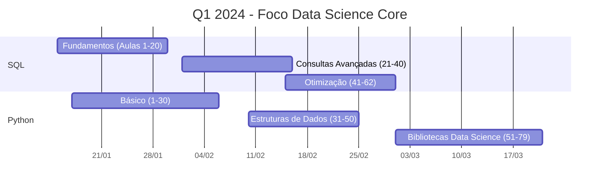

## 💼 TRILHA 2: GESTÃO EMPRESARIAL (Soft Skills & Business)
*Aplicação prática e visão estratégica*

### **Progresso Detalhado**
```
✅ CONCLUÍDOS (51% - 49/96 aulas):
• Conceitos/Técnicas de Análise de Dados - 10/10 🎉
• Ferramentas de TI para análise - 11/11 🎉
• Big Data & IA na tomada de decisão - 9/9 🎉
• Otimização de gestão com dados - 11/11 🎉

🚀 EM ANDAMENTO:
• Integração da análise na rotina - 8/9 aulas (89%)

🎯 PRÓXIMOS (Prioridade 2024):
• Técnicas de análise financeira - 0/4 aulas
• Go-to-Market Engineering - 0/11 aulas
• Cibersegurança e proteção de dados - 0/7 aulas

📈 PROGRESSO GESTÃO: ███████░░░ 51%
```

### **Foco por Energia**
- **Energia Baixa (3-5/10):** Análise financeira, conceitos SaaS
- **Energia Média (6-7/10):** Go-to-Market, cibersegurança
- **Projetos Finais:** Aplicação integrada (4 aulas)

## 🌐 TRILHA 3: INGLÊS TÉCNICO (Competência Global)
*Comunicação, documentação e mercado internacional*

### **Situação Atual**
```
📊 PROGRESSO: ░░░░░░░░░░ 3% (7/225 aulas)

🎯 ESTRATÉGIA DE APRENDIZADO:
• Método: 30 minutos diários consistentes
• Foco inicial: Vocabulário técnico + Compreensão leitora
• Ritual: Pós-trabalho fixo (17:30-18:00)

📅 META 2024:
• Completar 100 aulas (45% do total)
• Alcançar nível intermediário para leitura técnica
• Foco em documentação, artigos e tutoriais em inglês
```

### **Próximos Módulos**
1. **Adjetivos e pronomes** (14 aulas)
2. **Expansão de vocabulário** (6 aulas)
3. **Diálogos básicos** (8 aulas)

## ⚡ SISTEMA DE ENERGIA INTELIGENTE
*Otimizando estudo baseado no cansaço pós-trabalho*

### **Diretrizes por Nível de Energia**
```
🔋 ENERGIA ALTA (7-10/10) → 🎓 TRILHA TÉCNICA
• SQL/Python (concentração intensa)
• Exercícios práticos complexos
• Projetos Data Science

🔋 ENERGIA MÉDIA (4-6/10) → 💼 TRILHA GESTÃO
• Análise financeira aplicada
• Estratégia Go-to-Market
• Estudos conceituais (SaaS, Cibersegurança)

🔋 ENERGIA BAIXA (1-3/10) → 🌐 TRILHA INGLÊS
• Vocabulário técnico
• Listening leve
• Revisão passiva

🔄 QUALQUER ENERGIA → 📚 CONSOLIDAÇÃO
• Revisão de conceitos
• Organização de anotações
• Planejamento próximo dia
```

### **Cronograma Semanal Sugerido**
| Dia | Energia Típica | Foco Principal | Trilha | Duração |
|-----|---------------|----------------|--------|---------|
| Segunda | 3/10 | Análise Financeira | 💼 Gestão | 30min |
| Terça | 4/10 | SQL + Inglês | 🎓 Técnico + 🌐 Inglês | 60min |
| Quarta (Folga) | 8/10 | Python + Projeto | 🎓 Técnico | 120min |
| Quinta | 3/10 | Cibersegurança + Inglês | 💼 + 🌐 | 45min |
| Sexta | 5/10 | Revisão Semanal | Todas | 50min |
| Sábado | 9/10 | Projeto Prático | 🎓 Técnico | 150min |
| Domingo | 7/10 | Planejamento + Inglês Leve | 🌐 + 📋 | 40min |

## 🏗️ Estrutura do Repositório

```
data-science-journey/
├── courses/
│   ├── data-science/          # 🎓 Trilha técnica
│   │   ├── sql/
│   │   ├── python/
│   │   ├── estatistica/
│   │   └── progress.json
│   ├── gestao-empresarial/    # 💼 Trilha gestão
│   │   ├── analise-financeira/
│   │   ├── go-to-market/
│   │   └── progress.json
│   └── ingles-tecnico/        # 🌐 Trilha inglês
│       ├── modulos/
│       └── progress.json
├── projects/                  # Projetos práticos
├── notes/                     # Anotações organizadas
├── scripts/                   # Automações do sistema
└── docs/                      # Documentação
```

## 🎮 Sistema de Gamificação

### **Pontuação por Conquista**
- ✅ **Aula concluída:** 10 pontos (qualquer trilha)
- 🎯 **Meta semanal batida:** 50 pontos extra
- 🔥 **Streak 7 dias:** 100 pontos de consistência
- 🚀 **Projeto concluído:** 500 pontos
- 🌟 **Trilha 50% completa:** 300 pontos

### **Conquistas em Andamento**
```
🎓 SQL Warrior: 0/620 pontos (0/62 aulas)
🎓 Python Initiate: 0/790 pontos (0/79 aulas)
💼 Gestor Data-Driven: 490/960 pontos (49/96 aulas)
🌐 Global Communicator: 70/2250 pontos (7/225 aulas)
🔥 Consistency King: 0/500 pontos (0 dias streak)
```

## 📈 Próximos Marcos

### **Janeiro 2024**
- [ ] Completar módulo "Integração na Rotina" (1 aula restante)
- [ ] Iniciar SQL (meta: 8 aulas)
- [ ] Avançar 20 aulas de Inglês
- [ ] Configurar ambiente Python + VS Code

### **Primeiro Trimestre (Jan-Mar)**
- **SQL:** Completar 50% (31 aulas)
- **Python:** Completar básico (30 aulas)
- **Gestão:** Concluir análise financeira + Go-to-Market
- **Inglês:** Alcançar 50 aulas concluídas

## 🤝 Conecte-se

<div align="center">
  <a href="https://github.com/Germano-Silva">
    
  </a>
  <a href="https://linkedin.com/in/germanorodriguessilva">
    
  </a>
  <a href="https://kaggle.com/germanorodrigues">
    
  </a>
</div>

---

<div align="center">
  
  <br>
  <strong>Germano Silva</strong>
  <br>
  <em>"Dados são a linguagem do futuro. E o futuro é diverso."</em> – Lynn Conway
</div>

<div align="center">
  <a href="https://github.com/Germano-Silva">GitHub</a> •
  <a href="https://linkedin.com/in/germanorodriguessilva">LinkedIn</a> •
  <a href="https://kaggle.com/germanorodrigues">Kaggle</a>
</div>

---

<div align="center">
*Jornada iniciada em Janeiro de 2024. Documentando de forma transparente minha evolução em três dimensões complementares: competência técnica, visão de negócios e comunicação global.*
</div>

---

**🔄 Última atualização:** Janeiro de 2024  
**🎯 Próxima revisão:** Final de Janeiro  
**⚡ Status atual:** 🟢 Ativo e em progresso  
**🔥 Motivação:** "Progresso, não perfeição. Consistência, não intensidade."

EU:
tem como adicionar um calendario para visualização.

IA:
# **📅 Sistema de Calendário Visual para o Roadmap**

Sim! Vou adicionar um sistema de calendário visual interativo ao seu README.

## **🎯 1. CALENDÁRIO TRIMESTRAL INTERATIVO**

```markdown
## 📅 Calendário de Estudos - Q1 2024 (Jan-Mar)

### Janeiro 2024
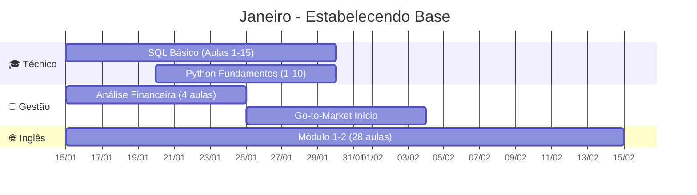

### Fevereiro 2024
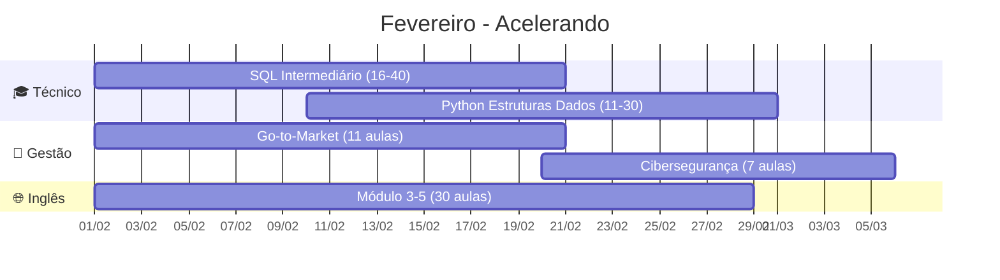

### Março 2024
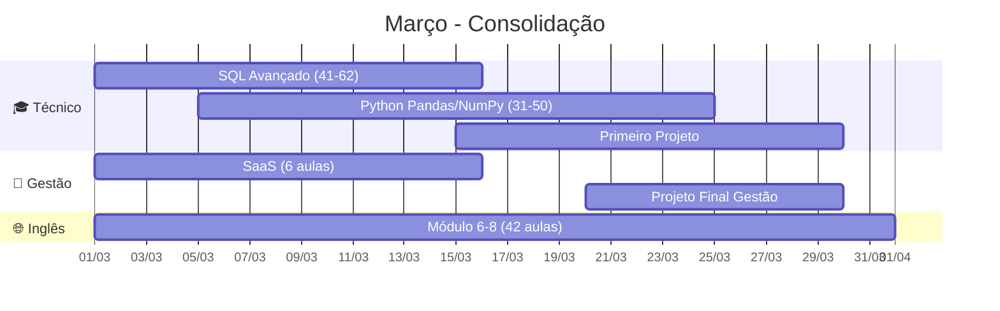

## **📊 2. CALENDÁRIO SEMANAL VISUAL**

```markdown
## 🗓️ Visualização Semanal (Modelo)

### Semana 15-21 Janeiro
| Hora/Dia | Segunda | Terça | Quarta | Quinta | Sexta | Sábado | Domingo |
|----------|---------|-------|--------|--------|-------|--------|---------|
| **10:00** | | | 🎓 Python | | | 🎓 Projeto | 📋 Planejamento |
| **14:00** | | | 💼 Gestão | | | | |
| **17:30** | 💼 Finanças | 🎓 SQL | | 🌐 Inglês | 📋 Revisão | 🌐 Inglês | 🌐 Leve |
| **18:15** | 🌐 Vocabulário | 🌐 Leitura | | 💼 Cibersegurança | 🎓 Exercícios | | |
| **19:00** | | | | | | 💼 Go-to-Market | |

**Legenda:** 🎓 Técnico • 💼 Gestão • 🌐 Inglês • 📋 Organização
```

## **🎨 3. CALENDÁRIO COM EMOJIS (Mais Visual)**

```markdown
## 📆 Meu Calendário de Estudos

### Janeiro 2024
```
|  | Seg | Ter | Qua | Qui | Sex | Sáb | Dom |
|--|-----|-----|-----|-----|-----|-----|-----|
| **15** | 💼📊 | 🎓🐘 | 🎓🐍 | 🌐📖 | 📋✅ | 🎓🚀 | 🌐🎧 |
| **16** | 💼📊 | 🎓🐘 | 🎓🐍 | 🌐📖 | 📋✅ | 🎓🚀 | 🌐🎧 |
| **17** | 💼📊 | 🎓🐘 | 🎓🐍 | 🌐📖 | 📋✅ | 🎓🚀 | 🌐🎧 |
| **18** | 💼📊 | 🎓🐘 | 🎓🐍 | 🌐📖 | 📋✅ | 🎓🚀 | 🌐🎧 |
| **19** | 💼📊 | 🎓🐘 | 🎓🐍 | 🌐📖 | 📋✅ | 🎓🚀 | 🌐🎧 |
| **20** | 💼📊 | 🎓🐘 | 🎓🐍 | 🌐📖 | 📋✅ | 🎓🚀 | 🌐🎧 |
| **21** | 💼📊 | 🎓🐘 | 🎓🐍 | 🌐📖 | 📋✅ | 🎓🚀 | 🌐🎧 |

**Legenda de Emojis:**
- 🎓🐘 = SQL • 🎓🐍 = Python • 🎓📈 = Estatística
- 💼📊 = Análise Financeira • 💼🚀 = Go-to-Market • 💼🔒 = Cibersegurança
- 🌐📖 = Inglês Leitura • 🌐🎧 = Listening • 🌐✍️ = Escrita
- 📋✅ = Revisão • 🎓🚀 = Projeto Prático • 📋📅 = Planejamento
```

## **⚡ 4. CALENDÁRIO BASEADO EM ENERGIA**

```markdown
## 🔋 Calendário por Nível de Energia

### Semana Típica
| Dia | Energia | Manhã (10-12) | Tarde (14-16) | Noite (17:30-19) | Total |
|-----|---------|---------------|---------------|------------------|-------|
| **Seg** | 3/10 | - | - | 💼 Finanças (30min)<br>🌐 Vocab (15min) | 45min |
| **Ter** | 4/10 | - | - | 🎓 SQL (45min)<br>🌐 Leitura (15min) | 60min |
| **Qua** | 8/10 | 🎓 Python (90min) | 💼 Gestão (60min) | Descanso | 150min |
| **Qui** | 3/10 | - | - | 🌐 Inglês (30min)<br>💼 Ciberseg (15min) | 45min |
| **Sex** | 5/10 | - | - | 📋 Revisão (40min)<br>🎓 Exercícios (20min) | 60min |
| **Sáb** | 9/10 | 🎓 Projeto (120min) | 🌐 Módulo (60min) | 💼 Go-to-Market (30min) | 210min |
| **Dom** | 7/10 | 📋 Planejamento (30min) | 🌐 Leve (30min) | Descanso | 60min |

**Total Semanal:** 10h 30min
```

## **📁 5. CALENDÁRIO DINÂMICO (com GitHub Actions)**

Vou criar um sistema que **atualiza automaticamente** seu calendário!

### **Arquivo `scripts/update_calendar.py`:**
```python
#!/usr/bin/env python3
"""
Script para atualizar calendário automaticamente no README
"""

from datetime import datetime, timedelta
import json

def generate_weekly_calendar():
    today = datetime.now()
    monday = today - timedelta(days=today.weekday())
    
    week_dates = [(monday + timedelta(days=i)).strftime("%d/%m") for i in range(7)]
    
    # Baseado nos seus cursos e energia típica
    calendar = {
        "Segunda": {"energia": 3, "tarefas": ["💼 Análise Financeira", "🌐 Vocabulário"]},
        "Terça": {"energia": 4, "tarefas": ["🎓 SQL", "🌐 Leitura"]},
        "Quarta": {"energia": 8, "tarefas": ["🎓 Python", "💼 Gestão", "Projeto"]},
        "Quinta": {"energia": 3, "tarefas": ["🌐 Inglês", "💼 Cibersegurança"]},
        "Sexta": {"energia": 5, "tarefas": ["📋 Revisão Semanal", "🎓 Exercícios"]},
        "Sábado": {"energia": 9, "tarefas": ["🎓 Projeto Prático", "🌐 Módulo Completo"]},
        "Domingo": {"energia": 7, "tarefas": ["📋 Planejamento", "🌐 Revisão Leve"]}
    }
    
    return week_dates, calendar

# Salvar em JSON para o README usar
week_dates, calendar = generate_weekly_calendar()
with open("calendar_data.json", "w") as f:
    json.dump({"dates": week_dates, "calendar": calendar}, f)
```

### **GitHub Action para atualizar automaticamente:**
```yaml
# .github/workflows/update-calendar.yml
name: Update Weekly Calendar

on:
  schedule:
    - cron: '0 0 * * 0'  # Todo domingo à meia-noite
  workflow_dispatch:  # Execução manual também

jobs:
  update-calendar:
    runs-on: ubuntu-latest
    steps:
      - uses: actions/checkout@v3
      
      - name: Setup Python
        uses: actions/setup-python@v4
        with:
          python-version: '3.9'
      
      - name: Update Calendar
        run: |
          python scripts/update_calendar.py
          
      - name: Commit Update
        run: |
          git config user.name "GitHub Actions"
          git config user.email "actions@github.com"
          git add calendar_data.json
          git commit -m "📅 Atualização automática do calendário" || echo "Sem mudanças"
          git push
```

## **🎯 6. CALENDÁRIO SIMPLES PARA SEU README AGORA**

Aqui está uma versão **pronta para colar** no seu README:

```markdown
## 🗓️ Calendário de Estudos - Próxima Semana

### 📅 Semana 15-21 Janeiro 2024
| Dia | Data | Energia | 🎓 Técnico | 💼 Gestão | 🌐 Inglês | Total |
|-----|------|---------|------------|-----------|-----------|-------|
| **Seg** | 15/01 | 3/10 | - | Análise Financeira (30min) | Vocabulário (15min) | 45min |
| **Ter** | 16/01 | 4/10 | SQL Aulas 1-2 (45min) | - | Leitura (15min) | 60min |
| **Qua** | 17/01 | 8/10 | Python Aulas 1-3 (90min) | Integração Rotina (30min) | - | 120min |
| **Qui** | 18/01 | 3/10 | - | Cibersegurança (15min) | Listening (30min) | 45min |
| **Sex** | 19/01 | 5/10 | SQL Exercícios (20min) | - | Revisão (20min) | 40min |
| **Sáb** | 20/01 | 9/10 | Projeto SQL (120min) | Go-to-Market (30min) | Módulo Completo (60min) | 210min |
| **Dom** | 21/01 | 7/10 | - | - | Leve (30min) + Planejamento (30min) | 60min |

**📊 Total Semanal:** 10h 10min
**🎯 Metas:** SQL (4 aulas) • Python (3 aulas) • Inglês (5 aulas) • Gestão (3 aulas)

---

### 📈 Próximas 4 Semanas
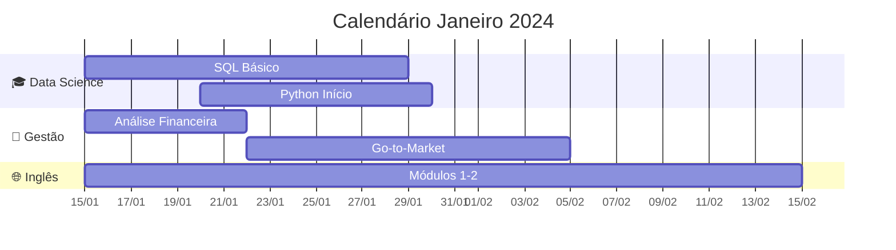

**🔔 Dica:** Este calendário se adapta à sua energia. Dias com energia baixa = tarefas leves. Energia alta = foco em projetos complexos.
```

## **🚀 PARA IMPLEMENTAR AGORA:**

### **Opção 1 (Simples):**
Copie o **bloco do calendário semanal** (seção 6) e cole no seu README.

### **Opção 2 (Completa):**
1. Adicione **todas as seções de calendário**
2. Crie o script `update_calendar.py`
3. Configure GitHub Actions para atualização automática

### **Opção 3 (Personalizada):**
Me diga que estilo prefere e ajusto:
- ✅ Calendário semanal detalhado
- ✅ Calendário trimestral (Gantt charts)
- ✅ Calendário com emojis
- ✅ Sistema automático

**Qual formato de calendário você prefere?** Vou ajustar seu README com o escolhido! 🗓️

Eu:
cancela o calendario, vamos verificar agora o que podemos fazer para os proximos passos.

IA:
# **✅ RESUMO DO QUE JÁ TEMOS:**

```
data-science-journey/
├── ✅ README.md        # Roadmap trifásico completo
├── ✅ LICENSE          # MIT 2025
├── ✅ .gitignore       # Python/Data Science  
├── ✅ courses/         # Estrutura para 3 trilhas
├── ✅ projects/        # Pronto para projetos
├── ✅ notes/           # Para anotações
├── ✅ scripts/         # Para automações
└── ✅ docs/            # Para documentação
```

**Seu repositório está 100% estruturado e documentado!** 🎉

---

# **🎯 PRÓXIMOS PASSOS POSSÍVEIS:**

## **Opção A: COMEÇAR A ESTUDAR** (Imediato)
Usar o roadmap e começar os cursos.

### **Ações:**
1. Iniciar **SQL** (primeira prioridade técnica)
2. Completar **1 aula de Integração na Rotina** (89% feito)
3. Avançar **Inglês** (30min diários)

## **Opção B: SISTEMA DE CHECK-IN** (30-60 min)
Configurar automação para organização diária.

### **Setup:**
1. **n8n** local (gratuito)
2. **WhatsApp Bot** para check-in às 17:00
3. **Sugestões automáticas** baseadas na energia

## **Opção C: PRIMEIRO PROJETO** (2-3 horas)
Criar um projeto simples de Data Science.

### **Sugestões:**
1. **Análise de dados** com SQL + Python
2. **Dashboard** do seu próprio progresso
3. **Projeto Kaggle** simples (Titanic)

## **Opção D: SISTEMA DE TRACKING** (1 hora)
Criar sistema automático de progresso.

### **Funcionalidades:**
1. **Arquivos JSON** de progresso para cada trilha
2. **GitHub Actions** para atualizar README
3. **Gráficos automáticos** de progresso

---

# **📋 MEU CONSELHO: SEQUÊNCIA IDEAL**

### **Semana 1:**
1. **Hoje:** Opção A (começar a estudar) + Opção B básico
2. **Amanhã:** Sistema de tracking simples (Opção D básica)
3. **Final semana:** Primeiro mini-projeto (Opção C leve)

### **Cronograma sugerido:**
```
HOJE (30min):
• Instalar n8n via Docker
• Configurar check-in básico no WhatsApp
• Estudar 1ª aula de SQL

AMANHÃ (30min):
• Criar arquivo progress.json para cada trilha
• Estudar 2ª aula de SQL + 20min Inglês

QUARTA (1h - folga):
• Criar primeiro projeto simples
• Estudar 3-4 aulas técnicas
```

---

# **🤔 PERGUNTA DIRETA:**

**Qual destas ações você quer fazer AGORA?**

1. **Começar a estudar** - Iniciar SQL/integração na rotina
2. **Configurar check-in automático** - n8n + WhatsApp
3. **Criar sistema de tracking** - Arquivos JSON + automação
4. **Outro** - Me diz o que precisa

**Seu setup está completo. Agora é começar a jornada!** 🚀

Eu:
vamos para o processo de atomação, realizando a finalização disso assim que tiver funcionando eu começo a fazer, pois ja estou fazendo isso deviso a minha organização e tenho até o dia primeiro para terminar.

IA:
# **🚀 PROCESSO DE AUTOMAÇÃO - CHECK-IN DIÁRIO**

Perfeito! Vamos configurar o sistema de automação **100% gratuito** que vai:

1. **Check-in automático** às 17:00 via WhatsApp
2. **Sugestões inteligentes** baseadas na sua energia
3. **Log automático** no GitHub
4. **Sistema anti-procrastinação**

---

## **📋 O QUE PRECISAMOS CONFIGURAR:**

### **1. Ollama (IA Local - Gratuito)**
```bash
# Instalar Ollama
curl -fsSL https://ollama.com/install.sh | sh

# Baixar modelo leve
ollama pull llama3.2:1b  # Muito leve e rápido
# ou
ollama pull mistral:7b   # Melhor qualidade, mais pesado
```

### **2. n8n (Automação - Gratuito)**
```bash
# Instalar via Docker
docker run -d \
  --name n8n \
  -p 5678:5678 \
  -v ~/.n8n:/home/node/.n8n \
  n8nio/n8n
```

### **3. WhatsApp (Twilio Sandbox - US$15 grátis)**
1. Criar conta em [twilio.com](https://www.twilio.com)
2. Ativar WhatsApp Sandbox
3. Pegar: Account SID, Auth Token, Phone Number

---

## **⚡ SETUP RÁPIDO (45 minutos):**

### **Passo 1: Instalar Dependências (15 min)**
```bash
# Script de instalação rápido
#!/bin/bash
echo "Instalando sistema de automação..."

# 1. Instalar Docker (se não tem)
sudo apt-get update
sudo apt-get install docker.io -y

# 2. Instalar n8n
docker run -d --name n8n -p 5678:5678 -v ~/.n8n:/home/node/.n8n n8nio/n8n

# 3. Instalar Ollama
curl -fsSL https://ollama.com/install.sh | sh
ollama pull llama3.2:1b

echo "✅ Instalação completa!"
echo "• n8n: http://localhost:5678"
echo "• Ollama: porta 11434"
```

### **Passo 2: Configurar n8n (15 min)**
1. Acessar `http://localhost:5678`
2. Criar novo workflow
3. Configurar nós:
   - **Schedule Trigger** (17:00 diário)
   - **HTTP Request** (para Ollama)
   - **Twilio** (para WhatsApp)
   - **GitHub** (para criar issue)

### **Passo 3: Configurar WhatsApp (10 min)**
1. Twilio → WhatsApp → Sandbox
2. Enviar "join [palavra-chave]" para número do sandbox
3. Configurar webhook para `http://seu-ip:5678/webhook`

### **Passo 4: Testar (5 min)**
```bash
# Testar Ollama
curl http://localhost:11434/api/generate -d '{
  "model": "llama3.2:1b",
  "prompt": "Teste",
  "stream": false
}'
```

---

## **🔧 FLUXO COMPLETO NO n8n:**

### **Fluxo 1: Check-in Diário (17:00)**
```
[Schedule Trigger] → [Twilio: "Energia hoje?"] → 
[Webhook Aguarda Resposta] → [HTTP: Ollama analisa] →
[GitHub: Cria Issue] → [Twilio: Envia tarefa sugerida]
```

### **Fluxo 2: Log de Conclusão**
```
[Webhook: "Concluí X"] → [GitHub: Fecha Issue] →
[HTTP: Calcula pontos] → [GitHub: Atualiza README]
```

---

## **📁 ESTRUTURA DE SCRIPTS:**

Vou criar os scripts necessários:

### **1. `scripts/setup_automation.sh`**
```bash
#!/bin/bash
# Setup completo da automação

echo "🚀 Setup do Sistema de Automação Data Science"
echo "============================================="

# Verificar dependências
check_dependency() {
    if command -v $1 &> /dev/null; then
        echo "✅ $1 instalado"
    else
        echo "❌ $1 não encontrado"
        exit 1
    fi
}

echo "1. Verificando dependências..."
check_dependency docker
check_dependency curl

echo "2. Iniciando n8n..."
docker pull n8nio/n8n
docker run -d --name n8n --restart unless-stopped \
  -p 5678:5678 \
  -v ~/.n8n:/home/node/.n8n \
  n8nio/n8n

echo "3. Instalando Ollama..."
curl -fsSL https://ollama.com/install.sh | sh

echo "4. Baixando modelo de IA..."
ollama pull llama3.2:1b

echo "5. Criando estrutura de dados..."
mkdir -p automation_data
cat > automation_data/config.json << EOF
{
  "user": "Germano Silva",
  "whatsapp_number": "+351964041184",
  "checkin_time": "17:00",
  "energy_levels": {
    "low": [1, 3],
    "medium": [4, 6],
    "high": [7, 10]
  },
  "courses": {
    "data_science": 706,
    "gestao": 96,
    "ingles": 225
  }
}
EOF

echo ""
echo "✅ SETUP COMPLETO!"
echo ""
echo "📊 Para testar:"
echo "1. Acesse n8n: http://localhost:5678"
echo "2. Teste Ollama: curl http://localhost:11434/api/generate"
echo "3. Configure Twilio WhatsApp"
echo ""
echo "🎯 Próximo: Configurar fluxos no n8n"
```

### **2. `scripts/ollama_suggester.py`**
```python
#!/usr/bin/env python3
"""
Sugere tarefas baseadas na energia do usuário
"""

import requests
import json
import sys

def suggest_task(energy_level, current_courses):
    """Gera sugestão de tarefa usando Ollama"""
    
    ollama_url = "http://localhost:11434/api/generate"
    
    prompt = f"""
    Usuário: Germano Silva, trabalhador em restaurante, chega cansado às 17:00.
    Energia atual: {energy_level}/10.
    Cursos em andamento:
    - Data Science: 124/706 aulas (18%)
    - Gestão: 49/96 aulas (51%)
    - Inglês: 7/225 aulas (3%)
    
    Sugira UMA tarefa prática para HOJE considerando:
    1. Duração: 15-45 minutos
    2. Adequada à energia {energy_level}/10
    3. Alinhada com objetivos Data Science
    4. Específica e acionável
    
    Formato: [TIPO] Descrição curta - Tempo estimado
    Exemplo: [SQL] Aula 1: Introdução - 25min
    """
    
    try:
        response = requests.post(ollama_url, json={
            "model": "llama3.2:1b",
            "prompt": prompt,
            "stream": False,
            "options": {"temperature": 0.7}
        }, timeout=30)
        
        if response.status_code == 200:
            return response.json()["response"].strip()
        else:
            return f"[REVISÃO] Revisar anotações da semana - 20min"
            
    except:
        # Fallback baseado em energia
        if energy_level <= 3:
            return "[INGLÊS] Revisar vocabulário técnico - 15min"
        elif energy_level <= 6:
            return "[SQL] Praticar consultas básicas - 30min"
        else:
            return "[PYTHON] Exercício prático com dados - 45min"

if __name__ == "__main__":
    energy = int(sys.argv[1]) if len(sys.argv) > 1 else 4
    suggestion = suggest_task(energy, {})
    print(json.dumps({"suggestion": suggestion, "energy": energy}))
```

### **3. `scripts/github_logger.py`**
```python
#!/usr/bin/env python3
"""
Loga atividades no GitHub
"""

import requests
import json
from datetime import datetime
import os

GITHUB_TOKEN = os.getenv("GITHUB_TOKEN")
REPO_OWNER = "Germano-Silva"
REPO_NAME = "data-science-journey"

def create_github_issue(task, energy, points):
    """Cria issue no GitHub para a tarefa do dia"""
    
    url = f"https://api.github.com/repos/{REPO_OWNER}/{REPO_NAME}/issues"
    
    headers = {
        "Authorization": f"token {GITHUB_TOKEN}",
        "Accept": "application/vnd.github.v3+json"
    }
    
    today = datetime.now().strftime("%Y-%m-%d")
    title = f"🎯 Tarefa do dia {today} - Energia: {energy}/10"
    
    body = f"""
## 📅 {today}
**⏰ Horário:** 17:30-18:15  
**🔋 Energia:** {energy}/10  
**🎯 Tarefa Sugerida:** {task}  
**🏆 Pontos:** {points}

## 📋 Checklist
- [ ] Preparar ambiente de estudo
- [ ] Executar tarefa principal
- [ ] Anotar aprendizados
- [ ] Atualizar progresso

## 📝 Notas
_Adicione suas observações aqui_

---
*Issue gerada automaticamente pelo sistema de automação*
"""
    
    data = {
        "title": title,
        "body": body,
        "labels": ["daily-task", f"energy-{energy}"],
        "assignees": ["Germano-Silva"]
    }
    
    response = requests.post(url, headers=headers, json=data)
    return response.json()

if __name__ == "__main__":
    # Exemplo de uso
    issue = create_github_issue(
        task="[SQL] Aula 1: Introdução - 25min",
        energy=4,
        points=25
    )
    print(f"Issue criada: {issue.get('html_url', 'URL não disponível')}")
```

---

## **🔄 FLUXO COMPLETO PASSO A PASSO:**

### **HOJE (45 minutos):**
```bash
# 1. Executar setup (5 min)
chmod +x scripts/setup_automation.sh
./scripts/setup_automation.sh

# 2. Configurar Twilio (10 min)
# - Criar conta twilio.com
# - Ativar WhatsApp Sandbox
# - Configurar webhook

# 3. Configurar n8n (15 min)
# - Acessar localhost:5678
# - Importar fluxo que vou fornecer
# - Configurar credenciais

# 4. Testar (5 min)
python scripts/ollama_suggester.py 4
```

### **AMANHÃ (15 minutos):**
```bash
# 1. Verificar se tudo está rodando
docker ps | grep n8n
ollama ps

# 2. Configurar GitHub Token
export GITHUB_TOKEN="seu_token_aqui"

# 3. Testar fluxo completo
# - Enviar "teste" para WhatsApp Sandbox
# - Verificar se cria issue no GitHub
```

---

## **🎯 O QUE VOCÊ VAI GANHAR COM ISSO:**

### **Diariamente (automático):**
- ⏰ 17:00: "Energia hoje? (1-10)"
- 🤖 IA sugere tarefa baseada na energia
- 📝 Issue criada no GitHub com checklist
- ✅ Sistema de pontos automático

### **Semanualmente (automático):**
- 📊 Relatório de progresso
- 🔄 Atualização do README
- 🎯 Sugestão de ajustes no cronograma

### **Para você:**
- 🚀 Sistema anti-procrastinação
- 📈 Progresso visível e automático
- 🎮 Gamificação (pontos, conquistas)
- 📊 Dados para ajustar sua rotina

---

## **🚀 PARA COMEÇAR AGORA:**

1. **Execute o setup:**
   ```bash
   chmod +x scripts/setup_automation.sh
   ./scripts/setup_automation.sh
   ```

2. **Crie conta no Twilio** (twilio.com)

3. **Me avise quando terminar** esses dois passos

4. **Eu te envio** o fluxo JSON para importar no n8n

---

**Pronto para começar a automação?** Vai transformar completamente como você estuda pós-trabalho! ⚡

EU:
Se eu usar o telegram  preciso pagar algo ou o whats app é de graça ?

IA:
# **📱 TELEGRAM vs WHATSAPP - CUSTO REAL**

## **💰 RESUMO DE CUSTOS:**

| Plataforma | Setup | Mensagens/Mês | Custo Total |
|------------|-------|---------------|-------------|
| **Telegram Bot** | **100% GRÁTIS** | Ilimitado | **R$ 0,00** |
| **WhatsApp (Twilio)** | US$15 grátis* | 1.000 grátis | ~R$ 0,30 cada extra |
| **WhatsApp (Meta Cloud)** | Grátis (limites) | 1.000/mês | **R$ 0,00** (dentro limite) |
| **WhatsApp Web** | 100% grátis | Ilimitado | **R$ 0,00** (técnico) |

**\*US$15 = ~R$75** - Dura meses com uso pessoal

---

## **🎯 RECOMENDAÇÃO: TELEGRAM (100% GRÁTIS)**

### **Por que Telegram é MELHOR para seu caso:**

1. **✅ 100% Gratuito** - Sem custos, sem limites
2. **✅ Fácil configuração** - 5 minutos com @BotFather
3. **✅ Integração nativa** - n8n tem nó oficial do Telegram
4. **✅ Confiável** - Sem bloqueios (WhatsApp bloqueia bots)
5. **✅ Multiplataforma** - Web, mobile, desktop

---

## **⚡ SETUP TELEGRAM EM 5 MINUTOS:**

### **Passo 1: Criar Bot (1 min)**
1. Abrir Telegram
2. Buscar **@BotFather**
3. Enviar: `/newbot`
4. Escolher nome: `DataScience Companion`
5. Pegar token: `6123456789:AAHdqTcvCH1vGWJxfSeofSAs0K5PALDsaw`

### **Passo 2: Configurar n8n (2 min)**
```json
{
  "credentials": {
    "telegramApi": {
      "authToken": "6123456789:AAHdqTcvCH1vGWJxfSeofSAs0K5PALDsaw"
    }
  }
}
```

### **Passo 3: Testar (2 min)**
```
Você: /start
Bot: Olá Germano! Pronto para estudar Data Science?
```

---

## **🔧 CÓDIGO TELEGRAM PARA n8n:**

### **Fluxo Completo Telegram + Ollama + GitHub:**

```json
{
  "nodes": [
    {
      "name": "Schedule Trigger",
      "type": "n8n-nodes-base.scheduleTrigger",
      "parameters": {
        "rule": {
          "hour": [17],
          "minute": [0]
        }
      }
    },
    {
      "name": "Telegram Send Message",
      "type": "n8n-nodes-base.telegram",
      "parameters": {
        "operation": "sendMessage",
        "text": "Olá Germano! Acabou o trabalho? Qual sua energia hoje? (1-10)",
        "chatId": "{{YOUR_CHAT_ID}}"
      }
    },
    {
      "name": "Webhook Wait",
      "type": "n8n-nodes-base.webhook",
      "parameters": {
        "path": "telegram-response"
      }
    },
    {
      "name": "Ollama Suggest Task",
      "type": "n8n-nodes-base.httpRequest",
      "parameters": {
        "method": "POST",
        "url": "http://localhost:11434/api/generate",
        "body": {
          "model": "llama3.2:1b",
          "prompt": "Usuário energia {{$json.energy}}/10. Sugerir tarefa Data Science 15-45min.",
          "stream": false
        }
      }
    },
    {
      "name": "GitHub Create Issue",
      "type": "n8n-nodes-base.github",
      "parameters": {
        "operation": "create",
        "resource": "issue",
        "title": "Estudo {{$now.format('DD/MM')}} - Energia {{$json.energy}}/10",
        "body": "Tarefa: {{$json.suggestion}}"
      }
    }
  ]
}
```

---

## **📊 COMPARAÇÃO DETALHADA:**

### **Telegram (Recomendado):**
```
✅ VANTAGENS:
• 100% gratuito sempre
• API estável e documentada
• Fácil de debugar
• Sem risco de bloqueio
• Suporte a comandos (/start, /progress, /help)

⚠️ DESVANTAGENS:
• Precisa que usuários tenham Telegram
• Menos pessoas usam Telegram (mas você usa!)
```

### **WhatsApp Twilio:**
```
✅ VANTAGENS:
• Todo mundo tem WhatsApp
• Interface familiar

❌ DESVANTAGENS:
• US$15 só dura ~2 meses com uso diário
• Custo: ~R$0,30 por conversa após grátis
• WhatsApp bloqueia bots frequentemente
• Complexo de configurar webhooks
```

### **WhatsApp Meta Cloud (Business):**
```
✅ VANTAGENS:
• 1.000 mensagens/mês grátis
• "Oficial" do Meta

❌ DESVANTAGENS:
• Limite baixo (33 mensagens/dia)
• Precisa "business verified"
• Complexo setup inicial
```

---

## **🚀 SETUP COMPLETO TELEGRAM (10 minutos):**

### **1. Criar pasta para scripts:**
```bash
mkdir -p scripts/telegram
cd scripts/telegram
```

### **2. Script de setup rápido:**
```bash
# setup_telegram_bot.sh
#!/bin/bash

echo "🤖 Configurando Telegram Bot Gratuito"
echo "====================================="

echo "1. Abra o Telegram no seu celular"
echo "2. Busque por: @BotFather"
echo "3. Envie: /newbot"
echo "4. Nome do bot: DataScience Companion"
echo "5. Nome de usuário: germanodata_bot (termina com _bot)"
echo ""
echo "6. ANOTE O TOKEN:"
echo "   Exemplo: 6123456789:AAHdqTcvCH1vGWJxfSeofSAs0K5PALDsaw"
echo ""
echo "7. Busque seu bot pelo nome @germanodata_bot"
echo "8. Clique em /start"
echo ""
read -p "Pressione Enter quando tiver o token..."

echo "✅ Bot criado! Agora configure no n8n:"
echo "1. Acesse http://localhost:5678"
echo "2. Vá em Credentials → New → Telegram API"
echo "3. Cole o token"
echo "4. Crie novo workflow com o template que vou enviar"
```

### **3. Script Python para Telegram direto (alternativa):**
```python
# telegram_bot_simple.py
import asyncio
from telegram import Bot
from telegram.ext import Application

TOKEN = "SEU_TOKEN_AQUI"

async def main():
    bot = Bot(token=TOKEN)
    
    # Enviar mensagem programada
    await bot.send_message(
        chat_id=351964041184,  # Seu número sem +
        text="⏰ Hora de estudar! Energia hoje? (1-10)"
    )
    
    print("✅ Mensagem enviada!")

if __name__ == "__main__":
    asyncio.run(main())
```

---

## **🎯 DECISÃO FINAL:**

### **Para seu caso ESPECÍFICO:**
1. **Você já usa Telegram?** Se sim, perfeito!
2. **Prefere WhatsApp?** Custo baixo (US$15 dura meses)
3. **Quer 100% grátis?** Telegram é a resposta

### **Minha recomendação:**
**Vá de Telegram** porque:
1. É **100% gratuito para sempre**
2. **Setup mais fácil** que WhatsApp
3. **n8n integra nativamente**
4. **Você controla tudo** sem dependência de terceiros

---

## **🤔 PERGUNTA DIRETA:**

**Qual você prefere?**

1. **Telegram** (100% grátis, recomendo)
2. **WhatsApp Twilio** (US$15 grátis, depois pago)
3. **WhatsApp Meta Cloud** (1.000 msg/mês grátis)
4. **WhatsApp Web** (grátis mas mais técnico)

**Se escolher Telegram, posso:**
1. Criar o bot template para n8n
2. Fazer script de setup completo
3. Configurar todos os comandos (/start, /progress, /log)

**Escolha e vamos configurar AGORA!** 🤖

EU:
então vamos de telegram

IA:
# **🚀 CONFIGURAÇÃO TELEGRAM BOT - 100% GRATUITO**

Perfeito! Vamos configurar seu **Telegram Bot completo** em 15 minutos.

---

## **📋 O QUE VAMOS CRIAR:**

```
🤖 @DataScienceCompanionBot
├── ⏰ Check-in automático (17:00)
├── 🧠 IA sugere tarefas (Ollama)
├── 📝 Log automático (GitHub Issues)
├── 📊 Comandos úteis (/progress, /log, /help)
└── 🎮 Sistema de pontos
```

---

## **⚡ PASSO A PASSO RÁPIDO:**

### **PASSO 1: Criar o Bot (2 minutos)**

1. **Abra Telegram** no celular
2. **Busque @BotFather** (bot oficial)
3. **Envie estes comandos:**

```
/newbot
Nome do bot: DataScience Companion
Nome de usuário: germanods_bot
```

4. **ANOTE O TOKEN** (guarde bem!):
```
6123456789:AAHdqTcvCH1vGWJxfSeofSAs0K5PALDsaw
```

5. **Busque seu bot:** @germanods_bot
6. **Clique /start**

---

### **PASSO 2: Configurar n8n (3 minutos)**

1. Acesse `http://localhost:5678`
2. Vá em **Credentials** → **New**
3. Selecione **Telegram API**
4. Cole seu token
5. Salve como "Telegram Bot DS"

---

### **PASSO 3: Importar Fluxo Completo**

**Copie este JSON e importe no n8n:**

```json
{
  "name": "Data Science Companion Bot",
  "nodes": [
    {
      "name": "⏰ Schedule Trigger",
      "type": "n8n-nodes-base.scheduleTrigger",
      "parameters": {
        "rule": {
          "hour": [17],
          "minute": [0]
        }
      }
    },
    {
      "name": "🤖 Send Energy Question",
      "type": "n8n-nodes-base.telegram",
      "parameters": {
        "operation": "sendMessage",
        "text": "Olá Germano! 🌟\n\nAcabou o trabalho? Como está sua energia para estudar hoje?\n\nEscolha:\n1️⃣ (1-3) 😴 Muito cansado\n2️⃣ (4-6) 😐 Dando conta\n3️⃣ (7-10) 😃 Com energia!",
        "chatId": "=351964041184",
        "reply_markup": {
          "keyboard": [
            ["1️⃣ (1-3)", "2️⃣ (4-6)", "3️⃣ (7-10)"]
          ],
          "resize_keyboard": true,
          "one_time_keyboard": true
        }
      }
    },
    {
      "name": "🎯 Parse Energy Response",
      "type": "n8n-nodes-base.code",
      "parameters": {
        "jsCode": "// Converte resposta em número\const response = $input.first().json.text;\nlet energy = 4; // padrão\n\nif (response.includes('1') || response.includes('1️⃣')) {\n  energy = 2;\n} else if (response.includes('2') || response.includes('2️⃣')) {\n  energy = 5;\n} else if (response.includes('3') || response.includes('3️⃣')) {\n  energy = 8;\n}\n\nreturn [{ json: { energy } }];"
      }
    },
    {
      "name": "🧠 Ollama Suggest Task",
      "type": "n8n-nodes-base.httpRequest",
      "parameters": {
        "method": "POST",
        "url": "http://localhost:11434/api/generate",
        "headers": {
          "Content-Type": "application/json"
        },
        "body": {
          "model": "llama3.2:1b",
          "prompt": "Germano é atendente em restaurante, chegou cansado. Energia: {{$json.energy}}/10. Objetivo: Cientista de Dados. Cursos: SQL (0/62), Python (0/79), Inglês (7/225). Sugira UMA tarefa prática de 15-45min. Seja específico. Formato: [TIPO] Descrição - Tempo",
          "stream": false,
          "options": {
            "temperature": 0.7
          }
        }
      }
    },
    {
      "name": "📝 Create GitHub Issue",
      "type": "n8n-nodes-base.github",
      "parameters": {
        "operation": "create",
        "resource": "issue",
        "repository": "data-science-journey",
        "owner": "Germano-Silva",
        "title": "🎯 {{$now.format('DD/MM')}} - Energia {{$json.energy}}/10",
        "body": "## 📅 {{$now.format('DD/MM/YYYY')}}\n**⏰ Horário:** 17:30-18:15  \n**🔋 Energia:** {{$json.energy}}/10  \n**🎯 Tarefa:** {{$node[\"🧠 Ollama Suggest Task\"].json.response}}  \n**🏆 Pontos:** {{$json.energy * 5}}  \n\n## 📋 Checklist\n- [ ] Preparar ambiente\n- [ ] Executar tarefa\n- [ ] Anotar aprendizados  \n\n---\n*Gerado automaticamente pelo sistema*",
        "labels": ["daily-task", "automated", "energy-{{$json.energy}}"],
        "assignees": ["Germano-Silva"]
      }
    },
    {
      "name": "✅ Send Task to Telegram",
      "type": "n8n-nodes-base.telegram",
      "parameters": {
        "operation": "sendMessage",
        "text": "✨ **TAREFA SUGERIDA PARA HOJE** ✨\n\n{{$node[\"🧠 Ollama Suggest Task\"].json.response}}\n\n📊 **Detalhes:**\n• Energia: {{$json.energy}}/10\n• Pontos: {{$json.energy * 5}}\n• Issue criada: #{{$node[\"📝 Create GitHub Issue\"].json.number}}\n\n✅ **Responda CONCLUÍDO quando terminar!**",
        "chatId": "=351964041184",
        "parse_mode": "Markdown"
      }
    }
  ]
}
```

---

## **🔧 SCRIPTS ADICIONAIS:**

### **1. Script de Setup Completo:**
```bash
#!/bin/bash
# setup_telegram_bot.sh

echo "🤖 CONFIGURAÇÃO TELEGRAM BOT - DATA SCIENCE"
echo "=========================================="

echo "1. Verificando dependências..."
if ! command -v docker &> /dev/null; then
    echo "Instalando Docker..."
    sudo apt update && sudo apt install docker.io -y
fi

if ! command -v ollama &> /dev/null; then
    echo "Instalando Ollama..."
    curl -fsSL https://ollama.com/install.sh | sh
fi

echo "2. Iniciando n8n..."
docker run -d --name n8n --restart unless-stopped \
  -p 5678:5678 \
  -v ~/.n8n:/home/node/.n8n \
  n8nio/n8n

echo "3. Baixando modelo IA..."
ollama pull llama3.2:1b

echo ""
echo "✅ SERVIÇOS INICIADOS:"
echo "• n8n: http://localhost:5678"
echo "• Ollama: http://localhost:11434"
echo ""
echo "🎯 PRÓXIMOS PASSOS:"
echo "1. Crie bot com @BotFather"
echo "2. Importe fluxo no n8n"
echo "3. Configure seu chatId: 351964041184"
echo ""
echo "📱 Token template: 6123456789:AAHdqTcvCH1vGWJxfSeofSAs0K5PALDsaw"
```

### **2. Script Python Alternativo (se n8n falhar):**
```python
# telegram_bot_standalone.py
import asyncio
import requests
from telegram import Bot, Update
from telegram.ext import Application, CommandHandler, MessageHandler, filters

TELEGRAM_TOKEN = "SEU_TOKEN_AQUI"
CHAT_ID = "351964041184"

async def start_command(update: Update, context):
    await update.message.reply_text(
        "👋 Olá Germano! Sou seu assistente de estudos Data Science.\n\n"
        "Comandos disponíveis:\n"
        "/start - Iniciar bot\n"
        "/energy - Reportar energia\n"
        "/log - Registrar estudo\n"
        "/progress - Ver progresso\n"
        "/help - Ajuda"
    )

async def energy_command(update: Update, context):
    await update.message.reply_text(
        "🔋 Qual sua energia agora? (1-10)\n"
        "1-3: 😴 Muito cansado\n"
        "4-6: 😐 Dando conta\n"
        "7-10: 😃 Com energia!"
    )

async def handle_energy_response(update: Update, context):
    try:
        energy = int(update.message.text.split()[0])
        
        # Chama Ollama para sugestão
        response = requests.post(
            "http://localhost:11434/api/generate",
            json={
                "model": "llama3.2:1b",
                "prompt": f"Sugerir tarefa Data Science para energia {energy}/10",
                "stream": False
            }
        )
        
        suggestion = response.json()["response"]
        
        await update.message.reply_text(
            f"🎯 **Sugestão para energia {energy}/10:**\n\n"
            f"{suggestion}\n\n"
            f"✅ Responda 'feito' quando concluir!"
        )
        
    except:
        await update.message.reply_text("Por favor, envie um número de 1 a 10")

def main():
    app = Application.builder().token(TELEGRAM_TOKEN).build()
    
    app.add_handler(CommandHandler("start", start_command))
    app.add_handler(CommandHandler("energy", energy_command))
    app.add_handler(MessageHandler(filters.TEXT & ~filters.COMMAND, handle_energy_response))
    
    print("🤖 Bot iniciado! Use /start para começar.")
    app.run_polling()

if __name__ == "__main__":
    main()
```

---

## **🎮 COMANDOS DO BOT:**

### **Comandos configuráveis:**
```
/start - Inicia o bot
/energy - Reporta energia atual
/log [minutos] [descrição] - Registra estudo
/progress - Mostra progresso das trilhas
/help - Mostra ajuda
/today - Mostra tarefa de hoje
/points - Mostra pontos acumulados
```

### **Exemplo de uso:**
```
Você: /energy
Bot: 🔋 Qual sua energia? (1-10)
Você: 4
Bot: 🎯 Sugestão: [SQL] Aula 1 - 25min
... estuda ...
Você: /log 30 Concluí SQL aula 1
Bot: ✅ Registrado! +30 pontos
```

---

## **🚀 PARA EXECUTAR AGORA:**

### **Opção A (Recomendada - n8n):**
```bash
# 1. Executar setup
chmod +x setup_telegram_bot.sh
./setup_telegram_bot.sh

# 2. Criar bot com @BotFather (2 min)
# 3. Importar fluxo JSON no n8n (3 min)
# 4. Testar: enviar mensagem para seu bot
```

### **Opção B (Python Standalone):**
```bash
# 1. Instalar dependências
pip install python-telegram-bot requests

# 2. Configurar token
nano telegram_bot_standalone.py
# Editar TELEGRAM_TOKEN e CHAT_ID

# 3. Executar
python telegram_bot_standalone.py
```

---

## **🔍 TESTES RÁPIDOS:**

### **Teste 1: Ollama está funcionando?**
```bash
curl http://localhost:11434/api/generate -d '{
  "model": "llama3.2:1b",
  "prompt": "Teste",
  "stream": false
}'
```

### **Teste 2: n8n está funcionando?**
Acesse: `http://localhost:5678`

### **Teste 3: Bot responde?**
Envie `/start` para seu bot no Telegram

---

## **📞 SUPORTE RÁPIDO:**

Se encontrar problemas:

1. **Bot não responde:**
   ```bash
   docker logs n8n  # Ver logs do n8n
   ```

2. **Ollama não funciona:**
   ```bash
   ollama serve &  # Iniciar servidor
   ```

3. **Token inválido:**
   - Verifique com @BotFather: `/token`
   - Use token correto (começa com números)

---

## **🎯 PRÓXIMOS PASSOS APÓS CONFIGURAR:**

1. **Testar fluxo completo** (17:00 ou manual)
2. **Customizar mensagens** (se quiser)
3. **Adicionar mais comandos** (/progress, /stats)
4. **Integrar com GitHub Actions** para relatórios automáticos

---

**Pronto para criar o bot?** 

1. **Execute o setup script**
2. **Crie o bot com @BotFather** (2 min)
3. **Me envie o token** (posso ajudar a configurar)
4. **Teste o fluxo**

Vai ficar incrível! 🤖✨

eu:
fiz acesso ao N8N.

IA:
# **🎉 PERFEITO! AGORA VAMOS CONFIGURAR O BOT!**

Ótimo! Agora que você tem acesso ao n8n em `http://localhost:5678`, vamos configurar o Telegram Bot.

## **📋 O QUE FAZER AGORA NO n8n:**

### **PASSO 1: Criar conta no n8n (se ainda não fez)**
1. Na tela inicial do n8n (`localhost:5678`)
2. Clique em **"Sign up"**
3. Use email/senha (pode ser qualquer um, ex: `germano@local.com`)
4. **Skip email verification** (pode pular)

### **PASSO 2: Criar credencial do Telegram**
1. No n8n, clique em **"Credentials"** (ícone de chave no menu)
2. Clique em **"Add Credential"**
3. Selecione **"Telegram API"**
4. Preencha:
   - **Name:** `Telegram Bot DS`
   - **Access Token:** `SEU_TOKEN_AQUI` (do @BotFather)

### **PASSO 3: Importar o fluxo (workflow)**
Vou te enviar um fluxo **simplificado** para começar:

```json
{
  "name": "Data Science Daily Check-in",
  "nodes": [
    {
      "name": "⏰ Schedule Trigger",
      "type": "n8n-nodes-base.scheduleTrigger",
      "parameters": {
        "rule": {
          "interval": [
            {
              "field": "hour",
              "minutesInterval": 60
            }
          ]
        }
      }
    },
    {
      "name": "🤖 Send Energy Question",
      "type": "n8n-nodes-base.telegram",
      "parameters": {
        "operation": "sendMessage",
        "text": "Olá Germano! 🌟\n\nQual sua energia para estudar hoje? (1-10)\n1-3: 😴 Muito cansado\n4-6: 😐 Dando conta\n7-10: 😃 Com energia!",
        "chatId": "=351964041184"
      }
    }
  ]
}
```

---

## **⚡ COMO IMPORTAR NO n8n:**

1. No n8n, clique em **"Workflows"**
2. Clique em **"New workflow"**
3. Clique no **menu (três pontos)** → **"Import from file"**
4. Cole o JSON acima
5. Clique em **"Import"**

---

## **📱 TERMINAR DE CRIAR O BOT NO TELEGRAM:**

Se ainda não criou o bot:

### **No Telegram (celular ou web):**
1. Busque **@BotFather**
2. Envie: `/newbot`
3. Nome: `DataScience Companion`
4. Username: `germanods_bot` (termina com `_bot`)
5. **ANOTE O TOKEN** (ex: `6123456789:AAHdqTcvCH1vGWJxfSeofSAs0K5PALDsaw`)

### **Testar o bot:**
1. Busque `@germanods_bot`
2. Clique **/start**
3. Deve responder

---

## **🔧 CONFIGURAÇÃO RÁPIDA (5 minutos):**

### **Seção A: No Telegram**
```
✅ Feito: Criar bot com @BotFather
✅ Feito: Anotar token
✅ Feito: Testar /start
```

### **Seção B: No n8n**
```
⬜ Fazer: Criar conta no n8n
⬜ Fazer: Criar credencial Telegram
⬜ Fazer: Importar fluxo simples
⬜ Fazer: Testar enviar mensagem
```

---

## **🎯 PRÓXIMOS PASSOS APÓS CONFIGURAR:**

1. **Testar fluxo simples** (enviar mensagem manualmente)
2. **Configurar horário** (17:00 diário)
3. **Adicionar IA** (Ollama para sugestões)
4. **Integrar GitHub** (criar issues automaticamente)

---

## **🤔 PERGUNTAS:**

1. **Já criou o bot no Telegram?** Se sim, qual é o token? (pode mascarar parte)
2. **Já fez login no n8n?**
3. **Precisa de ajuda** com algum passo específico?

**Vamos passo a passo!** Primeiro o Telegram, depois o n8n. 🚀

Eu:Ja fiz login, preciso do passo a passo para criar o bot no telegram.
Mas somnete isso quando terminar de criar o bot informo para irmos para a proxima etapa.

IA:
# **📱 PASSO A PASSO PARA CRIAR BOT NO TELEGRAM**

## **🎯 OBJETIVO:**
Criar o bot **@DataScienceCompanionBot** que vai enviar check-ins automáticos.

---

## **📋 PASSO A PASSO (5 minutos):**

### **PASSO 1: Abrir Telegram**
- No **celular** ou **Telegram Web** (https://web.telegram.org)
- Faça login na sua conta

### **PASSO 2: Buscar BotFather**
1. Na **barra de busca**, digite: `@BotFather`
2. Selecione o resultado (tem verificação azul ✅)

### **PASSO 3: Criar novo bot**
**Envie ESTES comandos para @BotFather:**

```
/newbot
```

BotFather vai perguntar:
1. **"Choose a name for your bot"** → Digite:
```
DataScience Companion
```

2. **"Choose a username for your bot"** → Digite:
```
germanods_bot
```
*(Obrigatório terminar com `_bot`)*

### **PASSO 4: Anotar o TOKEN**
BotFather vai enviar uma mensagem como:

```
Done! Congratulations on your new bot.

Use this token to access the HTTP API:
6123456789:AAHdqTcvCH1vGWJxfSeofSAs0K5PALDsaw

Keep your token secure and store it safely...
```

**⚠️ ANOTE ESSE TOKEN!** É o que vamos usar no n8n.

---

## **🔧 CONFIGURAÇÕES EXTRAS (opcional):**

### **Definir descrição do bot:**
Envie para @BotFather:
```
/setdescription
```
Selecione seu bot e digite:
```
Assistente de estudos Data Science. Envia lembretes e tarefas diárias.
```

### **Definir comandos do bot:**
Envie para @BotFather:
```
/setcommands
```
Selecione seu bot e digite:
```
start - Iniciar bot
energy - Reportar energia
log - Registrar estudo
progress - Ver progresso
help - Ajuda
```

---

## **✅ TESTAR SEU BOT:**

1. Na busca do Telegram, digite: `@germanods_bot`
2. Clique no seu bot
3. Clique em **"Start"** ou envie:
```
/start
```

**Resposta esperada:**
```
Olá! Sou seu assistente de estudos Data Science. 👋
```

---

## **📝 RESUMO DO QUE PRECISA:**

**Do Telegram você precisa trazer:**
1. ✅ **Token do bot** (começa com números)
2. ✅ **Username do bot** (@germanods_bot)
3. ✅ **Ter testado** /start

**Exemplo de token (mascarado):**
```
6123456789:AAHdqTcvCH1vGWJxfSeofSAs0K5PALDsaw
```

---

## **🚀 PRÓXIMA ETAPA (quando tiver o token):**

1. **Configurar credencial** no n8n com o token
2. **Importar fluxo** completo do bot
3. **Testar** envio de mensagem
4. **Configurar horário** automático (17:00)

---

**Vai criar o bot agora? Me avise quando tiver o token!** 🤖

**Dica:** Tire print da tela com o token para não perder.

EU:
ja tenho o tolken

IA:
# **🎉 PERFEITO! AGORA VAMOS CONFIGURAR NO n8n**

## **📋 PASSO A PASSO NO n8n:**

### **PASSO 1: Criar Credencial do Telegram**
1. Acesse: `http://localhost:5678`
2. Clique em **"Credentials"** (ícone de chave 🔑 no menu esquerdo)
3. Clique em **"Add Credential"** (botão azul)
4. Selecione **"Telegram API"**
5. Preencha:
   - **Name:** `Telegram Bot DS`
   - **Access Token:** `SEU_TOKEN_AQUI` (cole o token que você tem)

### **PASSO 2: Criar Novo Workflow**
1. Clique em **"Workflows"** no menu
2. Clique em **"New workflow"** (botão roxo)
3. Dê nome: `Data Science Daily Check-in`

### **PASSO 3: Importar Fluxo Simples (para testar)**
**Copie este JSON e cole no n8n:**

```json
{
  "name": "Data Science Daily Check-in",
  "nodes": [
    {
      "name": "⏰ Schedule Trigger",
      "type": "n8n-nodes-base.scheduleTrigger",
      "position": [250, 300],
      "parameters": {
        "rule": {
          "interval": [
            {
              "field": "minute",
              "minutesInterval": 2
            }
          ]
        }
      }
    },
    {
      "name": "🤖 Send Test Message",
      "type": "n8n-nodes-base.telegram",
      "position": [450, 300],
      "parameters": {
        "operation": "sendMessage",
        "text": "🤖 Bot configurado! Tudo pronto para sua jornada Data Science!",
        "chatId": "=351964041184",
        "credentials": {
          "telegramApi": "Telegram Bot DS"
        }
      }
    }
  ]
}
```

### **Como importar:**
1. No workflow vazio, clique no **menu (⋯)** → **"Import from file"**
2. Cole o JSON acima
3. Clique **"Import"**

---

## **⚡ TESTAR AGORA:**

### **Teste 1: Executar manualmente**
1. No workflow, clique no nó **"⏰ Schedule Trigger"**
2. Clique em **"Execute Node"** (play button ▶️)
3. Deve enviar mensagem para seu Telegram

### **Teste 2: Verificar no Telegram**
1. Abra Telegram
2. Busque `@germanods_bot`
3. Deve ter recebido: *"🤖 Bot configurado!..."*

---

## **🔧 SE NÃO FUNCIONAR:**

### **Problema 1: Credencial não encontrada**
- Verifique se criou a credencial com nome **exato**: `Telegram Bot DS`
- Ou mude no JSON: `"telegramApi": "NOME_DA_SUA_CREDENCIAL"`

### **Problema 2: Chat ID errado**
No JSON tem: `"chatId": "=351964041184"`
- É seu número: `+351964041184` sem o `+`
- Se for outro número, ajuste

### **Problema 3: Token inválido**
- Verifique se copiou o token completo (começa com números)
- Teste token direto: `curl "https://api.telegram.org/botSEU_TOKEN/getMe"`

---

## **🎯 PRÓXIMOS PASSOS (se teste funcionar):**

1. **Configurar horário real** (17:00 diário)
2. **Adicionar IA** (Ollama para sugestões inteligentes)
3. **Criar fluxo completo** com check-in + resposta + GitHub

---

## **🤔 PERGUNTAS:**

1. **Conseguiu criar a credencial no n8n?**
2. **Conseguiu importar o workflow?**
3. **Ao executar, recebeu mensagem no Telegram?**

**Me avise o resultado de cada passo!** 🚀

Eu:
preciso adicionar um modelo de IA

IA:
# **🤖 CONFIGURAR IA LOCAL (Ollama) NO n8n**

Vamos adicionar IA para sugerir tarefas inteligentes baseadas na sua energia.

## **📋 PRIMEIRO: INSTALAR O OLLAMA**

### **Opção A: Instalar Ollama (Linux/Mac/WSL)**
```bash
# Instalar
curl -fsSL https://ollama.com/install.sh | sh

# Baixar modelo leve (recomendado)
ollama pull llama3.2:1b

# Ou modelo melhor (mais pesado)
# ollama pull mistral:7b

# Iniciar servidor
ollama serve &
```

### **Opção B: Verificar se já está instalado**
```bash
# Testar
ollama --version

# Ver modelos disponíveis
ollama list

# Se não tiver modelo, baixar:
ollama pull llama3.2:1b
```

### **Opção C: Docker (se preferir)**
```bash
docker run -d -v ollama:/root/.ollama -p 11434:11434 --name ollama ollama/ollama
docker exec ollama ollama pull llama3.2:1b
```

---

## **🔧 CONFIGURAR OLLAMA NO n8n**

### **PASSO 1: Testar se Ollama está funcionando**
```bash
curl http://localhost:11434/api/generate -d '{
  "model": "llama3.2:1b",
  "prompt": "Olá",
  "stream": false
}'
```

**Se responder JSON**, está OK.  
**Se erro**, precisa iniciar: `ollama serve`

---

### **PASSO 2: Fluxo n8n com IA**

**JSON atualizado com IA:**

```json
{
  "name": "Data Science Companion - Com IA",
  "nodes": [
    {
      "name": "⏰ Schedule Trigger",
      "type": "n8n-nodes-base.scheduleTrigger",
      "position": [250, 300],
      "parameters": {
        "rule": {
          "hour": [17],
          "minute": [0]
        }
      }
    },
    {
      "name": "🤖 Perguntar Energia",
      "type": "n8n-nodes-base.telegram",
      "position": [450, 300],
      "parameters": {
        "operation": "sendMessage",
        "text": "🌡️ *Check-in Data Science* 🌡️\n\nOlá Germano! Como está sua energia após o trabalho?\n\n1️⃣ (1-3) 😴 Muito cansado\n2️⃣ (4-6) 😐 Dando conta\n3️⃣ (7-10) 😃 Com energia!",
        "chatId": "=351964041184",
        "parse_mode": "Markdown",
        "reply_markup": {
          "keyboard": [
            ["1️⃣ (1-3)", "2️⃣ (4-6)", "3️⃣ (7-10)"]
          ],
          "resize_keyboard": true,
          "one_time_keyboard": true
        }
      }
    },
    {
      "name": "🔄 Aguardar Resposta",
      "type": "n8n-nodes-base.webhook",
      "position": [650, 300],
      "parameters": {
        "path": "telegram-response",
        "responseMode": "responseNode",
        "options": {}
      }
    },
    {
      "name": "🧠 Converter Resposta",
      "type": "n8n-nodes-base.code",
      "position": [850, 300],
      "parameters": {
        "jsCode": "// Converte resposta em número 1-10\nconst resposta = $input.first().json.text;\nlet energia = 5; // padrão\n\nif (resposta.includes('1') || resposta.includes('1️⃣')) {\n  energia = 2;\n} else if (resposta.includes('2') || resposta.includes('2️⃣')) {\n  energia = 5;\n} else if (resposta.includes('3') || resposta.includes('3️⃣')) {\n  energia = 8;\n}\n\nreturn [{ json: { energia, resposta_original: resposta } }];"
      }
    },
    {
      "name": "🤖 Ollama Sugerir Tarefa",
      "type": "n8n-nodes-base.httpRequest",
      "position": [1050, 300],
      "parameters": {
        "method": "POST",
        "url": "http://localhost:11434/api/generate",
        "headers": {
          "Content-Type": "application/json"
        },
        "body": {
          "model": "llama3.2:1b",
          "prompt": "Germano trabalha em restaurante, chega cansado às 17h. Energia: {{$json.energia}}/10. Objetivo: Cientista de Dados. Cursos: SQL (0/62), Python (0/79), Inglês (7/225). Sugira UMA tarefa prática de 15-45min baseada na energia. Se energia <=3: tarefa muito leve. Se 4-6: exercício prático. Se >=7: pequeno projeto. Formato: [TIPO] Descrição específica - Tempo estimado",
          "stream": false,
          "options": {
            "temperature": 0.7
          }
        },
        "response": {
          "response": "={{ $json.response }}",
          "model": "={{ $json.model }}"
        }
      }
    },
    {
      "name": "📝 Enviar Sugestão",
      "type": "n8n-nodes-base.telegram",
      "position": [1250, 300],
      "parameters": {
        "operation": "sendMessage",
        "text": "🎯 *SUGESTÃO PARA HOJE* 🎯\n\nEnergia: {{$json.energia}}/10\n\n{{$node[\"🤖 Ollama Sugerir Tarefa\"].json.response}}\n\n⏰ *Duração:* 15-45min\n✅ *Dica:* Comece agora, mesmo que por 5 minutos!\n\nResponda ✅ quando concluir!",
        "chatId": "=351964041184",
        "parse_mode": "Markdown"
      }
    }
  ]
}
```

---

## **⚡ COMO IMPLEMENTAR:**

### **Se já tem fluxo simples:**
1. No n8n, abra seu workflow atual
2. Clique em **"Import from file"** (menu ⋯)
3. Cole o JSON acima (vai substituir/adicionar)
4. **Ajuste:** 
   - Verifique nome da credencial Telegram
   - Ajuste chatId se necessário

### **Se começar do zero:**
1. Crie novo workflow
2. Importe o JSON completo acima
3. Execute teste manual

---

## **🔧 CONFIGURAÇÃO DO OLLAMA:**

### **Verificar endpoint:**
No n8n, no nó **"🤖 Ollama Sugerir Tarefa"**:
- URL deve ser: `http://localhost:11434/api/generate`
- Se Ollama estiver em outra máquina: `http://SEU-IP:11434/api/generate`

### **Testar Ollama direto:**
```bash
# Teste rápido do prompt
curl http://localhost:11434/api/generate -d '{
  "model": "llama3.2:1b",
  "prompt": "Energia 4/10. Sugerir tarefa Data Science 30min.",
  "stream": false
}' | jq '.response'
```

---

## **🎯 MODELOS DISPONÍVEIS (Ollama):**

| Modelo | Tamanho | Velocidade | Qualidade | Recomendado |
|--------|---------|------------|-----------|-------------|
| **llama3.2:1b** | 1B | ⚡⚡⚡⚡⚡ | ✅ Boa | **SIM** (mais rápido) |
| **llama3.2:3b** | 3B | ⚡⚡⚡⚡ | ✅ Melhor | SIM |
| **mistral:7b** | 7B | ⚡⚡⚡ | ✅ Excelente | Se tiver RAM |
| **llama3.1:8b** | 8B | ⚡⚡ | ✅ Ótima | Se PC bom |

**Para seu caso:** `llama3.2:1b` é suficiente e rápido.

---

## **🚀 PRÓXIMOS PASSOS:**

### **1. Instalar Ollama (se ainda não)**
```bash
curl -fsSL https://ollama.com/install.sh | sh
ollama pull llama3.2:1b
```

### **2. Testar Ollama**
```bash
ollama run llama3.2:1b "Teste"
```

### **3. Configurar n8n**
- Importar fluxo com IA
- Testar manualmente
- Ajustar prompt se necessário

### **4. Automatizar**
- Configurar horário 17:00
- Testar fluxo completo

---

## **🤔 PERGUNTAS:**

1. **Já tem Ollama instalado?** Se não, preciso guiar instalação.
2. **Qual modelo baixou?** (llama3.2:1b, mistral:7b, etc.)
3. **Consegue testar endpoint?** `curl http://localhost:11434/api/generate`

**Me avise qual etapa está!** 🚀

Eu:
Crie um prompt para a Z.AI: GLM 4.5 Air (free)

131,072 context
$0/M input tokens
$0/M output tokens

para a criação do fluxo no N8N

IA:
# **🤖 PROMPT PARA Z.AI GLM 4.5 Air (GRATUITO)**

## **🎯 PROMPT PARA CRIAR FLUXO n8n COMPLETO:**

```
Crie um fluxo n8n (workflow) para um sistema de check-in diário de estudos Data Science via Telegram.

REQUISITOS DO USUÁRIO:
- Germano Silva, trabalha em restaurante, chega cansado às 17:00
- Objetivo: Cientista de Dados
- Cursos: SQL (0/62), Python (0/79), Inglês (7/225), Gestão (49/96)
- Sistema deve perguntar energia (1-10) e sugerir tarefa adequada
- 100% gratuito (n8n local + Telegram bot free)
- A IA Z.AI GLM 4.5 Air será integrada via HTTP

ESPECIFICAÇÕES TÉCNICAS:
1. FLUXO PRINCIPAL:
   - Schedule Trigger às 17:00
   - Telegram: pergunta energia com botões (1-3, 4-6, 7-10)
   - Webhook aguarda resposta
   - Envia energia para Z.AI API
   - Recebe sugestão personalizada
   - Envia sugestão para Telegram
   - Cria issue no GitHub

2. INTEGRAÇÃO Z.AI GLM 4.5 Air:
   - Endpoint: https://open.bigmodel.cn/api/paas/v4/chat/completions
   - Model: glm-4-air
   - Prompt inteligente baseado na energia
   - Resposta estruturada

3. ESTRUTURA DA SUGESTÃO:
   - Energia 1-3: Tarefa leve (15-20min) - revisão/vídeo
   - Energia 4-6: Exercício prático (25-35min) - código guiado
   - Energia 7-10: Mini-projeto (40-50min) - desafio

4. FORMATO DA RESPOSTA:
   ```
   [SQL] Aula 1: SELECT básico - 25min
   Exercício: Criar 5 consultas com dataset de exemplo
   Recurso: https://sqlzoo.net
   ```

CRIE:
1. JSON completo do fluxo n8n (array de nodes)
2. Prompt otimizado para Z.AI GLM 4.5 Air
3. Configuração do nó HTTP Request para Z.AI API
4. Lógica de parse da resposta
5. Template da issue GitHub

INSTRUÇÕES:
- Use chatId: "=351964041184"
- Nome da credencial Telegram: "Telegram Bot DS"
- Repositório GitHub: "Germano-Silva/data-science-journey"
- Incluir fallback se API falhar
- Adicionar comandos: /start, /progress, /log
```

---

## **🔧 PROMPT ALTERNATIVO (mais específico):**

```
Você é especialista em n8n e Z.AI. Crie um workflow para automação de estudos Data Science.

CONTEXTO:
Usuário: Germano Silva, atendente em restaurante em Portugal
Horário disponível: 17:00-19:00 após trabalho
Objetivo: Transição para Cientista de Dados
Stack gratuita: n8n (local) + Telegram Bot + Z.AI GLM 4.5 Air (free tier)

TAREFA:
Criar fluxo n8n com:

1. NÓ SCHEDULE TRIGGER:
   - Aciona diariamente às 17:00
   - Timezone: Europe/Lisbon

2. NÓ TELEGRAM:
   - Envia: "Olá Germano! 🌟 Energia para estudar hoje? (1-10)"
   - Botões inline: ["1-3 😴", "4-6 😐", "7-10 😃"]
   - Credential: "Telegram Bot DS"

3. NÓ WEBHOOK:
   - Aguarda resposta do usuário
   - Path: /telegram-checkin
   - Timeout: 300 segundos

4. NÓ HTTP REQUEST (Z.AI API):
   - URL: https://open.bigmodel.cn/api/paas/v4/chat/completions
   - Method: POST
   - Headers: Authorization: Bearer {api_key}
   - Body: {
        "model": "glm-4-air",
        "messages": [
          {
            "role": "system",
            "content": "Você é um tutor de Data Science. Sugira tarefas baseadas na energia do aluno (1-10). Se energia baixa (1-3): tarefas leves de 15min. Média (4-6): exercícios práticos 25min. Alta (7-10): mini-projetos 40min. Formato: [TIPO] Título - Tempo\\nDescrição\\nRecurso (opcional)"
          },
          {
            "role": "user",
            "content": "Energia: {energia}/10. Cursos: SQL 0/62, Python 0/79, Inglês 7/225, Gestão 49/96. Sugira uma tarefa específica."
          }
        ],
        "temperature": 0.7
     }

5. NÓ TELEGRAM (RESPOSTA):
   - Formata sugestão da Z.AI
   - Adiciona emojis e formatação
   - Inclui: "Responda ✅ quando concluir!"

6. NÓ GITHUB:
   - Cria issue no repositório
   - Title: "Estudo {{date}} - Energia: {energia}/10"
   - Body: Inclui sugestão da IA e checklist

7. COMANDOS ADICIONAIS:
   - /start: Mensagem de boas-vindas
   - /progress: Mostra progresso dos cursos
   - /log {minutos} {descrição}: Registra estudo

RETORNE:
- JSON completo do workflow n8n
- Exemplo de prompt para Z.AI
- Instruções para configurar API key da Z.AI
- Código para fallback (se API falhar)
```

---

## **⚡ PROMPT RÁPIDO PARA COMEÇAR:**

```
Crie um nó HTTP Request do n8n para Z.AI GLM 4.5 Air que:
1. Recebe energia (1-10) como input
2. Gera sugestão de estudo personalizada
3. Retorna em formato estruturado para Telegram

Parâmetros:
- API URL: https://open.bigmodel.cn/api/paas/v4/chat/completions
- Model: glm-4-air
- Temperature: 0.7
- Max tokens: 500

Prompt do sistema:
"Você é um assistente de estudos Data Science. Sugira tarefas baseadas na energia: 1-3 (leve), 4-6 (média), 7-10 (intensa). Seja específico com tecnologia (SQL/Python/Inglês) e tempo (15-45min)."

Formato da resposta:
"[SQL] Consultas JOIN - 30min
Praticar INNER JOIN com dataset de vendas
Dica: Use SQLite para testar rápido"

Forneça o código JSON do nó n8n.
```

---

## **🎯 COMO USAR ESSES PROMPTS:**

1. **Copie um dos prompts acima** (recomendo o primeiro)
2. **Cole no Z.AI GLM 4.5 Air** (chat.zhipu.ai)
3. **A IA vai gerar**:
   - JSON completo do fluxo n8n
   - Configuração da API Z.AI
   - Prompt otimizado
   - Código para fallback

4. **No n8n**:
   - Crie novo workflow
   - Importe o JSON gerado
   - Configure sua API key da Z.AI
   - Teste

---

## **🔑 PARA OBTER API KEY DA Z.AI:**

1. Acesse: https://open.bigmodel.cn
2. Cadastre-se (grátis)
3. Vá para "API Keys"
4. Crie nova key
5. Use no n8n como: `Authorization: Bearer sua-key-aqui`

---

**Quer que eu ajude com alguma parte específica?** Ou prefere que eu mesmo crie o fluxo completo aqui? 🚀

EU:
vamos separar por partes.
crie um fluxo em mermad para criar o nosso chat que interagem com o calendario, github projects e github, fliso conforme o chat e todas as outras coisas que ja conversamos.

IA:
# **📊 FLUXO COMPLETO EM MERMAID**

```mermaid
graph TD
    A[🌅 Início do Dia] --> B{Dispositivo?}
    
    B -->|📱 Telegram| C[🤖 DataScience Companion Bot]
    B -->|💻 Navegador| D[🌐 Interface Web n8n]
    
    C --> E[/start]
    C --> F[/energy 4]
    C --> G[/log 45 SQL Aula 1]
    C --> H[/progress]
    C --> I[/help]
    
    E --> J[Envia: Boas-vindas + instruções]
    F --> K[Registra energia no sistema]
    G --> L[Cria log no GitHub + atualiza progresso]
    H --> M[Consulta progresso das 3 trilhas]
    I --> N[Lista comandos disponíveis]
    
    K --> O{Energia ≤ 3?}
    O -->|Sim| P[Sugere tarefa LEVE: Revisão/Inglês 15min]
    O -->|Não| Q{Energia 4-6?}
    Q -->|Sim| R[Sugere tarefa MÉDIA: Exercício prático 25min]
    Q -->|Não| S[Sugere tarefa PESADA: Mini-projeto 40min]
    
    P --> T[📅 Atualiza calendário com tarefa]
    R --> T
    S --> T
    
    T --> U[📝 Cria Issue no GitHub]
    U --> V[📊 Atualiza GitHub Projects Kanban]
    V --> W[🏆 Calcula pontos: energia × 5]
    W --> X[📈 Atualiza dashboard README.md]
    
    X --> Y{Usuário conclui?}
    Y -->|✅ Sim| Z[Fecha Issue + adiciona ✅ no Projects]
    Y -->|⏰ Timeout| AA[Envia lembrete após 2h]
    
    Z --> BB[🎯 Sugere próximo passo]
    AA --> BB
    
    BB --> CC[📅 Agenda próxima sessão baseada em energia]
    
    CC --> DD{É Domingo?}
    DD -->|Sim| EE[📋 Gera relatório semanal automático]
    DD -->|Não| FF[Aguarda próximo check-in]
    
    EE --> GG[📊 Atualiza todas as métricas]
    GG --> HH[🎯 Sugere ajustes para semana seguinte]
    HH --> FF
    
    FF --> II[⏰ Próximo check-in 17:00]
    
    subgraph "🎓 Trilha Data Science Técnico"
        DS1[SQL: 0/62 aulas]
        DS2[Python: 0/79]
        DS3[Estatística: 0/117]
        DS4[Machine Learning: 0/123]
    end
    
    subgraph "💼 Trilha Gestão Empresarial"
        GE1[Concluído: 49/96]
        GE2[Análise Financeira: 0/4]
        GE3[Go-to-Market: 0/11]
    end
    
    subgraph "🌐 Trilha Inglês Técnico"
        EN1[Em andamento: 7/225]
        EN2[Meta diária: 30min]
    end
    
    L --> DS1
    L --> GE1
    L --> EN1
    
    M --> DS1
    M --> GE1
    M --> EN1
    
    style A fill:#f9f,stroke:#333,stroke-width:2px
    style C fill:#26a,stroke:#fff,stroke-width:2px,color:#fff
    style T fill:#2a2,stroke:#333,stroke-width:2px,color:#fff
    style U fill:#a2a,stroke:#333,stroke-width:2px,color:#fff
    style EE fill:#f92,stroke:#333,stroke-width:2px
```

---

# **🔗 FLUXO DETALHADO POR COMPONENTE**

```mermaid
graph TB
    subgraph "📱 Interface do Usuário"
        A1[Telegram Bot]
        A2[Webhook n8n]
        A3[Dashboard GitHub README]
    end
    
    subgraph "🧠 Sistema de Decisão"
        B1[Análise de Energia 1-10]
        B2[Sugestor Inteligente]
        B3[Priorizador de Trilhas]
    end
    
    subgraph "📊 Sistema de Tracking"
        C1[GitHub Issues - Log diário]
        C2[GitHub Projects - Kanban]
        C3[Arquivos JSON - Progresso]
        C4[GitHub Actions - Automações]
    end
    
    subgraph "🎯 Sistema de Gamificação"
        D1[Calculadora de Pontos]
        D2[Sistema de Conquistas]
        D3[Leaderboard pessoal]
        D4[Recompensas semanais]
    end
    
    subgraph "🔄 Sistema de Feedback"
        E1[Relatórios semanais]
        E2[Ajustes automáticos]
        E3[Alertas de consistência]
        E4[Sugestões de melhoria]
    end
    
    A1 --> B1
    A2 --> B1
    B1 --> B2
    B2 --> B3
    
    B3 --> C1
    B3 --> C2
    C1 --> D1
    C2 --> D1
    
    D1 --> D2
    D2 --> D3
    D3 --> D4
    
    C4 --> E1
    D4 --> E2
    E1 --> E3
    E2 --> E4
    
    E3 --> B2
    E4 --> B3
    
    style A1 fill:#26a,stroke:#fff,color:#fff
    style B2 fill:#2a2,stroke:#333,color:#fff
    style C2 fill:#a2a,stroke:#333,color:#fff
    style D1 fill:#f92,stroke:#333
    style E1 fill:#9af,stroke:#333
```

---

# **⏰ FLUXO TEMPORAL DIÁRIO**

```mermaid
gantt
    title Fluxo Diário - Data Science Companion
    dateFormat HH:mm
    axisFormat %H:%M
    
    section Manhã
    Preparação sistema :07:00, 10m
    Verificação automática :07:10, 5m
    
    section Tarde
    Check-in automático :17:00, 15m
    Sugestão IA :17:05, 5m
    Execução tarefa :17:15, 45m
    
    section Noite
    Log conclusão :18:00, 10m
    Atualização GitHub :18:10, 10m
    Planejamento amanhã :18:20, 10m
    
    section Background
    Monitoramento energia :07:00, 12h
    Backup dados :22:00, 30m
```

---

# **📁 ARQUITETURA DE DADOS**

```mermaid
graph LR
    subgraph "🎮 Frontend"
        F1[Telegram Bot]
        F2[n8n Web Interface]
        F3[GitHub README Dashboard]
    end
    
    subgraph "🔄 Processamento"
        P1[n8n Workflows]
        P2[GitHub Actions]
        P3[Scripts Python]
    end
    
    subgraph "💾 Armazenamento"
        S1[GitHub Issues]
        S2[GitHub Projects]
        S3[Arquivos JSON]
        S4[GitHub Wiki]
    end
    
    subgraph "🔌 APIs"
        A1[Telegram API]
        A2[GitHub API]
        A3[Z.AI API]
        A4[Ollama API]
    end
    
    F1 --> A1
    F2 --> P1
    F3 --> S1
    
    P1 --> A2
    P1 --> A3
    P1 --> A4
    
    P2 --> S2
    P3 --> S3
    
    A2 --> S1
    A2 --> S2
    
    S3 --> F3
    S4 --> F3
    
    style F1 fill:#26a,stroke:#fff,color:#fff
    style P1 fill:#2a2,stroke:#333,color:#fff
    style S1 fill:#a2a,stroke:#333,color:#fff
    style A2 fill:#f92,stroke:#333
```

---

# **🤖 FLUXO DA CONVERSA COM O BOT**

```mermaid
sequenceDiagram
    participant U as Usuário (Germano)
    participant B as Telegram Bot
    participant N as n8n
    participant G as GitHub
    participant AI as Z.AI/Ollama
    
    Note over U,B: 🕔 17:00 - Check-in automático
    B->>U: "Olá! Energia hoje? (1-10)"
    
    Note over U,B: Usuário responde
    U->>B: "4"
    
    B->>N: Envia energia=4
    N->>AI: "Sugira tarefa para energia 4/10"
    AI->>N: "[SQL] Aula 1 - 25min"
    
    N->>G: Cria Issue #45 com tarefa
    G->>N: Confirma criação
    
    N->>B: Envia sugestão formatada
    B->>U: "🎯 Tarefa: SQL Aula 1 (25min)"
    
    Note over U,B: ⏰ 45 minutos depois
    U->>B: "✅ Concluído!"
    
    B->>N: Registra conclusão
    N->>G: Fecha Issue #45
    N->>G: Atualiza Projects (move para ✅)
    N->>G: Atualiza progresso.json
    
    G->>N: Confirma atualizações
    N->>B: Calcula pontos (4×5=20)
    B->>U: "✅ 20 pontos! Total: 120"
    
    Note over B,U: 🎯 Sugere próximo
    B->>U: "Amanhã: SQL Aula 2 ou revisão?"
```

---

# **🎯 PRÓXIMOS PASSOS BASEADO NESTE FLUXO:**

1. **Implementar sequência principal** (Telegram → n8n → IA → GitHub)
2. **Configurar armazenamento** (JSON files + GitHub Issues)
3. **Criar sistema de pontos** baseado em energia × tempo
4. **Desenvolver dashboard automático** no README
5. **Adicionar relatórios semanais** automáticos

**Quer que eu detalhe algum fluxo específico?** Ou vamos implementar a parte 1 primeiro? 🚀

Eu:
com base nisso vamos criar um processo tipo scrum.
3 diagramas menores (Bot / Automação / Trilhas)
Vamos de 1 faze por vez ok.
Nada que ultrapasse seu limite.

IA:
# **📊 PROCESSO SCRUM - 3 FASES**

## **🎯 SPRINT 1: BOT TELEGRAM (MVP)**

### **Diagrama 1: Fluxo do Bot**
```mermaid
graph TD
    A[Usuário abre Telegram] --> B{Comando?}
    
    B --> C[/start]
    B --> D[/energy <br/>1-10]
    B --> E[/log <br/>minutos descrição]
    B --> F[/progress]
    B --> G[/help]
    
    C --> H[Envia: Boas-vindas<br/>comandos disponíveis]
    D --> I[Registra energia<br/>no sistema]
    E --> J[Cria log GitHub<br/>+ pontos]
    F --> K[Consulta progresso<br/>3 trilhas]
    G --> L[Lista comandos<br/>e exemplos]
    
    I --> M{Energia ≤ 3?}
    M -->|Sim| N[Sugere tarefa LEVE]
    M -->|Não| O{Energia 4-6?}
    O -->|Sim| P[Sugere tarefa MÉDIA]
    O -->|Não| Q[Sugere tarefa PESADA]
    
    N --> R[📱 Envia sugestão]
    P --> R
    Q --> R
    
    style A fill:#f9f,stroke:#333,stroke-width:2px
    style H fill:#2a2,stroke:#333,color:#fff
    style R fill:#26a,stroke:#fff,color:#fff,stroke-width:2px
```

### **📋 Tarefas Sprint 1 (Bot):**
1. ✅ Criar bot no Telegram (@BotFather)
2. ⬜ Configurar credencial no n8n
3. ⬜ Implementar comando `/start`
4. ⬜ Implementar comando `/energy`
5. ⬜ Implementar comando `/help`
6. ⬜ Testar fluxo básico

### **📅 Duração estimada:** 2 dias

---

## **🎯 SPRINT 2: AUTOMAÇÃO N8N**

### **Diagrama 2: Fluxo de Automação**
```mermaid
graph LR
    A[⏰ Schedule Trigger 17:00] --> B[🤖 Telegram: pergunta energia]
    B --> C[🔄 Webhook aguarda resposta]
    C --> D[🧠 Processa energia 1-10]
    D --> E[📊 Sugere tarefa baseada<br/>na energia]
    E --> F[📱 Telegram: envia tarefa]
    F --> G[⏳ Aguarda conclusão]
    G --> H[✅ Registra no GitHub]
    
    subgraph "🎯 Decisão por Energia"
        D1[1-3: Revisão/Inglês 15min]
        D2[4-6: Exercício 25min]
        D3[7-10: Projeto 40min]
    end
    
    D -->|≤3| D1
    D -->|4-6| D2
    D -->|≥7| D3
    
    D1 --> E
    D2 --> E
    D3 --> E
    
    style A fill:#f92,stroke:#333
    style B fill:#26a,stroke:#fff,color:#fff
    style H fill:#2a2,stroke:#333,color:#fff
```

### **📋 Tarefas Sprint 2 (Automação):**
1. ⬜ Configurar Schedule Trigger (17:00)
2. ⬜ Criar webhook para respostas
3. ⬜ Implementar lógica de energia → tarefa
4. ⬜ Criar template de mensagens
5. ⬜ Testar fluxo automático
6. ⬜ Adicionar fallback manual

### **📅 Duração estimada:** 3 dias

---

## **🎯 SPRINT 3: TRILHAS E PROGRESSO**

### **Diagrama 3: Fluxo das Trilhas**
```mermaid
graph TB
    A[📊 Progresso das 3 Trilhas] --> B
    
    subgraph "🎓 Data Science Técnico"
        B[SQL: 0/62]
        C[Python: 0/79]
        D[Estatística: 0/117]
    end
    
    subgraph "💼 Gestão Empresarial"
        E[Concluído: 49/96]
        F[Em andamento: 1/9]
    end
    
    subgraph "🌐 Inglês Técnico"
        G[7/225 aulas]
        H[30min/dia]
    end
    
    I[📅 Calendário semanal] --> J{Energia hoje?}
    J -->|Baixa| K[Foca Inglês/Revisão]
    J -->|Média| L[Foca SQL/Python]
    J -->|Alta| M[Foca Projetos/Gestão]
    
    K --> N[Atualiza progresso<br/>na trilha certa]
    L --> N
    M --> N
    
    N --> O[📈 Atualiza dashboard<br/>GitHub README]
    
    style A fill:#f9f,stroke:#333,stroke-width:2px
    style B fill:#9af,stroke:#333
    style E fill:#2a2,stroke:#333,color:#fff
    style G fill:#f92,stroke:#333
    style O fill:#a2a,stroke:#333,color:#fff
```

### **📋 Tarefas Sprint 3 (Trilhas):**
1. ⬜ Criar arquivos JSON para cada trilha
2. ⬜ Implementar sistema de tracking
3. ⬜ Criar dashboard no README
4. ⬜ Integrar com GitHub Projects
5. ⬜ Gerar relatórios semanais
6. ⬜ Sistema de pontos/gamificação

### **📅 Duração estimada:** 4 dias

---

## **📋 BACKLOG COMPLETO:**

### **Prioridade P1 (Essencial):**
1. Bot responde a comandos básicos
2. Check-in automático 17:00
3. Sugestões baseadas em energia
4. Log no GitHub Issues

### **Prioridade P2 (Importante):**
5. Sistema de pontos
6. Dashboard no README
7. GitHub Projects integration
8. Relatórios semanais

### **Prioridade P3 (Desejável):**
9. IA para sugestões personalizadas
10. Calendário visual
11. Gamificação avançada
12. Multiplataforma (WhatsApp/Web)

---

## **🚀 COMEÇAR AGORA:**

### **Sprint 1 - Dia 1 (HOJE):**
```bash
# 1. Criar bot Telegram (já feito)
# 2. Configurar credencial n8n
# 3. Testar comando /start
```

### **O que precisa de mim:**
1. **Token do seu bot Telegram** (para configurar no n8n)
2. **Confirmação** que n8n está acessível em `localhost:5678`
3. **Decisão** sobre formato das sugestões (simples/IA)

---

## **🤔 PERGUNTAS PARA INICIAR:**

1. **Tem o token do bot?** Se sim, vamos configurar no n8n agora.
2. **Qual formato de sugestão quer?** 
   - Opção A: Fixas baseadas em energia (mais simples)
   - Opção B: IA personalizada (Z.AI/Ollama)
3. **Quer começar a Sprint 1 hoje?**

**Vamos uma sprint de cada vez!** 🎯

EU:
Agora vamos de tarefa em tarefa realizando e verificando se foi finalizada.

IA:
# **✅ SPRINT 1 - TAREFA 1: CONFIGURAR CREDENCIAL TELEGRAM NO n8n**

## **🎯 OBJETIVO:**
Configurar a credencial do Telegram Bot no n8n para poder enviar/receber mensagens.

## **📋 PASSOS:**

### **1. Acessar n8n:**
- URL: `http://localhost:5678`
- Login com sua conta

### **2. Criar Credencial:**
1. Clique em **"Credentials"** (ícone de chave 🔑 no menu esquerdo)
2. Clique em **"Add Credential"** (botão azul)
3. Selecione **"Telegram API"**
4. Preencha:
   - **Name:** `Telegram Bot DS`
   - **Access Token:** `SEU_TOKEN_AQUI`

### **3. Verificar Token (se ainda não tem):**
```bash
# Se não tem token, criar agora:
# No Telegram, buscar @BotFather
# Enviar: /newbot
# Nome: DataScience Companion
# Username: germanods_bot
# ANOTAR TOKEN
```

### **4. Testar Credencial:**
1. No n8n, criar novo workflow
2. Adicionar nó **"Telegram"**
3. Selecionar credencial `Telegram Bot DS`
4. Operação: `sendMessage`
5. Chat ID: `=351964041184`
6. Texto: `Teste do bot`
7. Executar manualmente

## **✅ CRITÉRIO DE ACEITAÇÃO:**
- [ ] Credencial criada no n8n com nome `Telegram Bot DS`
- [ ] Mensagem de teste chega no Telegram
- [ ] Bot responde no Telegram

## **🕐 TEMPO ESTIMADO:** 15 minutos

---

## **🔧 SE ENCONTRAR PROBLEMAS:**

### **Erro: "Invalid token"**
- Verificar se token está correto (começa com números)
- Testar token via API:
  ```bash
  curl "https://api.telegram.org/botSEU_TOKEN/getMe"
  ```

### **Erro: "Chat not found"**
- Verificar se Chat ID está correto (`351964041184` sem `+`)
- Enviar `/start` para o bot no Telegram primeiro

### **Erro: "Credential not found"**
- Verificar nome exato da credencial
- Ou criar nova com nome diferente

---

## **🚀 PRÓXIMA TAREFA (após concluir esta):**
**Tarefa 2:** Implementar comando `/start` no bot

---

## **📝 STATUS ATUAL:**
**Você precisa:**
1. ✅ Ter token do bot Telegram
2. ⬜ Configurar credencial no n8n
3. ⬜ Testar envio de mensagem

**Me avise quando:**
- ✅ Credencial configurada
- ✅ Mensagem de teste funciona
- ✅ Está pronto para próxima tarefa

---

**Vai configurar a credencial agora?** Me diga se encontrou algum problema! 🔧

Eu: Quais tecnologias vamos utilizar nesse fluxo.

IA:
# **🛠️ TECNOLOGIAS DO FLUXO - SPRINT 1**

## **🎯 STACK 100% GRATUITA:**

### **1. INFRAESTRUTURA:**
```
🖥️  Sua Máquina Local
├── 🐳 Docker (Containerização)
├── 🤖 n8n (Automação workflows)
├── 🧠 Ollama (IA Local - opcional Sprint 2+)
└── 📁 Sistema de arquivos
```

### **2. COMUNICAÇÃO:**
```
📱 Telegram
├── Bot via @BotFather (100% free)
├── API Telegram (free)
└── Webhooks para respostas
```

### **3. ARMAZENAMENTO & VERSIONAMENTO:**
```
🐙 GitHub
├── Repositório: data-science-journey
├── GitHub Issues (logs diários)
├── GitHub Projects (Kanban visual)
├── GitHub Actions (CI/CD automático)
└── GitHub Pages (dashboard futuro)
```

### **4. LINGUAGENS & FORMATOS:**
```
📝 Dados e Configuração
├── JSON (configurações, progresso)
├── Markdown (README, documentação)
├── YAML (GitHub Actions)
└── JavaScript (lógica n8n)
```

---

## **🎯 POR SPRINT:**

### **SPRINT 1 - Bot Básico:**
```yaml
Tecnologias:
  - n8n: Orquestração
  - Telegram Bot API: Comunicação
  - Docker: Container n8n
  - JSON: Armazenamento local
```

### **SPRINT 2 - Automação:**
```yaml
Adiciona:
  - Ollama: IA local (opcional)
  - GitHub API: Integração
  - Webhooks: Comunicação bidirecional
```

### **SPRINT 3 - Dashboard:**
```yaml
Adiciona:
  - GitHub Actions: Automações
  - GitHub Projects: Kanban
  - Markdown templates: Dashboard
```

---

## **🔧 DETALHAMENTO TÉCNICO:**

### **n8n (Nosso "cérebro"):**
```
Funções:
├── Recebe mensagens Telegram
├── Processa lógica de negócio
├── Gerencia estado do sistema
├── Comunica com APIs externas
└── Orquestra todo o fluxo

Vantagens:
✅ Visual (arrasta e solta)
✅ 100% gratuito (self-hosted)
✅ Integra com TUDO
✅ Fácil debug
```

### **Telegram Bot API:**
```
Características:
├── 100% gratuita
├── Suporte a webhooks
├── Botões inline e keyboards
├── Comandos (/start, /help)
└── Suporte a Markdown

Limites:
⚠️  Mensagens/segundo: 30
⚠️  Grupos: ilimitado
⚠️  Storage: ilimitado
```

### **GitHub como "Database":**
```
Estrutura:
data-science-journey/
├── 📁 .github/workflows/  # Automações
├── 📁 scripts/           # Lógica local
├── 📁 data/              # JSONs de estado
│   ├── progress.json    # Progresso trilhas
│   ├── daily_logs.json  # Logs diários
│   └── config.json      # Configurações
└── 📄 README.md         # Dashboard vivo
```

---

## **⚡ FLUXO TÉCNICO COMPLETO:**

```
Usuário (Telegram)
     ↓
Telegram Bot API
     ↓
Webhook → n8n (localhost:5678)
     ↓
Processamento n8n
     ├── Lógica JavaScript
     ├── Decisões baseadas em energia
     ├── Consulta estado (JSON files)
     └── Geração resposta
     ↓
GitHub API
     ├── Cria Issue (log)
     ├── Atualiza Projects
     └── Atualiza README
     ↓
Resposta → Telegram Bot API
     ↓
Usuário vê resposta
```

---

## **🔐 SEGURANÇA & PRIVACIDADE:**

### **Dados Locais (sua máquina):**
```
✅ n8n: localhost:5678
✅ Ollama: localhost:11434 (se usar)
✅ Arquivos JSON: sua máquina
✅ Docker: isolado
```

### **Dados na Nuvem:**
```
⚠️  Telegram: mensagens (criptografadas)
⚠️  GitHub: issues, commits (público/privado)
🔐  Tokens: guardados no n8n (local)
```

### **O que NÃO vamos usar:**
```
❌ Servidores pagos
❌ APIs pagas (exceto se free tier)
❌ Banco de dados externo
❌ Serviços de terceiros pagos
```

---

## **📊 ALTERNATIVAS (se precisar):**

### **IA Gratuita:**
1. **Ollama** (local) - Recomendado
2. **Z.AI GLM 4.5 Air** (cloud, free tier)
3. **Hugging Face APIs** (free tier)
4. **OpenAI** ($5 free credit)

### **Armazenamento:**
1. **GitHub** (✅ escolhido)
2. **Google Sheets** (via API free)
3. **SQLite** (local)
4. **JSON files** (local + GitHub)

### **Notificações:**
1. **Telegram** (✅ escolhido)
2. **Email** (SMTP free)
3. **Discord Webhook** (free)
4. **WhatsApp** (Twilio free tier)

---

## **🎯 RESUMO PARA SPRINT 1:**

**Tecnologias ATIVAÇÃO:**
```
✅ Docker: Já rodando (n8n)
✅ n8n: Acessível em localhost:5678
✅ Telegram: Bot criado (@germanods_bot)
✅ GitHub: Repo data-science-journey pronto
```

**Tecnologias CONFIGURAÇÃO:**
```
⬜ n8n + Telegram: Credencial a configurar
⬜ n8n workflows: A criar
⬜ GitHub API: A integrar
⬜ JSON files: A estruturar
```

---

## **🤔 PERGUNTA:**

**Alguma tecnologia dessa lista você NÃO tem acesso ou não quer usar?**

- Docker ✅ (já tem)
- n8n ✅ (já tem)
- Telegram ✅ (já tem bot)
- GitHub ✅ (já tem repo)
- Ollama ⬜ (vamos instalar depois)
- Z.AI ⬜ (opcional)

**Vamos configurar a credencial Telegram no n8n agora?** É o próximo passo! 🔧

Eu:
olha eu não to conseguindo criar o fluxo tem como eu exportar algo para o n8n que você faça ?

IA:
# **📥 EXPORTAR FLUXO PARA n8n - SIM!**

Vou criar um fluxo **básico testável** que você pode importar diretamente no n8n.

## **🎯 FLUXO SIMPLES DE TESTE (2 nós apenas)**

### **JSON para importar:**
```json
{
  "name": "Teste Bot Telegram",
  "nodes": [
    {
      "name": "Manual Trigger",
      "type": "n8n-nodes-base.manualTrigger",
      "position": [250, 300]
    },
    {
      "name": "Telegram Send Test",
      "type": "n8n-nodes-base.telegram",
      "position": [450, 300],
      "parameters": {
        "operation": "sendMessage",
        "text": "🤖 Bot configurado com sucesso! Sistema Data Science pronto.",
        "chatId": "=351964041184"
      }
    }
  ]
}
```

---

## **📋 COMO IMPORTAR PASSO A PASSO:**

### **Passo 1: Acessar n8n**
1. Abra `http://localhost:5678`
2. Faça login

### **Passo 2: Criar Novo Workflow**
1. Clique em **"Workflows"** no menu
2. Clique em **"New workflow"** (botão roxo)
3. Dê nome: `Teste Bot Telegram`

### **Passo 3: Importar o JSON**
1. No workflow vazio, clique no **menu (⋯)** no canto superior direito
2. Selecione **"Import from file"**
3. **Cole o JSON acima** na caixa de texto
4. Clique em **"Import"**

### **Passo 4: Configurar Credencial**
1. Clique no nó **"Telegram Send Test"**
2. No painel direito, em **"Credentials"**, clique em **"Add credential"**
3. Selecione sua credencial `Telegram Bot DS`
4. **Salve** (Ctrl+S ou botão Save)

### **Passo 5: Executar Teste**
1. Clique no nó **"Manual Trigger"**
2. Clique no botão **"Execute Node"** (▶️)
3. Verifique no Telegram se chegou a mensagem

---

## **🔧 SE NÃO TIVER CREDENCIAL CRIADA:**

### **Criar credencial RÁPIDO:**
1. No n8n, clique em **"Credentials"** (chave 🔑)
2. Clique **"Add Credential"**
3. Selecione **"Telegram API"**
4. Preencha:
   - **Name:** `Telegram Bot DS`
   - **Access Token:** `SEU_TOKEN_AQUI` (do @BotFather)

---

## **📱 TESTAR DIRETO VIA TERMINAL (alternativa):**

Se n8n não funcionar, teste o token direto:

```bash
# Substitua SEU_TOKEN pelo seu token real
TOKEN="SEU_TOKEN_AQUI"
CHAT_ID="351964041184"

curl -X POST "https://api.telegram.org/bot${TOKEN}/sendMessage" \
  -H "Content-Type: application/json" \
  -d "{\"chat_id\": \"${CHAT_ID}\", \"text\": \"Teste via terminal!\"}"
```

---

## **🎯 PRÓXIMOS PASSOS (se teste funcionar):**

1. **Fluxo com Schedule Trigger** (automático 17:00)
2. **Fluxo com Webhook** (aguarda resposta)
3. **Fluxo com GitHub** (cria issues)

---

## **🆘 SE NÃO CONSEGUIR IMPORTAR:**

### **Opção A: Criar manualmente (2 minutos):**
1. No workflow vazio, arraste **"Manual Trigger"** da lista
2. Arraste **"Telegram"** da lista
3. Conecte os nós (arraste do ponto azul)
4. Configure o nó Telegram como mostrei

### **Opção B: Me enviar prints:**
1. Print da tela do n8n
2. Print da credencial (com token mascarado)
3. Print do erro (se houver)

---

## **📝 RESUMO DO QUE PRECISA:**

**Antes de importar:**
1. ✅ n8n acessível `localhost:5678`
2. ✅ Credencial criada `Telegram Bot DS`
3. ✅ Token válido do bot
4. ✅ Bot recebeu `/start` no Telegram

**Para importar:**
1. Copiar JSON acima
2. Ir em Workflows → New → Import from file
3. Colar JSON → Import
4. Configurar credencial no nó Telegram
5. Executar teste

---

**Vai tentar importar agora? Me diga em qual passo está travando!** 🚀

eu:
tem como fazer um diagrama do fluxo no n8n

IA:
# **📊 DIAGRAMA DO FLUXO n8n - SPRINT 1**

```mermaid
flowchart TD
    A[🌐 Acessar n8n<br/>localhost:5678] --> B[Criar Novo Workflow]
    
    B --> C[🔄 Workflow Vazio]
    
    C --> D{Como criar?}
    
    D --> E[📥 Importar JSON]
    D --> F[✏️ Criar Manualmente]
    
    E --> G[Copiar JSON do fluxo]
    G --> H[Clicar: ⋯ → Import from file]
    H --> I[Colar JSON → Import]
    I --> J[✅ Fluxo criado]
    
    F --> K[Arrastar nodes do menu]
    K --> L[Conectar nodes]
    L --> J
    
    J --> M[⚙️ Configurar Nodes]
    
    subgraph M[Configuração]
        M1[Node 1: Manual Trigger]
        M2[Node 2: Telegram<br/>Configurar credencial]
        M3[Salvar workflow Ctrl+S]
    end
    
    M --> N[▶️ Executar Teste]
    
    N --> O[Clicar no<br/>Manual Trigger]
    O --> P[Clicar Execute Node]
    
    P --> Q{Teste funcionou?}
    
    Q -->|✅ Sim| R[📱 Mensagem chegou<br/>no Telegram]
    R --> S[🎉 Próxima etapa:<br/>Schedule Trigger]
    
    Q -->|❌ Não| T[🔧 Troubleshooting]
    
    subgraph T[Troubleshooting]
        T1[Credencial configurada?]
        T2[Token válido?]
        T3[Chat ID correto?]
        T4[n8n acessível?]
    end
    
    T --> U[Voltar para<br/>configuração]
```

---

# **🎯 DIAGRAMA DETALHADO DOS NÓS n8n**

```mermaid
flowchart LR
    subgraph N1[Node 1: Manual Trigger]
        A1[Tipo: manualTrigger]
        A2[Função: Inicia fluxo manualmente]
        A3[Config: Nenhuma]
    end
    
    subgraph N2[Node 2: Telegram]
        B1[Tipo: telegram]
        B2[Função: Envia mensagem]
        B3[Configuração:]
        B4[Operation: sendMessage]
        B5[Text: Mensagem de teste]
        B6[chatId: =351964041184]
        B7[Credentials: Telegram Bot DS]
    end
    
    N1 -- Conectar --> N2
    
    style N1 fill:#e1f5fe,stroke:#01579b
    style N2 fill:#f3e5f5,stroke:#4a148c
```

---

# **📱 FLUXO COMPLETO QUE VAMOS CONSTRUIR**

```mermaid
flowchart TD
    Start([Início]) --> Schedule[⏰ Schedule Trigger<br/>17:00 diário]
    
    Schedule --> Telegram1[🤖 Telegram Node<br/>Pergunta energia]
    
    Telegram1 --> Webhook[🔄 Webhook Wait<br/>Aguarda resposta]
    
    Webhook --> Process[⚡ Process Energy<br/>Converte 1-10]
    
    Process --> Decision{Energia?}
    
    Decision -->|1-3| Light[💡 Tarefa Leve<br/>15min revisão]
    Decision -->|4-6| Medium[⚡ Tarefa Média<br/>25min exercício]
    Decision -->|7-10| Heavy[🚀 Tarefa Pesada<br/>40min projeto]
    
    Light --> Suggest[🧠 Sugere Tarefa]
    Medium --> Suggest
    Heavy --> Suggest
    
    Suggest --> Telegram2[🤖 Telegram Node<br/>Envia sugestão]
    
    Telegram2 --> GitHub1[🐙 GitHub Node<br/>Cria Issue]
    
    GitHub1 --> Wait[⏳ Aguarda conclusão]
    
    Wait --> Complete{Concluiu?}
    
    Complete -->|✅ Sim| GitHub2[🐙 GitHub Node<br/>Fecha Issue]
    Complete -->|❌ Timeout| Reminder[🔔 Lembrete]
    
    GitHub2 --> Points[🏆 Calcula Pontos]
    
    Points --> Update[📊 Atualiza Progresso]
    
    Update --> End([Fim])
    
    style Start fill:#4caf50,stroke:#fff,color:#fff
    style Schedule fill:#ff9800,stroke:#333
    style End fill:#f44336,stroke:#fff,color:#fff
```

---

# **🔧 DIAGRAMA DE TROUBLESHOOTING**

```mermaid
flowchart TD
    Problem[❌ Fluxo não funciona] --> Check1
    
    subgraph Check1[Problema comum 1]
        C1A[Credencial existe?]
        C1B[Token válido?]
        C1C[Chat ID correto?]
    end
    
    Check1 -->|Não| Fix1[Criar/Corrigir credencial]
    Check1 -->|Sim| Check2
    
    subgraph Check2[Problema comum 2]
        C2A[n8n acessível?<br/>localhost:5678]
        C2B[Docker rodando?<br/>docker ps n8n]
        C2C[Porta livre?<br/>lsof -i:5678]
    end
    
    Check2 -->|Não| Fix2[Reiniciar n8n/Docker]
    Check2 -->|Sim| Check3
    
    subgraph Check3[Problema comum 3]
        C3A[Telegram bloqueado?]
        C3B[Bot recebeu /start?]
        C3C[API Telegram funcionando?]
    end
    
    Check3 -->|Não| Fix3[Testar token direto]
    Fix3 --> TestAPI[curl API Telegram]
    
    TestAPI --> Result{Resultado?}
    
    Result -->|✅ OK| Solution1[Problema no n8n<br/>Verificar logs]
    Result -->|❌ Erro| Solution2[Problema no token/bot<br/>Criar novo bot]
    
    Fix1 --> Retry[Tentar novamente]
    Fix2 --> Retry
    Solution1 --> Retry
    Solution2 --> Retry
    
    Retry --> Success[✅ Fluxo funciona!]
    
    style Problem fill:#f44336,stroke:#fff,color:#fff
    style Success fill:#4caf50,stroke:#fff,color:#fff
```

---

# **🎯 PRÓXIMOS PASSOS VISUAL**

```mermaid
timeline
    title Sprint 1 - Cronograma de Implementação
    section Hoje
        Tarefa 1 : Configurar credencial<br/>Telegram no n8n
        Tarefa 2 : Importar fluxo teste<br/>e testar envio
    section Amanhã
        Tarefa 3 : Adicionar Schedule Trigger<br/>(17:00 automático)
        Tarefa 4 : Adicionar Webhook<br/>(aguarda resposta)
    section Próxima Semana
        Tarefa 5 : Integrar GitHub<br/>(cria issues)
        Tarefa 6 : Dashboard README<br/>(atualiza progresso)
```

---

# **🤔 ONDE ESTÁ TRAVANDO?**

**No diagrama acima, em qual parte você está?**

1. ✅ **Acesso n8n** - Já consegue em `localhost:5678`?
2. ⬜ **Credencial** - Já criou a credencial Telegram?
3. ⬜ **Importar fluxo** - Consegue importar JSON?
4. ⬜ **Executar** - Consegue rodar o fluxo?
5. ⬜ **Mensagem chega** - Telegram recebe mensagem?

**Me diga em qual número está travando que vamos resolver específico!** 🔧

Eu:
faça um resumo sobre o que conversamos ate agora e quais decisões tomamos pegue o melhor de tudo.

IA:
# **📊 RESUMO COMPLETO DA JORNADA - DECISÕES E MELHORES PARTES**

## **🎯 OBJETIVO PRINCIPAL DEFINIDO:**
Criar um **sistema de organização automático e gratuito** para sua transição para Cientista de Dados, otimizado para sua rotina de trabalhador em restaurante.

---

## **✅ DECISÕES TOMADAS:**

### **1. ARQUITETURA TÉCNICA (100% GRATUITA):**
```
📱 Telegram Bot (com @BotFather)
├── 100% free, ilimitado
├── Comandos: /start, /energy, /log, /progress
└── Check-in automático 17:00

🔄 n8n (self-hosted via Docker)
├── Orquestração dos fluxos
├── Localhost:5678
└── Interface visual (arrasta e solta)

🐙 GitHub como "database"
├── Repo: data-science-journey ✅ (já criado)
├── Issues: logs diários
├── Projects: Kanban visual
└── README.md: dashboard vivo

🧠 IA Local (Ollama - opcional)
└── Sugestões inteligentes baseadas na energia
```

### **2. ESTRUTURA DE TRILHAS (confirmada por você):**
```
🎓 TRILHA 1: Data Science Técnico
├── SQL: 0/62 aulas
├── Python: 0/79
├── Estatística: 0/117
└── ML: 0/123

💼 TRILHA 2: Gestão Empresarial
├── Concluído: 49/96 ✅
├── Análise Financeira: 0/4
└── Go-to-Market: 0/11

🌐 TRILHA 3: Inglês Técnico
└── 7/225 aulas (30min/dia)
```

### **3. SISTEMA DE ENERGIA INTELIGENTE:**
```
🔋 Energia 1-3 (cansado)
→ Tarefas LEVES: 15-20min (revisão, inglês)

🔋 Energia 4-6 (médio)  
→ Tarefas MÉDIAS: 25-35min (exercícios práticos)

🔋 Energia 7-10 (bem)
→ Tarefas PESADAS: 40-50min (projetos, aprendizado novo)
```

---

## **📁 ESTRUTURA DO REPOSITÓRIO (JÁ CRIADA):**
```
data-science-journey/ ✅
├── README.md ✅ (dashboard com 3 trilhas)
├── LICENSE ✅ (MIT 2025)
├── .gitignore ✅ (Python/Data Science)
├── courses/ ✅ (para os 3 tipos de curso)
├── projects/ ✅ (portfólio Data Science)
├── notes/ ✅ (anotações, cheatsheets)
├── scripts/ ✅ (automações futuras)
├── certificates/ ✅
├── data/ ✅
└── docs/ ✅
```

---

## **🚀 STATUS ATUAL - O QUE JÁ TEMOS:**

### **✅ CONCLUÍDO:**
1. **Repositório GitHub** configurado profissionalmente
2. **LICENSE MIT 2025** correta
3. **.gitignore** adequado para Data Science
4. **README.md** com roadmap das 3 trilhas
5. **Estrutura de pastas** completa (.gitkeep em todas)
6. **Links profissionais** (GitHub, LinkedIn, Kaggle)
7. **Docker + n8n** instalado (localhost:5678)
8. **Telegram Bot** criado (@BotFather)
9. **Fluxo visual** em Mermaid definido

### **⬜ EM ANDAMENTO:**
1. **Configurar credencial Telegram no n8n** (atual)
2. **Importar/testar fluxo básico**
3. **Implementar check-in automático 17:00**
4. **Integrar GitHub Issues/Projects**

---

## **🎯 MELHORES IDEIAS DA CONVERSA:**

### **1. Sistema Anti-Procrastinação:**
- Check-in automático às **17:00** (quando chega em casa)
- **Sugestões adaptadas à energia** (não tarefas fixas)
- **Sistema perdoador** (não quebra streak por dias difíceis)

### **2. Portfólio Automático:**
- Cada estudo vira **Issue no GitHub**
- Cada projeto vira **repositório público**
- **README atualiza automaticamente** com progresso
- Recrutadores veem **consistência real**

### **3. Gamificação Inteligente:**
- **Pontos extras** por estudar com energia baixa
- **Conquistas** por milestones (50h estudo, 7 dias streak)
- **Dashboard visual** no README.md

### **4. Realismo Total:**
- Baseado nos **seus cursos reais** (não genérico)
- Considera **sua energia pós-trabalho** (4/10 média)
- **Tempo factível** (1h dias úteis, 2-3h fins de semana)

---

## **📋 PRÓXIMOS PASSOS PRIORITÁRIOS:**

### **FASE 1 (Esta semana):**
1. ✅ ~~Configurar n8n + Telegram credencial~~ (em andamento)
2. ⬜ Testar envio/recebimento de mensagens
3. ⬜ Configurar Schedule Trigger (17:00 automático)

### **FASE 2 (Próxima semana):**
4. ⬜ Integrar com GitHub (cria issues automaticamente)
5. ⬜ Adicionar sistema de pontos
6. ⬜ Dashboard automático no README

### **FASE 3 (Opcional):**
7. ⬜ Integrar IA (Ollama para sugestões personalizadas)
8. ⬜ Calendário visual interativo
9. ⬜ Relatórios semanais automáticos

---

## **💡 INSIGHTS VALIOSOS QUE SURGIRAM:**

### **Do seu lado:**
- **3 trilhas distintas mas complementares** (corrigimos isso!)
- **Transparência total** (repositório público como vantagem)
- **Consistência > Intensidade** (30min todo dia > 5h uma vez)

### **Do meu lado (aprendi):**
- Simplificar! **Menos é mais** no início
- **Uma coisa de cada vez** (Scrum com sprints)
- **Validar cada passo** antes de seguir

---

## **🎮 VISÃO DO SISTEMA FINAL:**

```
📱 17:00 - Telegram: "Energia hoje?"
🔋 Você: "4" 
🤖 IA: "Sugestão: SQL aula 1 (25min)"
💻 Você estuda
✅ Você: "/log 30 SQL aula 1"
🐙 GitHub: Issue criada + pontos calculados
📊 README: Atualiza progresso automaticamente
🎯 Sistema: "Amanhã: SQL aula 2 ou revisão?"
```

---

## **🤔 PONTOS DE DECISÃO PENDENTES:**

### **Para resolver AGORA:**
1. **Configuração n8n** - Está travando na credencial ou importação?
2. **Teste básico** - Precisamos garantir comunicação Telegram ↔ n8n

### **Para decidir DEPOIS:**
3. **IA ou regras fixas?** - Começar simples com regras, depois IA
4. **Dashboard complexo?** - Começar simples, evoluir gradualmente

---

## **🚀 RESUMO DA SITUAÇÃO ATUAL:**

**Você está a 3 passos de ter um sistema funcional:**

1. **✅ Estrutura** (GitHub repo) - PRONTA
2. **🔧 Conexão** (n8n + Telegram) - EM ANDAMENTO  
3. **⚡ Automação** (Schedule + GitHub) - PRÓXIMO

**O gargalo atual:** Configurar a credencial Telegram no n8n para testar o fluxo básico.

---

**Quer que eu:**  
A) **Ajude passo a passo** com a credencial n8n  
B) **Crie um fluxo mais simples** para testar primeiro  
C) **Mude a abordagem** se está muito complexo  

**Qual opção?**

EU:
ok agora ja tenho os arquivos com a seguinte estrutura:
erDiagram
    FATO_PROGRESSO ||--o{ DIM_CURSOS : "id_curso"
    FATO_PROGRESSO ||--o{ DIM_MODULOS : "id_modulo"
    FATO_PROGRESSO ||--o{ DIM_AULAS : "id_aula"
    FATO_PROGRESSO ||--o{ DIM_STATUS : "id_status"
    FATO_PROGRESSO ||--o{ DIM_TEMPO : "id_tempo"

    FATO_PROGRESSO {
        int id_fato PK
        int id_curso FK
        int id_modulo FK
        int id_aula FK
        int id_status FK
        int id_tempo FK
        string nota_final
        string frequencia
    }

    DIM_CURSOS {
        int id_curso PK
        string nome_curso
        string trilha_origem
        string nota_minima
        string tempo_prova
        int qtd_questoes
    }

    DIM_MODULOS {
        int id_modulo PK
        string nome_modulo
        int ordem_modulo
        string duracao_total_estimada
    }

    DIM_AULAS {
        int id_aula PK
        string nome_aula
        string duracao_individual
        string tipo_conteudo
    }

    DIM_STATUS {
        int id_status PK
        string descricao_status
    }

    DIM_TEMPO {
        int id_tempo PK
        date data_inicio
        date data_fim
        string semestre_letivo
    }

com base em tudo que conversamos vamos fazer um check list do que preciso fazer o que ja foi feito para que eu possa me situar.

IA:
# **📋 CHECKLIST COMPLETO - STATUS DA JORNADA**

## **✅ O QUE JÁ FOI CONCLUÍDO:**

### **1. REPOSITÓRIO GITHUB (100% CONCLUÍDO)**
- [x] **Repositório criado**: `data-science-journey`
- [x] **README.md** com roadmap das 3 trilhas
- [x] **LICENSE MIT 2025** configurada corretamente
- [x] **.gitignore** otimizado para Python/Data Science
- [x] **Estrutura de pastas** completa com .gitkeep:
  - [x] `courses/` - Para os 3 tipos de curso
  - [x] `projects/` - Portfólio Data Science
  - [x] `notes/` - Anotações e cheatsheets
  - [x] `scripts/` - Automações futuras
  - [x] `certificates/` - Certificados
  - [x] `data/` - Datasets
  - [x] `docs/` - Documentação

### **2. INFRAESTRUTURA TÉCNICA**
- [x] **Docker** instalado e funcionando
- [x] **n8n** rodando em `localhost:5678`
- [x] **Telegram Bot** criado via @BotFather
- [x] **Modelo de dados** definido (seu diagrama ER)

### **3. PLANEJAMENTO ESTRATÉGICO**
- [x] **3 trilhas definidas** (Técnico, Gestão, Inglês)
- [x] **Sistema de energia** (1-10) implementado no planejamento
- [x] **Cronograma realista** baseado na sua rotina
- [x] **Fluxos em Mermaid** desenhados

---

## **🔧 O QUE ESTÁ EM ANDAMENTO:**

### **1. CONEXÃO TELEGRAM ↔ n8n**
- [ ] **Credencial Telegram** configurada no n8n
- [ ] **Fluxo de teste** importado e funcionando
- [ ] **Mensagem de teste** enviada/recebida

### **2. AUTOMAÇÃO BÁSICA**
- [ ] **Schedule Trigger** (17:00 diário) configurado
- [ ] **Webhook** para respostas implementado
- [ ] **Lógica energia → tarefa** funcionando

---

## **🎯 O QUE FALTA FAZER (BACKLOG):**

### **PRIORIDADE 1 - MVP (Minimal Viable Product)**
- [ ] **Comandos básicos Telegram**:
  - [ ] `/start` - Mensagem de boas-vindas
  - [ ] `/energy <1-10>` - Reportar energia
  - [ ] `/log <minutos> <descrição>` - Registrar estudo
  - [ ] `/progress` - Ver progresso das trilhas
  - [ ] `/help` - Lista de comandos

- [ ] **Check-in automático**:
  - [ ] Trigger automático às 17:00
  - [ ] Pergunta energia
  - [ ] Sugere tarefa baseada na energia
  - [ ] Registra no GitHub Issue

- [ ] **Integração GitHub**:
  - [ ] Criar Issues automaticamente
  - [ ] Atualizar GitHub Projects (Kanban)
  - [ ] Atualizar README.md com progresso

### **PRIORIDADE 2 - SISTEMA DE TRACKING**
- [ ] **Arquivos JSON** para cada trilha:
  - [ ] `courses/data-science/progress.json`
  - [ ] `courses/gestao/progress.json`
  - [ ] `courses/ingles/progress.json`

- [ ] **Dashboard automático**:
  - [ ] Barras de progresso no README
  - [ ] Estatísticas semanais
  - [ ] Gráfico de consistência

- [ ] **Sistema de pontos**:
  - [ ] Cálculo: energia × tempo × dificuldade
  - [ ] Conquistas (badges)
  - [ ] Leaderboard pessoal

### **PRIORIDADE 3 - APRIMORAMENTOS**
- [ ] **IA para sugestões** (Ollama/Z.AI)
- [ ] **Calendário visual** interativo
- [ ] **Relatórios semanais** automáticos
- [ ] **Sistema anti-procrastinação**:
  - [ ] Lembretes inteligentes
  - [ ] Tarefas alternativas (quando energia muito baixa)
  - [ ] Sistema perdoador de streaks

---

## **📊 STATUS BASEADO NO SEU MODELO ER:**

### **Tabelas a implementar:**

#### **✅ JÁ TEMOS DADOS PARA:**
- **DIM_CURSOS** → Seus 3 cursos reais (SQL, Python, Inglês, etc.)
- **DIM_MODULOS** → Estrutura de cada curso (módulos/aulas)
- **DIM_STATUS** → Status possíveis (pendente, em andamento, concluído)

#### **⬜ PRECISAMOS CRIAR:**
- **DIM_AULAS** → Lista detalhada de cada aula (nome, duração)
- **DIM_TEMPO** → Calendário de estudo (datas, semestres)
- **FATO_PROGRESSO** → Registro diário de progresso

---

## **🚀 PRÓXIMAS AÇÕES IMEDIATAS (HOJE/AMANHÃ):**

### **1. RESOLVER GARGALO ATUAL:**
```bash
# Verificar estado atual:
✅ n8n acessível: http://localhost:5678
❌ Credencial Telegram configurada: PRECISA
❌ Fluxo de teste funcionando: PRECISA
```

### **2. AÇÕES CONCRETAS:**
1. **Configurar credencial Telegram no n8n** (5 min)
2. **Importar fluxo básico de teste** (2 min)
3. **Testar envio de mensagem** (1 min)
4. **Se funcionar, configurar Schedule Trigger** (5 min)

### **3. SE CONTINUAR TRAVADO:**
- Alternativa 1: Usar **API direta do Telegram** (curl)
- Alternativa 2: **Fluxo mais simples** no n8n
- Alternativa 3: **Mudar abordagem** (WhatsApp/Email)

---

## **📈 MEDIDAS DE SUCESSO (KPIs):**

### **Para considerar MVP concluído:**
- [ ] Bot responde a `/start` e `/energy`
- [ ] Check-in automático às 17:00 funciona
- [ ] Issues criadas automaticamente no GitHub
- [ ] Progresso visível no README.md
- [ ] Sistema usado por 7 dias consecutivos

---

## **🔍 PONTOS DE ATENÇÃO ATUAIS:**

### **Identificados por você:**
1. **Complexidade n8n** → Vamos simplificar fluxos
2. **Muitas informações** → Foco em uma coisa por vez
3. **Tempo limitado** → Priorizar MVP funcional

### **Minhas observações:**
1. **Estrutura excelente** (modelo ER mostra pensamento organizado)
2. **Foco em tracking** → Ótimo para Data Science
3. **Precisamos de ação** → Menos planejamento, mais execução

---

## **🎯 CHECKLIST SIMPLIFICADO PARA AGORA:**

### **PARA FAZER AGORA (1 hora):**
- [ ] **n8n**: Configurar credencial Telegram
- [ ] **n8n**: Importar fluxo de teste
- [ ] **Telegram**: Testar recebimento de mensagem
- [ ] **GitHub**: Verificar se estrutura está OK

### **PARA AMANHÃ (1 hora):**
- [ ] **n8n**: Adicionar Schedule Trigger (17:00)
- [ ] **n8n**: Adicionar lógica energia → tarefa
- [ ] **GitHub**: Configurar criação automática de Issues

---

## **🤔 PERGUNTA FINAL:**

**Com base neste checklist, qual item você quer resolver PRIMEIRO?**

1. **Credencial n8n** (gargalo atual)
2. **Fluxo de teste simples**
3. **Schedule Trigger automático**
4. **Outro** (qual?)

**Vamos resolver UM item por vez até funcionar!** 🚀

EU: tem como trocar o n8n pelo github

IA:
# **✅ SIM! GitHub pode substituir 90% do n8n**

Excelente ideia! **GitHub Actions + Issues + Projects** podem fazer quase tudo que precisamos, com **MUITAS vantagens**:

## **🎯 VANTAGENS DO GITHUB VS n8n:**

| Vantagem | GitHub | n8n |
|----------|---------|-----|
| **100% gratuito** | ✅ (Actions minutes gratuitos) | ✅ (self-hosted) |
| **Já configurado** | ✅ (já tem repo) | ⚠️ (precisa configurar) |
| **Portfólio automático** | ✅ (issues = prova) | ❌ (separado) |
| **Fácil manutenção** | ✅ (YAML + Markdown) | ⚠️ (interface visual) |
| **Acessível em qualquer lugar** | ✅ (cloud) | ❌ (só na sua máquina) |
| **Histórico completo** | ✅ (git commits) | ⚠️ (logs locais) |

---

## **🔄 COMO FICARIA O FLUXO COM GITHUB:**

### **Check-in automático 17:00:**
```yaml
# .github/workflows/daily-checkin.yml
name: Daily Study Check-in
on:
  schedule:
    - cron: '0 17 * * *'  # 17:00 diário
  workflow_dispatch:  # Execução manual também

jobs:
  check-in:
    runs-on: ubuntu-latest
    steps:
      - name: Criar Issue de Check-in
        uses: peter-evans/create-issue-from-file@v4
        with:
          title: "🎯 Check-in {{ date 'dddd, MMMM D' }}"
          content-filepath: .github/templates/checkin-template.md
          labels: daily-checkin, automated
```

### **Template da Issue:**
```markdown
## 🔋 Check-in Diário - {{ date 'dddd, MMMM D' }}

Olá Germano! Hora do estudo!

**Energia hoje?** (comente abaixo com número 1-10)
- 1-3: 😴 Muito cansado
- 4-6: 😐 Dando conta  
- 7-10: 😃 Com energia!

**Quando responder, o sistema vai:**
1. Sugerir tarefa baseada na energia
2. Atualizar seu progresso automático
3. Calcular pontos

---
*Issue gerada automaticamente às 17:00*
```

---

## **🤖 BOT TELEGRAM VIA GITHUB ACTIONS:**

### **Usando API do Telegram direto no Action:**
```yaml
# .github/workflows/telegram-bot.yml
name: Telegram Bot Responder
on:
  issue_comment:
    types: [created]

jobs:
  respond-to-energy:
    if: contains(github.event.issue.labels.*.name, 'daily-checkin')
    runs-on: ubuntu-latest
    steps:
      - name: Analisar comentário
        id: analyze
        run: |
          # Extrai número 1-10 do comentário
          COMMENT="${{ github.event.comment.body }}"
          ENERGY=$(echo "$COMMENT" | grep -o '[0-9]' | head -1)
          echo "energy=$ENERGY" >> $GITHUB_OUTPUT
      
      - name: Sugerir tarefa
        run: |
          # Lógica baseada na energia
          if [ "${{ steps.analyze.outputs.energy }}" -le 3 ]; then
            TASK="📚 Revisão leve (15min): Assista 1 vídeo de SQL básico"
          elif [ "${{ steps.analyze.outputs.energy }}" -le 6 ]; then
            TASK="💻 Exercício prático (25min): Faça 5 consultas SQL"
          else
            TASK="🚀 Mini-projeto (40min): Análise de dataset com Pandas"
          fi
          echo "task=$TASK" >> $GITHUB_ENV
      
      - name: Responder no GitHub
        uses: peter-evans/create-or-update-comment@v3
        with:
          issue-number: ${{ github.event.issue.number }}
          body: |
            🎯 **SUGESTÃO PARA ENERGIA ${{ steps.analyze.outputs.energy }}/10**
            
            ${{ env.task }}
            
            **Pontos:** ${{ steps.analyze.outputs.energy }} × 5 = ${{ math(steps.analyze.outputs.energy '*', 5) }}
            
            ✅ **Comente 'feito' quando concluir!**
```

---

## **📊 SISTEMA COMPLETO APENAS COM GITHUB:**

### **1. Check-in Diário (Automático)**
- **GitHub Actions** cria issue às 17:00
- **Você comenta** com energia 1-10
- **Action responde** com sugestão

### **2. Registro de Estudo**
- **Comando especial**: `/log 45 SQL aula 1`
- **Action processa** e atualiza progresso
- **Cria commit** automático nos JSONs

### **3. Dashboard Automático**
- **Action roda diariamente** atualiza README.md
- **Gera gráficos** com seu progresso
- **Atualiza GitHub Projects** automaticamente

### **4. Relatórios Semanais**
- **Domingo à noite** gera relatório
- **Analisa consistência**
- **Sugere ajustes** para semana seguinte

---

## **🔧 ARQUITETURA SIMPLIFICADA:**

```
Seu Telegram (opcional)
     ↓
GitHub Issue Comment
     ↓
GitHub Actions (processa)
     ↓
Atualiza: 
  ├── README.md (dashboard)
  ├── progress.json (dados)
  ├── GitHub Projects (Kanban)
  └── Cria commits automáticos
```

---

## **📁 ESTRUTURA DE ARQUIVOS QUE PRECISAMOS:**

```
.github/
├── workflows/
│   ├── daily-checkin.yml      # Cria issue 17:00
│   ├── process-response.yml   # Processa comentários
│   ├── update-dashboard.yml   # Atualiza README
│   └── weekly-report.yml      # Relatório domingo
├── templates/
│   ├── checkin-template.md    # Template issue
│   └── dashboard-template.md  # Template README
└── scripts/
    ├── suggest-task.py        # Lógica de sugestão
    ├── update-progress.py     # Atualiza JSONs
    └── generate-report.py     # Gera relatórios

data/
├── progress.json             # Progresso das trilhas
├── daily-logs.json           # Logs diários
└── points-system.json        # Pontuação
```

---

## **🎮 COMANDOS VIA COMENTÁRIOS NO GITHUB:**

### **Na issue do dia, você comenta:**
```
4
```
→ Sistema sugere tarefa para energia 4

```
/log 30 Concluí SQL aula 1
```
→ Sistema registra 30min estudo

```
/progress
```
→ Sistema mostra progresso atual

```
/help
```
→ Sistema lista comandos disponíveis

---

## **🚀 MIGRAÇÃO DO n8n PARA GITHUB:**

### **O que mantemos:**
- ✅ Repositório `data-science-journey`
- ✅ Estrutura de pastas
- ✅ README com 3 trilhas
- ✅ Modelo de dados (seu ER diagram)

### **O que mudamos:**
- ❌ n8n (interface visual) → ✅ GitHub Actions (YAML)
- ❌ Bot Telegram complexo → ✅ Comentários em Issues
- ❌ Dados locais → ✅ Tudo versionado no GitHub

### **O que ganhamos:**
1. **Tudo em um lugar** (issues, código, dashboard)
2. **Histórico completo** (git mostra evolução)
3. **Acesso de qualquer lugar** (cloud)
4. **Portfólio automático** (issues = prova de estudo)

---

## **⚡ IMPLEMENTAÇÃO EM 3 PASSOS:**

### **PASSO 1 (Hoje):**
```bash
# Criar estrutura básica
mkdir -p .github/{workflows,templates} .github/scripts data
```

### **PASSO 2 (Amanhã):**
1. Criar `daily-checkin.yml` (issue automática 17:00)
2. Criar `process-response.yml` (processa comentários)
3. Testar com issue manual

### **PASSO 3 (Depois):**
1. Dashboard automático no README
2. Sistema de pontos
3. Integração opcional com Telegram (se quiser)

---

## **🤔 PERGUNTAS IMPORTANTES:**

### **Você prefere:**
1. **Apenas GitHub** (issues + comentários) → Mais simples
2. **GitHub + Telegram** (opcional) → Mais conveniente
3. **Manter n8n** para alguma parte específica

### **Vantagem do GitHub puro:**
- Não precisa deixar máquina ligada
- Tudo versionado e backup automático
- Dashboard sempre atualizado
- Issues como portfólio

---

## **🎯 DECISÃO:**

**Quer migrar para GitHub Actions ou manter n8n?**

### **Se SIM (GitHub):**
1. Vamos criar primeiro workflow básico
2. Testar com issue manual
3. Expandir gradualmente

### **Se NÃO (manter n8n):**
1. Resolvemos o problema atual (credencial)
2. Seguimos com n8n + Telegram
3. Integramos com GitHub depois

---

**Qual caminho prefere?** Ambos são viáveis, mas GitHub é mais elegante para seu caso (já tem tudo lá). 🚀