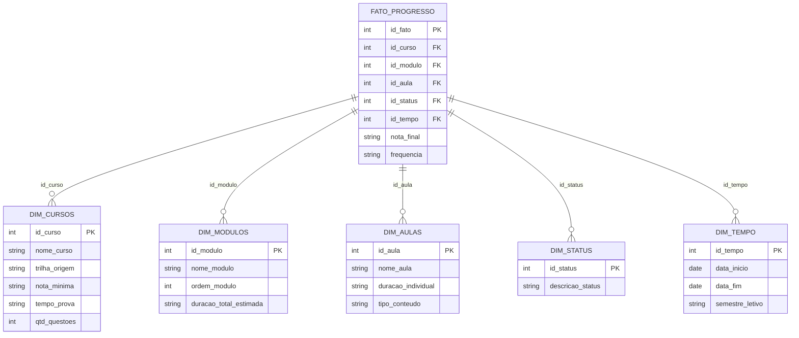

Para englobar todos os dados das trilhas de "Análise de Dados", "Cientista de Dados" e "Inglês", a estrutura ideal é um **Esquema Estrela (Star Schema)**. Neste modelo, centralizamos os eventos mensuráveis (como o progresso do aluno) em uma tabela de fatos, conectada a dimensões que descrevem o contexto desses dados.

Abaixo está o diagrama ER em formato **Mermaid**:

### Detalhamento dos Componentes (Baseado nas Fontes)

1.  **Tabela de Fatos (`FATO_PROGRESSO`):**
    *   Esta tabela centraliza a execução do estudo. Ela permite cruzar, por exemplo, qual a nota mínima exigida para o curso com o status atual da aula específica.

2.  **Dimensão Cursos (`DIM_CURSOS`):**
    *   Contém atributos de alto nível, como a **Nota Mínima** (ex: 50% ou 70% na trilha de Gestão) e o **Tempo de Prova** (ex: 30 min ou 20 min).
    *   Diferencia as trilhas: "Análise de Dados", "Cientista de Dados" ou "Inglês Online".

3.  **Dimensão Módulos (`DIM_MODULOS`):**
    *   Armazena o nome e a ordem dos módulos. Para a trilha de Inglês, inclui a **Duração Total** (ex: Módulo 1 com 06h:45m).
    *   Relaciona módulos específicos como "Introdução ao Python" ou "Excel Intermediário".

4.  **Dimensão Aulas (`DIM_AULAS`):**
    *   Contém o detalhamento das 225 aulas de Inglês (com durações individuais como 00h:43m para "Introdução e Names").
    *   Inclui tópicos de TI como "Web Scrapping" ou "Cibersegurança".

5.  **Dimensão Status (`DIM_STATUS`):**
    *   Padroniza os diversos estados encontrados nas fontes: **Aprovado**, **Em andamento**, **Aguardando início**, **Concluído** e **Indisponível**.

6.  **Dimensão Tempo (`DIM_TEMPO`):**
    *   Embora muitas datas constem como **N/D** nas fontes, esta dimensão é essencial para registrar quando houver o preenchimento da **Data de Início** e **Data de Fim**.

**Metáfora:** Imagine que a **Tabela de Fatos** é o "Diário de Classe" onde se registra o que aconteceu. As **Dimensões** são os "Livros da Biblioteca" que você consulta para saber os detalhes do que é aquele curso, quem é o professor ou quanto tempo a aula deveria durar. Sem o diário, os livros são apenas teoria; sem os livros, o diário é apenas um monte de códigos sem sentido.