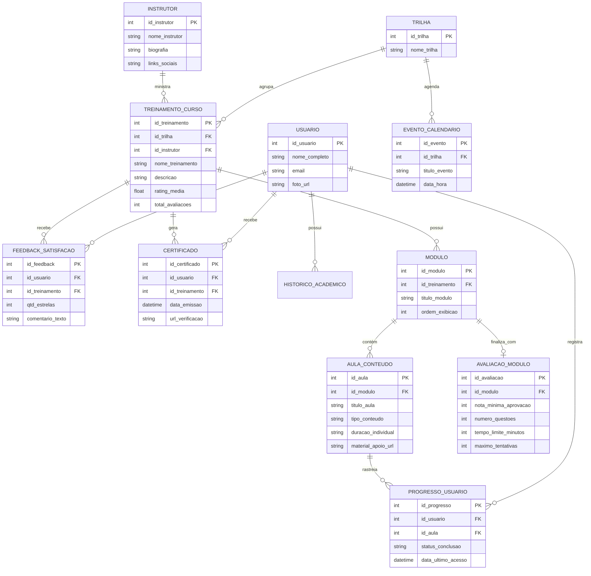

```mermaid
erDiagram
    USUARIO ||--o{ PROGRESSO_USUARIO : "registra"
    USUARIO ||--o{ FEEDBACK_SATISFACAO : "fornece"
    USUARIO ||--o{ CERTIFICADO : "recebe"
    USUARIO ||--o{ HISTORICO_ACADEMICO : "possui"

    TRILHA ||--o{ TREINAMENTO_CURSO : "agrupa"
    TRILHA ||--o{ EVENTO_CALENDARIO : "agenda"

    INSTRUTOR ||--o{ TREINAMENTO_CURSO : "ministra"

    TREINAMENTO_CURSO ||--o{ MODULO : "possui"
    TREINAMENTO_CURSO ||--o{ CERTIFICADO : "gera"
    TREINAMENTO_CURSO ||--o{ FEEDBACK_SATISFACAO : "recebe"

    MODULO ||--o{ AULA_CONTEUDO : "contém"
    MODULO ||--o| AVALIACAO_MODULO : "finaliza_com"

    AULA_CONTEUDO ||--o{ PROGRESSO_USUARIO : "rastreia"

    USUARIO {
        int id_usuario PK
        string nome_completo
        string email
        string foto_url
    }

    TRILHA {
        int id_trilha PK
        string nome_trilha
    }

    TREINAMENTO_CURSO {
        int id_treinamento PK
        int id_trilha FK
        int id_instrutor FK
        string nome_treinamento
        string descricao
        float rating_media
        int total_avaliacoes
    }

    MODULO {
        int id_modulo PK
        int id_treinamento FK
        string titulo_modulo
        int ordem_exibicao
    }

    AULA_CONTEUDO {
        int id_aula PK
        int id_modulo FK
        string titulo_aula
        string tipo_conteudo
        string duracao_individual
        string material_apoio_url
    }

    INSTRUTOR {
        int id_instrutor PK
        string nome_instrutor
        string biografia
        string links_sociais
    }

    AVALIACAO_MODULO {
        int id_avaliacao PK
        int id_modulo FK
        int nota_minima_aprovacao
        int numero_questoes
        int tempo_limite_minutos
        int maximo_tentativas
    }

    PROGRESSO_USUARIO {
        int id_progresso PK
        int id_usuario FK
        int id_aula FK
        string status_conclusao
        datetime data_ultimo_acesso
    }

    CERTIFICADO {
        int id_certificado PK
        int id_usuario FK
        int id_treinamento FK
        datetime data_emissao
        string url_verificacao
    }

    FEEDBACK_SATISFACAO {
        int id_feedback PK
        int id_usuario FK
        int id_treinamento FK
        int qtd_estrelas
        string comentario_texto
    }

    EVENTO_CALENDARIO {
        int id_evento PK
        int id_trilha FK
        string titulo_evento
        datetime data_hora
    }
```