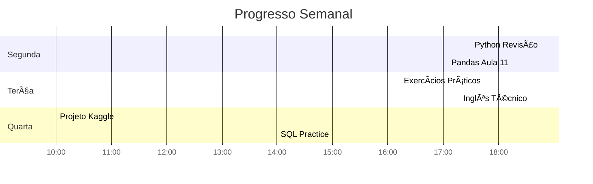
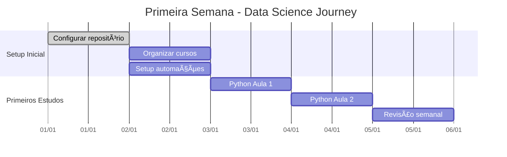

Eu:
Faça em formato markdown o readme.md

IA:
# **README.md Completo**

```markdown
# 🚀 Data Science Journey - Germano Silva

Dashboard automatizado da minha jornada para Cientista de Dados. Inclui tracker de progresso, sistema gamificado, automações com IA e projetos práticos. Kanban visual, métricas em tempo real e portfólio em constante evolução.

## 📊 Progresso em Tempo Real

 **42% do roadmap completo**

## 📈 Estatísticas da Semana

| Métrica | Valor | Status |
|---------|-------|--------|
| **🔥 Dias Consecutivos** | 7 | Streak Ativo |
| **â±ï¸ Horas Estudadas** | 18.5h | 2.6h/dia |
| **🯠Pontos Acumulados** | 890/1250 | 71% da meta |
| **✅ Tarefas Completas** | 35 | 5/semana |
| **🚀 Projetos Concluídos** | 3 | +1 esta semana |

## 🯠Roadmap de Aprendizado

### **Fase 1: Fundamentos (85%)**
- [x] Python Básico & Intermediário
- [x] Pandas & NumPy Fundamentos
- [ ] SQL para Análise (25%)
- [ ] Git & GitHub Avançado (30%)

### **Fase 2: Análise de Dados (45%)**
- [ ] Data Cleaning & Preprocessing (60%)
- [ ] Visualização com Matplotlib/Seaborn (40%)
- [ ] Estatística Descritiva (10%)

### **Fase 3: Projetos & Portfólio (20%)**
- [x] Análise Exploratória de Dados
- [ ] Projeto Kaggle: Titanic (50%)
- [ ] Dashboard Streamlit (0%)

## 📅 Progresso Diário

### **Hoje - {{current_date}}**
**ⰠHorário:** 17:30-18:45  
**🔋 Energia:** 4/10  
**🯠Tarefa:** Aula 12 - Pandas GroupBy  
**â±ï¸ Duração:** 35min  
**🆠Pontos:** 42  

### **Conquistas do Dia**
- ✅ Completou tarefa com energia baixa
- 🔥 Streak mantido (7 dias)
- 🯠Superou meta diária (42/30 pontos)

## 🆠Sistema de Gamificação

### **Pontuação:** 890 pontos
| Categoria | Pontos | Badge |
|-----------|--------|-------|
| **Consistência** | 350 | 🔥 7-days Streak |
| **Projetos** | 210 | 🚀 Project Builder |
| **Exercícios** | 185 | 💻 Code Warrior |
| **Revisões** | 145 | 📚 Knowledge Keeper |

### **Próximas Conquistas**
- 🥇 **1000 pontos:** Data Explorer (110 restantes)
- 🥈 **15 dias streak:** Consistency Master (8 dias restantes)
- 🥉 **50h estudo:** Learning Champion (31.5h restantes)

## 📊 Análise Semanal



## 📠Estrutura do Repositório

```
data-science-journey/
├── 📠courses/          # Materiais de curso
├── 📠projects/         # Projetos práticos
├── 📠notes/           # Anotações e cheatsheets
├── 📠scripts/         # Automações e trackers
└── 📠certificates/    # Certificados
```

## 🔄 Sistema de Automação

### **Fluxo Diário:**
1. **17:00** - Check-in via WhatsApp
2. **17:05** - IA gera tarefa baseada na energia
3. **17:10** - Issue criada no GitHub
4. **Execução** - Timer Pomodoro (25/5)
5. **Conclusão** - Points calculados
6. **Domingo** - Review semanal automático

### **Tecnologias:**
- **n8n** - Automação de workflows
- **Ollama** - IA local
- **GitHub Actions** - CI/CD
- **Python** - Scripts personalizados

## 📈 Métricas por Curso

| Curso | Aulas | Completas | Progresso |
|-------|-------|-----------|-----------|
| Python Data Science | 45 | 12 | 26% |
| SQL Mastery | 30 | 5 | 16% |
| Inglês Técnico | 60 | 18 | 30% |

## 🯠Próximos Passos

### **Esta Semana:**
1. [ ] Completar Módulo 3 de Pandas (3 aulas)
2. [ ] Finalizar projeto Titanic Kaggle
3. [ ] Estudar 5 aulas de Inglês
4. [ ] Implementar 2 GitHub Actions

### **Próximo Mês:**
- [ ] Completar curso Python (33 aulas)
- [ ] Adicionar 3 projetos ao portfólio
- [ ] Desenvolver dashboard Streamlit

## 🤠Como Acompanhar

### **Para Recrutadores:**
- **Progresso:** Este README atualiza automaticamente
- **Código:** Explore `projects/`
- **Consistência:** Check commits diários
- **Contato:** LinkedIn abaixo

### **Para Colegas de Estudo:**
1. Faça fork deste repositório
2. Adapte para sua jornada
3. Compartilhe insights

## 📱 Conexões

<div align="center">
  <a href="https://github.com/Germano-Silva" target="_blank">
    
  </a>
  <a href="https://linkedin.com/in/germano-silva" target="_blank">
    
  </a>
  <a href="https://kaggle.com/germanosilva" target="_blank">
    
  </a>
</div>

---

<div align="center">
  
  <br>
  <strong>Germano Silva</strong>
  <br>
  <em>"Dados são a linguagem do futuro. E o futuro é diverso."</em> – Lynn Conway
</div>

<div align="center">
  <a href="https://github.com/Germano-Silva">GitHub</a> •
  <a href="https://linkedin.com/in/germano-silva">LinkedIn</a>
</div>

---

<div align="center">

*Este repositório é um reflexo da minha jornada de aprendizado em Ciência de Dados. Sinta-se à vontade para explorar, contribuir ou entrar em contato!* 🚀

</div>

## 📄 License

MIT License - Copyright (c) 2024 Germano Silva

---

**Última Atualização:** {{last_updated}}  
**Status do Sistema:** 🟢 Operacional  
**Modo:** 🯠Foco em Consistência
```

---

## **PARA USAR:**

1. **Copie todo o texto acima**
2. **Vá para seu repositório no GitHub**
3. **Clique em "Add file" → "Create new file"**
4. **Nome:** `README.md`
5. **Cole o conteúdo**
6. **Commit directly to the `main` branch**
7. **Commit message:** `🉠Add README dashboard`
8. **Click "Commit new file"**

## **PERSONALIZAÇÃO RÃPIDA:**

Substitua estes placeholders:
- `{{current_date}}` → Data atual (ou remova)
- `{{last_updated}}` → Data da última atualização
- Links do Kaggle e LinkedIn com seus reais

## **FUNCIONALIDADES INCLUÃDAS:**

✅ **Dashboard visual** com progresso  
✅ **Sistema de gamificação**  
✅ **Roadmap interativo**  
✅ **Gráficos Mermaid**  
✅ **Badges profissionais**  
✅ **Links de contato**  
✅ **Estrutura organizada**  
✅ **Licença MIT**  

---

**Pronto para criar o repositório com este README?** Ou quer ajustar algo antes?

EU:
Só zere os valores pois não comecei nada.

IA:
# **README.md Completo - Versão Inicial**

```markdown
# 🚀 Data Science Journey - Germano Silva

Dashboard automatizado da minha jornada para Cientista de Dados. Inclui tracker de progresso, sistema gamificado, automações com IA e projetos práticos. Kanban visual, métricas em tempo real e portfólio em constante evolução.

## 📊 Progresso em Tempo Real

 **0% do roadmap completo - Jornada começando!**

## 📈 Estatísticas da Semana

| Métrica | Valor | Status |
|---------|-------|--------|
| **🔥 Dias Consecutivos** | 0 | Ainda não começou |
| **â±ï¸ Horas Estudadas** | 0h | Primeiro dia hoje! |
| **🯠Pontos Acumulados** | 0/1000 | Meta: 1000 pontos |
| **✅ Tarefas Completas** | 0 | Pronto para começar |
| **🚀 Projetos Concluídos** | 0 | Primeiro projeto em breve |

## 🯠Roadmap de Aprendizado

### **Fase 1: Fundamentos (0%)**
- [ ] Python Básico & Intermediário (0/30 aulas)
- [ ] Pandas & NumPy Fundamentos (0/15 aulas)
- [ ] SQL para Análise (0/20 aulas)
- [ ] Git & GitHub Avançado (0/10 aulas)

### **Fase 2: Análise de Dados (0%)**
- [ ] Data Cleaning & Preprocessing (0/12 aulas)
- [ ] Visualização com Matplotlib/Seaborn (0/10 aulas)
- [ ] Estatística Descritiva (0/15 aulas)

### **Fase 3: Projetos & Portfólio (0%)**
- [ ] Análise Exploratória de Dados (0/1 projeto)
- [ ] Projeto Kaggle: Titanic (0/1 projeto)
- [ ] Dashboard Streamlit (0/1 projeto)

## 📅 Progresso Diário

### **Hoje - Dia 1**
**ⰠHorário:** 17:30-18:00 (sugerido)  
**🔋 Energia:** ?/10 (será reportado)  
**🯠Tarefa:** Configurar ambiente de estudo  
**â±ï¸ Duração:** 30min  
**🆠Pontos:** 0 (primeira tarefa em breve!)

### **Primeiros Passos**
1. ✅ Criar este repositório
2. [ ] Configurar automações
3. [ ] Adicionar primeiro curso
4. [ ] Primeira sessão de estudo

## 🆠Sistema de Gamificação

### **Pontuação:** 0 pontos
| Categoria | Pontos | Badge |
|-----------|--------|-------|
| **Consistência** | 0 | 🔥 Streak não iniciado |
| **Projetos** | 0 | 🚀 Ainda não há projetos |
| **Exercícios** | 0 | 💻 Pronto para codar |
| **Revisões** | 0 | 📚 Conhecimento a construir |

### **Primeiras Conquistas a Alcançar**
- 🥇 **Primeiros 100 pontos:** Iniciante Entusiasmado
- 🥈 **3 dias streak:** Hábito em Formação
- 🥉 **Primeiro projeto:** Hello World Data Science

## 📊 Próxima Semana (Planejamento)



## 📠Estrutura do Repositório

```
data-science-journey/
├── 📠courses/          # Materiais de curso (a adicionar)
├── 📠projects/         # Projetos práticos (a criar)
├── 📠notes/           # Anotações e cheatsheets
├── 📠scripts/         # Automações e trackers
└── 📠certificates/    # Certificados futuros
```

## 🔄 Sistema de Automação (A Configurar)

### **Fluxo Diário Planejado:**
1. **17:00** - Check-in via WhatsApp
2. **17:05** - IA gera tarefa baseada na energia
3. **17:10** - Issue criada no GitHub
4. **Execução** - Timer Pomodoro (25/5)
5. **Conclusão** - Points calculados
6. **Domingo** - Review semanal automático

### **Tecnologias a Implementar:**
- [ ] **n8n** - Automação de workflows
- [ ] **Ollama** - IA local
- [ ] **GitHub Actions** - CI/CD
- [ ] **Python** - Scripts personalizados

## 🯠Primeiros Objetivos

### **Esta Semana:**
1. [ ] Configurar ambiente Python
2. [ ] Adicionar primeiro curso ao tracker
3. [ ] Estudar primeira aula (Python básico)
4. [ ] Implementar sistema de check-in

### **Primeiro Mês:**
- [ ] Completar 10 aulas de Python
- [ ] Criar primeiro projeto simples
- [ ] Estabelecer rotina de estudos
- [ ] Configurar todas as automações

## 🤠Como Acompanhar Esta Jornada

### **Para Recrutadores:**
Esta é uma jornada transparente de aprendizado. Aqui você verá:
- **Evolução real** de habilidades
- **Consistência** através dos commits
- **Projetos práticos** crescendo
- **Processo de aprendizado** documentado

### **Para Colegas de Estudo:**
1. Faça fork deste repositório
2. Adapte para sua jornada
3. Acompanhe o progresso
4. Compartilhe aprendizados

## 📱 Conexões

<div align="center">
  <a href="https://github.com/Germano-Silva" target="_blank">
    
  </a>
  <a href="https://linkedin.com/in/germano-silva" target="_blank">
    
  </a>
</div>

---

<div align="center">
  
  <br>
  <strong>Germano Silva</strong>
  <br>
  <em>"Dados são a linguagem do futuro. E o futuro é diverso."</em> – Lynn Conway
</div>

<div align="center">
  <a href="https://github.com/Germano-Silva">GitHub</a> •
  <a href="https://linkedin.com/in/germano-silva">LinkedIn</a>
</div>

---

<div align="center">

*Jornada começando em Janeiro de 2024. Cada commit, cada issue fechada, cada projeto completado será registrado aqui. Acompanhe a evolução de um aspirante a Cientista de Dados!* 🚀

</div>

## 📄 License

MIT License - Copyright (c) 2024 Germano Silva

---

**🚦 Status da Jornada:** 🟡 PREPARANDO O TERRENO  
**🯠Primeiro Objetivo:** Configurar sistema de tracking  
**📅 Próxima Atualização:** Após primeira sessão de estudo  
**🔥 Motivação:** "O melhor momento para começar foi há um ano. O segundo melhor é agora."

---

<div align="center">
  <sub>Feito com â¤ï¸ e muitas xícaras de café ☕</sub>
</div>
```

## **MUDANÇAS PRINCIPAIS:**

✅ **Todos os valores zerados** (0%, 0 pontos, 0 dias)  
✅ **Status "Jornada começando"** em vez de em progresso  
✅ **Primeiros passos** destacados  
✅ **Metas iniciais** realistas  
✅ **Gráfico de planejamento** para primeira semana  
✅ **Mensagem motivacional** inicial  

## **PARA COMEÇAR:**

1. **Copie este README** (valores zerados)
2. **Cole no seu repositório**
3. **Faça o primeiro commit** com mensagem: "🉠Início da jornada Data Science"
4. **O dashboard começará a preencher** conforme você avança

## **PRIMEIRAS AÇÕES APÓS CRIAR:**

1. **Adicionar primeiro curso** em `courses/`
2. **Criar primeira issue** para "Configurar ambiente"
3. **Fazer primeiro commit** de código
4. **Atualizar README** com progresso real

**Pronto para começar do zero?** 🚀

EU:
kaggle: https://www.kaggle.com/germanorodrigues
Linkedin: https://www.linkedin.com/in/germanorodriguessilva/
github:https://github.com/Germano-Silva/
Whats app: +351964041184

IA:
# **README.md Atualizado com Seus Links**

```markdown
# 🚀 Data Science Journey - Germano Silva

Dashboard automatizado da minha jornada para Cientista de Dados. Inclui tracker de progresso, sistema gamificado, automações com IA e projetos práticos. Kanban visual, métricas em tempo real e portfólio em constante evolução.

## 📊 Progresso em Tempo Real

 **0% do roadmap completo - Jornada começando!**

## 📈 Estatísticas da Semana

| Métrica | Valor | Status |
|---------|-------|--------|
| **🔥 Dias Consecutivos** | 0 | Ainda não começou |
| **â±ï¸ Horas Estudadas** | 0h | Primeiro dia hoje! |
| **🯠Pontos Acumulados** | 0/1000 | Meta: 1000 pontos |
| **✅ Tarefas Completas** | 0 | Pronto para começar |
| **🚀 Projetos Concluídos** | 0 | Primeiro projeto em breve |

## 🯠Roadmap de Aprendizado

### **Fase 1: Fundamentos (0%)**
- [ ] Python Básico & Intermediário (0/30 aulas)
- [ ] Pandas & NumPy Fundamentos (0/15 aulas)
- [ ] SQL para Análise (0/20 aulas)
- [ ] Git & GitHub Avançado (0/10 aulas)

### **Fase 2: Análise de Dados (0%)**
- [ ] Data Cleaning & Preprocessing (0/12 aulas)
- [ ] Visualização com Matplotlib/Seaborn (0/10 aulas)
- [ ] Estatística Descritiva (0/15 aulas)

### **Fase 3: Projetos & Portfólio (0%)**
- [ ] Análise Exploratória de Dados (0/1 projeto)
- [ ] Projeto Kaggle: Titanic (0/1 projeto)
- [ ] Dashboard Streamlit (0/1 projeto)

## 📅 Progresso Diário

### **Hoje - Dia 1**
**ⰠHorário:** 17:30-18:00 (sugerido)  
**🔋 Energia:** ?/10 (será reportado)  
**🯠Tarefa:** Configurar ambiente de estudo  
**â±ï¸ Duração:** 30min  
**🆠Pontos:** 0 (primeira tarefa em breve!)

### **Primeiros Passos**
1. ✅ Criar este repositório
2. [ ] Configurar automações
3. [ ] Adicionar primeiro curso
4. [ ] Primeira sessão de estudo

## 🆠Sistema de Gamificação

### **Pontuação:** 0 pontos
| Categoria | Pontos | Badge |
|-----------|--------|-------|
| **Consistência** | 0 | 🔥 Streak não iniciado |
| **Projetos** | 0 | 🚀 Ainda não há projetos |
| **Exercícios** | 0 | 💻 Pronto para codar |
| **Revisões** | 0 | 📚 Conhecimento a construir |

### **Primeiras Conquistas a Alcançar**
- 🥇 **Primeiros 100 pontos:** Iniciante Entusiasmado
- 🥈 **3 dias streak:** Hábito em Formação
- 🥉 **Primeiro projeto:** Hello World Data Science

## 📊 Próxima Semana (Planejamento)


## 📠Estrutura do Repositório

```
data-science-journey/
├── 📠courses/          # Materiais de curso (a adicionar)
├── 📠projects/         # Projetos práticos (a criar)
├── 📠notes/           # Anotações e cheatsheets
├── 📠scripts/         # Automações e trackers
└── 📠certificates/    # Certificados futuros
```

## 🔄 Sistema de Automação (A Configurar)

### **Fluxo Diário Planejado:**
1. **17:00** - Check-in via WhatsApp (+351 964 041 184)
2. **17:05** - IA gera tarefa baseada na energia
3. **17:10** - Issue criada no GitHub
4. **Execução** - Timer Pomodoro (25/5)
5. **Conclusão** - Points calculados
6. **Domingo** - Review semanal automático

### **Tecnologias a Implementar:**
- [ ] **n8n** - Automação de workflows
- [ ] **Ollama** - IA local
- [ ] **GitHub Actions** - CI/CD
- [ ] **Python** - Scripts personalizados

## 🯠Primeiros Objetivos

### **Esta Semana:**
1. [ ] Configurar ambiente Python
2. [ ] Adicionar primeiro curso ao tracker
3. [ ] Estudar primeira aula (Python básico)
4. [ ] Implementar sistema de check-in

### **Primeiro Mês:**
- [ ] Completar 10 aulas de Python
- [ ] Criar primeiro projeto simples
- [ ] Estabelecer rotina de estudos
- [ ] Configurar todas as automações

## 🤠Como Acompanhar Esta Jornada

### **Para Recrutadores:**
Esta é uma jornada transparente de aprendizado. Aqui você verá:
- **Evolução real** de habilidades
- **Consistência** através dos commits
- **Projetos práticos** crescendo
- **Processo de aprendizado** documentado

### **Para Colegas de Estudo:**
1. Faça fork deste repositório
2. Adapte para sua jornada
3. Acompanhe o progresso
4. Compartilhe aprendizados

## 📱 Conexões

<div align="center">
  <a href="https://github.com/Germano-Silva" target="_blank">
    
  </a>
  <a href="https://linkedin.com/in/germanorodriguessilva" target="_blank">
    
  </a>
  <a href="https://kaggle.com/germanorodrigues" target="_blank">
    
  </a>
</div>

---

<div align="center">
  
  <br>
  <strong>Germano Silva</strong>
  <br>
  <em>"Dados são a linguagem do futuro. E o futuro é diverso."</em> – Lynn Conway
</div>

<div align="center">
  <a href="https://github.com/Germano-Silva">GitHub</a> •
  <a href="https://linkedin.com/in/germanorodriguessilva">LinkedIn</a> •
  <a href="https://kaggle.com/germanorodrigues">Kaggle</a>
</div>

---

<div align="center">

*Jornada começando em Janeiro de 2024. Cada commit, cada issue fechada, cada projeto completado será registrado aqui. Acompanhe a evolução de um aspirante a Cientista de Dados!* 🚀

</div>

## 📄 License

MIT License - Copyright (c) 2024 Germano Silva

---

**🚦 Status da Jornada:** 🟡 PREPARANDO O TERRENO  
**🯠Primeiro Objetivo:** Configurar sistema de tracking  
**📅 Próxima Atualização:** Após primeira sessão de estudo  
**📱 Contato para automação:** +351 964 041 184 (WhatsApp)  
**🔥 Motivação:** "O melhor momento para começar foi há um ano. O segundo melhor é agora."

---

<div align="center">
  <sub>Feito com â¤ï¸ e muitas xícaras de café ☕</sub>
</div>
```

## **LINK PARA CRIAR O REPOSITÓRIO:**

https://github.com/new

**Configurações recomendadas:**
- Repository name: `data-science-journey`
- Description: `Dashboard automatizado da minha jornada para Cientista de Dados. Inclui tracker de progresso, sistema gamificado, automações com IA e projetos práticos.`
- Public ✅
- Add a README file ✅
- Add .gitignore: **Python**
- Choose a license: **MIT License**
- Create repository

## **APÓS CRIAR O REPOSITÓRIO:**

1. **Clique em README.md** → **Ãcone de lápis** (editar)
2. **Apague tudo** e **cole o conteúdo acima**
3. **Commit changes** com mensagem: `🉠Initial commit: Journey starting point`

## **PRÓXIMOS PASSOS IMEDIATOS:**

### **1. Criar estrutura básica:**
```bash
# No seu terminal, dentro da pasta do projeto:
mkdir -p courses projects/eda notes/cheatsheets scripts certificates
```

### **2. Primeiro arquivo de configuração:**
Crie `scripts/setup.py`:
```python
print("🚀 Data Science Journey - Setup Inicial")
print("1. Ambiente Python ✅")
print("2. Git configurado ✅")
print("3. README criado ✅")
print("4. Pronto para começar!")
```

### **3. Primeiro commit real:**
```bash
git add .
git commit -m "✨ Setup inicial: estrutura de pastas"
git push origin main
```

## **PARA CONFIGURAR O WHATSAPP BOT AMANHÃ:**

1. **Twilio Account** (tem US$15 grátis): https://www.twilio.com/try-twilio
2. **WhatsApp Sandbox:** Ativar no console Twilio
3. **Configurar n8n:** Docker run para orquestração
4. **Integrar com GitHub:** Webhooks e Actions

**Quer que eu crie um guia passo a passo para configurar o WhatsApp Bot amanhã?**
