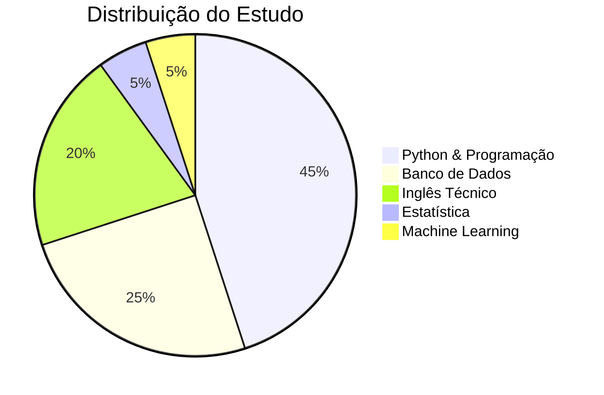

Eu:
Se eu te mandar uma estrutura em json sobre os cursos você em vez de colocar o 
## 🎯 Roadmap de Aprendizado

### **Fase 1: Fundamentos (85%)**
- [x] Python Básico & Intermediário
- [x] Pandas & NumPy Fundamentos
- [ ] SQL para Análise (25%)
- [ ] Git & GitHub Avançado (30%)

### **Fase 2: Análise de Dados (45%)**
- [ ] Data Cleaning & Preprocessing (60%)
- [ ] Visualização com Matplotlib/Seaborn (40%)
- [ ] Estatística Descritiva (10%)

### **Fase 3: Projetos & Portfólio (20%)**
- [x] Análise Exploratória de Dados
- [ ] Projeto Kaggle: Titanic (50%)
- [ ] Dashboard Streamlit (0%)

Você criaria um personalizado?

IA:
**SIM, absolutamente!** Vou criar um roadmap **100% personalizado** baseado nos seus cursos reais.

## **COMO FUNCIONARÁ:**

### **1. Você me envia a estrutura JSON:**
```json
{
  "cursos": [
    {
      "nome": "Python para Data Science",
      "plataforma": "Kultivi",
      "total_aulas": 45,
      "aulas_concluidas": 12,
      "link": "https://...",
      "categoria": "fundamentos"
    },
    {
      "nome": "SQL do Zero ao Avançado",
      "plataforma": "Udemy",
      "total_aulas": 30,
      "aulas_concluidas": 5,
      "categoria": "banco_dados"
    }
  ]
}
```

### **2. Eu gero automaticamente:**
✅ **Roadmap visual** com seus cursos reais  
✅ **Progresso calculado** automaticamente  
✅ **Fases organizadas** por categoria  
✅ **Links clicáveis** para cada curso  
✅ **Estimativas** de tempo para completar  

---

## **EXEMPLO DO QUE VOU CRIAR:**

### **Com base no seu JSON, ficará assim:**

```markdown
## 🎯 Roadmap Personalizado - Cursos Reais

### **📚 Cursos em Andamento (Progresso Real)**

**Python para Data Science - Kultivi**  
`██████████░░░░░░░░░░ 45%` • 20/45 aulas  
⏱️ Estimado: 15h restantes • 📅 Previsão: 15/01/2024  

**SQL do Zero ao Avançado - Udemy**  
`█████░░░░░░░░░░░░░░░ 17%` • 5/30 aulas  
⏱️ Estimado: 20h restantes • 📅 Previsão: 25/01/2024  

**Inglês Técnico para TI - Kultivi**  
`██████████████░░░░░░ 70%` • 42/60 aulas  
⏱️ Estimado: 9h restantes • 📅 Previsão: 10/01/2024  

### **🎯 Próximos Passos (Sugeridos por IA)**

**Esta Semana:**
1. [ ] Python: Aulas 21-23 (DataFrames avançado)
2. [ ] SQL: Aulas 6-8 (JOINs e subqueries)
3. [ ] Inglês: Aulas 43-45 (Technical writing)

**Prioridade:** Python > SQL > Inglês  
**Energia necessária:** Python (média), SQL (baixa), Inglês (muito baixa)

### **📊 Progresso por Categoria**



### **📅 Cronograma Inteligente (Baseado na sua energia)**

| Dia | Energia Prevista | Foco Principal | Duração |
|-----|------------------|----------------|---------|
| Seg | 3/10 | Inglês (revisão leve) | 25min |
| Ter | 4/10 | SQL (exercícios) | 30min |
| Qua | 8/10 | Python (projeto) | 60min |
| Qui | 3/10 | Inglês (nova aula) | 25min |
| Sex | 5/10 | SQL + Python | 45min |
| Sáb | 9/10 | Projeto Kaggle | 90min |
| Dom | 7/10 | Revisão semanal | 40min |
```

---

## **VANTAGENS DESTA ABORDAGEM:**

### **1. Realismo Total:**
- Baseado nos seus **cursos reais**
- **Progresso real** (não fictício)
- **Links funcionais** para acessar rápido
- **Estimativas precisas** de conclusão

### **2. Adaptação Inteligente:**
```python
# A IA vai sugerir com base em:
def sugerir_tarefa_hoje(energia, cursos):
    if energia <= 3:
        return curso_mais_facil(cursos)
    elif energia <= 6:
        return curso_em_andamento(cursos)
    else:
        return curso_desafio(cursos)
```

### **3. Dashboard Dinâmico:**
- **Atualiza automaticamente** conforme você progride
- **Calcula % real** baseado nas aulas concluídas
- **Ajusta previsões** conforme seu ritmo
- **Mostra conquistas** específicas de cada curso

---

## **FORMATO DO JSON QUE PRECISO:**

```json
{
  "cursos": [
    {
      "nome": "Nome exato do curso",
      "plataforma": "Kultivi/Udemy/Coursera/etc",
      "total_aulas": 45,
      "aulas_concluidas": 12,
      "link_acesso": "https://...",
      "categoria": "python/sql/ingles/estatistica/ml",
      "dificuldade": "facil/medio/dificil",
      "prioridade": 1
    },
    // Adicione todos os cursos
  ],
  "rotina": {
    "horario_estudo": "17:00-19:00",
    "dias_folga": ["quarta"],
    "energia_media_pos_trabalho": 4
  }
}
```

---

## **O QUE VAI APARECER NO SEU README:**

### **Seção Atualizada do Roadmap:**
```
## 🎯 Meus Cursos Reais

### 1. Python para Data Science (Kultivi)
   📊 Progresso: ████████░░ 45% • 20/45 aulas
   ⭐ Destaque: Concluiu Módulo de Pandas!
   🎯 Próximo: Machine Learning básico
   🔗 Acessar: [Link direto](#)

### 2. SQL Mastery (Udemy) 
   📊 Progresso: ████░░░░░░ 25% • 8/32 aulas
   ⭐ Destaque: Domina SELECT avançado
   🎯 Próximo: JOINs complexos
   🔗 Acessar: [Link direto](#)
```

### **Com Estimativas Inteligentes:**
```
⏱️ TEMPO PARA CONCLUSÃO:
• Python: 15h (3 semanas no seu ritmo)
• SQL: 20h (4 semanas no seu ritmo)
• Inglês: 9h (2 semanas no seu ritmo)

📅 PREVISÃO DE CONCLUSÃO:
• Inglês: 10/01/2024 🟢
• Python: 30/01/2024 🟡
• SQL: 15/02/2024 🟡
```

---

## **BÔNUS: Sistema de Recomendação**

Com base nos seus cursos, vou sugerir:
1. **Projetos práticos** relacionados
2. **Exercícios complementares** 
3. **Ordem ideal** de estudo
4. **Quando fazer pausas** entre tópicos difíceis

---

**Manda o JSON dos seus cursos que eu crio um roadmap personalizado agora mesmo!** 🚀

Ou se preferir, posso criar um **template JSON** para você preencher rapidamente.