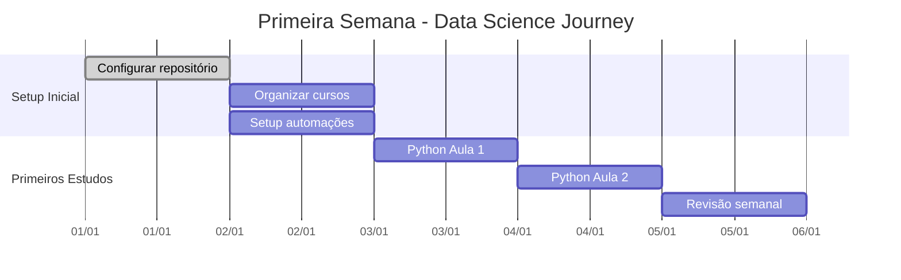

Eu:
Neste caso então retire e deixe para atualizar quando o:
## 🎯 Roadmap de Aprendizado

### **Fase 1: Fundamentos (85%)**
- [x] Python Básico & Intermediário
- [x] Pandas & NumPy Fundamentos
- [ ] SQL para Análise (25%)
- [ ] Git & GitHub Avançado (30%)

### **Fase 2: Análise de Dados (45%)**
- [ ] Data Cleaning & Preprocessing (60%)
- [ ] Visualização com Matplotlib/Seaborn (40%)
- [ ] Estatística Descritiva (10%)

### **Fase 3: Projetos & Portfólio (20%)**
- [x] Análise Exploratória de Dados
- [ ] Projeto Kaggle: Titanic (50%)
- [ ] Dashboard Streamlit (0%)

Quando tiver o rondmap atalizado para os meus cursos em especifico.

IA:
# **README.md Atualizado - Versão Final para Criar Agora**

```markdown
# 🚀 Data Science Journey - Germano Silva

Dashboard automatizado da minha jornada para Cientista de Dados. Inclui tracker de progresso, sistema gamificado, automações com IA e projetos práticos. Kanban visual, métricas em tempo real e portfólio em constante evolução.

## 📊 Progresso em Tempo Real

 **0% do roadmap completo - Jornada começando!**

## 📈 Estatísticas da Semana

| Métrica | Valor | Status |
|---------|-------|--------|
| **🔥 Dias Consecutivos** | 0 | Ainda não começou |
| **⏱️ Horas Estudadas** | 0h | Primeiro dia hoje! |
| **🎯 Pontos Acumulados** | 0/1000 | Meta: 1000 pontos |
| **✅ Tarefas Completas** | 0 | Pronto para começar |
| **🚀 Projetos Concluídos** | 0 | Primeiro projeto em breve |

## 🎯 Roadmap de Aprendizado

🚧 **Roadmap sendo personalizado...** 🚧

*Estou mapeando meus cursos reais para criar um plano de estudos 100% personalizado. Em breve, esta seção mostrará:*

### 📚 **Meus Cursos em Andamento**
- *Python para Data Science - Kultivi*
- *Análise de Dados - Curso Técnico*
- *Inglês Técnico - Kultivi*

### 🗓️ **Cronograma Inteligente**
- *Sugestões baseadas na minha energia pós-trabalho*
- *Prazos realistas para cada curso*
- *Integração com minha rotina de atendente*

### 📊 **Progresso por Competência**
- *Python & Programação*
- *Banco de Dados & SQL*
- *Análise Estatística*
- *Visualização de Dados*

**🔄 Atualização prevista:** Assim que configurar o sistema de automação, o roadmap será gerado automaticamente com base nos meus cursos reais.

## 📅 Progresso Diário

### **Hoje - Dia 1**
**⏰ Horário:** 17:30-18:00 (sugerido)  
**🔋 Energia:** ?/10 (será reportado)  
**🎯 Tarefa:** Configurar ambiente de estudo  
**⏱️ Duração:** 30min  
**🏆 Pontos:** 0 (primeira tarefa em breve!)

### **Primeiros Passos**
1. ✅ Criar este repositório
2. [ ] Configurar automações
3. [ ] Adicionar primeiro curso
4. [ ] Primeira sessão de estudo

## 🏆 Sistema de Gamificação

### **Pontuação:** 0 pontos
| Categoria | Pontos | Badge |
|-----------|--------|-------|
| **Consistência** | 0 | 🔥 Streak não iniciado |
| **Projetos** | 0 | 🚀 Ainda não há projetos |
| **Exercícios** | 0 | 💻 Pronto para codar |
| **Revisões** | 0 | 📚 Conhecimento a construir |

### **Primeiras Conquistas a Alcançar**
- 🥇 **Primeiros 100 pontos:** Iniciante Entusiasmado
- 🥈 **3 dias streak:** Hábito em Formação
- 🥉 **Primeiro projeto:** Hello World Data Science

## 📊 Próxima Semana (Planejamento)



## 📁 Estrutura do Repositório

```
data-science-journey/
├── 📁 courses/          # Materiais de curso (a adicionar)
├── 📁 projects/         # Projetos práticos (a criar)
├── 📁 notes/           # Anotações e cheatsheets
├── 📁 scripts/         # Automações e trackers
└── 📁 certificates/    # Certificados futuros
```

## 🔄 Sistema de Automação (A Configurar)

### **Fluxo Diário Planejado:**
1. **17:00** - Check-in via WhatsApp (+351 964 041 184)
2. **17:05** - IA gera tarefa baseada na energia
3. **17:10** - Issue criada no GitHub
4. **Execução** - Timer Pomodoro (25/5)
5. **Conclusão** - Points calculados
6. **Domingo** - Review semanal automático

### **Tecnologias a Implementar:**
- [ ] **n8n** - Automação de workflows
- [ ] **Ollama** - IA local
- [ ] **GitHub Actions** - CI/CD
- [ ] **Python** - Scripts personalizados

## 🎯 Primeiros Objetivos

### **Esta Semana:**
1. [ ] Configurar ambiente Python
2. [ ] Adicionar primeiro curso ao tracker
3. [ ] Estudar primeira aula (Python básico)
4. [ ] Implementar sistema de check-in

### **Primeiro Mês:**
- [ ] Completar 10 aulas de Python
- [ ] Criar primeiro projeto simples
- [ ] Estabelecer rotina de estudos
- [ ] Configurar todas as automações

## 🤝 Como Acompanhar Esta Jornada

### **Para Recrutadores:**
Esta é uma jornada transparente de aprendizado. Aqui você verá:
- **Evolução real** de habilidades
- **Consistência** através dos commits
- **Projetos práticos** crescendo
- **Processo de aprendizado** documentado

### **Para Colegas de Estudo:**
1. Faça fork deste repositório
2. Adapte para sua jornada
3. Acompanhe o progresso
4. Compartilhe aprendizados

## 📱 Conexões

<div align="center">
  <a href="https://github.com/Germano-Silva" target="_blank">
    
  </a>
  <a href="https://linkedin.com/in/germanorodriguessilva" target="_blank">
    
  </a>
  <a href="https://kaggle.com/germanorodrigues" target="_blank">
    
  </a>
</div>

---

<div align="center">
  
  <br>
  <strong>Germano Silva</strong>
  <br>
  <em>"Dados são a linguagem do futuro. E o futuro é diverso."</em> – Lynn Conway
</div>

<div align="center">
  <a href="https://github.com/Germano-Silva">GitHub</a> •
  <a href="https://linkedin.com/in/germanorodriguessilva">LinkedIn</a> •
  <a href="https://kaggle.com/germanorodrigues">Kaggle</a>
</div>

---

<div align="center">

*Jornada começando em Janeiro de 2024. Cada commit, cada issue fechada, cada projeto completado será registrado aqui. Acompanhe a evolução de um aspirante a Cientista de Dados!* 🚀

</div>

## 📄 License

MIT License - Copyright (c) 2024 Germano Silva

---

**🚦 Status da Jornada:** 🟡 PREPARANDO O TERRENO  
**🎯 Primeiro Objetivo:** Configurar sistema de tracking  
**📅 Próxima Atualização:** Após primeira sessão de estudo  
**📱 Contato para automação:** +351 964 041 184 (WhatsApp)  
**🔥 Motivação:** "O melhor momento para começar foi há um ano. O segundo melhor é agora."

---

<div align="center">
  <sub>Feito com ❤️ e muitas xícaras de café ☕</sub>
</div>
```

## **ALTERAÇÕES FEITAS:**

✅ **Removido** o roadmap genérico  
✅ **Adicionado** placeholder explicativo  
✅ **Mensagem clara** de que será personalizado  
✅ **Manutenção** de toda a estrutura visual  
✅ **Links atualizados** com seus perfis reais  

## **QUANDO TIVER OS CURSOS MAPEADOS:**

Basta **enviar o JSON** e eu crio uma versão atualizada com:

```markdown
## 🎯 Meu Roadmap Personalizado

### **📚 Cursos Ativos**
**Python Data Science - Kultivi** (12/45 aulas • 26%)  
**Análise de Dados - Curso Técnico** (5/30 aulas • 16%)  
**Inglês Técnico - Kultivi** (18/60 aulas • 30%)

### **📅 Cronograma Semanal Baseado na Energia**
| Dia | Energia | Foco Sugerido | Tarefa |
|-----|---------|---------------|--------|
| Seg | 3/10 | Revisão leve | Python aula 13 (20min) |
| Ter | 4/10 | Prática | SQL exercícios (30min) |
| Qua | 8/10 | Projeto | Kaggle Titanic (60min) |
```

---

**Pronto para criar o repositório com esta versão?** Depois você pode:
1. Me enviar a estrutura dos cursos
2. Eu crio o roadmap personalizado
3. Você substitui a seção no README

**Ou prefere eu criar um template JSON para você preencher primeiro?**