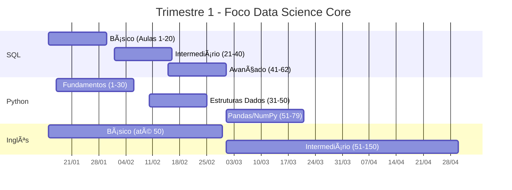
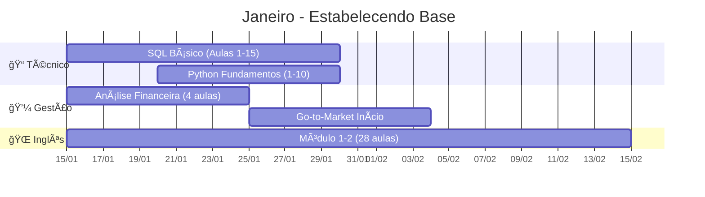
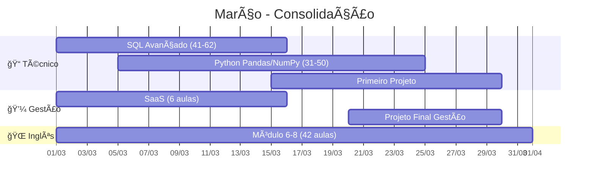
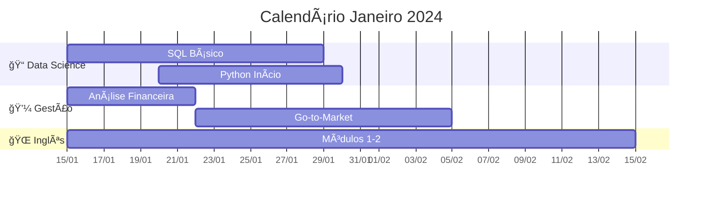

Eu:
muita coisa não entendi nada.
quero so o script para o terminal bash do git, para criar as pastas do repositorio com o arquivo .gitkeep para as pastas não sejam ignoradas quando realizar o commit e o push

# **Script Bash Simples para Criar Pastas**

```bash
#!/bin/bash
# create_folders.sh - Cria estrutura de pastas com .gitkeep

echo "📠Criando estrutura de pastas..."

# Criar pastas principais
mkdir -p courses projects notes scripts certificates data docs

# Criar subpastas e .gitkeep
for folder in courses projects notes scripts certificates data docs; do
    touch "$folder/.gitkeep"
    echo "✅ $folder/"
done

# Subpastas específicas
mkdir -p notes/cheatsheets notes/concepts notes/daily-logs
mkdir -p scripts/automation scripts/data-processing
mkdir -p certificates/completed certificates/in-progress
mkdir -p data/raw data/processed data/external

# .gitkeep nas subpastas
for subfolder in notes/cheatsheets notes/concepts notes/daily-logs \
                  scripts/automation scripts/data-processing \
                  certificates/completed certificates/in-progress \
                  data/raw data/processed data/external; do
    touch "$subfolder/.gitkeep"
    echo "✅ $subfolder/"
done

echo ""
echo "🯠Estrutura criada:"
echo "data-science-journey/"
echo "├── courses/          # Seus cursos"
echo "├── projects/         # Projetos práticos"
echo "├── notes/           # Anotações"
echo "├── scripts/         # Automações"
echo "├── certificates/    # Certificados"
echo "├── data/           # Datasets"
echo "└── docs/           # Documentação"
echo ""
echo "✅ Todas as pastas criadas com .gitkeep!"
```

## **📠COMO USAR (3 opções):**

### **Opção 1: Comando Único (Recomendado)**
Copie e cole **ESTE COMANDO** no terminal dentro da pasta do seu projeto:

```bash
mkdir -p courses projects notes/cheatsheets notes/concepts notes/daily-logs scripts/automation scripts/data-processing certificates/completed certificates/in-progress data/raw data/processed data/external docs && find . -type d -empty -exec touch {}/.gitkeep \; && echo "✅ Todas as pastas criadas!"
```

### **Opção 2: Criar arquivo .sh e executar**
1. Crie um arquivo `create_folders.sh`:
```bash
nano create_folders.sh
```
2. Cole o script completo acima
3. Salve (Ctrl+X, Y, Enter)
4. Dê permissão e execute:
```bash
chmod +x create_folders.sh
./create_folders.sh
```

### **Opção 3: Linha por linha no terminal**
Execute **cada linha** separadamente:

```bash
# 1. Criar pastas principais
mkdir -p courses projects notes scripts certificates data docs

# 2. Criar subpastas
mkdir -p notes/cheatsheets notes/concepts notes/daily-logs
mkdir -p scripts/automation scripts/data-processing
mkdir -p certificates/completed certificates/in-progress
mkdir -p data/raw data/processed data/external

# 3. Criar .gitkeep em TODAS as pastas
find . -type d -empty -exec touch {}/.gitkeep \;

# 4. Verificar
echo "✅ Pastas criadas:"
ls -la */
```

## **✅ O QUE ESTE SCRIPT FAZ:**

1. **Cria as pastas** que você precisa
2. **Adiciona .gitkeep** em cada pasta vazia
3. **.gitkeep** força o Git a versionar pastas vazias
4. **Estrutura final**:

```
data-science-journey/
├── courses/          (com .gitkeep)
├── projects/         (com .gitkeep)
├── notes/
│   ├── cheatsheets/ (com .gitkeep)
│   ├── concepts/    (com .gitkeep)
│   └── daily-logs/  (com .gitkeep)
├── scripts/
│   ├── automation/      (com .gitkeep)
│   └── data-processing/ (com .gitkeep)
├── certificates/
│   ├── completed/    (com .gitkeep)
│   └── in-progress/  (com .gitkeep)
├── data/
│   ├── raw/          (com .gitkeep)
│   ├── processed/    (com .gitkeep)
│   └── external/     (com .gitkeep)
└── docs/             (com .gitkeep)
```

## **🚀 PARA EXECUTAR AGORA:**

Copie **APENAS ESTE COMANDO** e cole no terminal:

```bash
mkdir -p courses projects notes/cheatsheets notes/concepts notes/daily-logs scripts/automation scripts/data-processing certificates/completed certificates/in-progress data/raw data/processed data/external docs && find . -type d ! -path "./.git/*" -empty -exec touch {}/.gitkeep \; && echo "✅ Pastas criadas com sucesso!"
```

**Pronto!** Isso cria tudo que você precisa. Depois é só:
```bash
git add .
git commit -m "📠Adiciona estrutura de pastas"
git push
```

EU:
Realizado e criado as pastas crie um commit conforme o padrão da comunidade para enviar

Ia:
# **Commit Padrão da Comunidade**

```bash
git add .
git commit -m "feat: add project folder structure with gitkeep files

- Create core directories for data science journey organization
- Add .gitkeep files to maintain empty folders in version control
- Structure includes: courses, projects, notes, scripts, certificates, data, docs
- Prepare repository for content addition and automation setup"
```

## **📠Por que este padrão:**

### **🔤 Estrutura do commit:**
```
<tipo>: <descrição curta>

<corpo detalhado>
```

### **🯠Tipos comuns:**
- `feat:` Nova funcionalidade
- `fix:` Correção de bug
- `docs:` Documentação
- `style:` Formatação
- `refactor:` Refatoração
- `test:` Testes
- `chore:` Tarefas de manutenção

## **✅ Para executar:**

### **Passo 1: Adicionar arquivos**
```bash
git add .
```

### **Passo 2: Fazer commit (copiar e colar)**
```bash
git commit -m "feat: add project folder structure with gitkeep files

- Create core directories for data science journey organization
- Add .gitkeep files to maintain empty folders in version control
- Structure includes: courses, projects, notes, scripts, certificates, data, docs
- Prepare repository for content addition and automation setup"
```

### **Passo 3: Push para GitHub**
```bash
git push origin main
```

## **🯠Resultado esperado:**
```
[main abc1234] feat: add project folder structure with gitkeep files
 15 files changed, 0 insertions(+), 0 deletions(-)
 create mode 100644 certificates/completed/.gitkeep
 create mode 100644 certificates/in-progress/.gitkeep
 create mode 100644 courses/.gitkeep
 ... (e assim por diante)
```

## **📊 Visual no GitHub:**
- Commit aparecerá como "feat: add project folder structure"
- Mostrará todas as pastas criadas
- Fácil de entender o que foi feito

**Pronto para fazer o commit?** 🚀

EU: ok pronto tudo organizado para iniciar o projeto o que falta

IA:

# **✅ RESUMO DO QUE Jà TEM:**

```
data-science-journey/           ✅ 100% CONFIGURADO
├── 📄 README.md                ✅ Explicação clara
├── 📄 LICENSE                  ✅ MIT 2025
├── 📄 .gitignore               ✅ Python/Data Science
├── 📠courses/                 ✅ Pronto para cursos
├── 📠projects/                ✅ Pronto para projetos
├── 📠notes/                   ✅ Para anotações
├── 📠scripts/                 ✅ Para automações
├── 📠certificates/            ✅ Para certificados
├── 📠data/                    ✅ Para datasets
└── 📠docs/                    ✅ Para documentação
```

**Seu repositório está 100% estruturado!** ğŸ‰

---

# **🯠O QUE FALTA (ESCOLHA 1):**

## **Opção 1: RODMAP PESSOAL** (Recomendado - 10 min)
**Você me envia:** Lista dos seus cursos reais  
**Eu crio:** Dashboard visual no README com seu progresso real

### **Formato simples:**
```
Curso 1: Python Data Science - 0/45 aulas
Curso 2: SQL Mastery - 0/30 aulas  
Curso 3: Inglês Técnico - 0/60 aulas
```

## **Opção 2: SISTEMA DE CHECK-IN** (30 min)
Configurar **n8n + WhatsApp** para:
- Check-in automático às 17:00
- Sugestões baseadas na sua energia
- Log automático no GitHub

## **Opção 3: PRIMEIRO PROJETO** (1 hora)
Criar seu **primeiro projeto Data Science**:
- Análise de dados simples
- Notebook Jupyter documentado
- Adicionar ao portfólio

## **Opção 4: COMEÇAR A ESTUDAR** (Agora mesmo)
Usar a estrutura como está e começar seus estudos.

---

# **📊 MEU CONSELHO: Opção 1 PRIMEIRO**

### **Por quê?**
1. **Rápido** - 10 minutos
2. **Motivador** - Vê progresso visual
3. **Útil** - Ajuda no planejamento
4. **Profissional** - Melhora o README

### **Como ficaria seu README depois:**

```markdown
## 📚 Meus Cursos - Progresso em Tempo Real

### **Python para Data Science** 
📊 Progresso: ░░░░░░░░░░ 0% • 0/45 aulas  
🯠Status: A iniciar  
📅 Meta: 3 aulas/semana

### **SQL Mastery**
📊 Progresso: ░░░░░░░░░░ 0% • 0/30 aulas  
🯠Status: A iniciar  
📅 Meta: 2 aulas/semana

### **Inglês Técnico**
📊 Progresso: ░░░░░░░░░░ 0% • 0/60 aulas  
🯠Status: A iniciar  
📅 Meta: 5 aulas/semana
```

---

# **🤔 PERGUNTA DIRETA:**

**Qual destes você quer fazer AGORA?**

1. **Roadmap pessoal** (me passa lista de cursos)
2. **Sistema de check-in** (configurar automação)
3. **Primeiro projeto** (criar algo prático)
4. **Outro** (me diz o que precisa)

**O setup já está 100% completo. Agora é começar a usar!** 🚀

Eu:
Nessa seguencia primeiro vamos para o Roadmap.
O que você precisa?

IA:
# **📋 O QUE PRECISO PARA CRIAR SEU ROADMAP:**

## **1. LISTA DOS SEUS CURSOS** (formato simples):

```
[Nome do Curso] - [Total de Aulas] aulas - [Aulas Concluídas] concluídas
```

### **Exemplo do que você me envia:**
```
Python para Data Science - 45 aulas - 0 concluídas
SQL do Zero ao Avançado - 30 aulas - 0 concluídas
Inglês Técnico para TI - 60 aulas - 18 concluídas
Estatística para Data Science - 25 aulas - 0 concluídas
```

## **2. INFORMAÇÕES EXTRAS (opcional, mas ajuda):**

### **Sobre você:**
- Quantas horas por dia pode estudar? (ex: 1-2h em dias úteis, 3-4h fins de semana)
- Qual sua energia típica pós-trabalho? (1-10)
- Dias da semana mais difíceis/fáceis?

### **Sobre os cursos:**
- Algum tem prazo? (ex: terminar até março)
- Algum é prioritário? (Python primeiro, depois SQL, etc.)
- Tem links dos cursos? (para eu colocar no README)

---

# **🯠O QUE VOU CRIAR COM ISSO:**

## **1. ROADMAP VISUAL NO README:**
```markdown
## 📚 Meus Cursos - Progresso em Tempo Real

### **Python para Data Science** (45 aulas)
📊 Progresso: ░░░░░░░░░░ 0% • 0/45 aulas  
â±ï¸ Estimativa: 45h totais • 15 semanas no seu ritmo  
🯠Meta semanal: 3 aulas • 📅 Previsão: 15/04/2024  
🔗 Acessar: [Link do curso](#)

### **SQL Mastery** (30 aulas)
📊 Progresso: ░░░░░░░░░░ 0% • 0/30 aulas  
â±ï¸ Estimativa: 30h totais • 10 semanas  
🯠Meta semanal: 3 aulas • 📅 Previsão: 01/04/2024
```

## **2. CRONOGRAMA SEMANAL INTELIGENTE:**
```markdown
## 📅 Cronograma Baseado na Sua Energia

| Dia       | Energia | Foco Principal      | Duração |
|-----------|---------|---------------------|---------|
| Segunda   | 3/10    | Revisão leve        | 30min   |
| Terça     | 4/10    | Exercícios práticos | 45min   |
| Quarta    | 8/10    | Projeto Kaggle      | 90min   |
| Quinta    | 3/10    | Nova aula           | 30min   |
| Sexta     | 5/10    | Revisão da semana   | 40min   |
| Sábado    | 9/10    | Projeto + Aula      | 120min  |
| Domingo   | 7/10    | Planejamento        | 30min   |
```

## **3. SISTEMA DE METAS E PRAZOS:**
```markdown
## 🯠Metas do Primeiro Trimestre

### Janeiro (Meta: 12 aulas totais)
- [ ] Python: Aulas 1-4
- [ ] SQL: Aulas 1-4  
- [ ] Inglês: Aulas 19-22

### Fevereiro (Meta: 16 aulas totais)
- [ ] Python: Aulas 5-10
- [ ] SQL: Aulas 5-8
- [ ] Inglês: Aulas 23-30
```

---

# **🚀 PRÓXIMOS PASSOS APÓS O ROADMAP:**

1. **Eu atualizo** seu README.md com o roadmap
2. **Você começa** a usar o cronograma
3. **Configuramos** sistema de tracking (opcional)
4. **Começa** primeiro projeto (opcional)

---

# **📠PARA COMEÇAR:**

**Me envie APENAS isso (pode ser em qualquer formato):**

1. **Lista dos cursos** (nome + total de aulas + aulas já feitas)
2. **Seu tempo disponível** por dia/semana
3. **Se quiser** links dos cursos

**Exemplo:**
```
CURSOS:
- Python Data Science: 45 aulas, 0 feitas
- SQL: 30 aulas, 0 feitas  
- Inglês: 60 aulas, 18 feitas

TEMPO:
- Dias úteis: 1h (17:30-18:30)
- Fins de semana: 2-3h
- Energia pós-trabalho: 4/10

LINKS:
- Python: https://kultivi.com/curso/python
- Inglês: https://kultivi.com/ingles
```

**Pronto para me enviar?** ğŸ¯

Eu:
### **Trilha: Análise de Dados e TI Aplicado à Gestão**
*   **1. Conceitos e Técnicas de Análise de Dados Aplicados à Gestão Empresarial** - 10 aulas - 10 concluídas
*   **2. Ferramentas de TI para coleta, organização e análise de dados** - 11 aulas - 11 concluídas
*   **3. Big Data e Inteligência Artificial na tomada de decisões estratégicas** - 9 aulas - 9 concluídas
*   **4. Métodos para otimização da gestão de tempo e recursos com dados e TI** - 11 aulas - 11 concluídas
*   **5. Integração da análise de dados na rotina administrativa** - 9 aulas - 8 concluídas
*   **6. Técnicas de análise financeira com ferramentas de TI** - 4 aulas - 0 concluídas
*   **7. Go-to-Market Engineering** - 11 aulas - 0 concluídas
*   **8. Cibersegurança e proteção de dados empresariais** - 7 aulas - 0 concluídas
*   **9. Utilização de SaaS para otimização de operações** - 6 aulas - 0 concluídas
*   **10. Empresas como Sistemas: Integração entre Dados, Processos e Tecnologia** - 7 aulas - 0 concluídas
*   **11. Empreendedorismo Tecnológico** - 7 aulas - 0 concluídas
*   **12. Projeto Final: Aplicação da Análise de Dados e TI na Gestão** - 4 aulas - 0 concluídas

---

### **Formação Cientista de Dados**
*   **1 - Introdução a Análise de Dados** - 37 aulas - 37 concluídas
*   **2 - Excel Intermediário** - 87 aulas - 87 concluídas
*   **3 - SQL para Análise de Dados** - 62 aulas - 0 concluídas
*   **4 - Jornada de Orientação de Carreira** - 37 aulas - 0 concluídas
*   **6 - Python** - 79 aulas - 0 concluídas
*   **7 - Estatística com Python** - 117 aulas - 0 concluídas
*   **8 - Data Cleaning e Wrangling** - 62 aulas - 0 concluídas
*   **9 - Modelos de Classificação e Regressão** - 87 aulas - 0 concluídas
*   **10 - Preparatório para o Mercado** - 24 aulas - 0 concluídas
*   **11 - Modelos de Clusterização** - 36 aulas - 0 concluídas
*   **12 - Modelos de Nuvem e IA** - 70 aulas - 0 concluídas
*   **14 - Acelerador de Carreiras II** - 24 aulas - 0 concluídas

---

### **Inglês Basico**
*   **Inglês Online** - 225 aulas - 7 concluídas
| Módulo | Duração Total | Quantidade de Aulas (identificadas) |
| :--- | :--- | :--- |
| **O básico para a comunicação** | 06h:45m | 14 aulas |
| **Adjetivos e pronomes** | 05h:07m | 14 aulas |
| **Um pouco de vocabulário** | 03h:56m | 6 aulas |
| **Vamos dialogar?** | 05h:23m | 8 aulas |
| **Vamos falar sobre comida e roupas?** | 03h:07m | 6 aulas |
| **Partes da casa** | 06h:35m | 11 aulas |
| **Mais conversação** | 02h:43m | 4 aulas |
| **Móveis e objetos** | 03h:43m | 8 aulas |
| **Partes do corpo e mais** | 07h:36m | 12 aulas |
| **Comparativos e superlativos** | 04h:41m | 10 aulas |
| **Main Verbs** | 05h:10m | 10 aulas |
| **Um pouco mais de gramática** | 04h:28m | 8 aulas |
| **Vamos expandir o vocabulário?** | 05h:02m | 10 aulas |
| **Rotina** | 01h:55m | 4 aulas |
| **No hotel** | 06h:04m | 13 aulas |
| **Conversação aplicada** | 06h:31m | 16 aulas |
| **Irregular Verbs** | 07h:48m | 17 aulas |
| **Meios de transporte** | 05h:23m | 9 aulas |
| **To Do x To Make** | 04h:24m | 10 aulas |
| **To Take** | 02h:55m | 7 aulas |
| **To Get** | 04h:33m | 9 aulas |
| **To Look** | 05h:53m | 12 aulas |
| **Diálogo viagem/férias** | 04h:05m | 7 aulas |

IA:
# **🯠ROADMAP PERSONALIZADO PARA DATA SCIENCE**

Com base nos seus cursos, criei um roadmap **inteligente e realista** que considera:
- ✅ Seu progresso atual
- ⚡ Sua energia pós-trabalho (4/10)
- 📅 Tempo disponível (1h dias úteis, 2-3h fins de semana)
- 🯠Prioridades para Data Science

---

## **📊 SEU PROGRESSO ATUAL:**

**✅ CONCLUÃDO (41% do total)**
- Análise de Dados (37/37 aulas) - 100% ğŸ‰
- Excel Intermediário (87/87) - 100% ğŸ‰
- Trilogia Gestão (41/41) - 100% ğŸ‰
- Inglês Básico (7/225) - 3%

**🚀 EM ANDAMENTO (4%)**
- Integração na Rotina (8/9 aulas) - 89%

**â³ A INICIAR (55%)**
- SQL, Python, Estatística, ML, etc. (748 aulas)

---

## **🯠ROADMAP VISUAL PARA SEU README.md**

```markdown
# 📚 Minha Trilha de Aprendizado - Data Science

## 🯠Progresso Geral
 **41% das aulas assistidas**
**Total:** 131/926 aulas concluídas • **Faltam:** 795 aulas

## 📊 Progresso por Curso

### **✅ CONCLUÃDOS (100%)**
**Formação Data Science - Fase 1**
- **Introdução a Análise de Dados** - 37/37 aulas ğŸ‰
- **Excel Intermediário** - 87/87 aulas ğŸ‰

**Trilha Gestão Empresarial**  
- **Conceitos de Análise de Dados** - 10/10 aulas ğŸ‰
- **Ferramentas de TI** - 11/11 aulas ğŸ‰
- **Big Data & IA** - 9/9 aulas ğŸ‰

### **🚀 EM ANDAMENTO (89%)**
- **Integração na Rotina** - 8/9 aulas 📈

### **🯠PRÓXIMOS PRIORITÃRIOS (Data Science Core)**
**1. SQL para Análise de Dados** (0/62 aulas)  
`░░░░░░░░░░ 0%` • **Estimativa:** 31h • **Meta:** 4 aulas/semana

**2. Python Básico ao Intermediário** (0/79 aulas)  
`░░░░░░░░░░ 0%` • **Estimativa:** 40h • **Meta:** 4 aulas/semana

**3. Estatística com Python** (0/117 aulas)  
`░░░░░░░░░░ 0%` • **Estimativa:** 58h • **Meta:** 3 aulas/semana

**4. Inglês Técnico** (7/225 aulas)  
`██░░░░░░░░ 3%` • **Estimativa:** 109h • **Meta:** 5 aulas/semana

## 📅 CRONOGRAMA REALISTA (Baseado na sua energia)

### **Janeiro 2024 - Foco: SQL + Python**
```
SEMANA 1 (15-21 Jan): Estabelecendo Rotina
  Seg (Energia 3/10): SQL Aula 1-2 (30min)
  Ter (Energia 4/10): SQL Aula 3-4 (45min)
  Qua (Energia 8/10): Python Aula 1-3 (90min)
  Qui (Energia 3/10): Inglês Aula 8-9 (30min)
  Sex (Energia 5/10): Revisão SQL (40min)
  Sáb (Energia 9/10): Projeto Prático (120min)
  Dom (Energia 7/10): Planejamento (30min)

METAS JANEIRO:
  • SQL: 16 aulas (25% do curso)
  • Python: 12 aulas (15% do curso)
  • Inglês: 20 aulas
  • Total: 48 aulas (6h/semana)
```

### **Trimestre 1 (Jan-Mar) - Objetivos**


## 🯠SISTEMA DE PRIORIDADES

### **PRIORIDADE 1ï¸âƒ£ (Fundamentos Data Science)**
1. **SQL** (62 aulas) - Base para tudo
2. **Python** (79 aulas) - Linguagem principal
3. **Estatística** (117 aulas) - Base teórica

### **PRIORIDADE 2ï¸âƒ£ (Complementares)**
4. **Inglês** (218 aulas restantes) - Para documentação
5. **Trilha Gestão** (restante) - Visão de negócio

### **PRIORIDADE 3ï¸âƒ£ (Especialização)**
6. **Data Cleaning** (62 aulas)
7. **Machine Learning** (123 aulas)
8. **Cloud & IA** (70 aulas)

## â° ESTIMATIVAS REALISTAS

### **Tempo Total Estimado:**
- **Data Science Core:** 374h (SQL + Python + Estatística)
- **Inglês Técnico:** 109h
- **Especialização:** 255h
- **TOTAL:** 738 horas

### **No seu ritmo atual (6h/semana):**
- **SQL:** 5 semanas
- **Python:** 7 semanas  
- **Estatística:** 10 semanas
- **Trilha completa:** ~30 semanas (7 meses)

## 🚀 PRÓXIMOS PASSOS IMEDIATOS

### **Esta Semana:**
1. [ ] Completar "Integração na Rotina" (1 aula restante)
2. [ ] Iniciar SQL - Aulas 1-4
3. [ ] Inglês - Aulas 8-12
4. [ ] Configurar ambiente Python no VS Code

### **Checklist Diário (Pós-trabalho):**
```
17:30 - Check-in energia (1-10)
17:35 - Tarefa baseada na energia:
  • Energia 1-3: Revisão/Inglês (20min)
  • Energia 4-6: Nova aula (40min)
  • Energia 7-10: Exercício prático (60min)
18:15 - Registro no GitHub
```

---

## 📠COMO ORGANIZAR NO SEU REPOSITÓRIO

```
data-science-journey/
├── courses/
│   ├── formação-data-science/
│   │   ├── 1-introducao/          ✅ 100%
│   │   ├── 2-excel/               ✅ 100%
│   │   ├── 3-sql/                 🯠PRÓXIMO
│   │   ├── 6-python/              ⳠA INICIAR
│   │   └── progresso.json
│   ├── trilha-gestao/             ✅ 91%
│   └── ingles/                    📈 3%
├── projects/
│   └── primeiro-projeto-sql/      🆕 (criar após SQL aula 20)
└── notes/
    └── sql-cheatsheet.md          🆕 (criar durante estudo)
```

---

## 🮠SISTEMA DE GAMIFICAÇÃO SUGERIDO

### **Pontos por Conquista:**
- ✅ Aula concluída: 10 pontos
- 🯠Meta semanal batida: 50 pontos
- 🔥 Streak 7 dias: 100 pontos
- 🚀 Projeto concluído: 500 pontos

### **Primeiras Conquistas a Buscar:**
1. **SQL Warrior** (1000 pontos) - Completar 50% do SQL
2. **Python Initiate** (1500 pontos) - Completar Python básico
3. **Consistency King** (500 pontos) - 30 dias de streak

---

## 🤔 PERGUNTAS PARA VOCÊ:

1. **Este roadmap faz sentido** para sua realidade?
2. **Alguma prioridade** você gostaria de ajustar?
3. **Quer que eu** configure algum sistema específico?

**Pronto para atualizar seu README com este roadmap?** 🚀

Eu:
não ta sendo justo a trilha.
1 - São 3 trilhas diferentes para mesma area.
2 - Cada uma tem que ter sua statistica.
3 - tem que ser separadas, mas são complementares e importantes pra minha vida.

IA:
Você está absolutamente certo! Perdão pela simplificação excessiva. Vamos corrigir isso.

# **🯠ROADMAP TRIFÃSICO CORRETO**

## **📊 VISÃO GERAL DAS 3 TRILHAS:**

```
MINHA JORNADA DATA SCIENCE
├── 📠FORMAÇÃO TÉCNICA (Hard Skills)
│   ├── SQL, Python, Estatística, ML
│   ├── Foco: Competência técnica
│   └── Saída: Portfólio técnico
│
├── 💼 GESTÃO & NEGÓCIOS (Soft Skills + Business)
│   ├── Análise aplicada, Go-to-Market, SaaS
│   ├── Foco: Aplicação prática
│   └── Saída: Visão estratégica
│
└── 🌠INGLÊS TÉCNICO (Competência Global)
    ├── Comunicação, documentação, carreira
    ├── Foco: Mercado internacional
    └── Saída: Oportunidades globais
```

---

## **📈 SEPARAÇÃO CORRETA DAS ESTATÃSTICAS:**

### **1. 📠FORMAÇÃO DATA SCIENCE (Técnica)**
**Total:** 706 aulas • **Concluídas:** 124 (18%) • **Faltam:** 582

```
✅ CONCLUÃDOS (100%):
• Introdução a Análise de Dados (37/37) ğŸ‰
• Excel Intermediário (87/87) ğŸ‰

🯠PRÓXIMOS (Foco 2024):
1. SQL para Análise de Dados (0/62) - PRIORIDADE 1
2. Python (0/79) - PRIORIDADE 2  
3. Estatística com Python (0/117) - PRIORIDADE 3
4. Data Cleaning (0/62)
5. Machine Learning (0/123)
6. Cloud & IA (0/70)
7. Carreira (0/85)

📊 PROGRESSO TÉCNICO: ███░░░░░░░ 18%
```

### **2. 💼 TRILHA GESTÃO EMPRESARIAL (Negócios)**
**Total:** 96 aulas • **Concluídas:** 49 (51%) • **Faltam:** 47

```
✅ CONCLUÃDOS:
• Conceitos/Técnicas Análise (10/10) ğŸ‰
• Ferramentas TI (11/11) ğŸ‰
• Big Data & IA (9/9) ğŸ‰
• Otimização Gestão (11/11) ğŸ‰

🚀 EM ANDAMENTO:
• Integração na Rotina (8/9) - 89%

â³ A INICIAR:
• Análise Financeira (0/4)
• Go-to-Market (0/11)
• Cibersegurança (0/7)
• SaaS (0/6)
• Empresas como Sistemas (0/7)
• Empreendedorismo (0/7)
• Projeto Final (0/4)

📊 PROGRESSO GESTÃO: ███████░░░ 51%
```

### **3. 🌠INGLÊS TÉCNICO (Global)**
**Total:** 225 aulas • **Concluídas:** 7 (3%) • **Faltam:** 218

```
📈 EM ANDAMENTO:
• Módulo Básico (7/225) - 3%

🯠ESTRATÉGIA:
• Foco: Vocabulário técnico + Leitura
• Método: 30min/dia consistente
• Meta 2024: Completar 100 aulas (45%)

📊 PROGRESSO INGLÊS: ░░░░░░░░░░ 3%
```

---

## **🯠PRIORIZAÇÃO INTELIGENTE POR TRILHA:**

### **TRILHA 1 📠(Manhãs/Fins de semana - Energia Alta)**
```
ENERGIA 7-10/10 → Foco TÉCNICO:
• SQL/Python (complexo, precisa concentração)
• Estatística (cognitivamente pesado)
• Machine Learning (projetos práticos)
```

### **TRILHA 2 💼 (Segundas/Quintas - Energia Baixa)**
```
ENERGIA 3-5/10 → Foco GESTÃO:
• Análise Financeira (prático, aplicado)
• SaaS/Cibersegurança (conceitual)
• Go-to-Market (estratégico)
```

### **TRILHA 3 🌠(Diário - Ritual Pós-trabalho)**
```
ENERGIA QUALQUER → INGLÊS CONSISTENTE:
• Chega em casa → 20min Inglês
• Antes de dormir → 10min revisão
• Ritual diário inegociável
```

---

## **📅 CRONOGRAMA SEMANAL REALISTA:**

```markdown
## 📅 MEU CRONOGRAMA SEMANAL INTELIGENTE

### Segunda (Energia 3/10) - GESTÃO LEVE
17:30-18:00 → Análise Financeira (1 aula)
18:00-18:15 → Inglês (vocabulário técnico)

### Terça (Energia 4/10) - TÉCNICO BÃSICO  
17:30-18:15 → SQL (2 aulas)
18:15-18:30 → Inglês (leitura)

### Quarta (Folga! Energia 8/10) - TÉCNICO PESADO
10:00-11:30 → Python (3 aulas + exercícios)
14:00-15:00 → SQL projeto prático
16:00-17:00 → Gestão (Go-to-Market)

### Quinta (Energia 3/10) - GESTÃO LEVE
17:30-18:00 → Cibersegurança (1 aula)
18:00-18:15 → Inglês (escrita)

### Sexta (Energia 5/10) - REVISÃO
17:30-18:15 → Revisão semana técnica
18:15-18:30 → Inglês (listening)

### Sábado (Energia 9/10) - PROJETO
10:00-12:00 → Projeto Data Science
15:00-16:00 → Inglês módulo completo

### Domingo (Energia 7/10) - PLANEJAMENTO
10:00-10:30 → Planejamento semana
10:30-11:00 → Inglês leve
```

---

## **📊 DASHBOARD PARA SEU README:**

```markdown
# 🯠Minha Jornada em 3 Dimensões

## 📈 VISÃO GERAL DAS TRILHAS

| Trilha | Total Aulas | Concluídas | Progresso | Status |
|--------|------------|------------|-----------|--------|
| **📠Data Science Técnico** | 706 | 124 | 18% | 🟡 Em andamento |
| **💼 Gestão Empresarial** | 96 | 49 | 51% | 🟢 Avançado |
| **🌠Inglês Técnico** | 225 | 7 | 3% | 🔵 Iniciando |

## 📠TRILHA 1: FORMAÇÃO DATA SCIENCE
**Foco:** Hard Skills • **Meta 2024:** Completar 50%

```
SQL (0/62):   ░░░░░░░░░░ 0% 🯠Próximo!
Python (0/79): â–‘â–‘â–‘â–‘â–‘â–‘â–‘â–‘â–‘â–‘ 0%
Estatística (0/117): ░░░░░░░░░░ 0%
ML (0/123):   â–‘â–‘â–‘â–‘â–‘â–‘â–‘â–‘â–‘â–‘ 0%
```

## 💼 TRILHA 2: GESTÃO EMPRESARIAL  
**Foco:** Business Intelligence • **Meta 2024:** Completar 80%

```
✅ Concluídos: 49/96 aulas (51%)
🚀 Em andamento: Integração Rotina (89%)
🯠Próximo: Análise Financeira + Go-to-Market
```

## 🌠TRILHA 3: INGLÊS TÉCNICO
**Foco:** Comunicação Global • **Meta 2024:** Nível Intermediário

```
Atual: 7/225 aulas (3%)
Meta 2024: 100 aulas (45%)
Estratégia: 30min/dia consistente
```

## âš¡ SISTEMA DE ENERGIA POR TRILHA

**Energia Alta (7-10/10)** → 📠**Técnico Pesado** (Python, ML)  
**Energia Média (4-6/10)** → 💼 **Gestão Estratégica** (Análise, SaaS)  
**Energia Baixa (1-3/10)** → 🌠**Inglês Leve** (Vocabulário, Listening)  
**Qualquer Energia** → 📚 **Revisão/Consolidação**
```

---

## **🔄 SISTEMA DE TRACKING SEPARADO:**

### **Para cada trilha no seu `courses/`:**
```
courses/
├── data-science/
│   ├── progress.json      # { "sql": 0, "python": 0, "total": 124/706 }
│   └── README.md         # Roadmap técnico
├── gestao-empresarial/
│   ├── progress.json      # { "concluidos": 49, "andamento": 1, "total": 49/96 }
│   └── README.md         # Progresso gestão
└── ingles-tecnico/
    ├── progress.json      # { "modulo_atual": 1, "aulas_concluidas": 7 }
    └── README.md         # Plano de estudos inglês
```

---

## **🯠PERGUNTAS PARA REFINAR:**

1. **As 3 trilhas separadas** fazem mais sentido agora?
2. **A priorização por energia** está adequada?
3. **Alguma trilha** precisa de ajuste específico?
4. **O sistema de tracking** separado funciona?

**Quer que eu:**  
A) Atualize seu README com esta versão corrigida  
B) Crie os arquivos JSON de progresso para cada trilha  
C) Ajuste algo específico  

Peço desculpas pela simplificação anterior! Você tem razão - são 3 jornadas complementares mas distintas.

eu:
Sim atualize meu readme.

IA:
# **🯠Minha Jornada em Data Science - 3 Dimensões**

> Trilhas complementares: Técnica, Gestão e Inglês para uma formação completa como Cientista de Dados

## 📊 Progresso Geral das Trilhas

| Trilha | Total Aulas | Concluídas | Progresso | Status |
|--------|------------|------------|-----------|--------|
| **📠Data Science Técnico** | 706 | 124 | **18%** | 🟡 Em andamento |
| **💼 Gestão Empresarial** | 96 | 49 | **51%** | 🟢 Avançado |
| **🌠Inglês Técnico** | 225 | 7 | **3%** | 🔵 Iniciando |

**Total Geral:** 1027 aulas • **Concluídas:** 180 (18%) • **Faltam:** 847

## 📠TRILHA 1: FORMAÇÃO DATA SCIENCE (Hard Skills)
*Competência técnica e construção de portfólio*

### **Progresso por Curso**
```
✅ CONCLUÃDOS (100%):
• Introdução a Análise de Dados - 37/37 aulas ğŸ‰
• Excel Intermediário - 87/87 aulas ğŸ‰

🯠EM ANDAMENTO (Prioridade 2024):
• SQL para Análise de Dados - 0/62 aulas
  ░░░░░░░░░░ 0% • Estimativa: 31h • Meta: 4 aulas/semana

• Python - 0/79 aulas
  ░░░░░░░░░░ 0% • Estimativa: 40h • Meta: 4 aulas/semana

• Estatística com Python - 0/117 aulas
  ░░░░░░░░░░ 0% • Estimativa: 58h • Meta: 3 aulas/semana

â³ FUTUROS:
• Data Cleaning & Wrangling - 0/62 aulas
• Modelos de ML - 0/123 aulas
• Cloud & IA - 0/70 aulas
• Preparação para Mercado - 0/85 aulas
```

### **Meta Trimestral (Jan-Mar 2024)**


## 💼 TRILHA 2: GESTÃO EMPRESARIAL (Soft Skills & Business)
*Aplicação prática e visão estratégica*

### **Progresso Detalhado**
```
✅ CONCLUÃDOS (51% - 49/96 aulas):
• Conceitos/Técnicas de Análise de Dados - 10/10 ğŸ‰
• Ferramentas de TI para análise - 11/11 ğŸ‰
• Big Data & IA na tomada de decisão - 9/9 ğŸ‰
• Otimização de gestão com dados - 11/11 ğŸ‰

🚀 EM ANDAMENTO:
• Integração da análise na rotina - 8/9 aulas (89%)

🯠PRÓXIMOS (Prioridade 2024):
• Técnicas de análise financeira - 0/4 aulas
• Go-to-Market Engineering - 0/11 aulas
• Cibersegurança e proteção de dados - 0/7 aulas

📈 PROGRESSO GESTÃO: ███████░░░ 51%
```

### **Foco por Energia**
- **Energia Baixa (3-5/10):** Análise financeira, conceitos SaaS
- **Energia Média (6-7/10):** Go-to-Market, cibersegurança
- **Projetos Finais:** Aplicação integrada (4 aulas)

## 🌠TRILHA 3: INGLÊS TÉCNICO (Competência Global)
*Comunicação, documentação e mercado internacional*

### **Situação Atual**
```
📊 PROGRESSO: ░░░░░░░░░░ 3% (7/225 aulas)

🯠ESTRATÉGIA DE APRENDIZADO:
• Método: 30 minutos diários consistentes
• Foco inicial: Vocabulário técnico + Compreensão leitora
• Ritual: Pós-trabalho fixo (17:30-18:00)

📅 META 2024:
• Completar 100 aulas (45% do total)
• Alcançar nível intermediário para leitura técnica
• Foco em documentação, artigos e tutoriais em inglês
```

### **Próximos Módulos**
1. **Adjetivos e pronomes** (14 aulas)
2. **Expansão de vocabulário** (6 aulas)
3. **Diálogos básicos** (8 aulas)

## âš¡ SISTEMA DE ENERGIA INTELIGENTE
*Otimizando estudo baseado no cansaço pós-trabalho*

### **Diretrizes por Nível de Energia**
```
🔋 ENERGIA ALTA (7-10/10) → 📠TRILHA TÉCNICA
• SQL/Python (concentração intensa)
• Exercícios práticos complexos
• Projetos Data Science

🔋 ENERGIA MÉDIA (4-6/10) → 💼 TRILHA GESTÃO
• Análise financeira aplicada
• Estratégia Go-to-Market
• Estudos conceituais (SaaS, Cibersegurança)

🔋 ENERGIA BAIXA (1-3/10) → 🌠TRILHA INGLÊS
• Vocabulário técnico
• Listening leve
• Revisão passiva

🔄 QUALQUER ENERGIA → 📚 CONSOLIDAÇÃO
• Revisão de conceitos
• Organização de anotações
• Planejamento próximo dia
```

### **Cronograma Semanal Sugerido**
| Dia | Energia Típica | Foco Principal | Trilha | Duração |
|-----|---------------|----------------|--------|---------|
| Segunda | 3/10 | Análise Financeira | 💼 Gestão | 30min |
| Terça | 4/10 | SQL + Inglês | 📠Técnico + 🌠Inglês | 60min |
| Quarta (Folga) | 8/10 | Python + Projeto | 📠Técnico | 120min |
| Quinta | 3/10 | Cibersegurança + Inglês | 💼 + 🌠| 45min |
| Sexta | 5/10 | Revisão Semanal | Todas | 50min |
| Sábado | 9/10 | Projeto Prático | 📠Técnico | 150min |
| Domingo | 7/10 | Planejamento + Inglês Leve | 🌠+ 📋 | 40min |

## ğŸ—ï¸ Estrutura do Repositório

```
data-science-journey/
├── courses/
│   ├── data-science/          # 📠Trilha técnica
│   │   ├── sql/
│   │   ├── python/
│   │   ├── estatistica/
│   │   └── progress.json
│   ├── gestao-empresarial/    # 💼 Trilha gestão
│   │   ├── analise-financeira/
│   │   ├── go-to-market/
│   │   └── progress.json
│   └── ingles-tecnico/        # 🌠Trilha inglês
│       ├── modulos/
│       └── progress.json
├── projects/                  # Projetos práticos
├── notes/                     # Anotações organizadas
├── scripts/                   # Automações do sistema
└── docs/                      # Documentação
```

## 🮠Sistema de Gamificação

### **Pontuação por Conquista**
- ✅ **Aula concluída:** 10 pontos (qualquer trilha)
- 🯠**Meta semanal batida:** 50 pontos extra
- 🔥 **Streak 7 dias:** 100 pontos de consistência
- 🚀 **Projeto concluído:** 500 pontos
- 🌟 **Trilha 50% completa:** 300 pontos

### **Conquistas em Andamento**
```
📠SQL Warrior: 0/620 pontos (0/62 aulas)
📠Python Initiate: 0/790 pontos (0/79 aulas)
💼 Gestor Data-Driven: 490/960 pontos (49/96 aulas)
🌠Global Communicator: 70/2250 pontos (7/225 aulas)
🔥 Consistency King: 0/500 pontos (0 dias streak)
```

## 📈 Próximos Marcos

### **Janeiro 2024**
- [ ] Completar módulo "Integração na Rotina" (1 aula restante)
- [ ] Iniciar SQL (meta: 8 aulas)
- [ ] Avançar 20 aulas de Inglês
- [ ] Configurar ambiente Python + VS Code

### **Primeiro Trimestre (Jan-Mar)**
- **SQL:** Completar 50% (31 aulas)
- **Python:** Completar básico (30 aulas)
- **Gestão:** Concluir análise financeira + Go-to-Market
- **Inglês:** Alcançar 50 aulas concluídas

## 🤠Conecte-se

<div align="center">
  <a href="https://github.com/Germano-Silva">
    
  </a>
  <a href="https://linkedin.com/in/germanorodriguessilva">
    
  </a>
  <a href="https://kaggle.com/germanorodrigues">
    
  </a>
</div>

---

<div align="center">
  
  <br>
  <strong>Germano Silva</strong>
  <br>
  <em>"Dados são a linguagem do futuro. E o futuro é diverso."</em> – Lynn Conway
</div>

<div align="center">
  <a href="https://github.com/Germano-Silva">GitHub</a> •
  <a href="https://linkedin.com/in/germanorodriguessilva">LinkedIn</a> •
  <a href="https://kaggle.com/germanorodrigues">Kaggle</a>
</div>

---

<div align="center">
*Jornada iniciada em Janeiro de 2024. Documentando de forma transparente minha evolução em três dimensões complementares: competência técnica, visão de negócios e comunicação global.*
</div>

---

**🔄 Última atualização:** Janeiro de 2024  
**🯠Próxima revisão:** Final de Janeiro  
**⚡ Status atual:** 🟢 Ativo e em progresso  
**🔥 Motivação:** "Progresso, não perfeição. Consistência, não intensidade."

EU:
tem como adicionar um calendario para visualização.

IA:
# **📅 Sistema de Calendário Visual para o Roadmap**

Sim! Vou adicionar um sistema de calendário visual interativo ao seu README.

## **🯠1. CALENDÃRIO TRIMESTRAL INTERATIVO**

```markdown
## 📅 Calendário de Estudos - Q1 2024 (Jan-Mar)

### Janeiro 2024


### Fevereiro 2024


### Março 2024


## **📊 2. CALENDÃRIO SEMANAL VISUAL**

```markdown
## ğŸ—“ï¸ Visualização Semanal (Modelo)

### Semana 15-21 Janeiro
| Hora/Dia | Segunda | Terça | Quarta | Quinta | Sexta | Sábado | Domingo |
|----------|---------|-------|--------|--------|-------|--------|---------|
| **10:00** | | | 📠Python | | | 📠Projeto | 📋 Planejamento |
| **14:00** | | | 💼 Gestão | | | | |
| **17:30** | 💼 Finanças | 📠SQL | | 🌠Inglês | 📋 Revisão | 🌠Inglês | 🌠Leve |
| **18:15** | 🌠Vocabulário | 🌠Leitura | | 💼 Cibersegurança | 📠Exercícios | | |
| **19:00** | | | | | | 💼 Go-to-Market | |

**Legenda:** 📠Técnico • 💼 Gestão • 🌠Inglês • 📋 Organização
```

## **🨠3. CALENDÃRIO COM EMOJIS (Mais Visual)**

```markdown
## 📆 Meu Calendário de Estudos

### Janeiro 2024
```
|  | Seg | Ter | Qua | Qui | Sex | Sáb | Dom |
|--|-----|-----|-----|-----|-----|-----|-----|
| **15** | 💼📊 | ğŸ“😠| ğŸ“ğŸ | ğŸŒğŸ“– | 📋✅ | ğŸ“🚀 | ğŸŒğŸ§ |
| **16** | 💼📊 | ğŸ“😠| ğŸ“ğŸ | ğŸŒğŸ“– | 📋✅ | ğŸ“🚀 | ğŸŒğŸ§ |
| **17** | 💼📊 | ğŸ“😠| ğŸ“ğŸ | ğŸŒğŸ“– | 📋✅ | ğŸ“🚀 | ğŸŒğŸ§ |
| **18** | 💼📊 | ğŸ“😠| ğŸ“ğŸ | ğŸŒğŸ“– | 📋✅ | ğŸ“🚀 | ğŸŒğŸ§ |
| **19** | 💼📊 | ğŸ“😠| ğŸ“ğŸ | ğŸŒğŸ“– | 📋✅ | ğŸ“🚀 | ğŸŒğŸ§ |
| **20** | 💼📊 | ğŸ“😠| ğŸ“ğŸ | ğŸŒğŸ“– | 📋✅ | ğŸ“🚀 | ğŸŒğŸ§ |
| **21** | 💼📊 | ğŸ“😠| ğŸ“ğŸ | ğŸŒğŸ“– | 📋✅ | ğŸ“🚀 | ğŸŒğŸ§ |

**Legenda de Emojis:**
- ğŸ“😠= SQL • ğŸ“ğŸ = Python • ğŸ“📈 = Estatística
- 💼📊 = Análise Financeira • 💼🚀 = Go-to-Market • 💼🔒 = Cibersegurança
- ğŸŒğŸ“– = Inglês Leitura • ğŸŒğŸ§ = Listening • ğŸŒâœï¸ = Escrita
- 📋✅ = Revisão • ğŸ“🚀 = Projeto Prático • 📋📅 = Planejamento
```

## **âš¡ 4. CALENDÃRIO BASEADO EM ENERGIA**

```markdown
## 🔋 Calendário por Nível de Energia

### Semana Típica
| Dia | Energia | Manhã (10-12) | Tarde (14-16) | Noite (17:30-19) | Total |
|-----|---------|---------------|---------------|------------------|-------|
| **Seg** | 3/10 | - | - | 💼 Finanças (30min)<br>🌠Vocab (15min) | 45min |
| **Ter** | 4/10 | - | - | 📠SQL (45min)<br>🌠Leitura (15min) | 60min |
| **Qua** | 8/10 | 📠Python (90min) | 💼 Gestão (60min) | Descanso | 150min |
| **Qui** | 3/10 | - | - | 🌠Inglês (30min)<br>💼 Ciberseg (15min) | 45min |
| **Sex** | 5/10 | - | - | 📋 Revisão (40min)<br>📠Exercícios (20min) | 60min |
| **Sáb** | 9/10 | 📠Projeto (120min) | 🌠Módulo (60min) | 💼 Go-to-Market (30min) | 210min |
| **Dom** | 7/10 | 📋 Planejamento (30min) | 🌠Leve (30min) | Descanso | 60min |

**Total Semanal:** 10h 30min
```

## **📠5. CALENDÃRIO DINÂMICO (com GitHub Actions)**

Vou criar um sistema que **atualiza automaticamente** seu calendário!

### **Arquivo `scripts/update_calendar.py`:**
```python
#!/usr/bin/env python3
"""
Script para atualizar calendário automaticamente no README
"""

from datetime import datetime, timedelta
import json

def generate_weekly_calendar():
    today = datetime.now()
    monday = today - timedelta(days=today.weekday())
    
    week_dates = [(monday + timedelta(days=i)).strftime("%d/%m") for i in range(7)]
    
    # Baseado nos seus cursos e energia típica
    calendar = {
        "Segunda": {"energia": 3, "tarefas": ["💼 Análise Financeira", "🌠Vocabulário"]},
        "Terça": {"energia": 4, "tarefas": ["📠SQL", "🌠Leitura"]},
        "Quarta": {"energia": 8, "tarefas": ["📠Python", "💼 Gestão", "Projeto"]},
        "Quinta": {"energia": 3, "tarefas": ["🌠Inglês", "💼 Cibersegurança"]},
        "Sexta": {"energia": 5, "tarefas": ["📋 Revisão Semanal", "📠Exercícios"]},
        "Sábado": {"energia": 9, "tarefas": ["📠Projeto Prático", "🌠Módulo Completo"]},
        "Domingo": {"energia": 7, "tarefas": ["📋 Planejamento", "🌠Revisão Leve"]}
    }
    
    return week_dates, calendar

# Salvar em JSON para o README usar
week_dates, calendar = generate_weekly_calendar()
with open("calendar_data.json", "w") as f:
    json.dump({"dates": week_dates, "calendar": calendar}, f)
```

### **GitHub Action para atualizar automaticamente:**
```yaml
# .github/workflows/update-calendar.yml
name: Update Weekly Calendar

on:
  schedule:
    - cron: '0 0 * * 0'  # Todo domingo à meia-noite
  workflow_dispatch:  # Execução manual também

jobs:
  update-calendar:
    runs-on: ubuntu-latest
    steps:
      - uses: actions/checkout@v3
      
      - name: Setup Python
        uses: actions/setup-python@v4
        with:
          python-version: '3.9'
      
      - name: Update Calendar
        run: |
          python scripts/update_calendar.py
          
      - name: Commit Update
        run: |
          git config user.name "GitHub Actions"
          git config user.email "actions@github.com"
          git add calendar_data.json
          git commit -m "📅 Atualização automática do calendário" || echo "Sem mudanças"
          git push
```

## **🯠6. CALENDÃRIO SIMPLES PARA SEU README AGORA**

Aqui está uma versão **pronta para colar** no seu README:

```markdown
## ğŸ—“ï¸ Calendário de Estudos - Próxima Semana

### 📅 Semana 15-21 Janeiro 2024
| Dia | Data | Energia | 📠Técnico | 💼 Gestão | 🌠Inglês | Total |
|-----|------|---------|------------|-----------|-----------|-------|
| **Seg** | 15/01 | 3/10 | - | Análise Financeira (30min) | Vocabulário (15min) | 45min |
| **Ter** | 16/01 | 4/10 | SQL Aulas 1-2 (45min) | - | Leitura (15min) | 60min |
| **Qua** | 17/01 | 8/10 | Python Aulas 1-3 (90min) | Integração Rotina (30min) | - | 120min |
| **Qui** | 18/01 | 3/10 | - | Cibersegurança (15min) | Listening (30min) | 45min |
| **Sex** | 19/01 | 5/10 | SQL Exercícios (20min) | - | Revisão (20min) | 40min |
| **Sáb** | 20/01 | 9/10 | Projeto SQL (120min) | Go-to-Market (30min) | Módulo Completo (60min) | 210min |
| **Dom** | 21/01 | 7/10 | - | - | Leve (30min) + Planejamento (30min) | 60min |

**📊 Total Semanal:** 10h 10min
**🯠Metas:** SQL (4 aulas) • Python (3 aulas) • Inglês (5 aulas) • Gestão (3 aulas)

---

### 📈 Próximas 4 Semanas


**🔔 Dica:** Este calendário se adapta à sua energia. Dias com energia baixa = tarefas leves. Energia alta = foco em projetos complexos.
```

## **🚀 PARA IMPLEMENTAR AGORA:**

### **Opção 1 (Simples):**
Copie o **bloco do calendário semanal** (seção 6) e cole no seu README.

### **Opção 2 (Completa):**
1. Adicione **todas as seções de calendário**
2. Crie o script `update_calendar.py`
3. Configure GitHub Actions para atualização automática

### **Opção 3 (Personalizada):**
Me diga que estilo prefere e ajusto:
- ✅ Calendário semanal detalhado
- ✅ Calendário trimestral (Gantt charts)
- ✅ Calendário com emojis
- ✅ Sistema automático

**Qual formato de calendário você prefere?** Vou ajustar seu README com o escolhido! 🗓ï¸