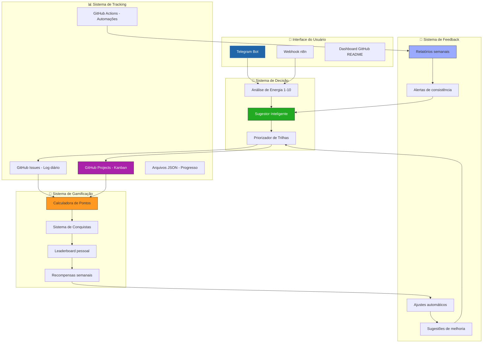
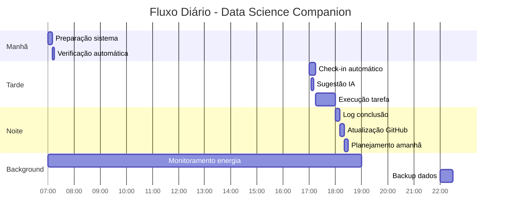
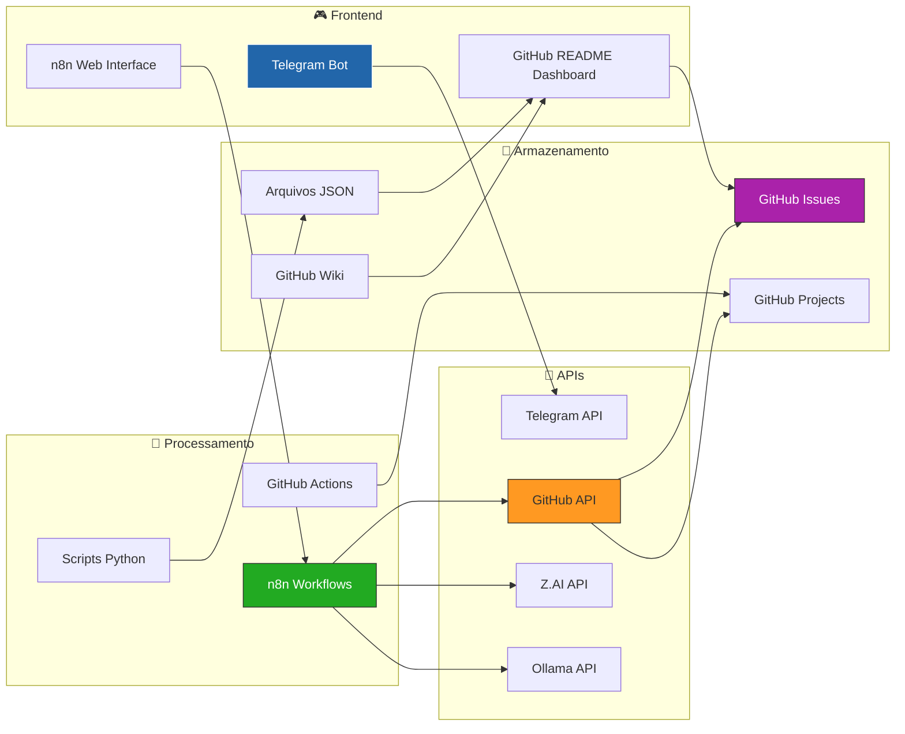
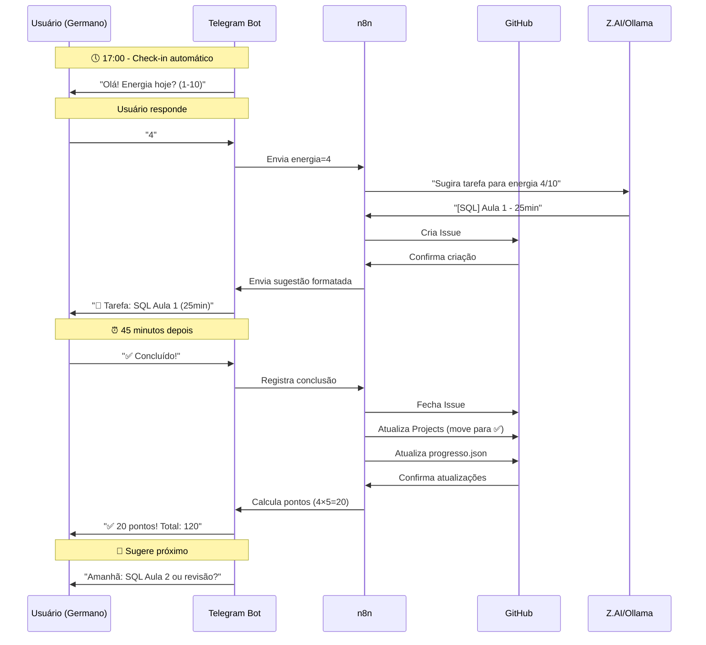

Eu:Ja fiz login, preciso do passo a passo para criar o bot no telegram.
Mas somnete isso quando terminar de criar o bot informo para irmos para a proxima etapa.

IA:
# **📱 PASSO A PASSO PARA CRIAR BOT NO TELEGRAM**

## **🎯 OBJETIVO:**
Criar o bot **@DataScienceCompanionBot** que vai enviar check-ins automáticos.

---

## **📋 PASSO A PASSO (5 minutos):**

### **PASSO 1: Abrir Telegram**
- No **celular** ou **Telegram Web** (https://web.telegram.org)
- Faça login na sua conta

### **PASSO 2: Buscar BotFather**
1. Na **barra de busca**, digite: `@BotFather`
2. Selecione o resultado (tem verificação azul ✅)

### **PASSO 3: Criar novo bot**
**Envie ESTES comandos para @BotFather:**

```
/newbot
```

BotFather vai perguntar:
1. **"Choose a name for your bot"** → Digite:
```
DataScience Companion
```

2. **"Choose a username for your bot"** → Digite:
```
germanods_bot
```
*(Obrigatório terminar com `_bot`)*

### **PASSO 4: Anotar o TOKEN**
BotFather vai enviar uma mensagem como:

```
Done! Congratulations on your new bot.

Use this token to access the HTTP API:
6123456789:AAHdqTcvCH1vGWJxfSeofSAs0K5PALDsaw

Keep your token secure and store it safely...
```

**⚠️ ANOTE ESSE TOKEN!** É o que vamos usar no n8n.

---

## **🔧 CONFIGURAÇÕES EXTRAS (opcional):**

### **Definir descrição do bot:**
Envie para @BotFather:
```
/setdescription
```
Selecione seu bot e digite:
```
Assistente de estudos Data Science. Envia lembretes e tarefas diárias.
```

### **Definir comandos do bot:**
Envie para @BotFather:
```
/setcommands
```
Selecione seu bot e digite:
```
start - Iniciar bot
energy - Reportar energia
log - Registrar estudo
progress - Ver progresso
help - Ajuda
```

---

## **✅ TESTAR SEU BOT:**

1. Na busca do Telegram, digite: `@germanods_bot`
2. Clique no seu bot
3. Clique em **"Start"** ou envie:
```
/start
```

**Resposta esperada:**
```
Olá! Sou seu assistente de estudos Data Science. 👋
```

---

## **📝 RESUMO DO QUE PRECISA:**

**Do Telegram você precisa trazer:**
1. ✅ **Token do bot** (começa com números)
2. ✅ **Username do bot** (@germanods_bot)
3. ✅ **Ter testado** /start

**Exemplo de token (mascarado):**
```
6123456789:AAHdqTcvCH1vGWJxfSeofSAs0K5PALDsaw
```

---

## **🚀 PRÓXIMA ETAPA (quando tiver o token):**

1. **Configurar credencial** no n8n com o token
2. **Importar fluxo** completo do bot
3. **Testar** envio de mensagem
4. **Configurar horário** automático (17:00)

---

**Vai criar o bot agora? Me avise quando tiver o token!** 🤖

**Dica:** Tire print da tela com o token para não perder.

EU:
ja tenho o tolken

IA:
# **🎉 PERFEITO! AGORA VAMOS CONFIGURAR NO n8n**

## **📋 PASSO A PASSO NO n8n:**

### **PASSO 1: Criar Credencial do Telegram**
1. Acesse: `http://localhost:5678`
2. Clique em **"Credentials"** (ícone de chave 🔑 no menu esquerdo)
3. Clique em **"Add Credential"** (botão azul)
4. Selecione **"Telegram API"**
5. Preencha:
   - **Name:** `Telegram Bot DS`
   - **Access Token:** `SEU_TOKEN_AQUI` (cole o token que você tem)

### **PASSO 2: Criar Novo Workflow**
1. Clique em **"Workflows"** no menu
2. Clique em **"New workflow"** (botão roxo)
3. Dê nome: `Data Science Daily Check-in`

### **PASSO 3: Importar Fluxo Simples (para testar)**
**Copie este JSON e cole no n8n:**

```json
{
  "name": "Data Science Daily Check-in",
  "nodes": [
    {
      "name": "⏰ Schedule Trigger",
      "type": "n8n-nodes-base.scheduleTrigger",
      "position": [250, 300],
      "parameters": {
        "rule": {
          "interval": [
            {
              "field": "minute",
              "minutesInterval": 2
            }
          ]
        }
      }
    },
    {
      "name": "🤖 Send Test Message",
      "type": "n8n-nodes-base.telegram",
      "position": [450, 300],
      "parameters": {
        "operation": "sendMessage",
        "text": "🤖 Bot configurado! Tudo pronto para sua jornada Data Science!",
        "chatId": "=351964041184",
        "credentials": {
          "telegramApi": "Telegram Bot DS"
        }
      }
    }
  ]
}
```

### **Como importar:**
1. No workflow vazio, clique no **menu (⋯)** → **"Import from file"**
2. Cole o JSON acima
3. Clique **"Import"**

---

## **⚡ TESTAR AGORA:**

### **Teste 1: Executar manualmente**
1. No workflow, clique no nó **"⏰ Schedule Trigger"**
2. Clique em **"Execute Node"** (play button ▶️)
3. Deve enviar mensagem para seu Telegram

### **Teste 2: Verificar no Telegram**
1. Abra Telegram
2. Busque `@germanods_bot`
3. Deve ter recebido: *"🤖 Bot configurado!..."*

---

## **🔧 SE NÃO FUNCIONAR:**

### **Problema 1: Credencial não encontrada**
- Verifique se criou a credencial com nome **exato**: `Telegram Bot DS`
- Ou mude no JSON: `"telegramApi": "NOME_DA_SUA_CREDENCIAL"`

### **Problema 2: Chat ID errado**
No JSON tem: `"chatId": "=351964041184"`
- É seu número: `+351964041184` sem o `+`
- Se for outro número, ajuste

### **Problema 3: Token inválido**
- Verifique se copiou o token completo (começa com números)
- Teste token direto: `curl "https://api.telegram.org/botSEU_TOKEN/getMe"`

---

## **🎯 PRÓXIMOS PASSOS (se teste funcionar):**

1. **Configurar horário real** (17:00 diário)
2. **Adicionar IA** (Ollama para sugestões inteligentes)
3. **Criar fluxo completo** com check-in + resposta + GitHub

---

## **🤔 PERGUNTAS:**

1. **Conseguiu criar a credencial no n8n?**
2. **Conseguiu importar o workflow?**
3. **Ao executar, recebeu mensagem no Telegram?**

**Me avise o resultado de cada passo!** 🚀

Eu:
preciso adicionar um modelo de IA

IA:
# **🤖 CONFIGURAR IA LOCAL (Ollama) NO n8n**

Vamos adicionar IA para sugerir tarefas inteligentes baseadas na sua energia.

## **📋 PRIMEIRO: INSTALAR O OLLAMA**

### **Opção A: Instalar Ollama (Linux/Mac/WSL)**
```bash
# Instalar
curl -fsSL https://ollama.com/install.sh | sh

# Baixar modelo leve (recomendado)
ollama pull llama3.2:1b

# Ou modelo melhor (mais pesado)
# ollama pull mistral:7b

# Iniciar servidor
ollama serve &
```

### **Opção B: Verificar se já está instalado**
```bash
# Testar
ollama --version

# Ver modelos disponíveis
ollama list

# Se não tiver modelo, baixar:
ollama pull llama3.2:1b
```

### **Opção C: Docker (se preferir)**
```bash
docker run -d -v ollama:/root/.ollama -p 11434:11434 --name ollama ollama/ollama
docker exec ollama ollama pull llama3.2:1b
```

---

## **🔧 CONFIGURAR OLLAMA NO n8n**

### **PASSO 1: Testar se Ollama está funcionando**
```bash
curl http://localhost:11434/api/generate -d '{
  "model": "llama3.2:1b",
  "prompt": "Olá",
  "stream": false
}'
```

**Se responder JSON**, está OK.  
**Se erro**, precisa iniciar: `ollama serve`

---

### **PASSO 2: Fluxo n8n com IA**

**JSON atualizado com IA:**

```json
{
  "name": "Data Science Companion - Com IA",
  "nodes": [
    {
      "name": "⏰ Schedule Trigger",
      "type": "n8n-nodes-base.scheduleTrigger",
      "position": [250, 300],
      "parameters": {
        "rule": {
          "hour": [17],
          "minute": [0]
        }
      }
    },
    {
      "name": "🤖 Perguntar Energia",
      "type": "n8n-nodes-base.telegram",
      "position": [450, 300],
      "parameters": {
        "operation": "sendMessage",
        "text": "🌡️ *Check-in Data Science* 🌡️\n\nOlá Germano! Como está sua energia após o trabalho?\n\n1️⃣ (1-3) 😴 Muito cansado\n2️⃣ (4-6) 😐 Dando conta\n3️⃣ (7-10) 😃 Com energia!",
        "chatId": "=351964041184",
        "parse_mode": "Markdown",
        "reply_markup": {
          "keyboard": [
            ["1️⃣ (1-3)", "2️⃣ (4-6)", "3️⃣ (7-10)"]
          ],
          "resize_keyboard": true,
          "one_time_keyboard": true
        }
      }
    },
    {
      "name": "🔄 Aguardar Resposta",
      "type": "n8n-nodes-base.webhook",
      "position": [650, 300],
      "parameters": {
        "path": "telegram-response",
        "responseMode": "responseNode",
        "options": {}
      }
    },
    {
      "name": "🧠 Converter Resposta",
      "type": "n8n-nodes-base.code",
      "position": [850, 300],
      "parameters": {
        "jsCode": "// Converte resposta em número 1-10\nconst resposta = $input.first().json.text;\nlet energia = 5; // padrão\n\nif (resposta.includes('1') || resposta.includes('1️⃣')) {\n  energia = 2;\n} else if (resposta.includes('2') || resposta.includes('2️⃣')) {\n  energia = 5;\n} else if (resposta.includes('3') || resposta.includes('3️⃣')) {\n  energia = 8;\n}\n\nreturn [{ json: { energia, resposta_original: resposta } }];"
      }
    },
    {
      "name": "🤖 Ollama Sugerir Tarefa",
      "type": "n8n-nodes-base.httpRequest",
      "position": [1050, 300],
      "parameters": {
        "method": "POST",
        "url": "http://localhost:11434/api/generate",
        "headers": {
          "Content-Type": "application/json"
        },
        "body": {
          "model": "llama3.2:1b",
          "prompt": "Germano trabalha em restaurante, chega cansado às 17h. Energia: {{$json.energia}}/10. Objetivo: Cientista de Dados. Cursos: SQL (0/62), Python (0/79), Inglês (7/225). Sugira UMA tarefa prática de 15-45min baseada na energia. Se energia <=3: tarefa muito leve. Se 4-6: exercício prático. Se >=7: pequeno projeto. Formato: [TIPO] Descrição específica - Tempo estimado",
          "stream": false,
          "options": {
            "temperature": 0.7
          }
        },
        "response": {
          "response": "={{ $json.response }}",
          "model": "={{ $json.model }}"
        }
      }
    },
    {
      "name": "📝 Enviar Sugestão",
      "type": "n8n-nodes-base.telegram",
      "position": [1250, 300],
      "parameters": {
        "operation": "sendMessage",
        "text": "🎯 *SUGESTÃO PARA HOJE* 🎯\n\nEnergia: {{$json.energia}}/10\n\n{{$node[\"🤖 Ollama Sugerir Tarefa\"].json.response}}\n\n⏰ *Duração:* 15-45min\n✅ *Dica:* Comece agora, mesmo que por 5 minutos!\n\nResponda ✅ quando concluir!",
        "chatId": "=351964041184",
        "parse_mode": "Markdown"
      }
    }
  ]
}
```

---

## **⚡ COMO IMPLEMENTAR:**

### **Se já tem fluxo simples:**
1. No n8n, abra seu workflow atual
2. Clique em **"Import from file"** (menu ⋯)
3. Cole o JSON acima (vai substituir/adicionar)
4. **Ajuste:** 
   - Verifique nome da credencial Telegram
   - Ajuste chatId se necessário

### **Se começar do zero:**
1. Crie novo workflow
2. Importe o JSON completo acima
3. Execute teste manual

---

## **🔧 CONFIGURAÇÃO DO OLLAMA:**

### **Verificar endpoint:**
No n8n, no nó **"🤖 Ollama Sugerir Tarefa"**:
- URL deve ser: `http://localhost:11434/api/generate`
- Se Ollama estiver em outra máquina: `http://SEU-IP:11434/api/generate`

### **Testar Ollama direto:**
```bash
# Teste rápido do prompt
curl http://localhost:11434/api/generate -d '{
  "model": "llama3.2:1b",
  "prompt": "Energia 4/10. Sugerir tarefa Data Science 30min.",
  "stream": false
}' | jq '.response'
```

---

## **🎯 MODELOS DISPONÍVEIS (Ollama):**

| Modelo | Tamanho | Velocidade | Qualidade | Recomendado |
|--------|---------|------------|-----------|-------------|
| **llama3.2:1b** | 1B | ⚡⚡⚡⚡⚡ | ✅ Boa | **SIM** (mais rápido) |
| **llama3.2:3b** | 3B | ⚡⚡⚡⚡ | ✅ Melhor | SIM |
| **mistral:7b** | 7B | ⚡⚡⚡ | ✅ Excelente | Se tiver RAM |
| **llama3.1:8b** | 8B | ⚡⚡ | ✅ Ótima | Se PC bom |

**Para seu caso:** `llama3.2:1b` é suficiente e rápido.

---

## **🚀 PRÓXIMOS PASSOS:**

### **1. Instalar Ollama (se ainda não)**
```bash
curl -fsSL https://ollama.com/install.sh | sh
ollama pull llama3.2:1b
```

### **2. Testar Ollama**
```bash
ollama run llama3.2:1b "Teste"
```

### **3. Configurar n8n**
- Importar fluxo com IA
- Testar manualmente
- Ajustar prompt se necessário

### **4. Automatizar**
- Configurar horário 17:00
- Testar fluxo completo

---

## **🤔 PERGUNTAS:**

1. **Já tem Ollama instalado?** Se não, preciso guiar instalação.
2. **Qual modelo baixou?** (llama3.2:1b, mistral:7b, etc.)
3. **Consegue testar endpoint?** `curl http://localhost:11434/api/generate`

**Me avise qual etapa está!** 🚀

Eu:
Crie um prompt para a Z.AI: GLM 4.5 Air (free)

131,072 context
$0/M input tokens
$0/M output tokens

para a criação do fluxo no N8N

IA:
# **🤖 PROMPT PARA Z.AI GLM 4.5 Air (GRATUITO)**

## **🎯 PROMPT PARA CRIAR FLUXO n8n COMPLETO:**

```
Crie um fluxo n8n (workflow) para um sistema de check-in diário de estudos Data Science via Telegram.

REQUISITOS DO USUÁRIO:
- Germano Silva, trabalha em restaurante, chega cansado às 17:00
- Objetivo: Cientista de Dados
- Cursos: SQL (0/62), Python (0/79), Inglês (7/225), Gestão (49/96)
- Sistema deve perguntar energia (1-10) e sugerir tarefa adequada
- 100% gratuito (n8n local + Telegram bot free)
- A IA Z.AI GLM 4.5 Air será integrada via HTTP

ESPECIFICAÇÕES TÉCNICAS:
1. FLUXO PRINCIPAL:
   - Schedule Trigger às 17:00
   - Telegram: pergunta energia com botões (1-3, 4-6, 7-10)
   - Webhook aguarda resposta
   - Envia energia para Z.AI API
   - Recebe sugestão personalizada
   - Envia sugestão para Telegram
   - Cria issue no GitHub

2. INTEGRAÇÃO Z.AI GLM 4.5 Air:
   - Endpoint: https://open.bigmodel.cn/api/paas/v4/chat/completions
   - Model: glm-4-air
   - Prompt inteligente baseado na energia
   - Resposta estruturada

3. ESTRUTURA DA SUGESTÃO:
   - Energia 1-3: Tarefa leve (15-20min) - revisão/vídeo
   - Energia 4-6: Exercício prático (25-35min) - código guiado
   - Energia 7-10: Mini-projeto (40-50min) - desafio

4. FORMATO DA RESPOSTA:
   ```
   [SQL] Aula 1: SELECT básico - 25min
   Exercício: Criar 5 consultas com dataset de exemplo
   Recurso: https://sqlzoo.net
   ```

CRIE:
1. JSON completo do fluxo n8n (array de nodes)
2. Prompt otimizado para Z.AI GLM 4.5 Air
3. Configuração do nó HTTP Request para Z.AI API
4. Lógica de parse da resposta
5. Template da issue GitHub

INSTRUÇÕES:
- Use chatId: "=351964041184"
- Nome da credencial Telegram: "Telegram Bot DS"
- Repositório GitHub: "Germano-Silva/data-science-journey"
- Incluir fallback se API falhar
- Adicionar comandos: /start, /progress, /log
```

---

## **🔧 PROMPT ALTERNATIVO (mais específico):**

```
Você é especialista em n8n e Z.AI. Crie um workflow para automação de estudos Data Science.

CONTEXTO:
Usuário: Germano Silva, atendente em restaurante em Portugal
Horário disponível: 17:00-19:00 após trabalho
Objetivo: Transição para Cientista de Dados
Stack gratuita: n8n (local) + Telegram Bot + Z.AI GLM 4.5 Air (free tier)

TAREFA:
Criar fluxo n8n com:

1. NÓ SCHEDULE TRIGGER:
   - Aciona diariamente às 17:00
   - Timezone: Europe/Lisbon

2. NÓ TELEGRAM:
   - Envia: "Olá Germano! 🌟 Energia para estudar hoje? (1-10)"
   - Botões inline: ["1-3 😴", "4-6 😐", "7-10 😃"]
   - Credential: "Telegram Bot DS"

3. NÓ WEBHOOK:
   - Aguarda resposta do usuário
   - Path: /telegram-checkin
   - Timeout: 300 segundos

4. NÓ HTTP REQUEST (Z.AI API):
   - URL: https://open.bigmodel.cn/api/paas/v4/chat/completions
   - Method: POST
   - Headers: Authorization: Bearer {api_key}
   - Body: {
        "model": "glm-4-air",
        "messages": [
          {
            "role": "system",
            "content": "Você é um tutor de Data Science. Sugira tarefas baseadas na energia do aluno (1-10). Se energia baixa (1-3): tarefas leves de 15min. Média (4-6): exercícios práticos 25min. Alta (7-10): mini-projetos 40min. Formato: [TIPO] Título - Tempo\\nDescrição\\nRecurso (opcional)"
          },
          {
            "role": "user",
            "content": "Energia: {energia}/10. Cursos: SQL 0/62, Python 0/79, Inglês 7/225, Gestão 49/96. Sugira uma tarefa específica."
          }
        ],
        "temperature": 0.7
     }

5. NÓ TELEGRAM (RESPOSTA):
   - Formata sugestão da Z.AI
   - Adiciona emojis e formatação
   - Inclui: "Responda ✅ quando concluir!"

6. NÓ GITHUB:
   - Cria issue no repositório
   - Title: "Estudo {{date}} - Energia: {energia}/10"
   - Body: Inclui sugestão da IA e checklist

7. COMANDOS ADICIONAIS:
   - /start: Mensagem de boas-vindas
   - /progress: Mostra progresso dos cursos
   - /log {minutos} {descrição}: Registra estudo

RETORNE:
- JSON completo do workflow n8n
- Exemplo de prompt para Z.AI
- Instruções para configurar API key da Z.AI
- Código para fallback (se API falhar)
```

---

## **⚡ PROMPT RÁPIDO PARA COMEÇAR:**

```
Crie um nó HTTP Request do n8n para Z.AI GLM 4.5 Air que:
1. Recebe energia (1-10) como input
2. Gera sugestão de estudo personalizada
3. Retorna em formato estruturado para Telegram

Parâmetros:
- API URL: https://open.bigmodel.cn/api/paas/v4/chat/completions
- Model: glm-4-air
- Temperature: 0.7
- Max tokens: 500

Prompt do sistema:
"Você é um assistente de estudos Data Science. Sugira tarefas baseadas na energia: 1-3 (leve), 4-6 (média), 7-10 (intensa). Seja específico com tecnologia (SQL/Python/Inglês) e tempo (15-45min)."

Formato da resposta:
"[SQL] Consultas JOIN - 30min
Praticar INNER JOIN com dataset de vendas
Dica: Use SQLite para testar rápido"

Forneça o código JSON do nó n8n.
```

---

## **🎯 COMO USAR ESSES PROMPTS:**

1. **Copie um dos prompts acima** (recomendo o primeiro)
2. **Cole no Z.AI GLM 4.5 Air** (chat.zhipu.ai)
3. **A IA vai gerar**:
   - JSON completo do fluxo n8n
   - Configuração da API Z.AI
   - Prompt otimizado
   - Código para fallback

4. **No n8n**:
   - Crie novo workflow
   - Importe o JSON gerado
   - Configure sua API key da Z.AI
   - Teste

---

## **🔑 PARA OBTER API KEY DA Z.AI:**

1. Acesse: https://open.bigmodel.cn
2. Cadastre-se (grátis)
3. Vá para "API Keys"
4. Crie nova key
5. Use no n8n como: `Authorization: Bearer sua-key-aqui`

---

**Quer que eu ajude com alguma parte específica?** Ou prefere que eu mesmo crie o fluxo completo aqui? 🚀

EU:
vamos separar por partes.
crie um fluxo em mermad para criar o nosso chat que interagem com o calendario, github projects e github, fliso conforme o chat e todas as outras coisas que ja conversamos.

IA:
# **📊 FLUXO COMPLETO EM MERMAID**

```mermaid
graph TD
    A[🌅 Início do Dia] --> B{Dispositivo?}
    
    B -->|📱 Telegram| C[🤖 DataScience Companion Bot]
    B -->|💻 Navegador| D[🌐 Interface Web n8n]
    
    C --> E[/start]
    C --> F[/energy 4]
    C --> G[/log 45 SQL Aula 1]
    C --> H[/progress]
    C --> I[/help]
    
    E --> J[Envia: Boas-vindas + instruções]
    F --> K[Registra energia no sistema]
    G --> L[Cria log no GitHub + atualiza progresso]
    H --> M[Consulta progresso das 3 trilhas]
    I --> N[Lista comandos disponíveis]
    
    K --> O{Energia ≤ 3?}
    O -->|Sim| P[Sugere tarefa LEVE: Revisão/Inglês 15min]
    O -->|Não| Q{Energia 4-6?}
    Q -->|Sim| R[Sugere tarefa MÉDIA: Exercício prático 25min]
    Q -->|Não| S[Sugere tarefa PESADA: Mini-projeto 40min]
    
    P --> T[📅 Atualiza calendário com tarefa]
    R --> T
    S --> T
    
    T --> U[📝 Cria Issue no GitHub]
    U --> V[📊 Atualiza GitHub Projects Kanban]
    V --> W[🏆 Calcula pontos: energia × 5]
    W --> X[📈 Atualiza dashboard README.md]
    
    X --> Y{Usuário conclui?}
    Y -->|✅ Sim| Z[Fecha Issue + adiciona ✅ no Projects]
    Y -->|⏰ Timeout| AA[Envia lembrete após 2h]
    
    Z --> BB[🎯 Sugere próximo passo]
    AA --> BB
    
    BB --> CC[📅 Agenda próxima sessão baseada em energia]
    
    CC --> DD{É Domingo?}
    DD -->|Sim| EE[📋 Gera relatório semanal automático]
    DD -->|Não| FF[Aguarda próximo check-in]
    
    EE --> GG[📊 Atualiza todas as métricas]
    GG --> HH[🎯 Sugere ajustes para semana seguinte]
    HH --> FF
    
    FF --> II[⏰ Próximo check-in 17:00]
    
    subgraph "🎓 Trilha Data Science Técnico"
        DS1[SQL: 0/62 aulas]
        DS2[Python: 0/79]
        DS3[Estatística: 0/117]
        DS4[Machine Learning: 0/123]
    end
    
    subgraph "💼 Trilha Gestão Empresarial"
        GE1[Concluído: 49/96]
        GE2[Análise Financeira: 0/4]
        GE3[Go-to-Market: 0/11]
    end
    
    subgraph "🌐 Trilha Inglês Técnico"
        EN1[Em andamento: 7/225]
        EN2[Meta diária: 30min]
    end
    
    L --> DS1
    L --> GE1
    L --> EN1
    
    M --> DS1
    M --> GE1
    M --> EN1
    
    style A fill:#f9f,stroke:#333,stroke-width:2px
    style C fill:#26a,stroke:#fff,stroke-width:2px,color:#fff
    style T fill:#2a2,stroke:#333,stroke-width:2px,color:#fff
    style U fill:#a2a,stroke:#333,stroke-width:2px,color:#fff
    style EE fill:#f92,stroke:#333,stroke-width:2px
```

---

# **🔗 FLUXO DETALHADO POR COMPONENTE**



---

# **⏰ FLUXO TEMPORAL DIÁRIO**



---

# **📁 ARQUITETURA DE DADOS**



---

# **🤖 FLUXO DA CONVERSA COM O BOT**



---

# **🎯 PRÓXIMOS PASSOS BASEADO NESTE FLUXO:**

1. **Implementar sequência principal** (Telegram → n8n → IA → GitHub)
2. **Configurar armazenamento** (JSON files + GitHub Issues)
3. **Criar sistema de pontos** baseado em energia × tempo
4. **Desenvolver dashboard automático** no README
5. **Adicionar relatórios semanais** automáticos

**Quer que eu detalhe algum fluxo específico?** Ou vamos implementar a parte 1 primeiro? 🚀