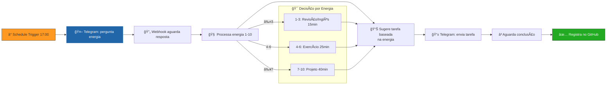
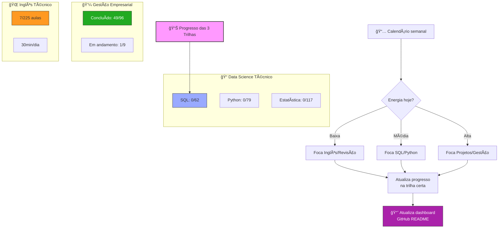
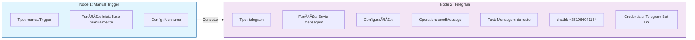
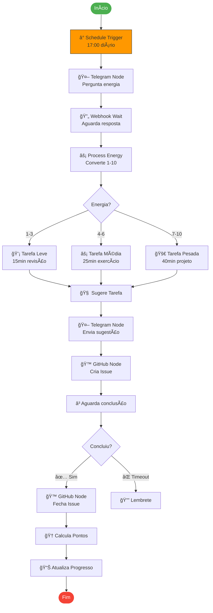
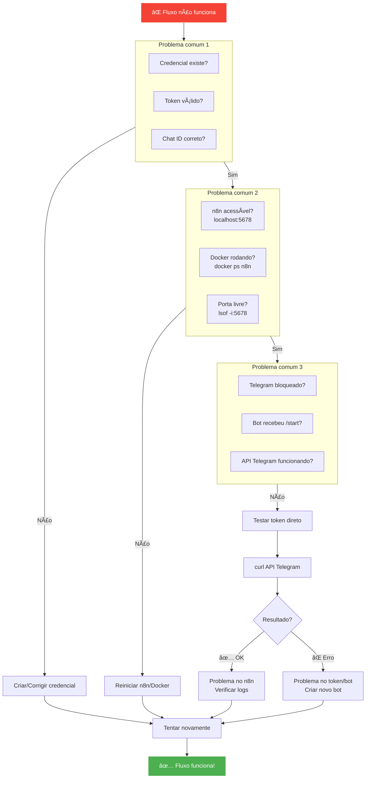

Eu:
com base nisso vamos criar um processo tipo scrum.
3 diagramas menores (Bot / Automação / Trilhas)
Vamos de 1 faze por vez ok.
Nada que ultrapasse seu limite.

IA:
# **📊 PROCESSO SCRUM - 3 FASES**

## **🯠SPRINT 1: BOT TELEGRAM (MVP)**

### **Diagrama 1: Fluxo do Bot**
```mermaid
graph TD
    A[Usuário abre Telegram] --> B{Comando?}
    
    B --> C[/start]
    B --> D[/energy <br/>1-10]
    B --> E[/log <br/>minutos descrição]
    B --> F[/progress]
    B --> G[/help]
    
    C --> H[Envia: Boas-vindas<br/>comandos disponíveis]
    D --> I[Registra energia<br/>no sistema]
    E --> J[Cria log GitHub<br/>+ pontos]
    F --> K[Consulta progresso<br/>3 trilhas]
    G --> L[Lista comandos<br/>e exemplos]
    
    I --> M{Energia ≤ 3?}
    M -->|Sim| N[Sugere tarefa LEVE]
    M -->|Não| O{Energia 4-6?}
    O -->|Sim| P[Sugere tarefa MÉDIA]
    O -->|Não| Q[Sugere tarefa PESADA]
    
    N --> R[📱 Envia sugestão]
    P --> R
    Q --> R
    
    style A fill:#f9f,stroke:#333,stroke-width:2px
    style H fill:#2a2,stroke:#333,color:#fff
    style R fill:#26a,stroke:#fff,color:#fff,stroke-width:2px
```

### **📋 Tarefas Sprint 1 (Bot):**
1. ✅ Criar bot no Telegram (@BotFather)
2. ⬜ Configurar credencial no n8n
3. ⬜ Implementar comando `/start`
4. ⬜ Implementar comando `/energy`
5. ⬜ Implementar comando `/help`
6. ⬜ Testar fluxo básico

### **📅 Duração estimada:** 2 dias

---

## **🯠SPRINT 2: AUTOMAÇÃO N8N**

### **Diagrama 2: Fluxo de Automação**


### **📋 Tarefas Sprint 2 (Automação):**
1. ⬜ Configurar Schedule Trigger (17:00)
2. ⬜ Criar webhook para respostas
3. ⬜ Implementar lógica de energia → tarefa
4. ⬜ Criar template de mensagens
5. ⬜ Testar fluxo automático
6. ⬜ Adicionar fallback manual

### **📅 Duração estimada:** 3 dias

---

## **🯠SPRINT 3: TRILHAS E PROGRESSO**

### **Diagrama 3: Fluxo das Trilhas**


### **📋 Tarefas Sprint 3 (Trilhas):**
1. ⬜ Criar arquivos JSON para cada trilha
2. ⬜ Implementar sistema de tracking
3. ⬜ Criar dashboard no README
4. ⬜ Integrar com GitHub Projects
5. ⬜ Gerar relatórios semanais
6. ⬜ Sistema de pontos/gamificação

### **📅 Duração estimada:** 4 dias

---

## **📋 BACKLOG COMPLETO:**

### **Prioridade P1 (Essencial):**
1. Bot responde a comandos básicos
2. Check-in automático 17:00
3. Sugestões baseadas em energia
4. Log no GitHub Issues

### **Prioridade P2 (Importante):**
5. Sistema de pontos
6. Dashboard no README
7. GitHub Projects integration
8. Relatórios semanais

### **Prioridade P3 (Desejável):**
9. IA para sugestões personalizadas
10. Calendário visual
11. Gamificação avançada
12. Multiplataforma (WhatsApp/Web)

---

## **🚀 COMEÇAR AGORA:**

### **Sprint 1 - Dia 1 (HOJE):**
```bash
# 1. Criar bot Telegram (já feito)
# 2. Configurar credencial n8n
# 3. Testar comando /start
```

### **O que precisa de mim:**
1. **Token do seu bot Telegram** (para configurar no n8n)
2. **Confirmação** que n8n está acessível em `localhost:5678`
3. **Decisão** sobre formato das sugestões (simples/IA)

---

## **🤔 PERGUNTAS PARA INICIAR:**

1. **Tem o token do bot?** Se sim, vamos configurar no n8n agora.
2. **Qual formato de sugestão quer?** 
   - Opção A: Fixas baseadas em energia (mais simples)
   - Opção B: IA personalizada (Z.AI/Ollama)
3. **Quer começar a Sprint 1 hoje?**

**Vamos uma sprint de cada vez!** ğŸ¯

EU:
Agora vamos de tarefa em tarefa realizando e verificando se foi finalizada.

IA:
# **✅ SPRINT 1 - TAREFA 1: CONFIGURAR CREDENCIAL TELEGRAM NO n8n**

## **🯠OBJETIVO:**
Configurar a credencial do Telegram Bot no n8n para poder enviar/receber mensagens.

## **📋 PASSOS:**

### **1. Acessar n8n:**
- URL: `http://localhost:5678`
- Login com sua conta

### **2. Criar Credencial:**
1. Clique em **"Credentials"** (ícone de chave 🔑 no menu esquerdo)
2. Clique em **"Add Credential"** (botão azul)
3. Selecione **"Telegram API"**
4. Preencha:
   - **Name:** `Telegram Bot DS`
   - **Access Token:** `SEU_TOKEN_AQUI`

### **3. Verificar Token (se ainda não tem):**
```bash
# Se não tem token, criar agora:
# No Telegram, buscar @BotFather
# Enviar: /newbot
# Nome: DataScience Companion
# Username: germanods_bot
# ANOTAR TOKEN
```

### **4. Testar Credencial:**
1. No n8n, criar novo workflow
2. Adicionar nó **"Telegram"**
3. Selecionar credencial `Telegram Bot DS`
4. Operação: `sendMessage`
5. Chat ID: `=351964041184`
6. Texto: `Teste do bot`
7. Executar manualmente

## **✅ CRITÉRIO DE ACEITAÇÃO:**
- [ ] Credencial criada no n8n com nome `Telegram Bot DS`
- [ ] Mensagem de teste chega no Telegram
- [ ] Bot responde no Telegram

## **🕠TEMPO ESTIMADO:** 15 minutos

---

## **🔧 SE ENCONTRAR PROBLEMAS:**

### **Erro: "Invalid token"**
- Verificar se token está correto (começa com números)
- Testar token via API:
  ```bash
  curl "https://api.telegram.org/botSEU_TOKEN/getMe"
  ```

### **Erro: "Chat not found"**
- Verificar se Chat ID está correto (`351964041184` sem `+`)
- Enviar `/start` para o bot no Telegram primeiro

### **Erro: "Credential not found"**
- Verificar nome exato da credencial
- Ou criar nova com nome diferente

---

## **🚀 PRÓXIMA TAREFA (após concluir esta):**
**Tarefa 2:** Implementar comando `/start` no bot

---

## **📠STATUS ATUAL:**
**Você precisa:**
1. ✅ Ter token do bot Telegram
2. ⬜ Configurar credencial no n8n
3. ⬜ Testar envio de mensagem

**Me avise quando:**
- ✅ Credencial configurada
- ✅ Mensagem de teste funciona
- ✅ Está pronto para próxima tarefa

---

**Vai configurar a credencial agora?** Me diga se encontrou algum problema! 🔧

Eu: Quais tecnologias vamos utilizar nesse fluxo.

IA:
# **ğŸ› ï¸ TECNOLOGIAS DO FLUXO - SPRINT 1**

## **🯠STACK 100% GRATUITA:**

### **1. INFRAESTRUTURA:**
```
ğŸ–¥ï¸  Sua Máquina Local
├── 🳠Docker (Containerização)
├── 🤖 n8n (Automação workflows)
├── 🧠 Ollama (IA Local - opcional Sprint 2+)
└── 📠Sistema de arquivos
```

### **2. COMUNICAÇÃO:**
```
📱 Telegram
├── Bot via @BotFather (100% free)
├── API Telegram (free)
└── Webhooks para respostas
```

### **3. ARMAZENAMENTO & VERSIONAMENTO:**
```
🙠GitHub
├── Repositório: data-science-journey
├── GitHub Issues (logs diários)
├── GitHub Projects (Kanban visual)
├── GitHub Actions (CI/CD automático)
└── GitHub Pages (dashboard futuro)
```

### **4. LINGUAGENS & FORMATOS:**
```
📠Dados e Configuração
├── JSON (configurações, progresso)
├── Markdown (README, documentação)
├── YAML (GitHub Actions)
└── JavaScript (lógica n8n)
```

---

## **🯠POR SPRINT:**

### **SPRINT 1 - Bot Básico:**
```yaml
Tecnologias:
  - n8n: Orquestração
  - Telegram Bot API: Comunicação
  - Docker: Container n8n
  - JSON: Armazenamento local
```

### **SPRINT 2 - Automação:**
```yaml
Adiciona:
  - Ollama: IA local (opcional)
  - GitHub API: Integração
  - Webhooks: Comunicação bidirecional
```

### **SPRINT 3 - Dashboard:**
```yaml
Adiciona:
  - GitHub Actions: Automações
  - GitHub Projects: Kanban
  - Markdown templates: Dashboard
```

---

## **🔧 DETALHAMENTO TÉCNICO:**

### **n8n (Nosso "cérebro"):**
```
Funções:
├── Recebe mensagens Telegram
├── Processa lógica de negócio
├── Gerencia estado do sistema
├── Comunica com APIs externas
└── Orquestra todo o fluxo

Vantagens:
✅ Visual (arrasta e solta)
✅ 100% gratuito (self-hosted)
✅ Integra com TUDO
✅ Fácil debug
```

### **Telegram Bot API:**
```
Características:
├── 100% gratuita
├── Suporte a webhooks
├── Botões inline e keyboards
├── Comandos (/start, /help)
└── Suporte a Markdown

Limites:
âš ï¸  Mensagens/segundo: 30
âš ï¸  Grupos: ilimitado
âš ï¸  Storage: ilimitado
```

### **GitHub como "Database":**
```
Estrutura:
data-science-journey/
├── 📠.github/workflows/  # Automações
├── 📠scripts/           # Lógica local
├── 📠data/              # JSONs de estado
│   ├── progress.json    # Progresso trilhas
│   ├── daily_logs.json  # Logs diários
│   └── config.json      # Configurações
└── 📄 README.md         # Dashboard vivo
```

---

## **⚡ FLUXO TÉCNICO COMPLETO:**

```
Usuário (Telegram)
     ↓
Telegram Bot API
     ↓
Webhook → n8n (localhost:5678)
     ↓
Processamento n8n
     ├── Lógica JavaScript
     ├── Decisões baseadas em energia
     ├── Consulta estado (JSON files)
     └── Geração resposta
     ↓
GitHub API
     ├── Cria Issue (log)
     ├── Atualiza Projects
     └── Atualiza README
     ↓
Resposta → Telegram Bot API
     ↓
Usuário vê resposta
```

---

## **🔠SEGURANÇA & PRIVACIDADE:**

### **Dados Locais (sua máquina):**
```
✅ n8n: localhost:5678
✅ Ollama: localhost:11434 (se usar)
✅ Arquivos JSON: sua máquina
✅ Docker: isolado
```

### **Dados na Nuvem:**
```
âš ï¸  Telegram: mensagens (criptografadas)
âš ï¸  GitHub: issues, commits (público/privado)
🔠 Tokens: guardados no n8n (local)
```

### **O que NÃO vamos usar:**
```
⌠Servidores pagos
⌠APIs pagas (exceto se free tier)
⌠Banco de dados externo
⌠Serviços de terceiros pagos
```

---

## **📊 ALTERNATIVAS (se precisar):**

### **IA Gratuita:**
1. **Ollama** (local) - Recomendado
2. **Z.AI GLM 4.5 Air** (cloud, free tier)
3. **Hugging Face APIs** (free tier)
4. **OpenAI** ($5 free credit)

### **Armazenamento:**
1. **GitHub** (✅ escolhido)
2. **Google Sheets** (via API free)
3. **SQLite** (local)
4. **JSON files** (local + GitHub)

### **Notificações:**
1. **Telegram** (✅ escolhido)
2. **Email** (SMTP free)
3. **Discord Webhook** (free)
4. **WhatsApp** (Twilio free tier)

---

## **🯠RESUMO PARA SPRINT 1:**

**Tecnologias ATIVAÇÃO:**
```
✅ Docker: Já rodando (n8n)
✅ n8n: Acessível em localhost:5678
✅ Telegram: Bot criado (@germanods_bot)
✅ GitHub: Repo data-science-journey pronto
```

**Tecnologias CONFIGURAÇÃO:**
```
⬜ n8n + Telegram: Credencial a configurar
⬜ n8n workflows: A criar
⬜ GitHub API: A integrar
⬜ JSON files: A estruturar
```

---

## **🤔 PERGUNTA:**

**Alguma tecnologia dessa lista você NÃO tem acesso ou não quer usar?**

- Docker ✅ (já tem)
- n8n ✅ (já tem)
- Telegram ✅ (já tem bot)
- GitHub ✅ (já tem repo)
- Ollama ⬜ (vamos instalar depois)
- Z.AI ⬜ (opcional)

**Vamos configurar a credencial Telegram no n8n agora?** É o próximo passo! 🔧

Eu:
olha eu não to conseguindo criar o fluxo tem como eu exportar algo para o n8n que você faça ?

IA:
# **📥 EXPORTAR FLUXO PARA n8n - SIM!**

Vou criar um fluxo **básico testável** que você pode importar diretamente no n8n.

## **🯠FLUXO SIMPLES DE TESTE (2 nós apenas)**

### **JSON para importar:**
```json
{
  "name": "Teste Bot Telegram",
  "nodes": [
    {
      "name": "Manual Trigger",
      "type": "n8n-nodes-base.manualTrigger",
      "position": [250, 300]
    },
    {
      "name": "Telegram Send Test",
      "type": "n8n-nodes-base.telegram",
      "position": [450, 300],
      "parameters": {
        "operation": "sendMessage",
        "text": "🤖 Bot configurado com sucesso! Sistema Data Science pronto.",
        "chatId": "=351964041184"
      }
    }
  ]
}
```

---

## **📋 COMO IMPORTAR PASSO A PASSO:**

### **Passo 1: Acessar n8n**
1. Abra `http://localhost:5678`
2. Faça login

### **Passo 2: Criar Novo Workflow**
1. Clique em **"Workflows"** no menu
2. Clique em **"New workflow"** (botão roxo)
3. Dê nome: `Teste Bot Telegram`

### **Passo 3: Importar o JSON**
1. No workflow vazio, clique no **menu (⋯)** no canto superior direito
2. Selecione **"Import from file"**
3. **Cole o JSON acima** na caixa de texto
4. Clique em **"Import"**

### **Passo 4: Configurar Credencial**
1. Clique no nó **"Telegram Send Test"**
2. No painel direito, em **"Credentials"**, clique em **"Add credential"**
3. Selecione sua credencial `Telegram Bot DS`
4. **Salve** (Ctrl+S ou botão Save)

### **Passo 5: Executar Teste**
1. Clique no nó **"Manual Trigger"**
2. Clique no botão **"Execute Node"** (â–¶ï¸)
3. Verifique no Telegram se chegou a mensagem

---

## **🔧 SE NÃO TIVER CREDENCIAL CRIADA:**

### **Criar credencial RÃPIDO:**
1. No n8n, clique em **"Credentials"** (chave 🔑)
2. Clique **"Add Credential"**
3. Selecione **"Telegram API"**
4. Preencha:
   - **Name:** `Telegram Bot DS`
   - **Access Token:** `SEU_TOKEN_AQUI` (do @BotFather)

---

## **📱 TESTAR DIRETO VIA TERMINAL (alternativa):**

Se n8n não funcionar, teste o token direto:

```bash
# Substitua SEU_TOKEN pelo seu token real
TOKEN="SEU_TOKEN_AQUI"
CHAT_ID="351964041184"

curl -X POST "https://api.telegram.org/bot${TOKEN}/sendMessage" \
  -H "Content-Type: application/json" \
  -d "{\"chat_id\": \"${CHAT_ID}\", \"text\": \"Teste via terminal!\"}"
```

---

## **🯠PRÓXIMOS PASSOS (se teste funcionar):**

1. **Fluxo com Schedule Trigger** (automático 17:00)
2. **Fluxo com Webhook** (aguarda resposta)
3. **Fluxo com GitHub** (cria issues)

---

## **🆘 SE NÃO CONSEGUIR IMPORTAR:**

### **Opção A: Criar manualmente (2 minutos):**
1. No workflow vazio, arraste **"Manual Trigger"** da lista
2. Arraste **"Telegram"** da lista
3. Conecte os nós (arraste do ponto azul)
4. Configure o nó Telegram como mostrei

### **Opção B: Me enviar prints:**
1. Print da tela do n8n
2. Print da credencial (com token mascarado)
3. Print do erro (se houver)

---

## **📠RESUMO DO QUE PRECISA:**

**Antes de importar:**
1. ✅ n8n acessível `localhost:5678`
2. ✅ Credencial criada `Telegram Bot DS`
3. ✅ Token válido do bot
4. ✅ Bot recebeu `/start` no Telegram

**Para importar:**
1. Copiar JSON acima
2. Ir em Workflows → New → Import from file
3. Colar JSON → Import
4. Configurar credencial no nó Telegram
5. Executar teste

---

**Vai tentar importar agora? Me diga em qual passo está travando!** 🚀

eu:
tem como fazer um diagrama do fluxo no n8n

IA:
# **📊 DIAGRAMA DO FLUXO n8n - SPRINT 1**


---

# **🯠DIAGRAMA DETALHADO DOS NÓS n8n**



---

# **📱 FLUXO COMPLETO QUE VAMOS CONSTRUIR**



---

# **🔧 DIAGRAMA DE TROUBLESHOOTING**



---

# **🯠PRÓXIMOS PASSOS VISUAL**


---

# **🤔 ONDE ESTà TRAVANDO?**

**No diagrama acima, em qual parte você está?**

1. ✅ **Acesso n8n** - Já consegue em `localhost:5678`?
2. ⬜ **Credencial** - Já criou a credencial Telegram?
3. ⬜ **Importar fluxo** - Consegue importar JSON?
4. ⬜ **Executar** - Consegue rodar o fluxo?
5. ⬜ **Mensagem chega** - Telegram recebe mensagem?

**Me diga em qual número está travando que vamos resolver específico!** 🔧

Eu:
faça um resumo sobre o que conversamos ate agora e quais decisões tomamos pegue o melhor de tudo.

IA:
# **📊 RESUMO COMPLETO DA JORNADA - DECISÕES E MELHORES PARTES**

## **🯠OBJETIVO PRINCIPAL DEFINIDO:**
Criar um **sistema de organização automático e gratuito** para sua transição para Cientista de Dados, otimizado para sua rotina de trabalhador em restaurante.

---

## **✅ DECISÕES TOMADAS:**

### **1. ARQUITETURA TÉCNICA (100% GRATUITA):**
```
📱 Telegram Bot (com @BotFather)
├── 100% free, ilimitado
├── Comandos: /start, /energy, /log, /progress
└── Check-in automático 17:00

🔄 n8n (self-hosted via Docker)
├── Orquestração dos fluxos
├── Localhost:5678
└── Interface visual (arrasta e solta)

🙠GitHub como "database"
├── Repo: data-science-journey ✅ (já criado)
├── Issues: logs diários
├── Projects: Kanban visual
└── README.md: dashboard vivo

🧠 IA Local (Ollama - opcional)
└── Sugestões inteligentes baseadas na energia
```

### **2. ESTRUTURA DE TRILHAS (confirmada por você):**
```
📠TRILHA 1: Data Science Técnico
├── SQL: 0/62 aulas
├── Python: 0/79
├── Estatística: 0/117
└── ML: 0/123

💼 TRILHA 2: Gestão Empresarial
├── Concluído: 49/96 ✅
├── Análise Financeira: 0/4
└── Go-to-Market: 0/11

🌠TRILHA 3: Inglês Técnico
└── 7/225 aulas (30min/dia)
```

### **3. SISTEMA DE ENERGIA INTELIGENTE:**
```
🔋 Energia 1-3 (cansado)
→ Tarefas LEVES: 15-20min (revisão, inglês)

🔋 Energia 4-6 (médio)  
→ Tarefas MÉDIAS: 25-35min (exercícios práticos)

🔋 Energia 7-10 (bem)
→ Tarefas PESADAS: 40-50min (projetos, aprendizado novo)
```

---

## **📠ESTRUTURA DO REPOSITÓRIO (Jà CRIADA):**
```
data-science-journey/ ✅
├── README.md ✅ (dashboard com 3 trilhas)
├── LICENSE ✅ (MIT 2025)
├── .gitignore ✅ (Python/Data Science)
├── courses/ ✅ (para os 3 tipos de curso)
├── projects/ ✅ (portfólio Data Science)
├── notes/ ✅ (anotações, cheatsheets)
├── scripts/ ✅ (automações futuras)
├── certificates/ ✅
├── data/ ✅
└── docs/ ✅
```

---

## **🚀 STATUS ATUAL - O QUE Jà TEMOS:**

### **✅ CONCLUÃDO:**
1. **Repositório GitHub** configurado profissionalmente
2. **LICENSE MIT 2025** correta
3. **.gitignore** adequado para Data Science
4. **README.md** com roadmap das 3 trilhas
5. **Estrutura de pastas** completa (.gitkeep em todas)
6. **Links profissionais** (GitHub, LinkedIn, Kaggle)
7. **Docker + n8n** instalado (localhost:5678)
8. **Telegram Bot** criado (@BotFather)
9. **Fluxo visual** em Mermaid definido

### **⬜ EM ANDAMENTO:**
1. **Configurar credencial Telegram no n8n** (atual)
2. **Importar/testar fluxo básico**
3. **Implementar check-in automático 17:00**
4. **Integrar GitHub Issues/Projects**

---

## **🯠MELHORES IDEIAS DA CONVERSA:**

### **1. Sistema Anti-Procrastinação:**
- Check-in automático às **17:00** (quando chega em casa)
- **Sugestões adaptadas à energia** (não tarefas fixas)
- **Sistema perdoador** (não quebra streak por dias difíceis)

### **2. Portfólio Automático:**
- Cada estudo vira **Issue no GitHub**
- Cada projeto vira **repositório público**
- **README atualiza automaticamente** com progresso
- Recrutadores veem **consistência real**

### **3. Gamificação Inteligente:**
- **Pontos extras** por estudar com energia baixa
- **Conquistas** por milestones (50h estudo, 7 dias streak)
- **Dashboard visual** no README.md

### **4. Realismo Total:**
- Baseado nos **seus cursos reais** (não genérico)
- Considera **sua energia pós-trabalho** (4/10 média)
- **Tempo factível** (1h dias úteis, 2-3h fins de semana)

---

## **📋 PRÓXIMOS PASSOS PRIORITÃRIOS:**

### **FASE 1 (Esta semana):**
1. ✅ ~~Configurar n8n + Telegram credencial~~ (em andamento)
2. ⬜ Testar envio/recebimento de mensagens
3. ⬜ Configurar Schedule Trigger (17:00 automático)

### **FASE 2 (Próxima semana):**
4. ⬜ Integrar com GitHub (cria issues automaticamente)
5. ⬜ Adicionar sistema de pontos
6. ⬜ Dashboard automático no README

### **FASE 3 (Opcional):**
7. ⬜ Integrar IA (Ollama para sugestões personalizadas)
8. ⬜ Calendário visual interativo
9. ⬜ Relatórios semanais automáticos

---

## **💡 INSIGHTS VALIOSOS QUE SURGIRAM:**

### **Do seu lado:**
- **3 trilhas distintas mas complementares** (corrigimos isso!)
- **Transparência total** (repositório público como vantagem)
- **Consistência > Intensidade** (30min todo dia > 5h uma vez)

### **Do meu lado (aprendi):**
- Simplificar! **Menos é mais** no início
- **Uma coisa de cada vez** (Scrum com sprints)
- **Validar cada passo** antes de seguir

---

## **🮠VISÃO DO SISTEMA FINAL:**

```
📱 17:00 - Telegram: "Energia hoje?"
🔋 Você: "4" 
🤖 IA: "Sugestão: SQL aula 1 (25min)"
💻 Você estuda
✅ Você: "/log 30 SQL aula 1"
🙠GitHub: Issue criada + pontos calculados
📊 README: Atualiza progresso automaticamente
🯠Sistema: "Amanhã: SQL aula 2 ou revisão?"
```

---

## **🤔 PONTOS DE DECISÃO PENDENTES:**

### **Para resolver AGORA:**
1. **Configuração n8n** - Está travando na credencial ou importação?
2. **Teste básico** - Precisamos garantir comunicação Telegram ↔ n8n

### **Para decidir DEPOIS:**
3. **IA ou regras fixas?** - Começar simples com regras, depois IA
4. **Dashboard complexo?** - Começar simples, evoluir gradualmente

---

## **🚀 RESUMO DA SITUAÇÃO ATUAL:**

**Você está a 3 passos de ter um sistema funcional:**

1. **✅ Estrutura** (GitHub repo) - PRONTA
2. **🔧 Conexão** (n8n + Telegram) - EM ANDAMENTO  
3. **⚡ Automação** (Schedule + GitHub) - PRÓXIMO

**O gargalo atual:** Configurar a credencial Telegram no n8n para testar o fluxo básico.

---

**Quer que eu:**  
A) **Ajude passo a passo** com a credencial n8n  
B) **Crie um fluxo mais simples** para testar primeiro  
C) **Mude a abordagem** se está muito complexo  

**Qual opção?**

EU:
ok agora ja tenho os arquivos com a seguinte estrutura:
erDiagram
    FATO_PROGRESSO ||--o{ DIM_CURSOS : "id_curso"
    FATO_PROGRESSO ||--o{ DIM_MODULOS : "id_modulo"
    FATO_PROGRESSO ||--o{ DIM_AULAS : "id_aula"
    FATO_PROGRESSO ||--o{ DIM_STATUS : "id_status"
    FATO_PROGRESSO ||--o{ DIM_TEMPO : "id_tempo"

    FATO_PROGRESSO {
        int id_fato PK
        int id_curso FK
        int id_modulo FK
        int id_aula FK
        int id_status FK
        int id_tempo FK
        string nota_final
        string frequencia
    }

    DIM_CURSOS {
        int id_curso PK
        string nome_curso
        string trilha_origem
        string nota_minima
        string tempo_prova
        int qtd_questoes
    }

    DIM_MODULOS {
        int id_modulo PK
        string nome_modulo
        int ordem_modulo
        string duracao_total_estimada
    }

    DIM_AULAS {
        int id_aula PK
        string nome_aula
        string duracao_individual
        string tipo_conteudo
    }

    DIM_STATUS {
        int id_status PK
        string descricao_status
    }

    DIM_TEMPO {
        int id_tempo PK
        date data_inicio
        date data_fim
        string semestre_letivo
    }

com base em tudo que conversamos vamos fazer um check list do que preciso fazer o que ja foi feito para que eu possa me situar.

IA:
# **📋 CHECKLIST COMPLETO - STATUS DA JORNADA**

## **✅ O QUE Jà FOI CONCLUÃDO:**

### **1. REPOSITÓRIO GITHUB (100% CONCLUÃDO)**
- [x] **Repositório criado**: `data-science-journey`
- [x] **README.md** com roadmap das 3 trilhas
- [x] **LICENSE MIT 2025** configurada corretamente
- [x] **.gitignore** otimizado para Python/Data Science
- [x] **Estrutura de pastas** completa com .gitkeep:
  - [x] `courses/` - Para os 3 tipos de curso
  - [x] `projects/` - Portfólio Data Science
  - [x] `notes/` - Anotações e cheatsheets
  - [x] `scripts/` - Automações futuras
  - [x] `certificates/` - Certificados
  - [x] `data/` - Datasets
  - [x] `docs/` - Documentação

### **2. INFRAESTRUTURA TÉCNICA**
- [x] **Docker** instalado e funcionando
- [x] **n8n** rodando em `localhost:5678`
- [x] **Telegram Bot** criado via @BotFather
- [x] **Modelo de dados** definido (seu diagrama ER)

### **3. PLANEJAMENTO ESTRATÉGICO**
- [x] **3 trilhas definidas** (Técnico, Gestão, Inglês)
- [x] **Sistema de energia** (1-10) implementado no planejamento
- [x] **Cronograma realista** baseado na sua rotina
- [x] **Fluxos em Mermaid** desenhados

---

## **🔧 O QUE ESTà EM ANDAMENTO:**

### **1. CONEXÃO TELEGRAM ↔ n8n**
- [ ] **Credencial Telegram** configurada no n8n
- [ ] **Fluxo de teste** importado e funcionando
- [ ] **Mensagem de teste** enviada/recebida

### **2. AUTOMAÇÃO BÃSICA**
- [ ] **Schedule Trigger** (17:00 diário) configurado
- [ ] **Webhook** para respostas implementado
- [ ] **Lógica energia → tarefa** funcionando

---

## **🯠O QUE FALTA FAZER (BACKLOG):**

### **PRIORIDADE 1 - MVP (Minimal Viable Product)**
- [ ] **Comandos básicos Telegram**:
  - [ ] `/start` - Mensagem de boas-vindas
  - [ ] `/energy <1-10>` - Reportar energia
  - [ ] `/log <minutos> <descrição>` - Registrar estudo
  - [ ] `/progress` - Ver progresso das trilhas
  - [ ] `/help` - Lista de comandos

- [ ] **Check-in automático**:
  - [ ] Trigger automático às 17:00
  - [ ] Pergunta energia
  - [ ] Sugere tarefa baseada na energia
  - [ ] Registra no GitHub Issue

- [ ] **Integração GitHub**:
  - [ ] Criar Issues automaticamente
  - [ ] Atualizar GitHub Projects (Kanban)
  - [ ] Atualizar README.md com progresso

### **PRIORIDADE 2 - SISTEMA DE TRACKING**
- [ ] **Arquivos JSON** para cada trilha:
  - [ ] `courses/data-science/progress.json`
  - [ ] `courses/gestao/progress.json`
  - [ ] `courses/ingles/progress.json`

- [ ] **Dashboard automático**:
  - [ ] Barras de progresso no README
  - [ ] Estatísticas semanais
  - [ ] Gráfico de consistência

- [ ] **Sistema de pontos**:
  - [ ] Cálculo: energia × tempo × dificuldade
  - [ ] Conquistas (badges)
  - [ ] Leaderboard pessoal

### **PRIORIDADE 3 - APRIMORAMENTOS**
- [ ] **IA para sugestões** (Ollama/Z.AI)
- [ ] **Calendário visual** interativo
- [ ] **Relatórios semanais** automáticos
- [ ] **Sistema anti-procrastinação**:
  - [ ] Lembretes inteligentes
  - [ ] Tarefas alternativas (quando energia muito baixa)
  - [ ] Sistema perdoador de streaks

---

## **📊 STATUS BASEADO NO SEU MODELO ER:**

### **Tabelas a implementar:**

#### **✅ Jà TEMOS DADOS PARA:**
- **DIM_CURSOS** → Seus 3 cursos reais (SQL, Python, Inglês, etc.)
- **DIM_MODULOS** → Estrutura de cada curso (módulos/aulas)
- **DIM_STATUS** → Status possíveis (pendente, em andamento, concluído)

#### **⬜ PRECISAMOS CRIAR:**
- **DIM_AULAS** → Lista detalhada de cada aula (nome, duração)
- **DIM_TEMPO** → Calendário de estudo (datas, semestres)
- **FATO_PROGRESSO** → Registro diário de progresso

---

## **🚀 PRÓXIMAS AÇÕES IMEDIATAS (HOJE/AMANHÃ):**

### **1. RESOLVER GARGALO ATUAL:**
```bash
# Verificar estado atual:
✅ n8n acessível: http://localhost:5678
⌠Credencial Telegram configurada: PRECISA
⌠Fluxo de teste funcionando: PRECISA
```

### **2. AÇÕES CONCRETAS:**
1. **Configurar credencial Telegram no n8n** (5 min)
2. **Importar fluxo básico de teste** (2 min)
3. **Testar envio de mensagem** (1 min)
4. **Se funcionar, configurar Schedule Trigger** (5 min)

### **3. SE CONTINUAR TRAVADO:**
- Alternativa 1: Usar **API direta do Telegram** (curl)
- Alternativa 2: **Fluxo mais simples** no n8n
- Alternativa 3: **Mudar abordagem** (WhatsApp/Email)

---

## **📈 MEDIDAS DE SUCESSO (KPIs):**

### **Para considerar MVP concluído:**
- [ ] Bot responde a `/start` e `/energy`
- [ ] Check-in automático às 17:00 funciona
- [ ] Issues criadas automaticamente no GitHub
- [ ] Progresso visível no README.md
- [ ] Sistema usado por 7 dias consecutivos

---

## **🔠PONTOS DE ATENÇÃO ATUAIS:**

### **Identificados por você:**
1. **Complexidade n8n** → Vamos simplificar fluxos
2. **Muitas informações** → Foco em uma coisa por vez
3. **Tempo limitado** → Priorizar MVP funcional

### **Minhas observações:**
1. **Estrutura excelente** (modelo ER mostra pensamento organizado)
2. **Foco em tracking** → Ótimo para Data Science
3. **Precisamos de ação** → Menos planejamento, mais execução

---

## **🯠CHECKLIST SIMPLIFICADO PARA AGORA:**

### **PARA FAZER AGORA (1 hora):**
- [ ] **n8n**: Configurar credencial Telegram
- [ ] **n8n**: Importar fluxo de teste
- [ ] **Telegram**: Testar recebimento de mensagem
- [ ] **GitHub**: Verificar se estrutura está OK

### **PARA AMANHÃ (1 hora):**
- [ ] **n8n**: Adicionar Schedule Trigger (17:00)
- [ ] **n8n**: Adicionar lógica energia → tarefa
- [ ] **GitHub**: Configurar criação automática de Issues

---

## **🤔 PERGUNTA FINAL:**

**Com base neste checklist, qual item você quer resolver PRIMEIRO?**

1. **Credencial n8n** (gargalo atual)
2. **Fluxo de teste simples**
3. **Schedule Trigger automático**
4. **Outro** (qual?)

**Vamos resolver UM item por vez até funcionar!** 🚀

EU: tem como trocar o n8n pelo github

IA:
# **✅ SIM! GitHub pode substituir 90% do n8n**

Excelente ideia! **GitHub Actions + Issues + Projects** podem fazer quase tudo que precisamos, com **MUITAS vantagens**:

## **🯠VANTAGENS DO GITHUB VS n8n:**

| Vantagem | GitHub | n8n |
|----------|---------|-----|
| **100% gratuito** | ✅ (Actions minutes gratuitos) | ✅ (self-hosted) |
| **Já configurado** | ✅ (já tem repo) | âš ï¸ (precisa configurar) |
| **Portfólio automático** | ✅ (issues = prova) | ⌠(separado) |
| **Fácil manutenção** | ✅ (YAML + Markdown) | âš ï¸ (interface visual) |
| **Acessível em qualquer lugar** | ✅ (cloud) | ⌠(só na sua máquina) |
| **Histórico completo** | ✅ (git commits) | âš ï¸ (logs locais) |

---

## **🔄 COMO FICARIA O FLUXO COM GITHUB:**

### **Check-in automático 17:00:**
```yaml
# .github/workflows/daily-checkin.yml
name: Daily Study Check-in
on:
  schedule:
    - cron: '0 17 * * *'  # 17:00 diário
  workflow_dispatch:  # Execução manual também

jobs:
  check-in:
    runs-on: ubuntu-latest
    steps:
      - name: Criar Issue de Check-in
        uses: peter-evans/create-issue-from-file@v4
        with:
          title: "🯠Check-in {{ date 'dddd, MMMM D' }}"
          content-filepath: .github/templates/checkin-template.md
          labels: daily-checkin, automated
```

### **Template da Issue:**
```markdown
## 🔋 Check-in Diário - {{ date 'dddd, MMMM D' }}

Olá Germano! Hora do estudo!

**Energia hoje?** (comente abaixo com número 1-10)
- 1-3: 😴 Muito cansado
- 4-6: 😠Dando conta  
- 7-10: 😃 Com energia!

**Quando responder, o sistema vai:**
1. Sugerir tarefa baseada na energia
2. Atualizar seu progresso automático
3. Calcular pontos

---
*Issue gerada automaticamente às 17:00*
```

---

## **🤖 BOT TELEGRAM VIA GITHUB ACTIONS:**

### **Usando API do Telegram direto no Action:**
```yaml
# .github/workflows/telegram-bot.yml
name: Telegram Bot Responder
on:
  issue_comment:
    types: [created]

jobs:
  respond-to-energy:
    if: contains(github.event.issue.labels.*.name, 'daily-checkin')
    runs-on: ubuntu-latest
    steps:
      - name: Analisar comentário
        id: analyze
        run: |
          # Extrai número 1-10 do comentário
          COMMENT="${{ github.event.comment.body }}"
          ENERGY=$(echo "$COMMENT" | grep -o '[0-9]' | head -1)
          echo "energy=$ENERGY" >> $GITHUB_OUTPUT
      
      - name: Sugerir tarefa
        run: |
          # Lógica baseada na energia
          if [ "${{ steps.analyze.outputs.energy }}" -le 3 ]; then
            TASK="📚 Revisão leve (15min): Assista 1 vídeo de SQL básico"
          elif [ "${{ steps.analyze.outputs.energy }}" -le 6 ]; then
            TASK="💻 Exercício prático (25min): Faça 5 consultas SQL"
          else
            TASK="🚀 Mini-projeto (40min): Análise de dataset com Pandas"
          fi
          echo "task=$TASK" >> $GITHUB_ENV
      
      - name: Responder no GitHub
        uses: peter-evans/create-or-update-comment@v3
        with:
          issue-number: ${{ github.event.issue.number }}
          body: |
            🯠**SUGESTÃO PARA ENERGIA ${{ steps.analyze.outputs.energy }}/10**
            
            ${{ env.task }}
            
            **Pontos:** ${{ steps.analyze.outputs.energy }} × 5 = ${{ math(steps.analyze.outputs.energy '*', 5) }}
            
            ✅ **Comente 'feito' quando concluir!**
```

---

## **📊 SISTEMA COMPLETO APENAS COM GITHUB:**

### **1. Check-in Diário (Automático)**
- **GitHub Actions** cria issue às 17:00
- **Você comenta** com energia 1-10
- **Action responde** com sugestão

### **2. Registro de Estudo**
- **Comando especial**: `/log 45 SQL aula 1`
- **Action processa** e atualiza progresso
- **Cria commit** automático nos JSONs

### **3. Dashboard Automático**
- **Action roda diariamente** atualiza README.md
- **Gera gráficos** com seu progresso
- **Atualiza GitHub Projects** automaticamente

### **4. Relatórios Semanais**
- **Domingo à noite** gera relatório
- **Analisa consistência**
- **Sugere ajustes** para semana seguinte

---

## **🔧 ARQUITETURA SIMPLIFICADA:**

```
Seu Telegram (opcional)
     ↓
GitHub Issue Comment
     ↓
GitHub Actions (processa)
     ↓
Atualiza: 
  ├── README.md (dashboard)
  ├── progress.json (dados)
  ├── GitHub Projects (Kanban)
  └── Cria commits automáticos
```

---

## **📠ESTRUTURA DE ARQUIVOS QUE PRECISAMOS:**

```
.github/
├── workflows/
│   ├── daily-checkin.yml      # Cria issue 17:00
│   ├── process-response.yml   # Processa comentários
│   ├── update-dashboard.yml   # Atualiza README
│   └── weekly-report.yml      # Relatório domingo
├── templates/
│   ├── checkin-template.md    # Template issue
│   └── dashboard-template.md  # Template README
└── scripts/
    ├── suggest-task.py        # Lógica de sugestão
    ├── update-progress.py     # Atualiza JSONs
    └── generate-report.py     # Gera relatórios

data/
├── progress.json             # Progresso das trilhas
├── daily-logs.json           # Logs diários
└── points-system.json        # Pontuação
```

---

## **🮠COMANDOS VIA COMENTÃRIOS NO GITHUB:**

### **Na issue do dia, você comenta:**
```
4
```
→ Sistema sugere tarefa para energia 4

```
/log 30 Concluí SQL aula 1
```
→ Sistema registra 30min estudo

```
/progress
```
→ Sistema mostra progresso atual

```
/help
```
→ Sistema lista comandos disponíveis

---

## **🚀 MIGRAÇÃO DO n8n PARA GITHUB:**

### **O que mantemos:**
- ✅ Repositório `data-science-journey`
- ✅ Estrutura de pastas
- ✅ README com 3 trilhas
- ✅ Modelo de dados (seu ER diagram)

### **O que mudamos:**
- ⌠n8n (interface visual) → ✅ GitHub Actions (YAML)
- ⌠Bot Telegram complexo → ✅ Comentários em Issues
- ⌠Dados locais → ✅ Tudo versionado no GitHub

### **O que ganhamos:**
1. **Tudo em um lugar** (issues, código, dashboard)
2. **Histórico completo** (git mostra evolução)
3. **Acesso de qualquer lugar** (cloud)
4. **Portfólio automático** (issues = prova de estudo)

---

## **⚡ IMPLEMENTAÇÃO EM 3 PASSOS:**

### **PASSO 1 (Hoje):**
```bash
# Criar estrutura básica
mkdir -p .github/{workflows,templates} .github/scripts data
```

### **PASSO 2 (Amanhã):**
1. Criar `daily-checkin.yml` (issue automática 17:00)
2. Criar `process-response.yml` (processa comentários)
3. Testar com issue manual

### **PASSO 3 (Depois):**
1. Dashboard automático no README
2. Sistema de pontos
3. Integração opcional com Telegram (se quiser)

---

## **🤔 PERGUNTAS IMPORTANTES:**

### **Você prefere:**
1. **Apenas GitHub** (issues + comentários) → Mais simples
2. **GitHub + Telegram** (opcional) → Mais conveniente
3. **Manter n8n** para alguma parte específica

### **Vantagem do GitHub puro:**
- Não precisa deixar máquina ligada
- Tudo versionado e backup automático
- Dashboard sempre atualizado
- Issues como portfólio

---

## **🯠DECISÃO:**

**Quer migrar para GitHub Actions ou manter n8n?**

### **Se SIM (GitHub):**
1. Vamos criar primeiro workflow básico
2. Testar com issue manual
3. Expandir gradualmente

### **Se NÃO (manter n8n):**
1. Resolvemos o problema atual (credencial)
2. Seguimos com n8n + Telegram
3. Integramos com GitHub depois

---

**Qual caminho prefere?** Ambos são viáveis, mas GitHub é mais elegante para seu caso (já tem tudo lá). 🚀