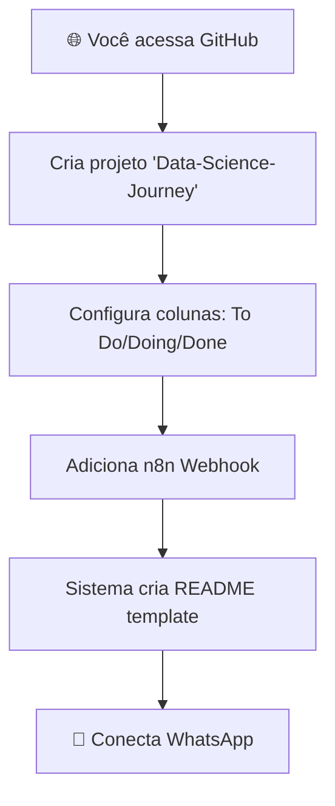
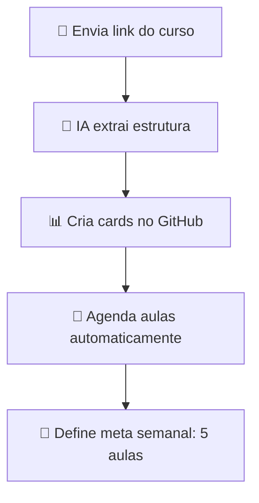
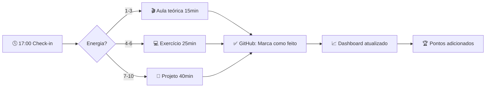

Eu:
o que cada passo faz, faça algo que eu consiga visualizar o processo e a organização.
lembrando eu tenho que add no processo as aulas do cursos?
para que assim possa criar as tarefas.
ou eu posso passar o link e a ia faz a extração dessas informações?

IA:
# **Sistema Visual de Organização - Processo Completo**

Vou criar um sistema onde você **VEJÁ** cada passo do processo. Vamos usar **GitHub Projects como dashboard visual** e integrar automaticamente com suas aulas.

## **VISÃO GERAL DO PROCESSO VISUAL**

```
📱 WHATSAPP (Início)
     ↓
🤖 IA ANALISA (Ollama)
     ↓
📊 GITHUB PROJECT (Kanban Visual)
     ↓
✅ GOOGLE SHEETS (Log Detalhado)
     ↓
📈 README.md (Dashboard Público)
```

## **1. COMO CADA PASSO FUNCIONA (Visivelmente)**

### **PASSO 1: Disparo Inicial (Você vê no WhatsApp)**
```
╔══════════════════════════════════╗
║ 📱 WHATSAPP - 17:00              ║
╠══════════════════════════════════╣
║ Olá! Como está sua energia após  ║
║ o trabalho? (1-10)              ║
║                                  ║
║ [ ] 1-3 😴                      ║
║ [ ] 4-6 😐                      ║
║ [ ] 7-10 😃                     ║
╚══════════════════════════════════╝
```

### **PASSO 2: IA Analisa + Sugere (Você vê a lógica)**
```python
# Processo visível que acontece:
def gerar_tarefa(energia, curso_atual):
    if energia <= 3:
        return "📹 Assista 1 vídeo (15min) do curso"
    elif energia <= 6:
        return "💻 Exercício prático (25min)"
    else:
        return "🚀 Mini-projeto (40min)"
    
# EXEMPLO: Energia=4, Curso="Python Data Science"
# SUGESTÃO: "💻 Faça exercício de Pandas (25min)"
```

### **PASSO 3: Atualização Visual (GitHub Project)**
```
SEU GITHUB PROJECT - KANBAN VISUAL
┌────────────────┬────────────────┬────────────────┐
│   📚 PARA FAZER   │   ⚡ FAZENDO   │   ✅ FEITO     │
├────────────────┼────────────────┼────────────────┤
│ Aula 3: Python │                │ Aula 1: Intro  │
│ Exercício 2    │                │ Aula 2: Basics │
│                │                │                │
│ 🆕 NOVO:       │                │                │
│ Pandas prática │                │                │
└────────────────┴────────────────┴────────────────┘
```

### **PASSO 4: Dashboard Automático (README.md)**
```markdown
# 📊 MEU PROGRESSO DATA SCIENCE

## 📈 ESTATÍSTICAS
• Dias consecutivos: 7 ✅
• Horas estudadas: 28h
• Tarefas completas: 42

## 🎯 PROGRESSO DOS CURSOS
┌──────────────────────┬───────────────┐
│ Curso                │ Progresso     │
├──────────────────────┼───────────────┤
│ Python Data Science  │ ████░░░░ 40%  │
│ SQL Mastery          │ ██░░░░░░ 20%  │
│ Machine Learning     │ █░░░░░░░ 10%  │
└──────────────────────┴───────────────┘
```

## **2. INTEGRAÇÃO AUTOMÁTICA DOS CURSOS**

### **OPÇÃO A: Você passa os links (Recomendado)**
1. **Envia link do curso** para o WhatsApp Bot
2. **IA extrai informações** automaticamente
3. **Cria estrutura no GitHub** com módulos

```python
# Exemplo: Você envia:
# "https://www.kultivi.com/curso/data-science"

# IA extrai:
curso = {
    "nome": "Data Science do Zero",
    "aulas": [
        {"aula": 1, "título": "Introdução", "duração": "25min"},
        {"aula": 2, "título": "Python Básico", "duração": "30min"},
        # ...
    ],
    "total_aulas": 45
}
```

### **OPÇÃO B: Sistema pede informações**
```yaml
Fluxo de cadastro do curso:
1. WhatsApp: "Qual curso quer adicionar?"
2. Você: "Python for Data Science"
3. WhatsApp: "Quantas aulas tem?"
4. Você: "30"
5. WhatsApp: "Duração média por aula?"
6. Você: "25min"
7. SISTEMA: Cria projeto no GitHub com 30 cards
```

## **3. PROCESSO COMPLETO VISUALIZADO**

### **DIA 1 - Setup Inicial**


### **DIA 2 - Adicionando Curso**


### **DIÁRIO - Fluxo de Estudo**


## **4. IMPLEMENTAÇÃO PASSO A PASSO**

### **PASSO 1: Criar Dashboard GitHub (5 min)**
```bash
# 1. Criar repositório
https://github.com/new
Nome: data-science-journey
Public: ✅ (vira portfólio!)

# 2. Criar Project Board
Settings → Projects → New project
Template: Automated kanban
Nome: "Learning Tracker"

# 3. Configurar colunas
Coluna 1: 📚 Para Estudar
Coluna 2: ⚡ Estudando Agora  
Coluna 3: ✅ Concluído
Coluna 4: 🔄 Revisão Necessária
```

### **PASSO 2: README.md Automatizado**
```markdown
<!-- README.md que atualiza automaticamente -->
# 🚀 Minha Jornada Data Science

## 📊 Progresso Hoje - {{date}}
```json
{
  "energia_inicial": "{{energy}}/10",
  "tarefa_realizada": "{{task}}",
  "tempo_gasto": "{{time}}min",
  "dificuldade": "{{difficulty}}/5"
}
```

## 🎯 Próximas Aulas Agendadas
<!-- Lista gerada automaticamente -->
1. [ ] Aula 15: Pandas GroupBy
2. [ ] Aula 16: Data Visualization
3. [ ] Exercício: Análise de Dataset
```

### **PASSO 3: Sistema de Pontos Visível**
```python
# points_system.py - Sistema gamificado
def calcular_pontos(tarefa, energia):
    pontos_base = {
        'video': 10,
        'exercicio': 25,
        'projeto': 50,
        'revisao': 15
    }
    
    # Bônus por baixa energia (esforço extra)
    if energia <= 3:
        bonus = 20
    elif energia <= 6:
        bonus = 10
    else:
        bonus = 5
        
    return pontos_base[tarefa] + bonus

# Exemplo no README.md
"""
🏆 SISTEMA DE PONTOS
Dia 01: 35 pontos ⭐
Dia 02: 42 pontos ⭐⭐
Dia 03: 28 pontos ⭐
TOTAL: 105 pontos 🏅
"""
```

## **5. EXEMPLO REAL DE UM DIA**

### **17:00 - Check-in**
```yaml
WhatsApp Bot: "Olá! Energia hoje? (1-10)"
Você: "4"
Bot: "Você está na aula 12 de 45 do curso Python.
      Sugestão: Assistir aula 12 (22min) - Funções em Python"
```

### **17:05 - GitHub Project Atualiza**
```
ANTES:
📚 PARA ESTUDAR: [Aula 11][Aula 12][Aula 13]
⚡ ESTUDANDO: [ ]
✅ CONCLUÍDO: [Aula 1-10]

DEPOIS:
📚 PARA ESTUDAR: [Aula 13]
⚡ ESTUDANDO: [Aula 12]
✅ CONCLUÍDO: [Aula 1-11]
```

### **17:30 - Conclusão**
```yaml
Bot: "Concluiu a aula? (sim/não)"
Você: "sim"
Bot: "✅ Excelente! 25 pontos adicionados.
      Próximo: Exercício prático (amanhã)
      Veja seu progresso: github.com/seuuser/data-science-journey"
```

## **6. COMO ADICIONAR CURSOS AUTOMATICAMENTE**

### **Método 1: IA Extrai do Link (YouTube/Kultivi)**
```python
# extract_course_info.py
import yt_dlp
import re

def extrair_curso_youtube(url):
    with yt_dlp.YoutubeDL() as ydl:
        info = ydl.extract_info(url, download=False)
        
    aulas = []
    if 'entries' in info:  # Playlist
        for video in info['entries']:
            aulas.append({
                'titulo': video['title'],
                'duracao': video['duration'],
                'url': video['webpage_url']
            })
    
    return {
        'titulo_curso': info['title'],
        'total_aulas': len(aulas),
        'aulas': aulas
    }

# No n8n: Executa este script quando você envia um link
```

### **Método 2: Template Simples**
```json
// Você envia JSON via WhatsApp
{
  "curso": "Python Data Science",
  "total_aulas": 30,
  "duracao_media": "25min",
  "link_playlist": "https://..."
}

// Sistema cria:
- 30 issues no GitHub (uma por aula)
- Cronograma automático no Google Calendar
- Metas semanais (5 aulas/semana)
```

## **7. DASHBOARD COMPLETO NO GITHUB**

### **Visão do Seu Repositório:**
```
data-science-journey/
├── 📁 projects/           # Board Kanban
├── 📁 issues/            # Cada aula vira issue
├── 📁 docs/              # Anotações automáticas
├── 📈 progress.json      # Progresso diário
├── 🎯 roadmap.md         # Plano de estudos
├── 📊 README.md          # Dashboard principal
└── ⚙️ .github/workflows/ # Automações
```

### **Exemplo de issue gerada automaticamente:**
```markdown
## 🎯 Aula 15: Pandas GroupBy Operations

**Curso:** Python Data Science  
**Duração:** 25min  
**Dificuldade:** Média  
**Pré-requisitos:** Aula 14 ✅  

### 📝 Tarefa
- Assistir vídeo: https://...
- Fazer exercício prático
- Anotar 3 principais aprendizados

### 🏆 Recompensa: 25 pontos
### ⏰ Estimativa: 30min
```

## **8. PRÓXIMOS PASSOS IMEDIATOS**

### **Hoje (30 minutos):**
1. **Criar repositório GitHub** com projeto
2. **Configurar colunas** do Kanban
3. **Adicionar primeiro curso** manualmente

### **Amanhã (1 hora):**
1. **Configurar n8n** com webhook GitHub
2. **Testar fluxo**: WhatsApp → GitHub
3. **Ver dashboard** atualizando automaticamente

### **Esta semana:**
1. **Sistema completo** funcionando
2. **2 cursos adicionados** automaticamente
3. **Dashboard público** mostrando progresso

---

**Quer que eu:** 
1. **Crie um repositório template** para você clonar?
2. **Mostre prints** de como fica cada tela?
3. **Detalhe mais** algum aspecto específico?

Ou você prefere começar criando o GitHub Project agora e eu te guio em tempo real?
