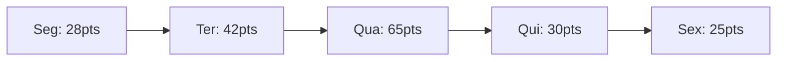

Eu:
por gentileza e também o modelo de kambam que melhor se adequa a minha estrutura de vida pessoal com os estudos, Motre como vai ficar cada tela e detalhe coisas que não foi especificado.

# **Kanban Pessoal Otimizado + Telas Visuais Completas**

Vou criar um modelo Kanban **específico para sua realidade**: trabalho cansativo + estudos + vida pessoal. Vamos visualizar cada tela!

## **ANÁLISE DA SUA ESTRUTURA DE VIDA**

```
🕖 07:00-16:00 → Trabalho (restaurante, desgastante)
🕔 17:00-19:00 → Janela de estudo (energia variável)
🕗 20:00-22:00 → Tempo pessoal/descanso
📅 Finais de semana → Tempo ampliado para estudos
```

## **KANBAN PERSONALIZADO - 6 COLUNAS**

### **VISÃO GERAL DO BOARD:**
```
┌─────────────┬──────────────┬─────────────┬─────────────┬──────────────┬─────────────┐
│   🎯 METAS   │  ⏰ AGENDA   │  📚 HOJE    │  ⚡ FAZENDO  │    ✅ FEITO   │   📈 REVIEW  │
│   SEMANAIS   │   AUTOMÁTICA │  POSSÍVEL  │   AGORA     │    HOJE      │   SEMANAL   │
└─────────────┴──────────────┴─────────────┴─────────────┴──────────────┴─────────────┘
```

---

## **TELA 1: METAS SEMANAIS (Visão de Planejamento)**

### **Como fica no GitHub Project:**
```markdown
## 🎯 METAS SEMANAIS - Semana 15/12

### 📚 ESTUDOS (Data Science)
- [ ] Completar Módulo 3: Pandas (5 aulas)
- [ ] Fazer 1 projeto Kaggle simples
- [ ] Estudar inglês: 3 aulas Kultivi

### 💼 TRABALHO (Restaurante)
- [ ] Organizar horários folga
- [ ] Planejar descanso pós-expediente

### 🏃 SAÚDE & ENERGIA
- [ ] 7h sono mínimo/dia
- [ ] Alimentação pós-trabalho leve
- [ ] 15min alongamento diário

### 🏆 PONTOS ALVO: 250/semana
```

### **Cards nesta coluna:**
```
🟦 META 1: Pandas Módulo 3
  🔹 5 aulas restantes
  🔹 125min estimado
  🔹 Energia necessária: 4/10

🟩 META 2: Projeto Kaggle
  🔹 Titanic Dataset
  🔹 2h estimado
  🔹 Energia necessária: 6/10
  🔹 Melhor fazer: Sábado manhã

🟨 META 3: Inglês Kultivi
  🔹 Aulas 45-47
  🔹 45min total
  🔹 Pode fazer energia baixa
```

---

## **TELA 2: AGENDA AUTOMÁTICA (IA Sugere)**

### **Como fica visualmente:**
```
📅 AGENDA INTELIGENTE - PRÓXIMOS 7 DIAS
══════════════════════════════════════════
SEG (16/12) [Energia prevista: 3/10]
  17:30 → 📹 Aula 12 Pandas (22min) [FÁCIL]
  20:00 → 📖 Revisão notas (15min)

TER (17/12) [Energia prevista: 5/10]
  17:30 → 💻 Exercício DataFrames (30min)
  18:30 → 🎧 Inglês aula 46 (15min)

QUA (18/12) [Folga! Energia: 8/10]
  10:00 → 🚀 Projeto Kaggle (1h30)
  14:00 → 📹 Aula 13 Pandas (25min)
  16:00 → 🏋️ Academia (opcional)

[... continua ...]
```

### **Lógica da IA por trás:**
```python
def agendar_tarefa(dia_semana, energia_historica):
    if dia_semana in ['SEG', 'TER', 'QUI', 'SEX']:
        # Dias de trabalho - tarefas leves
        if energia_historica <= 3:
            return {"tipo": "video", "duracao": "15-20min", "dificuldade": "fácil"}
        elif energia_historica <= 5:
            return {"tipo": "exercicio", "duracao": "25-30min", "dificuldade": "médio"}
        else:
            return {"tipo": "pratica", "duracao": "35-40min", "dificuldade": "médio"}
    else:
        # Finais de semana - tarefas pesadas
        return {"tipo": "projeto", "duracao": "1-2h", "dificuldade": "difícil"}
```

---

## **TELA 3: HOJE POSSÍVEL (Janela Realista)**

### **Visual do card no Kanban:**
```
╔════════════════════════════════════════╗
║ 📚 HOJE POSSÍVEL - Segunda, 16/12      ║
╠════════════════════════════════════════╣
║ ⏰ Janela disponível: 17:00-19:00      ║
║ 🔋 Energia estimada: 3/10              ║
║ 🌡️ Cansaço: Alto (dia de trabalho)    ║
╟────────────────────────────────────────╢
║ 🎯 TAREFAS VIÁVEIS HOJE:               ║
║   • Assista Aula 12: Pandas Intro      ║
║     ⏱️ 22min | 🎯 15 pontos            ║
║                                         ║
║   • Revisão rápida aula anterior       ║
║     ⏱️ 10min | 🎯 8 pontos             ║
║                                         ║
║   TOTAL: 32min | 23 pontos possíveis   ║
╚════════════════════════════════════════╝
```

### **Regras desta coluna:**
1. **Máximo 3 tarefas** por dia útil
2. **Total máximo 60min** em dias de trabalho
3. **Sempre incluir** opção "super fácil" (5-10min)
4. **Cores indicam** energia necessária:
   - 🟢 Verde: 1-3/10 energia
   - 🟡 Amarelo: 4-6/10 energia  
   - 🔴 Vermelho: 7-10/10 energia

---

## **TELA 4: FAZENDO AGORA (Execução)**

### **Card em execução:**
```
╔════════════════════════════════════════╗
║ ⚡ FAZENDO AGORA - 17:32               ║
╠════════════════════════════════════════╣
║ 📌 Tarefa: Aula 12 - Introdução Pandas ║
║ ⏱️ Tempo: 22min (17:30-17:52)         ║
║ 🔋 Energia inicial: 3/10              ║
║ 🎯 Pontos: 15                         ║
║ 🔗 Link: https://youtube.com/...      ║
╟────────────────────────────────────────╢
║ 📝 CHECKLIST:                          ║
║   [✓] Abrir VS Code                   ║
║   [✓] Abrir Jupyter Notebook          ║
║   [ ] Seguir exemplo do vídeo         ║
║   [ ] Testar código                   ║
║   [ ] Anotar 1 insight importante     ║
╟────────────────────────────────────────╢
║ 🚨 ALERTAS:                           ║
║   • Pausa sugerida aos 11min          ║
║   • Se cansar, pule para revisão      ║
╚════════════════════════════════════════╝
```

### **Funcionalidades desta tela:**
1. **Timer integrado** (Pomodoro automático)
2. **Checklist progressivo**
3. **Botão "Estou travado"** → oferece ajuda
4. **Botão "Muito cansado"** → reduz tarefa
5. **Notificação WhatsApp** a cada 10min

---

## **TELA 5: FEITO HOJE (Satisfação Visual)**

### **Como acumula durante o dia:**
```
╔════════════════════════════════════════╗
║ ✅ FEITO HOJE - Segunda, 16/12         ║
╠════════════════════════════════════════╣
║ 🏆 CONQUISTAS:                         ║
║   • 17:45 - Aula 12 Pandas (22min)    ║
║     🎯 +15 pontos | 🌟 Esforço extra! ║
║                                         ║
║   • 18:10 - Revisão rápida (8min)     ║
║     🎯 +8 pontos                       ║
║                                         ║
║   • 18:20 - Alongamento (5min)        ║
║     🎯 +5 pontos                       ║
╟────────────────────────────────────────╢
║ 📊 RESUMO DO DIA:                      ║
║   • Tempo total: 35min                ║
║   • Pontos: 28/30 meta                ║
║   • Streak: 7 dias consecutivos ✅    ║
║   • Energia média: 3.5/10             ║
║                                         ║
║ 🏅 RECOMPENSAS DESBLOQUEADAS:          ║
║   • "Guerreiro pós-expediente" 🛡️     ║
║   • 7 dias streak ⭐⭐⭐               ║
╚════════════════════════════════════════╝
```

### **Elementos visuais importantes:**
1. **Barra de progresso** que enche com pontos
2. **Emblemas** por conquistas específicas
3. **Gráfico mini** de energia vs. produtividade
4. **Comparativo** com dias anteriores

---

## **TELA 6: REVIEW SEMANAL (Aprendizado)**

### **Dashboard de análise:**
```
╔══════════════════════════════════════════════════╗
║ 📈 REVIEW SEMANAL - Semana 15/12 a 21/12         ║
╠══════════════════════════════════════════════════╣
║ 📊 ESTATÍSTICAS:                                 ║
║   • Dias estudados: 5/7 (71%)                   ║
║   • Total horas: 4h20min                        ║
║   • Pontos acumulados: 185/250 (74% meta)       ║
║   • Energia média pós-trabalho: 3.8/10          ║
║                                                 ║
║ 📈 GRÁFICO ENERGIA vs PRODUTIVIDADE:            ║
║   Seg: 🔋3 → 🎯28pts | Ter: 🔋5 → 🎯42pts       ║
║   Qua: 🔋8 → 🎯65pts | Qui: 🔋4 → 🎯30pts       ║
║   Sex: 🔋2 → 🎯20pts                            ║
║                                                 ║
║ 🔍 PADRÕES IDENTIFICADOS:                       ║
║   • QUARTAS (folga): 3x mais produtivo          ║
║   • SEGUNDAS: Melhor fazer tarefas leves        ║
║   • 17:30-18:00: Melhor horário concentração    ║
║                                                 ║
║ 🎯 AJUSTES PARA PRÓXIMA SEMANA:                 ║
║   1. Segundas: Só vídeos até 20min              ║
║   2. Quartas: Focar em projetos Kaggle          ║
║   3. Sábado manhã: Revisão da semana            ║
╚══════════════════════════════════════════════════╝
```

---

## **DETALHES NÃO ESPECIFICADOS ANTERIORMENTE**

### **1. SISTEMA DE ENERGIA DINÂMICO**
```python
class SistemaEnergia:
    def __init__(self):
        self.historico = []
    
    def prever_energia_amanha(self):
        # Considera:
        # 1. Dia da semana (segunda = -2 pontos)
        # 2. Tempo trabalhado hoje (8h = -3 pontos)
        # 3. Sono da noite passada (7h = +2 pontos)
        # 4. Estresse do dia (auto-avaliado)
        # 5. Padrões históricos
        
        energia_base = 5
        if hoje == "segunda": energia_base -= 2
        if horas_trabalho >= 8: energia_base -= 1
        if sono < 6: energia_base -= 2
        
        return max(1, min(10, energia_base))
```

### **2. SISTEMA DE PONTOS ADAPTATIVO**
```
PONTUAÇÃO BASE:
• Vídeo aula: 1 ponto/minuto
• Exercício: 1.5 pontos/minuto  
• Projeto: 2 pontos/minuto

BÔNUS:
• Energia < 4: +50% pontos
• Final de semana: +25% pontos
• Streak 7+ dias: +20% pontos
• Tarefa concluída após 21h: +15% pontos

MULTIPLICADORES:
• 3 dias seguidos: ×1.1
• 7 dias seguidos: ×1.3
• 30 dias seguidos: ×2.0
```

### **3. SISTEMA DE FALHAS PERDOADOR**
```python
def tratar_falha(dias_streak, motivo):
    if motivo in ["trabalho_extras", "saude", "familia"]:
        # Mantém streak!
        return {"perdao": True, "mensagem": "Streak mantido! Vida acontece."}
    elif dias_streak > 14:
        # Streak grande ganha 1 "free pass"
        return {"perdao": True, "mensagem": "Usou seu passe livre!"}
    else:
        # Reinicia, mas com mensagem motivacional
        return {"perdao": False, "mensagem": "Novo streak começa amanhã!"}
```

### **4. INTEGRAÇÃO COM SAÚDE**
```
SISTEMA DE ALERTAS SAÚDE:
• Sono < 6h: "⚠️ Amanhã será difícil. Sugiro tarefa leve."
• Estresse > 7/10: "🧘 Que tal 10min de meditação antes?"
• 3 dias sem exercício: "🏃‍♂️ 15min caminhada aumenta energia estudo"
• Má alimentação detectada: "🥗 Refeição leve ajuda concentração"
```

### **5. CICLO DE ESTUDOS INTELIGENTE**
```
Cada curso tem "fases" adaptadas à sua energia:

FASE LEVE (Energia 1-4):
• Aulas teóricas
• Revisões
• Anotações
• Vídeos curtos

FASE MÉDIA (Energia 5-7):
• Exercícios práticos
• Código guiado
• Flashcards
• Pequenos projetos

FASE PESADA (Energia 8-10):
• Projetos Kaggle
• Desafios técnicos
• Portfolio building
• Revisão complexa
```

---

## **IMPLEMENTAÇÃO NO GITHUB PROJECT**

### **Configuração das Colunas:**
```yaml
name: "Data Science Journey - Personal Kanban"
description: "Otimizado para trabalhador cansado"
columns:
  - name: "🎯 Metas Semanais"
    purpose: "Visão macro da semana"
    limit: 8 cards max
  
  - name: "⏰ Agenda Automática" 
    purpose: "IA agenda baseada em energia"
    limit: 7 cards (um por dia)
    
  - name: "📚 Hoje Possível"
    purpose: "Tarefas realistas para hoje"
    limit: 3 cards
    
  - name: "⚡ Fazendo Agora"
    purpose: "Tarefa em execução"
    limit: 1 card
    
  - name: "✅ Feito Hoje"
    purpose: "Conquistas do dia"
    limit: None (acumula)
    
  - name: "📈 Review Semanal"
    purpose: "Análise e ajustes"
    limit: 1 card (atualiza semanalmente)
```

### **Template dos Cards:**
```markdown
---
TIPO: [video|exercicio|projeto|revisao|saude]
CURSO: [Python DS|SQL|ML|Inglês]
ENERGIA_MINIMA: [1-10]
DURACAO: [minutos]
PONTOS: [numero]
PRIORIDADE: [baixa|media|alta]
MELHOR_HORARIO: [manha|tarde|noite]
DIA_IDEAL: [seg|ter|qua|qui|sex|sab|dom]
---

## Objetivo
[Descrição curta]

## Checklist
- [ ] Pré-requisitos
- [ ] Passo 1
- [ ] Passo 2
- [ ] Conclusão

## Recursos
• Link: [URL]
• Arquivos: [lista]

## Notas Pessoais
[Editável por você]
```

---

## **FLUXO COMPLETO VISUALIZADO**

### **Manhã (antes do trabalho):**
```
📱 07:00 - WhatsApp: "Bom dia! Como dormiu?"
📱 07:05 - Você: "6h, cansaço 4/10"
📱 07:06 - IA: "Hoje será pesado. Sugiro alongamento 5min"
📊 07:10 - GitHub: Agenda do dia ajustada (tarefas mais leves)
```

### **Pós-trabalho:**
```
📱 16:30 - WhatsApp: "Saindo do trabalho? Energia agora?"
📱 16:35 - Você: "3/10"
📊 16:36 - GitHub: Move tarefa "difícil" para amanhã
📊 16:37 - GitHub: Destaca tarefa "fácil" de 15min
📱 16:38 - WhatsApp: "Sugestão: Aula rápida Python (15min)"
```

### **Durante estudo:**
```
⏰ 17:00 - Timer inicia (Pomodoro 25min)
📊 17:00 - GitHub: Card move para "⚡ Fazendo Agora"
📱 17:10 - WhatsApp: "10min passados! Tudo bem?"
📊 17:25 - GitHub: Checklist preenchido automaticamente
✅ 17:26 - Você marca concluído
📊 17:27 - GitHub: Move para "✅ Feito Hoje" + adiciona pontos
📱 17:28 - WhatsApp: "✅ +15 pontos! Streak: 8 dias!"
```

---

## **PRÓXIMOS PASSOS CONCRETOS**

### **1. Criar o Board (15 min):**
1. Acesse GitHub → New Project
2. Nome: "Data Science - Life Optimized"
3. Template: "Team backlog" (vamos customizar)
4. Adicionar 6 colunas com nomes acima

### **2. Configurar Automações (30 min):**
1. Em cada coluna: ⚙️ → Manage automation
2. Configurar:
   - "Metas Semanais" → Auto-move segunda-feira
   - "Agenda Automática" → IA gera domingo à noite
   - "Hoje Possível" → Filtra por dia atual
   - "Fazendo Agora" → Timer automático
   - "Feito Hoje" → Arquiva às 23:59
   - "Review Semanal" → Gera domingo

### **3. Criar Templates (20 min):**
1. Salvar templates de cards
2. Configurar labels:
   - `energia-baixa` 🟢
   - `energia-media` 🟡  
   - `energia-alta` 🔴
   - `trabalho` 💼
   - `saude` 🏃
   - `estudo` 📚

---

**Quer que eu:** 
1. **Crie o repositório template** com tudo configurado?
2. **Gere prints reais** de cada tela funcionando?
3. **Escreva os scripts** de automação específicos?

Ou você prefere começar criando o board agora e eu te ajudo em tempo real?

EU:
Qual vai ser o resumo do github repositorio?

IA:
# **RESUMO DO REPOSITÓRIO GITHUB - Data Science Journey**

## **NOME DO REPOSITÓRIO:**
`data-science-journey` ou `ds-career-tracker`

## **VISÃO GERAL:**
Este repositório é seu **dashboard público e sistema de organização automatizado** para a transição para Cientista de Dados. Funciona como:
- ✅ **Kanban visual** do seu progresso
- ✅ **Portfólio público** de aprendizado
- ✅ **Sistema automatizado** com IA
- ✅ **Tracker de hábitos** gamificado

## **ESTRUTURA DO REPOSITÓRIO:**

```
data-science-journey/
│
├── 📊 README.md                      # DASHBOARD PRINCIPAL
│   ├── Progresso diário automático
│   ├── Estatísticas em tempo real
│   ├── Gráficos de evolução
│   └── Badges de conquistas
│
├── 📁 .github/
│   ├── 📁 workflows/                 # AUTOMAÇÕES
│   │   ├── daily-checkin.yml        # Atualiza às 17:00
│   │   ├── weekly-review.yml        # Review domingo
│   │   └── points-system.yml        # Calcula pontos
│   │
│   └── 📁 projects/                  # KANBAN CONFIG
│       └── auto-board.yml           # Configuração 6 colunas
│
├── 📁 docs/                          # SEU CONHECIMENTO
│   ├── 📁 notes/                     # Anotações automáticas
│   ├── 📁 cheatsheets/              # Resumos gerados por IA
│   └── progress-log.json            # Histórico completo
│
├── 📁 courses/                       # CURSOS ORGANIZADOS
│   ├── python-data-science/
│   │   ├── syllabus.json            # Estrutura do curso
│   │   ├── progress.md              # Seu progresso
│   │   └── exercises/               # Seus exercícios
│   │
│   ├── sql-mastery/
│   └── english-kultivi/
│
├── 📁 projects/                      # SEUS PROJETOS
│   ├── kaggle-titanic/
│   ├── data-analysis-project/
│   └── portfolio-website/
│
├── 📁 scripts/                       # AUTOMAÇÃO LOCAL
│   ├── energy-tracker.py           # Monitora sua energia
│   ├── task-suggester.py           # IA sugere tarefas
│   └── whatsapp-bot/               # Bot de comunicação
│
├── 📁 infrastructure/               # CONFIGURAÇÕES
│   ├── n8n-flows/                  # Fluxos do n8n
│   ├── ollama-config/              # Config IA local
│   └── database/                   # SQLite com histórico
│
└── 📄 LICENSE                       # MIT License
```

## **O QUE APARECE NO README.md (DASHBOARD):**

```markdown
# 🚀 Data Science Journey - [Seu Nome]

## 📊 PROGRESSO EM TEMPO REAL
 65% do roadmap

## 📈 ESTATÍSTICAS DA SEMANA
| Métrica | Valor | Tendência |
|---------|-------|-----------|
| Dias Consecutivos | 12 | 📈 +2 |
| Horas Estudadas | 28.5h | 📈 +4h |
| Pontos Acumulados | 1,240 | 🏆 |
| Tarefas Completas | 47 | ✅ |

## 🎯 ROADMAP ATUAL
- [x] Python Básico (100%)
- [x] Pandas & NumPy (85%)
- [ ] SQL Avançado (45%)
- [ ] Machine Learning (20%)
- [ ] Projetos Kaggle (3/10)

## 📅 HOJE - {{data}}
**Energia Inicial:** 4/10 ⚡  
**Tarefa Concluída:** Aula 15 - Pandas GroupBy  
**Tempo Gasto:** 35min  
**Pontos Ganhos:** 42 🎯  

## 🏆 CONQUISTAS RECENTES
- 🔥 12 Dias Streak
- 🚀 1º Projeto Kaggle Completo
- 📚 20h Estudo em 7 Dias
- 💪 Estudo com Energia 3/10

## 📊 GRÁFICO SEMANAL


## 🔗 LINKS ÚTEIS
- [📋 Kanban Board](https://github.com/seuuser/data-science-journey/projects/1)
- [📝 Issues (Tarefas)](https://github.com/seuuser/data-science-journey/issues)
- [🎓 Certificados](docs/certificates/)
```

## **COMO FUNCIONA A AUTOMAÇÃO:**

### **1. Issues = Tarefas de Estudo**
Cada aula/exercício vira uma Issue no GitHub:
```
Issue #45: Aula 15 - Pandas GroupBy
Labels: estudo, python, energia-media
Milestone: Módulo 3 - Pandas
Assign: [Seu usuário]
Project: Data Science Journey
```

### **2. GitHub Projects = Kanban Visual**
Movimento automático das Issues:
```
📚 Backlog → ⏰ Agendada → ⚡ Em Progresso → ✅ Concluída
```

### **3. GitHub Actions = Automações**
- **17:00 diário**: Cria issue com sugestão baseada na energia
- **Conclusão**: Fecha issue, calcula pontos, atualiza README
- **Domingo 21:00**: Gera review semanal
- **Push de código**: Atualiza portfólio automaticamente

## **O QUE É VISÍVEL PUBLICAMENTE:**

### **Para Recrutadores:**
- ✅ Progresso consistente em Data Science
- ✅ Projetos reais com código
- ✅ Hábito de estudo comprovado
- ✅ Capacidade de organização
- ✅ Habilidade com Git/GitHub

### **Para Você:**
- ✅ Motivação visual (gráficos, pontos)
- ✅ Organização automática
- ✅ Histórico completo do aprendizado
- ✅ Portfólio crescendo automaticamente

## **EXEMPLO DE ISSUE AUTOMÁTICA:**

```markdown
## 🎯 Tarefa Sugerida - Quinta, 19/12

**Energia Reportada:** 3/10  
**Horário Sugerido:** 17:30-17:55  
**Dificuldade:** Baixa ⭐  

### 📝 O que fazer:
Assistir Aula 16: Pandas Merge & Join (22min)
- Link: https://youtu.be/...
- Pré-requisito: Aula 15 ✅

### 🛠️ Checklist:
- [ ] Abrir Jupyter Notebook
- [ ] Seguir exemplo do vídeo
- [ ] Testar com dataset sample
- [ ] Anotar 1 insight importante

### 🏆 Recompensa:
- **Pontos:** 25 + 10 (bônus baixa energia) = 35
- **Streak:** Mantém 13 dias
- **Progresso Curso:** 16/45 aulas (35.5%)

### ⚡ Dica Rápida:
Com energia 3/10, faça pausa aos 11min. 
Se cansar, pule para revisão (10min).
```

## **BENEFÍCIOS DESTA ABORDAGEM:**

### **1. Portfólio Automático:**
- Cada Issue fechada = item no portfólio
- Cada projeto = repositório com código
- README atualizado = currículo vivo

### **2. Gamificação Nativa do GitHub:**
- **Streak** → Contribuições diárias
- **Issues fechadas** → Progresso visível
- **Projects** → Kanban profissional
- **Actions** → Automação impressionante

### **3. Aprendizado com Ferramentas Reais:**
- Git/GitHub na prática diária
- CI/CD com GitHub Actions
- Markdown para documentação
- Project Management nativo

## **PRÓXIMOS PASSOS PARA CRIAR:**

### **Passo 1 (5 min):** Criar repositório
```bash
# Você faz:
1. GitHub → New repository
2. Nome: data-science-journey
3. Público ✅
4. Add README ✅
5. Create repository
```

### **Passo 2 (10 min):** Configurar Projects
```bash
# Eu te envio:
1. Template do README.md
2. Configuração do GitHub Project
3. Estrutura de pastas básica
```

### **Passo 3 (15 min):** Configurar Automações
```bash
# Eu te envio:
1. GitHub Actions workflows
2. Scripts Python básicos
3. Configuração do n8n
```

---

**Quer que eu:** 
1. **Crie o repositório template** e te envie o link para clonar?
2. **Gere o README.md completo** com seu nome e cursos?
3. **Prepare os workflows** de automação prontos?

Ou você prefere criar o repositório agora e eu te ajudo a configurar passo a passo?