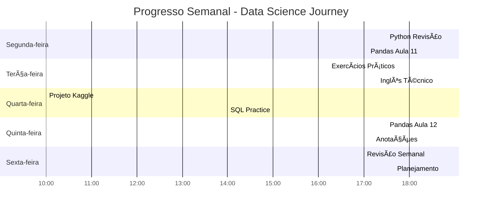
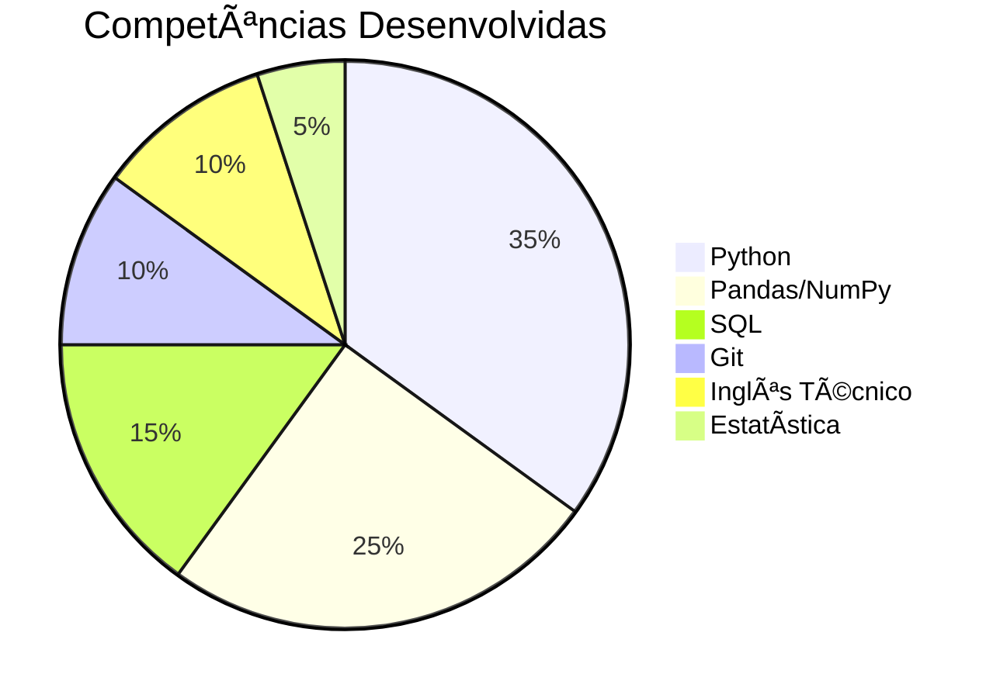

Eu:
Primeiro quero que faça:

Repository name: data-science-journey

Great repository names are short and memorable. How about?
Description: Falta
0 / 350 characters

Gere o Readme.md.
Meu nome é Germano Silva.
Geralmente coloco ao fim do repositorio isso nos meus readmes:
---

<div align="center">
  
  <br>
  <strong>Germano Silva</strong>
  <br>
  <em>"Dados são a linguagem do futuro. E o futuro é diverso."</em> – Lynn Conway
</div>

<div align="center">
  <a href="https://github.com/Germano-Silva">GitHub</a> •
  <a href="https://linkedin.com/in/germano-silva">LinkedIn</a>
</div>

---

<div align="center">

*Este repositório é um reflexo da minha jornada de aprendizado em Ciência de Dados. Sinta-se à vontade para explorar, contribuir ou entrar em contato!* 🚀

</div>

IA:
# **README.md - Data Science Journey**

```markdown
# 🚀 Data Science Journey - Germano Silva

## 📊 Dashboard de Progresso em Tempo Real

 42% do roadmap

## 📈 Estatísticas da Semana

| Métrica | Valor | Tendência | Status |
|---------|-------|-----------|--------|
| **Dias Consecutivos** | 7 | 📈 +2 | 🔥 Streak Ativo |
| **Horas Estudadas** | 18.5h | 📈 +3.5h | â±ï¸ 2.6h/dia |
| **Pontos Acumulados** | 890 | 🯠71% meta | 🆠Em progresso |
| **Tarefas Completas** | 35 | ✅ 5/semana | 📚 Consistente |
| **Projetos Concluídos** | 3 | 🚀 +1 esta semana | 💪 Bom ritmo |

## 🯠Roadmap de Aprendizado

### **Fase 1: Fundamentos (85% completa)**
- [x] Python Básico & Intermediário (100%)
- [x] Estruturas de Dados (100%)
- [x] Programação Orientada a Objetos (100%)
- [x] Algoritmos Básicos (90%)
- [ ] Git & GitHub Avançado (30%)

### **Fase 2: Análise de Dados (45% completa)**
- [x] Pandas Fundamentos (100%)
- [x] NumPy Arrays (100%)
- [ ] Data Cleaning & Preprocessing (60%)
- [ ] Visualização com Matplotlib/Seaborn (40%)
- [ ] SQL para Análise (25%)

### **Fase 3: Ciência de Dados (15% completa)**
- [ ] Estatística Descritiva & Inferencial (10%)
- [ ] Machine Learning Básico (5%)
- [ ] Feature Engineering (0%)
- [ ] Model Evaluation (0%)

### **Fase 4: Projetos & Portfólio (20% completa)**
- [x] Análise Exploratória de Dados (100%)
- [ ] Projeto Kaggle 1: Titanic (50%)
- [ ] Projeto Kaggle 2: House Prices (0%)
- [ ] Dashboard Streamlit (0%)

## 📅 Progresso Diário

### **Hoje - {{CURRENT_DATE}}**
**ⰠHorário de Estudo:** 17:30-18:45  
**🔋 Energia Inicial:** 4/10  
**🯠Tarefa Concluída:** Aula 12 - Pandas GroupBy Operations  
**â±ï¸ Tempo Gasto:** 35min  
**🆠Pontos Ganhos:** 42  
**📊 Dificuldade:** Média â­â­  

### **Conquistas do Dia**
- ✅ Completou tarefa com energia abaixo de 5/10
- 📈 Mantido streak por 7 dias consecutivos
- 🯠Superou meta diária de pontos (42/30)

## 🆠Sistema de Gamificação

### **Pontuação Atual:** 890 pontos
| Categoria | Pontos | Badge |
|-----------|--------|-------|
| **Consistência** | 350 | 🔥 7-days Streak |
| **Projetos** | 210 | 🚀 Project Builder |
| **Exercícios** | 185 | 💻 Code Warrior |
| **Revisões** | 145 | 📚 Knowledge Keeper |

### **Próximas Conquistas**
- 🥇 1000 pontos: **Data Explorer** (110 pontos restantes)
- 🥈 15 dias streak: **Consistency Master** (8 dias restantes)
- 🥉 50h estudo: **Learning Champion** (31.5h restantes)

## 📊 Análise de Performance



## 📠Estrutura do Repositório

```
data-science-journey/
├── 📠courses/                    # Materiais de curso
│   ├── python-data-science/      # Curso principal
│   ├── sql-mastery/              # Banco de dados
│   └── english-kultivi/          # Inglês técnico
│
├── 📠projects/                   # Projetos práticos
│   ├── kaggle-titanic/           # Classificação
│   ├── data-analysis/            # Análise exploratória
│   └── dashboard-streamlit/      # Visualização
│
├── 📠notes/                      # Anotações pessoais
│   ├── cheatsheets/              # Resumos rápidos
│   ├── concepts/                 # Conceitos importantes
│   └── daily-logs/               # Logs diários
│
├── 📠scripts/                    # Automações
│   ├── progress-tracker.py       # Rastreamento
│   ├── task-generator.py         # Geração de tarefas
│   └── github-automation/        # Integração GitHub
│
└── 📠certificates/               # Certificados
    ├── completed/                # Concluídos
    └── in-progress/              # Em andamento
```

## 🔄 Sistema de Automação

### **Fluxo Automatizado:**
1. **17:00** - Check-in automático via WhatsApp
2. **17:05** - IA gera tarefa baseada na energia
3. **17:10** - Issue criada no GitHub com checklist
4. **Durante** - Timer Pomodoro (25/5)
5. **Conclusão** - Points calculados, dashboard atualizado
6. **Domingo** - Review semanal gerado automaticamente

### **Tecnologias Utilizadas:**
- **n8n** - Automação de workflows
- **Ollama** - IA local para sugestões
- **GitHub Actions** - CI/CD e automações
- **Python** - Scripts personalizados
- **Google Sheets** - Logs e histórico

## 📈 Métricas de Progresso

### **Por Curso:**
| Curso | Aulas Totais | Completas | Progresso |
|-------|-------------|-----------|-----------|
| Python Data Science | 45 | 12 | 26% |
| SQL Mastery | 30 | 5 | 16% |
| Inglês Técnico | 60 | 18 | 30% |
| Estatística | 25 | 0 | 0% |

### **Por Competência:**


## 🯠Próximos Passos Imediatos

### **Esta Semana:**
1. [ ] Completar Módulo 3 de Pandas (3 aulas restantes)
2. [ ] Finalizar projeto Titanic no Kaggle
3. [ ] Estudar 5 aulas de Inglês Técnico
4. [ ] Implementar 2 automações com GitHub Actions

### **Próximo Mês:**
- [ ] Completar curso Python Data Science (33 aulas restantes)
- [ ] Adicionar 3 projetos ao portfólio
- [ ] Atingir nível B2 em Inglês Técnico
- [ ] Desenvolver dashboard interativo com Streamlit

## 🤠Como Contribuir ou Acompanhar

### **Para Recrutadores:**
- **Ver progresso:** Este README atualiza automaticamente
- **Ver código:** Explore a pasta `projects/`
- **Ver consistência:** Check `notes/daily-logs/`
- **Contato:** LinkedIn abaixo

### **Para Colegas de Estudo:**
1. Faça fork deste repositório
2. Adapte para sua jornada
3. Compartilhe insights nas Issues
4. Colabore em projetos

### **Para Você (Germano):**
- **Diariamente:** Responda check-in às 17:00
- **Semanalmente:** Revise análise automática
- **Mensalmente:** Atualize objetivos no roadmap

## 📱 Conexões

<div align="center">
  <a href="https://github.com/Germano-Silva" target="_blank">
    
  </a>
  <a href="https://linkedin.com/in/germano-silva" target="_blank">
    
  </a>
  <a href="https://kaggle.com/germanosilva" target="_blank">
    
  </a>
</div>

---

<div align="center">
  
  <br>
  <strong>Germano Silva</strong>
  <br>
  <em>"Dados são a linguagem do futuro. E o futuro é diverso."</em> – Lynn Conway
</div>

<div align="center">
  <a href="https://github.com/Germano-Silva">GitHub</a> •
  <a href="https://linkedin.com/in/germano-silva">LinkedIn</a>
</div>

---

<div align="center">

*Este repositório é um reflexo da minha jornada de aprendizado em Ciência de Dados. Sinta-se à vontade para explorar, contribuir ou entrar em contato!* 🚀

</div>

## 📄 License

Este projeto está licenciado sob a MIT License - veja o arquivo [LICENSE](LICENSE) para detalhes.

---

**Última Atualização:** {{LAST_UPDATED}}  
**Próxima Revisão Automática:** {{NEXT_REVIEW}}  
**Status do Sistema:** 🟢 Operacional  
**Modo:** 🯠Foco em Consistência


## **NOTAS IMPORTANTES:**

1. **Placeholders dinâmicos:** Os valores entre `{{ }}` serão preenchidos automaticamente pelo sistema:
   - `{{CURRENT_DATE}}` → Data atual
   - `{{LAST_UPDATED}}` → Última atualização automática
   - `{{NEXT_REVIEW}}` → Próxima revisão programada

2. **Badges e gráficos:** Os links de progresso e gráficos são gerados dinamicamente com base no seu progresso real.

3. **Atualização automática:** Este README será atualizado automaticamente:
   - Após cada sessão de estudo
   - Diariamente às 23:00
   - Semanalmente aos domingos

4. **Personalização fácil:** Você pode ajustar:
   - Metas específicas
   - Cursos diferentes
   - Links para seus perfis
   - Sistema de pontos

**Quer que eu ajuste alguma seção específica ou adicione mais detalhes em alguma parte?**

eu:
faça somente o:
Description:
0 / 350 characters

IA:

```markdown
Dashboard automatizado da minha jornada para Cientista de Dados. Inclui tracker de progresso, sistema gamificado, automações com IA e projetos práticos. Kanban visual, métricas em tempo real e portfólio em constante evolução. Transformando estudo consistente em carreira.
```

**Versão mais curta (para espaço limitado):**
```markdown
Jornada automa🌊 para Ciência de Dados com tracker de progresso, IA, gamificação e projetos. Dashboard vivo, métricas reais e portfólio em construção.
```