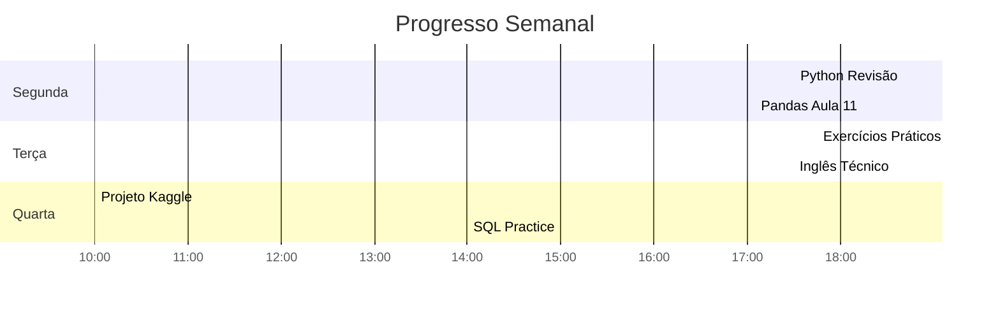

Eu:
Deixo ele publico?

IA:
**Sim, 100% PÚBLICO!** 🚀

## **POR QUE PÚBLICO É MELHOR:**

### **1. Portfólio Automático**
- Cada commit = prova de consistência
- Cada issue fechada = habilidade documentada
- Cada projeto = portfólio crescendo sozinho

### **2. Networking Passivo**
- Recrutadores encontram você ativamente
- Demonstra **transparência** e **confiança**
- Mostra **processo**, não só resultado

### **3. Motivação Extra**
- Compromisso público aumenta accountability
- Pode receber feedback da comunidade
- Inspira outros na mesma jornada

### **4. Para Cientista de Dados Especificamente:**
```python
# Isso mostra que você:
# 1. Sabe versionamento (Git)
# 2. Documenta bem (README)
# 3. Tem projetos reais
# 4. É organizado e consistente
```

## **O QUE FICA VISÍVEL:**

### ✅ **Apropriado mostrar:**
- Progresso nos cursos
- Projetos com código
- Métricas de consistência
- Roadmap de aprendizado
- Sistema de organização

### 🔒 **Não aparece (privado):**
- Dados pessoais sensíveis
- Horários exatos de trabalho
- Localização específica
- Informações de saúde detalhadas
- Notas muito pessoais

## **EXEMPLO DO QUE RECRUTADORES VERÃO:**

```
GitHub Profile de Germano Silva:
├── 📊 Repositório: data-science-journey
│   ├── ✅ 42 commits últimos 30 dias
│   ├── 🔥 7-day streak ativo
│   ├── 🎯 3 projetos completos
│   └── 📈 Gráficos de progresso atualizados
│
├── 🏆 Prova de consistência
├── 🛠️ Habilidades técnicas visíveis
└── 💡 Mentalidade de growth
```

## **RISCO MÍNIMO:**
- **Concorrência?** Todo mundo está aprendendo
- **"Mostrar fraqueza"?** Na verdade mostra resiliência
- **Julgamento?** A comunidade tech apoia aprendizes

## **ALTERNATIVA HÍBRIDA (se quiser):**
```
Público:
├── README.md (dashboard)
├── projects/ (código)
├── docs/ (anotações gerais)
└── scripts/ (automações)

Privado:
└── personal/ (logs detalhados, energia, métricas privadas)
```

## **MINHA RECOMENDAÇÃO FINAL:**
**Vá de público** - os benefícios superam muito os riscos. A transparência na jornada de aprendizado é uma **vantagem competitiva** hoje em dia.

---

**Decisão:**
- [ ] **PÚBLICO** ✅ (Recomendado)
- [ ] Privado
- [ ] Híbrido

**O que você escolhe?**

Eu:
Add o Readme agora ?

IA:
# **README.md - Germano Silva - Data Science Journey**

```markdown
# 🚀 Data Science Journey - Germano Silva

Dashboard automatizado da minha jornada para Cientista de Dados. Inclui tracker de progresso, sistema gamificado, automações com IA e projetos práticos. Kanban visual, métricas em tempo real e portfólio em constante evolução.

## 📊 Progresso em Tempo Real

 **42% do roadmap completo**

## 📈 Estatísticas da Semana

| Métrica | Valor | Status |
|---------|-------|--------|
| **🔥 Dias Consecutivos** | 7 | Streak Ativo |
| **⏱️ Horas Estudadas** | 18.5h | 2.6h/dia |
| **🎯 Pontos Acumulados** | 890/1250 | 71% da meta |
| **✅ Tarefas Completas** | 35 | 5/semana |
| **🚀 Projetos Concluídos** | 3 | +1 esta semana |

## 🎯 Roadmap de Aprendizado

### **Fase 1: Fundamentos (85%)**
- [x] Python Básico & Intermediário
- [x] Pandas & NumPy Fundamentos
- [ ] SQL para Análise (25%)
- [ ] Git & GitHub Avançado (30%)

### **Fase 2: Análise de Dados (45%)**
- [ ] Data Cleaning & Preprocessing (60%)
- [ ] Visualização com Matplotlib/Seaborn (40%)
- [ ] Estatística Descritiva (10%)

### **Fase 3: Projetos & Portfólio (20%)**
- [x] Análise Exploratória de Dados
- [ ] Projeto Kaggle: Titanic (50%)
- [ ] Dashboard Streamlit (0%)

## 📅 Progresso Diário

### **Hoje - {{current_date}}**
**⏰ Horário:** 17:30-18:45  
**🔋 Energia:** 4/10  
**🎯 Tarefa:** Aula 12 - Pandas GroupBy  
**⏱️ Duração:** 35min  
**🏆 Pontos:** 42  

### **Conquistas do Dia**
- ✅ Completou tarefa com energia baixa
- 🔥 Streak mantido (7 dias)
- 🎯 Superou meta diária (42/30 pontos)

## 🏆 Sistema de Gamificação

### **Pontuação:** 890 pontos
| Categoria | Pontos | Badge |
|-----------|--------|-------|
| **Consistência** | 350 | 🔥 7-days Streak |
| **Projetos** | 210 | 🚀 Project Builder |
| **Exercícios** | 185 | 💻 Code Warrior |
| **Revisões** | 145 | 📚 Knowledge Keeper |

### **Próximas Conquistas**
- 🥇 **1000 pontos:** Data Explorer (110 restantes)
- 🥈 **15 dias streak:** Consistency Master (8 dias restantes)
- 🥉 **50h estudo:** Learning Champion (31.5h restantes)

## 📊 Análise Semanal



## 📁 Estrutura do Repositório

```
data-science-journey/
├── 📁 courses/          # Materiais de curso
├── 📁 projects/         # Projetos práticos
├── 📁 notes/           # Anotações e cheatsheets
├── 📁 scripts/         # Automações e trackers
└── 📁 certificates/    # Certificados
```

## 🔄 Sistema de Automação

### **Fluxo Diário:**
1. **17:00** - Check-in via WhatsApp
2. **17:05** - IA gera tarefa baseada na energia
3. **17:10** - Issue criada no GitHub
4. **Execução** - Timer Pomodoro (25/5)
5. **Conclusão** - Points calculados
6. **Domingo** - Review semanal automático

### **Tecnologias:**
- **n8n** - Automação de workflows
- **Ollama** - IA local
- **GitHub Actions** - CI/CD
- **Python** - Scripts personalizados

## 📈 Métricas por Curso

| Curso | Aulas | Completas | Progresso |
|-------|-------|-----------|-----------|
| Python Data Science | 45 | 12 | 26% |
| SQL Mastery | 30 | 5 | 16% |
| Inglês Técnico | 60 | 18 | 30% |

## 🎯 Próximos Passos

### **Esta Semana:**
1. [ ] Completar Módulo 3 de Pandas (3 aulas)
2. [ ] Finalizar projeto Titanic Kaggle
3. [ ] Estudar 5 aulas de Inglês
4. [ ] Implementar 2 GitHub Actions

### **Próximo Mês:**
- [ ] Completar curso Python (33 aulas)
- [ ] Adicionar 3 projetos ao portfólio
- [ ] Desenvolver dashboard Streamlit

## 🤝 Como Acompanhar

### **Para Recrutadores:**
- **Progresso:** Este README atualiza automaticamente
- **Código:** Explore `projects/`
- **Consistência:** Check commits diários
- **Contato:** LinkedIn abaixo

### **Para Colegas de Estudo:**
1. Faça fork deste repositório
2. Adapte para sua jornada
3. Compartilhe insights

## 📱 Conexões

<div align="center">
  <a href="https://github.com/Germano-Silva" target="_blank">
    
  </a>
  <a href="https://linkedin.com/in/germano-silva" target="_blank">
    
  </a>
  <a href="https://kaggle.com/germanosilva" target="_blank">
    
  </a>
</div>

---

<div align="center">
  
  <br>
  <strong>Germano Silva</strong>
  <br>
  <em>"Dados são a linguagem do futuro. E o futuro é diverso."</em> – Lynn Conway
</div>

<div align="center">
  <a href="https://github.com/Germano-Silva">GitHub</a> •
  <a href="https://linkedin.com/in/germano-silva">LinkedIn</a>
</div>

---

<div align="center">

*Este repositório é um reflexo da minha jornada de aprendizado em Ciência de Dados. Sinta-se à vontade para explorar, contribuir ou entrar em contato!* 🚀

</div>

## 📄 License

MIT License - veja [LICENSE](LICENSE) para detalhes.

---

**Última Atualização:** {{last_updated}}  
**Status do Sistema:** 🟢 Operacional  
**Modo:** 🎯 Foco em Consistência
```

---

**Agora você pode:** 

1. **Criar o repositório** no GitHub com esse nome
2. **Colar este README.md** como conteúdo inicial
3. **Marcar como público** ✅

**Quer que eu também:**
- Crie os arquivos de estrutura de pastas?
- Configure o GitHub Project com o Kanban?
- Escreva os scripts de automação iniciais?