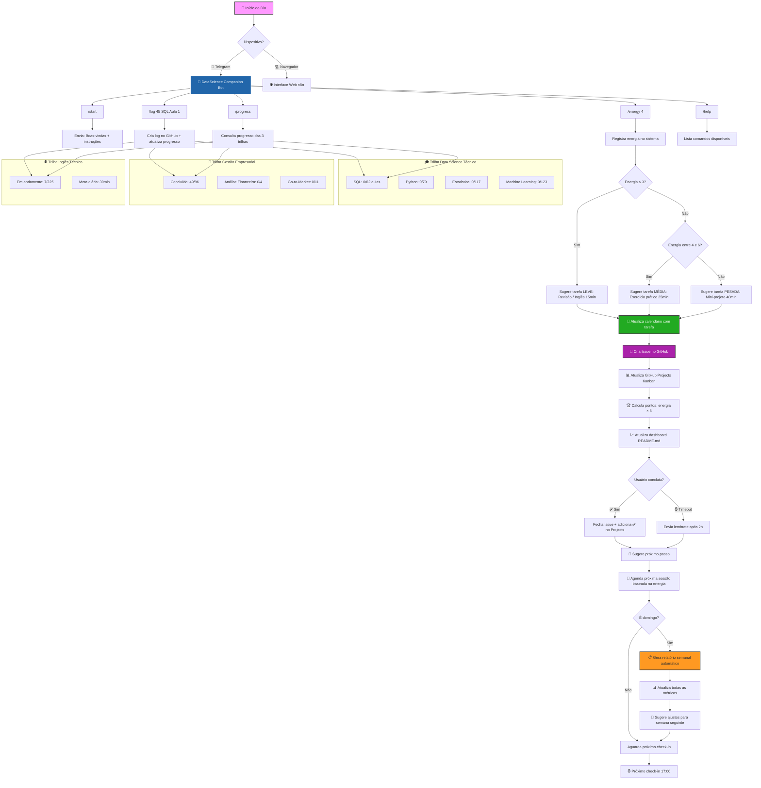
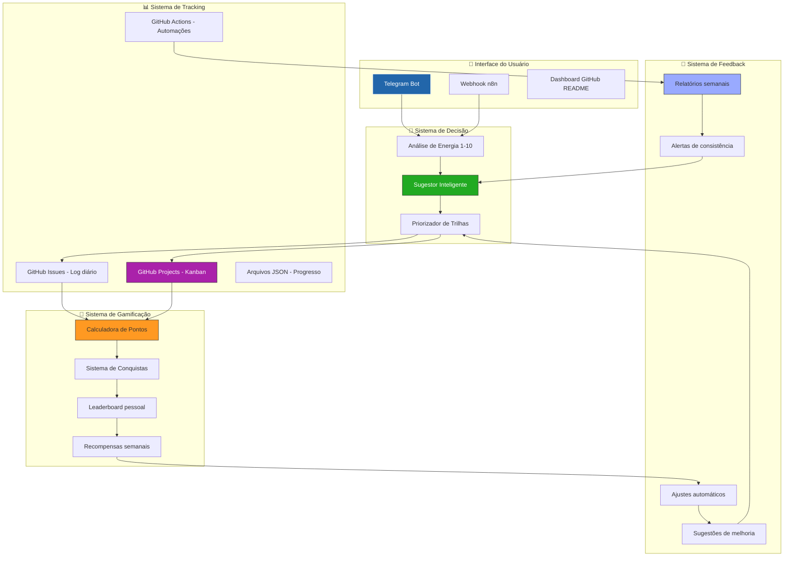
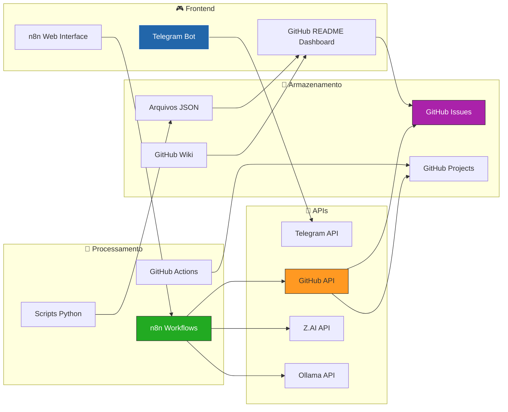
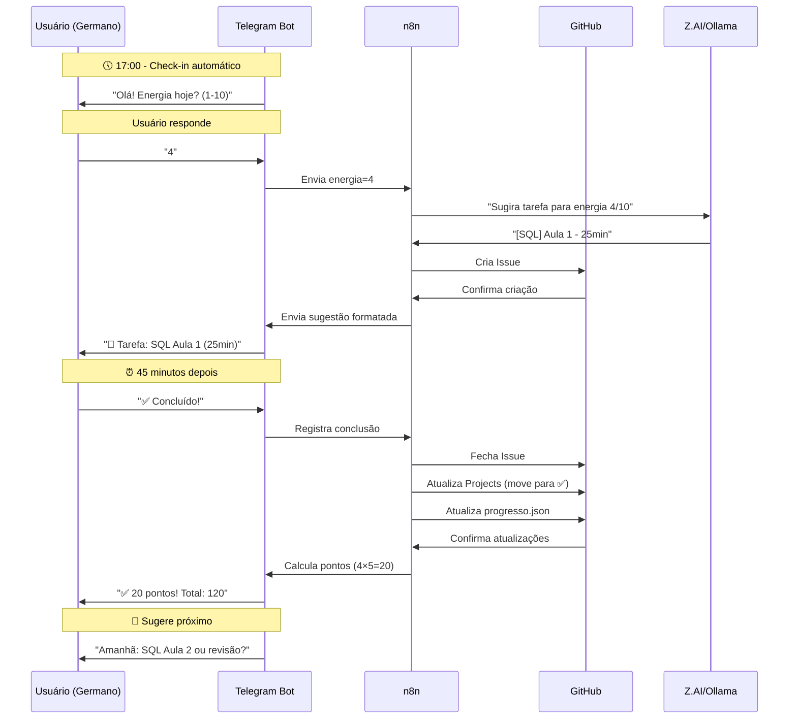
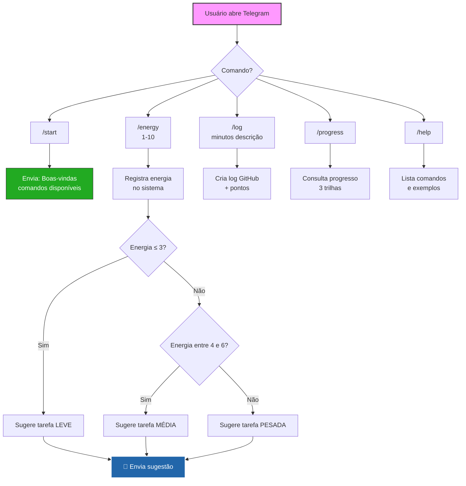
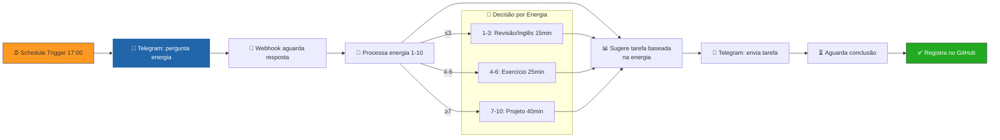
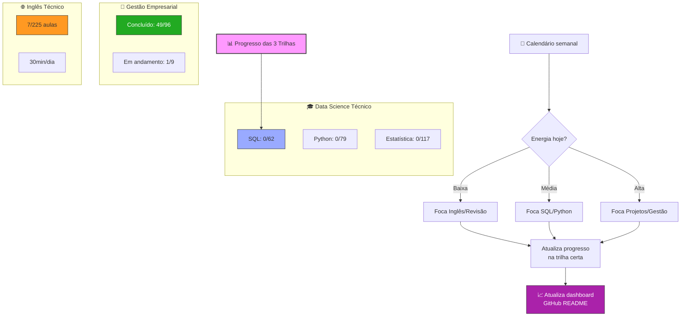

# **📊 FLUXO COMPLETO EM MERMAID**

---

# **🔗 FLUXO DETALHADO POR COMPONENTE**

---

# **⏰ FLUXO TEMPORAL DIÁRIO**

```mermaid
gantt
    title Fluxo Diário - Data Science Companion
    dateFormat HH:mm
    axisFormat %H:%M
    
    section Manhã
    Preparação sistema :07:00, 10m
    Verificação automática :07:10, 5m
    
    section Tarde
    Check-in automático :17:00, 15m
    Sugestão IA :17:05, 5m
    Execução tarefa :17:15, 45m
    
    section Noite
    Log conclusão :18:00, 10m
    Atualização GitHub :18:10, 10m
    Planejamento amanhã :18:20, 10m
    
    section Background
    Monitoramento energia :07:00, 12h
    Backup dados :22:00, 30m
```

---

# **📁 ARQUITETURA DE DADOS**

---

# **🤖 FLUXO DA CONVERSA COM O BOT**

---

# **📊 PROCESSO SCRUM - 3 FASES**

## **🎯 SPRINT 1: BOT TELEGRAM (MVP)**

### **Diagrama 1: Fluxo do Bot**

### **📋 Tarefas Sprint 1 (Bot):**
1. ✅ Criar bot no Telegram (@BotFather)
2. ⬜ Configurar credencial no n8n
3. ⬜ Implementar comando `/start`
4. ⬜ Implementar comando `/energy`
5. ⬜ Implementar comando `/help`
6. ⬜ Testar fluxo básico

### **📅 Duração estimada:** 2 dias

---

## **🎯 SPRINT 2: AUTOMAÇÃO N8N**

### **Diagrama 2: Fluxo de Automação**

### **📋 Tarefas Sprint 2 (Automação):**
1. ⬜ Configurar Schedule Trigger (17:00)
2. ⬜ Criar webhook para respostas
3. ⬜ Implementar lógica de energia → tarefa
4. ⬜ Criar template de mensagens
5. ⬜ Testar fluxo automático
6. ⬜ Adicionar fallback manual

### **📅 Duração estimada:** 3 dias

---

## **🎯 SPRINT 3: TRILHAS E PROGRESSO**

### **Diagrama 3: Fluxo das Trilhas**

### **📋 Tarefas Sprint 3 (Trilhas):**
1. ⬜ Criar arquivos JSON para cada trilha
2. ⬜ Implementar sistema de tracking
3. ⬜ Criar dashboard no README
4. ⬜ Integrar com GitHub Projects
5. ⬜ Gerar relatórios semanais
6. ⬜ Sistema de pontos/gamificação

### **📅 Duração estimada:** 4 dias

---

## **📋 BACKLOG COMPLETO:**

### **Prioridade P1 (Essencial):**
1. Bot responde a comandos básicos
2. Check-in automático 17:00
3. Sugestões baseadas em energia
4. Log no GitHub Issues

### **Prioridade P2 (Importante):**
5. Sistema de pontos
6. Dashboard no README
7. GitHub Projects integration
8. Relatórios semanais

### **Prioridade P3 (Desejável):**
9. IA para sugestões personalizadas
10. Calendário visual
11. Gamificação avançada
12. Multiplataforma (WhatsApp/Web)

---
