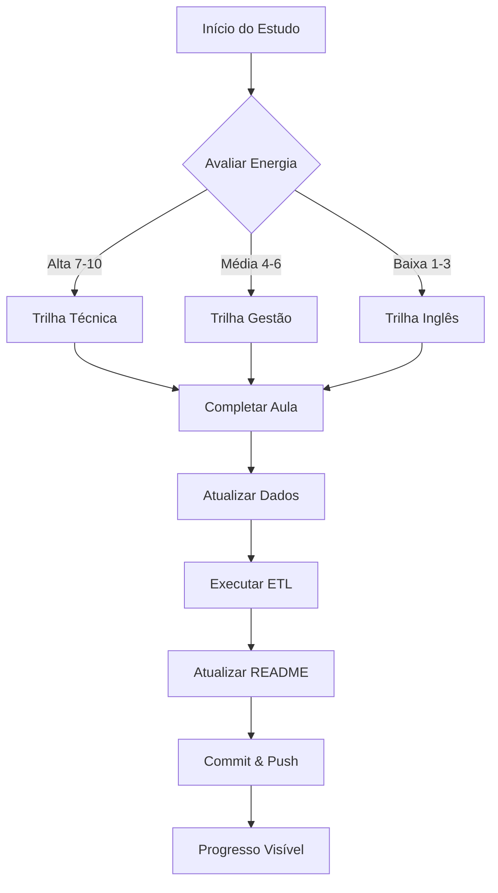

# Product Context: Data Science Journey

## Por que este projeto existe?

Este projeto nasceu da necessidade de gerenciar de forma eficiente uma jornada complexa de aprendizado em Data Science, conciliando:

1. **Trabalho Full-time**: Rotina profissional que consome energia
2. **Múltiplas Trilhas**: 3 dimensões complementares de aprendizado
3. **Energia Variável**: Níveis diferentes de disposição pós-trabalho
4. **Progresso Transparente**: Necessidade de documentar evolução real

## Problemas que Este Projeto Resolve

### 1. Sobrecarga de Decisão
**Problema**: Ao final de um dia de trabalho, decidir "o que estudar hoje" consome energia mental preciosa.

**Solução**: Sistema de energia inteligente que recomenda automaticamente o tipo de conteúdo ideal baseado no nível de cansaço:
- Energia alta → Conteúdo técnico complexo (SQL, Python)
- Energia média → Conceitos de gestão e negócios
- Energia baixa → Inglês e revisões leves

### 2. Gestão de Múltiplas Fontes de Dados
**Problema**: Cursos vêm de diferentes plataformas (DNC, Kultive, Prepara Portugal) com formatos variados (CSV, Markdown, diferentes estruturas).

**Solução**: Pipeline ETL robusto que:
- Extrai dados de múltiplos formatos
- Transforma em schema dimensional padronizado (Star Schema)
- Carrega dados processados prontos para análise
- Atualiza automaticamente dashboards e métricas

### 3. Falta de Visibilidade de Progresso
**Problema**: Difícil visualizar progresso real quando há centenas de aulas distribuídas em múltiplas trilhas.

**Solução**: 
- README.md auto-atualizado com métricas em tempo real
- Gráficos Mermaid integrados mostrando distribuição e progresso
- Sistema de gamificação com pontos e conquistas
- Visualização clara do que falta vs. completado

### 4. Perda de Contexto
**Problema**: Projetos de aprendizado longos perdem contexto ao longo do tempo - "onde parei?", "o que devo fazer agora?".

**Solução**: Memory Bank estruturado que mantém:
- Contexto atual sempre atualizado (activeContext.md)
- Padrões do sistema documentados (systemPatterns.md)
- Progresso detalhado (progress.md)
- Decisões técnicas registradas

## Como Este Projeto Funciona

### Fluxo Principal de Uso



### Experiência do Usuário Ideal

1. **Ao Chegar em Casa (Pós-trabalho)**
   - Avaliar nível de energia (1-10)
   - Consultar README para ver recomendação
   - Iniciar estudo no conteúdo apropriado

2. **Durante o Estudo**
   - Focar apenas no aprendizado
   - Fazer anotações em `notes/`
   - Marcar aula como concluída no CSV fonte

3. **Ao Finalizar Sessão**
   - Executar `python etl_cursos/main.py` para processar dados
   - Executar `python scripts/update_dashboard.py` para atualizar README
   - Commit automático com métricas atualizadas

4. **Visualização de Progresso**
   - Abrir GitHub para ver progresso visual
   - Badges e gráficos mostram evolução
   - Sistema de gamificação mostra conquistas

### Funcionalidades-Chave

#### 1. Pipeline ETL Automático
- **Input**: CSVs e Markdown de diferentes plataformas
- **Processamento**: Limpeza, normalização, schema dimensional
- **Output**: Tabelas prontas para análise e visualização

#### 2. Sistema de Energia Adaptativo
Mapeia energia disponível para tipo de conteúdo:

| Energia | Tipo | Justificativa |
|---------|------|---------------|
| 8-10/10 | SQL/Python | Requer concentração intensa e raciocínio lógico |
| 6-7/10 | Python Básico | Desafiador mas com suporte de tutoriais |
| 4-5/10 | Gestão/Conceitos | Conteúdo aplicado, menos abstrato |
| 2-3/10 | Inglês/Vocabulário | Repetitivo, passivo, baixa carga cognitiva |
| 1/10 | Revisão/Planejamento | Organização, sem novo conteúdo |

#### 3. Documentação Viva
- README atualizado automaticamente
- Badges dinâmicos mostrando progresso
- Gráficos Mermaid gerados programaticamente
- Links para recursos e certificados

#### 4. Gamificação Motivacional
```
Pontuação:
- Aula concluída: 10 pontos
- Meta semanal batida: 50 pontos
- Streak 7 dias: 100 pontos
- Projeto completo: 500 pontos
- Trilha 50%: 300 pontos
```

## Objetivos de Experiência

### Para o Aprendiz (Germano)
1. **Zero fricção**: Mínimo esforço para iniciar estudos
2. **Feedback imediato**: Ver progresso instantaneamente
3. **Motivação contínua**: Gamificação e visualizações mantêm engajamento
4. **Adaptabilidade**: Sistema se ajusta ao estado atual de energia

### Para Observadores Externos
1. **Transparência**: Progresso real e honesto
2. **Inspiração**: Modelo replicável para outros aprendizes
3. **Profissionalismo**: Demonstração de skills de engenharia de dados na prática

## Métricas de Sucesso do Produto

### Eficiência
- Tempo para decidir o que estudar: < 30 segundos
- Tempo para atualizar progresso: < 2 minutos
- Frequência de commits: Diária

### Efetividade
- Aulas concluídas por semana: Meta mínima 5
- Streak de dias consecutivos: Máximo possível
- Projetos práticos criados: 1 por mês

### Engajamento
- README acessado: Diariamente
- Satisfação com sistema: Alta (auto-avaliação semanal)
- Continuidade: Uso consistente por 12+ meses

## Princípios de Design

1. **Automatização sobre Manual**: Se pode ser automatizado, deve ser
2. **Visibilidade**: Progresso deve ser óbvio e visual
3. **Flexibilidade**: Sistema adapta-se ao usuário, não o contrário
4. **Simplicidade**: Interface clara, sem complexidade desnecessária
5. **Realidade**: Documentar progresso real, não ideal
