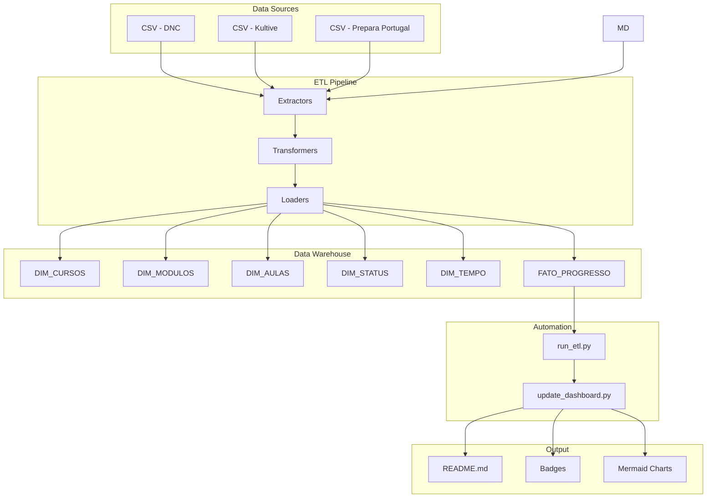

# System Patterns: Data Science Journey

## Arquitetura Geral do Sistema



## Padrões de Arquitetura

### 1. Star Schema Data Warehouse

O projeto utiliza modelagem dimensional clássica com **Star Schema**:

**Tabela Fato:**
- `FATO_PROGRESSO`: Registros de progresso com FKs para todas as dimensões

**Tabelas Dimensão:**
- `DIM_CURSOS`: Informações de cursos (nome, categoria, requisitos)
- `DIM_MODULOS`: Informações de módulos (nome, ordem, duração estimada)
- `DIM_AULAS`: Informações de aulas (nome, duração, tipo de conteúdo)
- `DIM_STATUS`: Status de progresso (Aprovado, Em andamento, etc.)
- `DIM_TEMPO`: Dimensão temporal (data, semestre, trimestre)

**Benefícios:**
- Consultas analíticas simplificadas
- Fácil agregação e drill-down
- Performance otimizada para leitura
- Estrutura intuitiva

### 2. Pipeline ETL Modular

**Estrutura:**
```
etl_cursos/
├── config.py          # Configurações centralizadas
├── extractors.py      # Extração de dados
├── transformers.py    # Transformação de dados
├── loaders.py         # Carga de dados
├── utils.py           # Funções auxiliares
└── main.py            # Orquestração do pipeline
```

**Padrão de Separação de Responsabilidades:**
- **Extractors**: Leem dados de fontes heterogêneas (CSV, MD)
- **Transformers**: Aplicam lógica de negócio e normalização
- **Loaders**: Persistem dados em formato padronizado
- **Utils**: Logging, validação, funções auxiliares

**Benefícios:**
- Testabilidade individual de cada componente
- Manutenibilidade facilitada
- Reutilização de código
- Fácil extensão para novas fontes

### 3. Configuration-Driven Design

Todas as configurações estão centralizadas em `config.py`:

```python
# Mapeamento de categorias
COURSE_CATEGORIES = {
    "analise_dados": "Trilha Analise de Dados...",
    "cientista_dados": "Trilha Formação...",
    "ingles": "Trilha Ingles"
}

# Mapeamento de status
STATUS_MAPPING = {
    "Aprovado": "Aprovado",
    "Em andamento": "Em andamento",
    # ...
}

# Mapeamento de colunas
COLUMN_MAPPING = {
    "csv": {...},
    "ingles_aulas": {...}
}
```

**Benefícios:**
- Mudanças de configuração sem alterar código
- Fácil adaptação para novos formatos
- Documentação implícita através de constantes

### 4. Logging e Observabilidade

Sistema de logging estruturado em 3 níveis:

```python
logger.info()   # Progresso normal do pipeline
logger.warning()  # Situações incomuns mas recuperáveis
logger.error()    # Falhas críticas
```

**Saída:**
- Console: Feedback em tempo real
- `etl.log`: Histórico completo de execuções

**Informações Registradas:**
- Número de registros extraídos
- Transformações aplicadas
- Validações executadas
- Erros e exceções com stack trace

### 5. Validation-Driven Loading

Dados são validados **antes** de serem persistidos:

```python
def validate_output_data(data: Dict) -> bool:
    """Valida estrutura e integridade dos dados"""
    # 1. Todas as tabelas presentes
    # 2. Colunas esperadas existem
    # 3. Tipos de dados corretos
    # 4. Relações entre FKs válidas
```

**Princípio:** Fail-fast - abortar pipeline se dados inválidos

## Padrões de Código

### 1. Type Hints

Todo código Python usa type hints para clareza:

```python
def extract_csv_files() -> List[Dict[str, Any]]:
    """Extrai dados de arquivos CSV"""
    pass

def transform_course_data(records: List[Dict]) -> pd.DataFrame:
    """Transforma dados em dimensão de cursos"""
    pass
```

### 2. Docstrings

Funções documentadas no formato PEP 257:

```python
def run_etl_pipeline() -> None:
    """
    Run the complete ETL pipeline
    
    Executes extraction, transformation, validation and loading
    in sequence with proper error handling and logging.
    """
```

### 3. Error Handling

Try-except em níveis apropriados:

```python
try:
    # Operação principal
    run_etl_pipeline()
except Exception as e:
    logger.error(f"Pipeline failed: {str(e)}", exc_info=True)
    raise  # Re-raise para debugging
```

### 4. Path Handling

Uso de `pathlib.Path` para compatibilidade cross-platform:

```python
BASE_DIR = Path(__file__).parent
DATA_RAW_DIR = BASE_DIR.parent / "data" / "raw"
```

## Padrões de Dados

### 1. Delimitador Padronizado

**Decisão:** Usar `;` (ponto e vírgula) como delimitador

**Razão:** Dados contêm vírgulas em textos descritivos

**Aplicação:**
```python
OUTPUT_DELIMITER = ";"
df.to_csv(output_file, sep=OUTPUT_DELIMITER, encoding="utf-8")
```

### 2. Encoding UTF-8

Todos os arquivos usam UTF-8 para suportar caracteres portugueses:
- ç, ã, õ, á, é, etc.

### 3. Normalização de Status

Status mapeados para valores padronizados:

```
"Aprovado" → "Aprovado"
"Concluído" → "Concluído"
"Em andamento" → "Em andamento"
"Aguardando início" → "Aguardando início"
```

### 4. IDs Auto-incrementais

Dimensões usam IDs sequenciais:
- `id_curso`: 1, 2, 3...
- `id_modulo`: 1, 2, 3...
- `id_aula`: 1, 2, 3...

## Padrões de Automação

### 1. Pipeline Executável

Scripts podem ser executados diretamente:

```bash
python etl_cursos/main.py
python scripts/update_dashboard.py
```

### 2. Saída Padronizada

Tabelas sempre salvam em:
```
data/processed/
├── DIM_CURSOS.csv
├── DIM_MODULOS.csv
├── DIM_AULAS.csv
├── DIM_STATUS.csv
├── DIM_TEMPO.csv
├── FATO_PROGRESSO.csv
└── etl.log
```

### 3. README Auto-gerado

`update_dashboard.py` regenera seções do README:
- Badges de progresso
- Gráficos Mermaid
- Tabelas de status
- Últimas atualizações

## Padrões de Testes

### 1. Testes em Camadas

```
test_etl_basic.py     # Testes sem dependências (sem pandas)
test_etl_structure.py # Testes completos (com pandas)
test_data_integrity.py # Testes de integridade de dados
```

### 2. Testes Baseados em Arquivos

Testes verificam existência e estrutura de arquivos gerados:

```python
assert os.path.exists("data/processed/DIM_CURSOS.csv")
assert df.columns.tolist() == expected_columns
```

## Decisões Técnicas Importantes

### 1. Por que Star Schema?

**Alternativas consideradas:**
- Normalização 3NF: Mais complexo para análises
- Document store: Não estruturado o suficiente

**Escolha:** Star Schema oferece melhor balanço entre simplicidade e performance analítica

### 2. Por que Pandas?

**Alternativas consideradas:**
- CSV nativo Python: Muito verboso
- Polars: Menos maduro, menor adoção

**Escolha:** Pandas é padrão da indústria para data wrangling em Python

### 3. Por que Arquivos CSV e não Database?

**Razão:** 
- Simplicidade: Projeto pessoal, não requer RDBMS
- Portabilidade: Funciona em qualquer máquina
- Versionamento: CSVs podem ser versionados no Git
- Transparência: Dados facilmente inspecionáveis

**Trade-off:** Performance sacrificada pela simplicidade

### 4. Por que Markdown para README?

**Razão:**
- GitHub renderiza nativamente
- Suporta Mermaid para diagramas
- Badges e imagens integrados
- Editável e versionável

## Convenções de Nomenclatura

### Arquivos
- Python: `snake_case.py`
- CSV: `UPPER_CASE.csv` (para tabelas de dados)
- Markdown: `kebab-case.md` ou `camelCase.md`

### Variáveis
- Variáveis/funções: `snake_case`
- Constantes: `UPPER_CASE`
- Classes: `PascalCase`

### Tabelas
- Dimensões: `DIM_NOME`
- Fatos: `FATO_NOME`
- CSVs intermediários: `nome_descritivo.csv`

## Fluxo de Dados Completo

```
1. Dados Brutos (CSV/MD)
   ↓
2. Extração (extractors.py)
   ↓
3. Transformação (transformers.py)
   ↓
4. Validação (loaders.py)
   ↓
5. Persistência (data/processed/)
   ↓
6. Processamento Dashboard (update_dashboard.py)
   ↓
7. Atualização README
   ↓
8. Commit & Push (manual ou automático)
   ↓
9. Visualização no GitHub
```

## Padrões de Organização

### Estrutura de Diretórios

```
data-science-journey/
├── data/
│   ├── raw/              # Dados originais (nunca modificar)
│   ├── processed/        # Dados transformados (gerados)
│   └── external/         # Dados de terceiros
├── etl_cursos/           # Pipeline ETL
├── scripts/              # Automações
├── notes/                # Anotações de estudo
├── projects/             # Projetos práticos
├── docs/                 # Documentação
├── certificates/         # Certificados
└── memory-bank/          # Contexto do projeto (este arquivo)
```

### Princípio: Separação de Concerns

Cada diretório tem um propósito claro e único.
